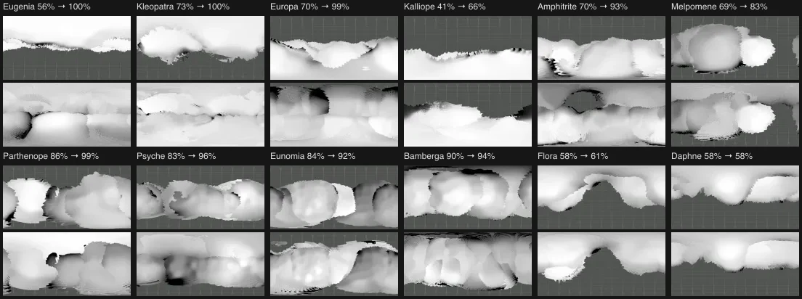
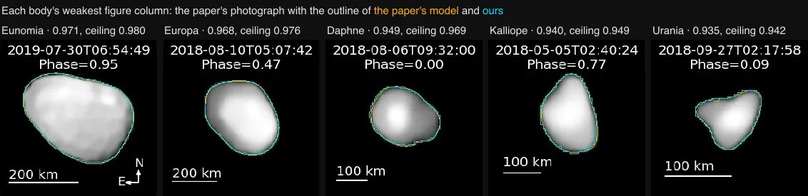
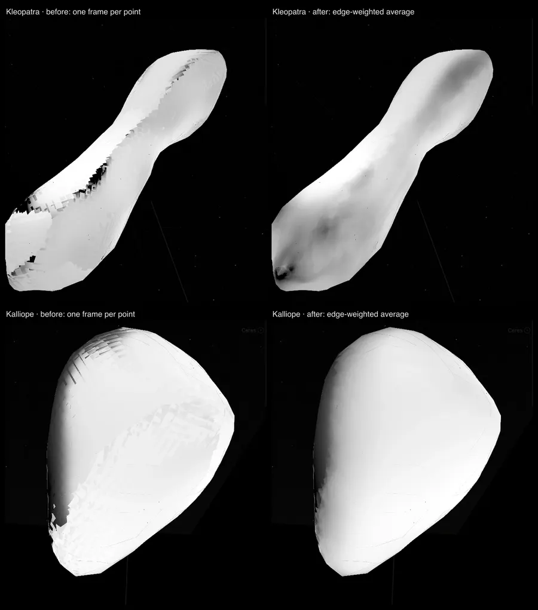

# SPHERE survey photographs

This recipe photographs a main-belt asteroid from the VLT/SPHERE imaging survey
of Vernazza et al. (2021), using the survey's deconvolved ZIMPOL frames. The lens
ships on the survey's own comparison figure, as the
[rule for ground-based lenses](../../../../tools/objects/surface-observations/README.md#observer-computed-cameras)
explains. Two commands do the work; Iris and Hebe are the worked examples.

## Before you start

- Read the body's `investigations.json` and the
  [investigation ledger index](../../../../docs/provenance/investigation-index.md).
  Most survey bodies have an unresolved `sphere-cross-frame-registration` entry.
  It says the frames show shape and shading, not markings. It does not block
  this route.
- Work in a dedicated worktree.

## Which apparitions a lens can cast

The deconvolved frames state no unit, and their scale changes between
apparitions: Kleopatra's 2017 frames total about 3 million, its 2018 frames
about 60 million, through the same filter at the same detector gain. Within one
apparition, nights stay within about 3× of each other. So the level fit gives
each apparition its own level, placed only through surface it shares with
another, and the 4× budget bounds each frame against its own apparition's first
frame. An apparition that shares no such surface cannot be matched and stays
out. Pallas and Iris are seen pole-on from opposite sides in their two
apparitions, so their second apparitions stay out.

```bash
node tools/objects/sphere-survey/apparitions.mts [<id> …]
```

This prints, for every shipped survey lens or the ones named, each apparition's
frames, sub-observer latitudes and distance, the share of the surface it would
add, and the display samples it shares with a cast frame. Beside them it prints
the surface the lens's own frames cover, from geometry, next to the prepared
lens's measured coverage: that pair shows how far the geometry can be trusted.



Above, each body's lens map with one apparition (top) and with every linked one
(bottom), and the measured share of the surface photographed. The geometry
decides only which apparitions to try. Daphne's 2017 frames were predicted to
share 193 samples with its 2018 frames, but the fit found at most 59 in the
pixels, so that apparition is left out by name
(`--leave-out-apparition=2017-05-20`). Its map changes only through how its
frames are combined.

## Set up and measure

```bash
node tools/objects/sphere-survey/setup.mts <id>
```

This writes nothing in the package. In `output/sphere-survey/<id>/` it builds a
copy of the package's `source/` with the lens added, measures it, and writes
`setup.json`, `evidence/published-comparison.json` and the evidence image. Along
the way it:

- finds the body's figure in [`vernazza-2021-figures.json`](../../../../tools/objects/sphere-survey/vernazza-2021-figures.json)
  by its Horizons number, and reads the frame time printed over each column
  from the figure's pixels;
- lists the release's frames, and marks a column the release lacks as having no
  lens frame;
- casts every apparition whose level the level fit can place. The apparition
  the figure shows most anchors the lens. Another joins when one of its frames
  shares at least the fit's 128 display samples with a frame already cast,
  within 60° of both the camera and the Sun. The setup decides this from
  geometry before it fetches a frame, and preparation decides again from the
  pixels. More than 96 frames keep every series, thinned evenly, with the
  figure's frames always kept;
- takes every file from this machine when a copy exists, and downloads the rest
  from LAM with its public cookie;
- reads the spin record in the column order the survey's Table A.1 pole
  supports. A body whose own published pole belongs to another solution, such
  as a DAMIT model, gets the survey's pole in its lens record;
- gives the ADAM mesh, an OBJ in kilometres, the body's own mesh settings,
  raising the simplification error bound to the next 100 m above what the ADAM
  mesh reaches at the face target when the body's bound falls short;
- writes both Horizons tables, derives every camera and measures the figure.

It stops with the reason when the spin record and the paper describe
different solutions (Nemesis), when the figure uses another layout, or when LAM
refuses a file. Where Table A.1 describes another solution than the survey's
released model, the figure table names that model as DAMIT's 2021 import of it
states it (Eleonora, Thisbe): the record is read against it, and the figure
decides. Where LAM withholds a body's own ADAM mesh and record, the table also
names DAMIT's files for the model (Flora), and the README states what DAMIT's
rounding leaves uncertain.
It also stops when a frame's limb fit does not settle, naming the frame: the
recipe states each disc centre, so it must be a settled one. After eight full
steps a fit still moving takes half steps, which settles one bouncing between
two positions (Kleopatra's did). `--leave-out=<frame-id>,…` leaves named
frames out of the selection; a frame the figure shows cannot be left out.

## Decide

Look at `evidence/published-comparison.webp`. It shows each figure column's
photograph with the outline of the paper's model in amber and ours in cyan. The
lens ships when our outline follows the paper's at the same phase. The install
checks this for every column: over a full turn in 10° steps, the best match to
the paper's model must be at our phase, one step from it, or better by less
than the same-shape loss, which happens on nearly round outlines. Otherwise it
refuses and names the column.



Above, every survey lens appears once, at the column where our outline
overlaps the paper's model least, with that column's overlap and its
same-shape ceiling below it. Read each overlap against its same-shape score. The numbers are
reported, not a gate, and the registration stage's verdict is reported beside
them.

## Install and prepare

```bash
node tools/objects/sphere-survey/install.mts <id>
```

It reruns the setup and writes it into the package: the frames, mesh, tables
and records, the source bindings, download
operations, the lens control and reader text, the ledger decision and the
entries it closes, the README's source rows and generated evidence blocks, and
the credits. It copies missing pinned inputs from sibling checkouts by hash and
moves scene files no inventory owns into `output/stale-public/<id>/`. Then:

```bash
node tools/prepare/prepare-object.mts <id>
```

```bash
node tools/objects/report-registration.mts <id> --write
```

Install and prepare one body at a time: the text step checks every package,
so a body installed but not yet prepared stops every other body's preparation.
A body whose preparation fails must be reset before the next one runs.

Preparation stops with "Observation level fit exceeds its authored gain
budget" when a frame needs more than a 4× level adjustment against the first
frame of its apparition. The error names each frame beyond the budget against
that frame or the apparition's median frame, so it shows whether the first
frame is the odd one (Davida's is, and every other frame is named against it)
or a few others are. It stops with "Observation overlaps leave frames
unreached" when no accepted overlap joins some frames to the rest, and names
each group. Reset the package, then install again leaving out the fewest frames
that fix it, never one the figure shows, with the measured reason:

```bash
node tools/objects/sphere-survey/install.mts <id> --leave-out=<frame-id>,… --because="<measured reason>"
```

The reason goes into the ledger decision, the `surface-imagery` entry and the
README's known problems.

Survey lenses average their frames where they overlap (`edge-weighted-average`):
each frame fades out toward its disc edge, where deconvolution rings, instead
of one frame per point switching abruptly. The rule, its source and its
measurements are in the
[route policy](../../../../tools/objects/surface-observations/README.md#route-policy).



Commit, then publish with `pnpm publish:runtime-assets --object=<id>` before merging.

## Survey figure conventions

These hold for Appendix B of the paper. The setup reads the labels of all 39
figures in the standard layout, and 289 of their 290 labels name a released
camera-1 frame; Amphitrite's 2019-08-16 07:21:27 does not.

- North is up and east is left. Scale bars are 100 or 200 km.
- Each column is labelled with its frame's exposure start to the second,
  followed by a rotational phase counted from the first column.
- Dark rows are SPHERE, then MPCD, then ADAM. Doris and Adeona have no MPCD row.
  The residual rows below, on grey, are not read.
- The red arrow is the spin axis. The comparison reads its angle and leaves it
  out of the body's outline.
- A figure with more epochs than fit one band continues in a second band below.
