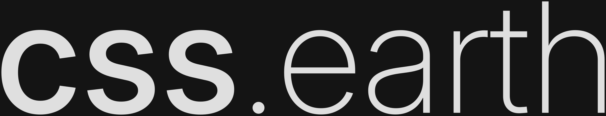
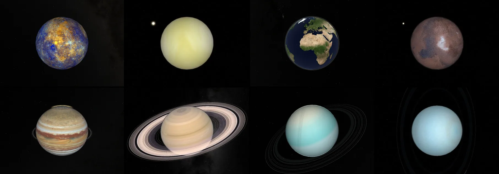
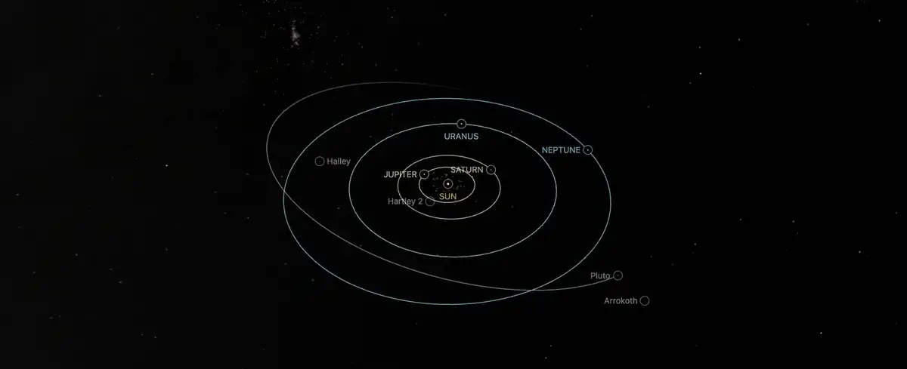
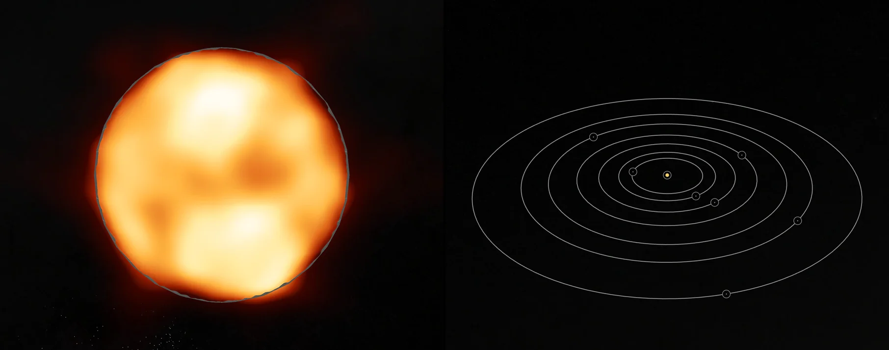
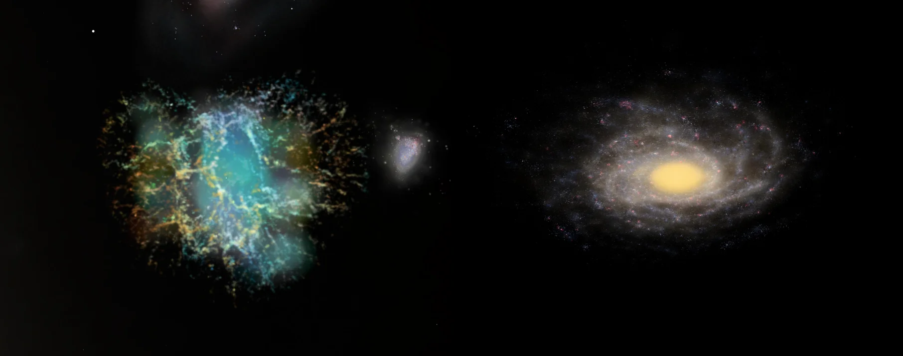

<h1></h1>

A 3D CSS astrovisualization platform that renders celestial bodies as HTML and CSS 3D geometry through [PolyCSS](https://github.com/LayoutitStudio/polycss), without WebGL or canvas. It turns open space data into browser-ready meshes, textures and volumes, all fit into one model of the universe.

Explore the cosmos at [css.earth](https://css.earth/) 🔭

Join the community at [chat.polycss.com](https://chat.polycss.com/) 🌎



## Motivation

Space agencies and observatories publish decades of public data, but it is buried in archives, formats and papers that are hard to access for the general public. css.earth mounts that data in the 3D DOM, with every pixel traceable to the original source.

Other universe browsers exist, and many of them inspired this platform: NASA's [Eyes on the Solar System](https://eyes.nasa.gov/apps/solar-system/), [OpenSpace](https://www.openspaceproject.com/), [Celestia](https://celestiaproject.space/), [Stellarium](https://stellarium.org/) and [Google Earth](https://earth.google.com/). The difference is that [css.earth](https://css.earth) does not need WebGL: it runs in any modern browser, which makes it easier to open and share. It even works without JavaScript!

## What You Can Explore

Every object has its own URL and they all share one camera, so you can fly from Saturn to another galaxy without leaving the page. The catalogue includes Solar System bodies, stars and exoplanets, plus the nebulae and galaxies below.

### The Solar System

The Sun, the eight planets, dwarf planets, moons, asteroids, comets and other trans-Neptunian objects, all on their orbits. Where a mission photographed a body, its surface comes from that mission's images; the rest are shown as shape models.



### Stars and Exoplanets

Stars whose surfaces have been imaged, such as Betelgeuse and R Doradus, and planetary systems beyond the Sun, such as WASP-43, HD 189733 and TRAPPIST-1.



### Nebulae and Galaxies

The Orion Nebula, the Crab, the Lagoon and the Helix, built as 3D volumes, plus the Pleiades cluster. Beyond them: the Milky Way, the Large Magellanic Cloud, Andromeda, Triangulum, the Local Group and the nearby universe.



## Datasets

Each object has datasets assigned, with selectable views of its available products. A view can be a true-colour or single-filter photograph, an enhanced- or false-colour mosaic, a thermal, infrared, ultraviolet or radar map, topography, or an interior model.

The data comes from spacecraft, landers and telescopes, including:

- **Planetary missions:** MESSENGER, Cassini, Galileo, Juno, Dawn, New Horizons, Voyager 1 and 2, Rosetta, Hayabusa and Hayabusa2, OSIRIS-REx, NEAR Shoemaker, DART and LICIACube, Magellan, the Viking orbiters and landers, LRO, MRO and Mars Odyssey.
- **Space telescopes:** Hubble, Webb, Spitzer, Herschel, Chandra, WISE, Gaia and Hipparcos.
- **Ground-based facilities:** ESO's VLT, VLTI, VISTA and VST, ALMA, the VLA and VLBA, and the Arecibo and Goldstone radars.

Preparation reads these products from their public archives, such as NASA's PDS, USGS Astrogeology, MAST, the ESO and ALMA archives and JAXA's JLPEDA, and records each one in `src/sources/`. Each body's README names the products behind its views, how they were processed and their known limits.

## Toolkits

Preparation reads archive formats directly with in-house TypeScript readers. The FITS, PDS, SPICE and photometry readers are checked against independent reference implementations in [`tools/oracles/`](tools/oracles/README.md).

- **FITS and PDS:** FITS images and tables, including Rice-compressed ones, with their sky orientation, and PDS3 and PDS4 labels ([`@cssearth/fits`](packages/fits/README.md), [PDS labels](docs/pds-labels.md)).
- **SPICE:** kernels, clocks, frames and pointing, used to place a spacecraft's camera for each photograph ([`@cssearth/spice`](packages/spice/README.md)).
- **Surface imagery:** image decoding, shape-model reduction, UV mapping and texture atlases ([surface preparation](docs/surface-preparation.md), [colour preparation](docs/color-preparation.md)).
- **Photometry:** Hapke and disc models that separate a surface's brightness from its lighting and viewing angles ([`tools/photometry/`](tools/photometry/README.md)).
- **Interferometry:** calibration and image reconstruction for stellar surfaces from raw VLTI and ALMA observations ([interferometric imaging](docs/interferometric-imaging.md)).
- **Eclipse mapping:** exoplanet maps fitted from raw JWST light curves ([eclipse mapping](docs/eclipse-mapping.md)).
- **Nebulae and galaxies:** 3D volumes and galaxy fields from surveys and catalogues ([prepared nebulae](docs/nebulae/README.md), [galaxies](docs/galaxies/README.md)); the volume bake is [`@cssearth/bake/volume`](packages/bake/README.md).

## Architecture

- **Rendering:** every body is a [PolyCSS](https://github.com/LayoutitStudio/polycss) mesh of HTML elements, placed with CSS `matrix3d(...)` and painted from prepared texture atlases. No canvas or WebGL.
- **Preparation:** Node reads declared source products and writes the textures, geometry, orbits and page text, each recording its sources. Runtime inventories pin the published outputs; source manifests record paths, acquisition and attribution.
- **Objects:** each one is a package under [`src/objects/<id>/`](src/objects/README.md). One registry, one shell and one camera serve them all.
- **Delivery:** prepared files are stored in R2; `pnpm setup:assets` fetches them before Astro builds the site for Netlify.
- **Runtime:** the browser loads prepared state and moves the camera. It never derives geometry or textures.

## How to Run

Use Node.js 24 (or 22.18+) and pnpm 10. Install dependencies, download the prepared assets once, and start the dev server:

```sh
pnpm install
pnpm setup:assets
pnpm dev
```

`pnpm install` builds the shared packages, the renderer and the preparation tools. `pnpm setup:assets` downloads the prepared browser images and each object's baked scene files, which Git does not track. `pnpm dev` serves the site on port 4210.

To work on one object, use `pnpm setup:assets --object=mars` and open `/mars/`. For a production build, run `pnpm build`, then `pnpm preview`.

Re-preparing an object from its original sources needs more: `node tools/assets/restore-source-inputs.mts --object=<id>` restores missing source files, and `pnpm prepare:objects --object=<id>` bakes the selected body. Some conversions need Python or the documented native toolchains. You do not need that to work on the shell, the renderer or the docs.

## Documentation

- [Adding a body](src/objects/README.md): package layout and the preparation steps.
- [Provenance and documentation contract](docs/provenance/CONTRACT.md): how sources, credits and evidence are recorded.
- [Documentation index](docs/README.md): surface preparation, interferometric imaging, eclipse mapping, navigation, performance and more.
- [Contributing](CONTRIBUTING.md): setup, which checks to run and where things live.
- [Celestial skill](.agents/skills/celestial-skill/SKILL.md): the workflow agents follow for body work.

## License and Data

css.earth source code is [MIT licensed](LICENSE). Scientific data, imagery and prepared derivatives keep the terms and attribution of their sources. Each object's README lists its exact provenance, presentation limits and credits, for example [Mars](src/objects/mars/README.md) and [Saturn](src/objects/saturn/README.md). NASA and other source credits do not imply endorsement.
