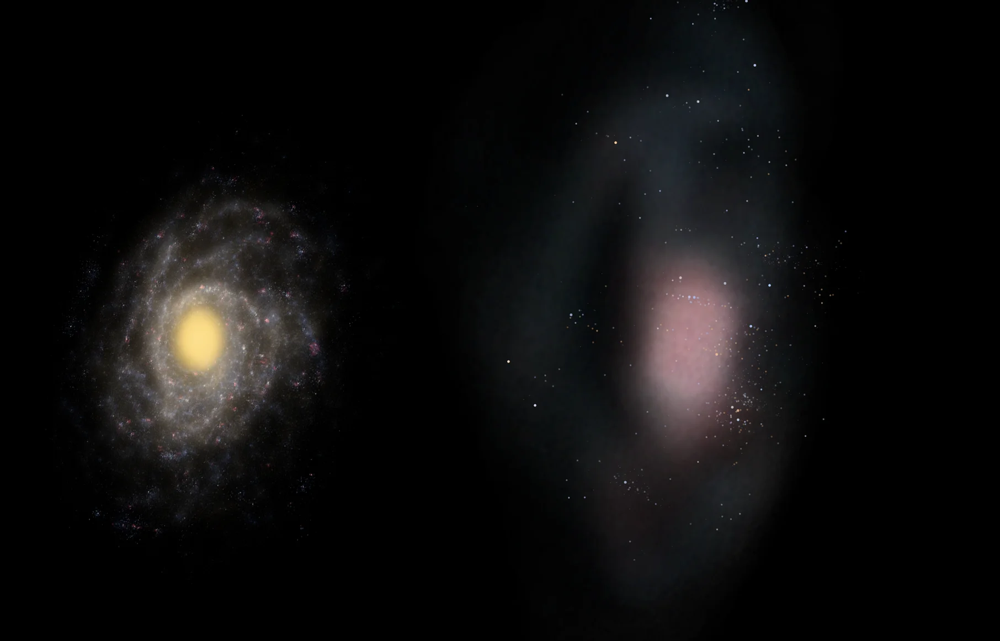

# css.earth 🌎

A 3D CSS astrovisualization platform. [css.earth](https://css.earth) renders celestial bodies as real HTML and CSS 3D geometry through [PolyCSS](https://github.com/LayoutitStudio/polycss), without a WebGL or canvas scene renderer. css.earth preprocesses open space data into browser-ready textures, meshes, and scene files, then loads them into a single model of the universe.

Explore the live version: [css.earth](https://css.earth) 🔭

Join [chat.polycss.com](https://chat.polycss.com) for support and community discussions.


## How It Works

[css.earth](https://css.earth) outputs one URL per celestial body with a shared camera, so you can fly from Saturn to another galaxy without leaving the page. So far, it covers 495 objects:

- **The Solar System:** the Sun, the eight planets, 5 dwarf planets, 99 moons, 311 asteroids, 32 comets and 17 other trans-Neptunian objects, all on their orbits. Where a mission photographed a body, its surface comes from that mission's images; the rest are shown as shape models.
- **Stars and exoplanets:** stars whose surfaces have been imaged, such as Betelgeuse and R Doradus, and planetary systems beyond the Sun, such as WASP-43, HD 189733 and TRAPPIST-1.
- **Interstellar visitors:** 'Oumuamua, Borisov and 3I/ATLAS.
- **Nebulae:** the Orion Nebula, the Crab, the Lagoon and the Helix, built as 3D volumes, plus the Pleiades cluster.
- **Galaxies:** the Milky Way, the Large Magellanic Cloud, Andromeda, Triangulum, the Local Group and the nearby universe.


## Motivation

Space agencies and observatories publish decades of public data, but it is buried in archives, formats and papers that are hard to access for the general public. css.earth mounts that data in the 3D DOM, with every surface traceable to the original product. Every pixel has a source.

Other universe browsers already exist, and many of them inspired this platform: NASA's [Eyes on the Solar System](https://eyes.nasa.gov/apps/solar-system/), [OpenSpace](https://www.openspaceproject.com/), [Celestia](https://celestiaproject.space/), [Stellarium](https://stellarium.org/) and [Google Earth](https://earth.google.com/). 

The key difference is that [css.earth](https://css.earth) does not require WebGL: it runs in any modern browser, which makes it easier to open and share. It even works without JavaScript!



## Datasets

Each object has datasets assigned: the 495 bodies carry 1,035 views between them. A view can be a true-colour or single-filter photograph, an enhanced- or false-colour mosaic, a thermal, infrared, ultraviolet or radar map, topography, or an interior model.

The data comes from 63 spacecraft, landers and telescopes, including:

- **Planetary missions:** MESSENGER, Cassini, Galileo, Juno, Dawn, New Horizons, Voyager 1 and 2, Rosetta, Hayabusa and Hayabusa2, OSIRIS-REx, NEAR Shoemaker, DART and LICIACube, Magellan, the Viking orbiters and landers, LRO, MRO and Mars Odyssey.
- **Space telescopes:** Hubble, Webb, Spitzer, Herschel, Chandra, WISE, Gaia and Hipparcos.
- **Ground-based facilities:** ESO's VLT, VLTI, VISTA and VST, ALMA, the VLA and VLBA, and the Arecibo and Goldstone radars.

Preparation reads these products from their public archives, such as NASA's PDS, USGS Astrogeology, MAST, the ESO and ALMA archives and JAXA's JLPEDA, and records each one in `src/sources/` (3,478 source records). Each body's README names the products behind its views, how they were processed and their known limits.

## Toolkits

Preparation reads archive formats directly with in-house TypeScript readers. The FITS, PDS, SPICE and photometry readers are checked against independent reference implementations in [`tools/oracles/`](tools/oracles/README.md).

- **FITS and PDS:** FITS images and tables, including Rice-compressed ones, with their sky orientation, and PDS3 and PDS4 labels ([`tools/fits.mts`](tools/fits.mts), [PDS labels](docs/pds-labels.md)).
- **SPICE:** kernels, clocks, frames and pointing, used to place a spacecraft's camera for each photograph ([`tools/spice/`](tools/spice)).
- **Surface imagery:** image decoding, shape-model reduction, UV mapping and texture atlases ([surface preparation](docs/surface-preparation.md), [colour preparation](docs/color-preparation.md)).
- **Photometry:** Hapke and disc models that separate a surface's brightness from its lighting and viewing angles ([`tools/photometry/`](tools/photometry/README.md)).
- **Interferometry:** calibration and image reconstruction for stellar surfaces from raw VLTI and ALMA observations ([interferometric imaging](docs/interferometric-imaging.md)).
- **Eclipse mapping:** exoplanet maps fitted from raw JWST light curves ([eclipse mapping](docs/eclipse-mapping.md)).
- **Nebulae and galaxies:** 3D volumes and galaxy fields from surveys and catalogues ([prepared nebulae](docs/nebulae/README.md), [galaxies](docs/galaxies/README.md)).

## Architecture

[css.earth](https://css.earth) is built on the [PolyCSS](https://github.com/LayoutitStudio/polycss) 3D DOM rendering engine. Every body is a mesh of real HTML elements: faces are placed with CSS `matrix3d(...)` transforms and painted from prepared texture atlases. The scene uses no `<canvas>` or WebGL, and no `clip-path`, masks, filters, gradients or blend modes at runtime.

Preparation reads the original products: PDS and FITS images, shape models, SPICE kernels, star catalogues, interferometric and radio data, and published fact sheets. It checks each input against its pinned hash, then writes the textures, geometry, lighting, orbits, labels and page text for each object. The outputs are reproducible from the checked-in inputs, and each one records the sources it came from.

The browser does not derive geometry, textures or charts. It loads the prepared state for the selected object, mounts it into a retained DOM, and moves the camera. Earth is the one object that pages its prepared imagery in and out as you zoom towards city level.

## How to Run

Use Node.js 24 (or 22.18+) and pnpm 10. Install dependencies, download the prepared assets once, and start the dev server:

```sh
pnpm install
pnpm setup:assets
pnpm dev
```

`pnpm install` builds the shared packages, the renderer and the preparation tools. `pnpm setup:assets` downloads the prepared browser images and each object's baked scene files, which Git does not track. `pnpm dev` serves the site on port 4210.

To work on one object, use `pnpm setup:assets --object=mars` and open `/mars/`. For a production build, run `pnpm build`, then `pnpm preview`.

Re-preparing an object from its original sources needs more: `pnpm prepare:checkout` restores the pinned source downloads, and some conversions call Python 3 with `numpy`. You do not need that to work on the shell, the renderer or the docs.

## Documentation

- [Adding a body](src/objects/README.md): package layout and the preparation steps.
- [Provenance and documentation contract](docs/provenance/CONTRACT.md): how sources, credits and evidence are recorded.
- [Documentation index](docs/README.md): surface preparation, interferometric imaging, eclipse mapping, navigation, performance and more.
- [Contributing](CONTRIBUTING.md): setup, which checks to run and where things live.
- [Celestial skill](.agents/skills/celestial-skill/SKILL.md): the workflow agents follow for body work.

## License and Data

css.earth source code is [MIT licensed](LICENSE). Scientific data, imagery and prepared derivatives keep the terms and attribution of their sources. Each object's README lists its exact provenance, presentation limits and credits, for example [Mars](src/objects/mars/README.md) and [Saturn](src/objects/saturn/README.md). NASA and other source credits do not imply endorsement.
