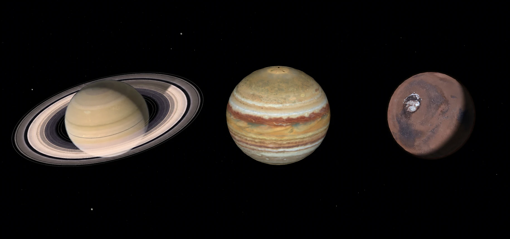

# cssEarth 🪐

A 3D CSS planetary explorer. cssEarth renders planets as real HTML and CSS 3D
geometry through [PolyCSS](https://github.com/LayoutitStudio/polycss), without
a WebGL or canvas scene renderer. It preprocesses planetary data into
browser-ready textures, charts, and retained scene plans, then lets you orbit
and inspect one planet at a time.

Explore the live version: [css.earth](https://css.earth) 🪐



## How to Build

Install dependencies and download the prepared browser assets, then start the site:

```sh
pnpm install
pnpm setup:assets
pnpm dev
```

For Earth alone, use `pnpm setup:assets --object=earth` and open `/earth/`.
Setup resumes existing files and verifies them against the checked-in runtime
inventories. It does not require source imagery, preparation tools, or the
25.4 GB Earth geometry mirror. Development and preview fetch the visible
geometry ranges from the published release when no local mirror is present.

To build all routes for production, run `pnpm setup:assets`, `pnpm build`, then
`pnpm preview`. To regenerate assets from source instead, run
`pnpm prepare:checkout`; that is the full preparation workflow described below.

## Checks

`pnpm test` runs package, renderer, platform, and shell behavior tests. It does
not reconstruct bodies or verify the full archive of scientific source files.

`pnpm test:browser` uses the existing server on **4210** for the shared body
and navigation checks at DPR 1 and DPR 2. It never starts a server or saves a
screenshot matrix. To check one body, use
`pnpm test:browser http://localhost:4210 mimas`.

Source acquisition verification (`pnpm acquire:planets -- --verify-only`),
preparation tests (`pnpm test:preparation`), prepared body data tests
(`pnpm test:planets`), and extended interaction conformance
(`pnpm test:browser:conformance`) are separate, explicit commands for changes
that need them. Source/preparation checks require their declared raw inputs.
For a camera or lens lifecycle change, focus conformance with
`pnpm test:browser:conformance http://localhost:4210 mimas`.
SEO and Earth delivery diagnostics also reuse an existing server; they never
launch a private Astro instance or rewrite the renderer.

## How It Works

cssEarth uses PolyCSS to turn planetary geometry into real HTML elements.
Faces, rings, moons, shadows, and atmosphere layers are positioned with CSS
`matrix3d(...)` transforms and textured with prepared CSS backgrounds instead
of being drawn to a `<canvas>`.

The shared shell loads the selected body from an open-ended object registry and
mounts one retained scene and one camera. Each object package owns its
scientific sources, textures, geometry, lighting, optional control content, and
material presentation. One shared runtime owns mounting, readiness, controls,
selection transactions, image residency, playback, camera binding, and cleanup.
Mercury and Venus consume validated JSON through the TypeScript CSS renderer;
the other clients retain their existing runtime adapter. The shell owns
navigation, information panels, playback permission, and responsive behavior.

Mercury and Venus share a prepared heliocentric frame. Selecting either in the
navigation bar or celestial vault flies the same physical camera to it using
the Galaxio selection curve. The next fixed asset bank loads during flight;
the current detailed scene is released before the destination mounts. The
document and shell persist. Back restores the saved camera and playback state;
camera input interrupts flight at the last drawn view. Existing object routes
and compact `?v` links remain supported, including translated camera positions.
The [architecture](docs/shared-runtime-architecture-proposal.md) explains the
contract and the rendering differences that remain inside each package. The
[proof](docs/generic-runtime-contract-proof.md) uses the actual registered objects
in real Chrome at DPR 1 and 2.

## Build and Runtime

cssEarth separates source-backed preparation from browser playback. Node tools
turn checked OpenSpace, NASA, JPL, USGS, and other planet-owned inputs into
local images, generated scene modules, scientific charts, and prepared motion
banks. At runtime, the browser only loads and displays these prepared assets.

Mercury and Venus use the shared TypeScript preparation pipeline. Their authored
capabilities and parameters are JSON; raster and geometry operations live in
the renderer-independent objects package. CSS compilation and file/image I/O
stay in application adapters. Earth and the other objects retain their existing
preparation implementations.

```text
src/planets/{mercury,venus}/
├── object.json                  Pinned capability recipe and transport digest
├── source/                      Authored JSON, scientific inputs and provenance
├── prepared/                    Baked JSON, committed for clean checkouts
│   └── object.json              Rebuilt runtime payload (Git-ignored)
├── runtime-assets.json          Reproducible asset inventory
└── SOURCE.md, NOTICE.md, LICENSE.*  Credits and licences
packages/objects/src/            Generic schema, geometry and pixel operations
src/preparation/                 Node image/file adapters
src/renderers/css/preparation/   CSS projection and retained presentation compiler
tests/objects/                   Object fixtures and browser/scientific regression tests
```

`pnpm install` builds packages and preparation tools, then assembles the small
transport JSON beside each object from its committed preparation output. It does not rebake textures.
To regenerate Mercury or Venus after changing their authored inputs, run
`pnpm prepare:planets --object=mercury` or `--object=venus`. The same commands
validate source pins, compile every layer, and replace their generated outputs.

Large source binaries and generated browser assets are intentionally not
committed. Their URLs, sizes, hashes, provenance, preparation code, and runtime
inventories are committed. `pnpm setup:assets` downloads the prepared outputs from
immutable URLs on the project asset CDN. After changing prepared outputs,
maintainers publish their updated inventories with `pnpm publish:runtime-assets`
(or `--object=earth`) before pushing the code that references them.

`prepare:checkout` restores the exact source bytes
and Earth's published geometry release, then generates `public/scenes/` locally.
The pinned worldwide release contains 19,632 packs (25.4 GB) outside Git and
`dist`. Acquisition resumes valid local packs and validates every replacement
before publishing it atomically to `.local/wmts-global/<version>/`.
See [Earth reproduction](docs/global-earth-coverage.md#reproduction-and-checks)
for acquisition and explicit geometry-authoring commands.

The vendored astronomy package (`packages/astronomy`, see its `SOURCE.md`) is
a preparation dependency only. It is consumed through its own build, which
`pnpm install` runs as `postinstall` (`pnpm build:astronomy` repeats it);
`pnpm prepare:planets` builds it first, and `pnpm prepare:solar-geometry`
regenerates the checked-in `src/platform/solar-geometry.mjs` from it
bit-for-bit. The browser runtime never loads it.

Surface minimaps are separate prepared WebP images, at most 640 pixels wide
for the sidebar at DPR 2. Object preparation writes them under
`prepared/minimaps/`; `pnpm prepare:surface-minimaps` refreshes them from existing
normalized maps or raster sources. The sidebar never downloads the HD globe map
for its preview.

After preparation, verify the local source closure or regenerate the browser
assets with:

```sh
pnpm acquire:planets -- --verify-only
pnpm prepare:planets
```

Preparation uses the same object registry as the application. Independent object
chains run in parallel, with a conservative limit based on available CPU and
memory. Unchanged objects reuse prepared files only after their source, generator,
toolchain, and output hashes have been verified. Missing or changed output files
rebuild their object. A changed shared generator invalidates affected caches.
Earth's pinned geometry packs are included in its input verification.

Use `pnpm prepare:planets:full` for a full rebuild, including reproducibility
checks. Use `pnpm prepare:planets --object=saturn` to prepare one existing object,
or `--concurrency=2` to limit parallel work. Per-object timings and cache results
are recorded in `.local/preparation/latest-run.json`. Saturn's preparation
generates its normal material masters once and verifies them before composing
the complete scene.

Measured on the development Mac on 2026-09-05, the complete serial rebuild took
44m39s. Two forced builds with three workers took 18m24s and 19m28s and produced
identical outputs. The verified unchanged run took 44s with all eleven cache
entries reused; reading and hashing Earth's 25.4 GB input release took 38s of
that run. These are local measurements, not guaranteed build times.

The existing NASA description collection is prepared separately and committed
under `data/planets/`. Other objects may own their source snapshots and parsers;
this importer is not a condition of the object contract:

```sh
pnpm prepare:planet-info -- saturn
pnpm prepare:planet-info
```

The importer validates NASA's record identity and structured content schema.
It does not fall back to scraping rendered webpages. Pluto uses checked,
object-owned NASA and JPL sources, without adding another registry entry here.

## License and Data

cssEarth source code is [MIT licensed](LICENSE). Scientific data, imagery, and
prepared derivatives retain the terms and attribution of their respective
sources. See the planet-owned
[Mars](src/planets/mars/SOURCE.md) and
[Saturn](src/planets/saturn/SOURCE.md) source records for exact provenance,
presentation limits, and credits. NASA and other source credits do not imply
endorsement.
