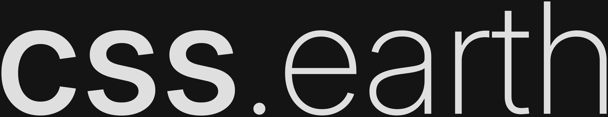
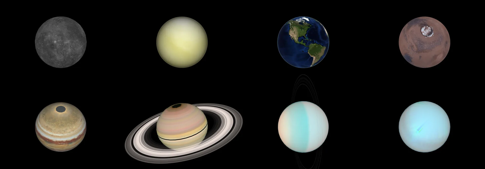
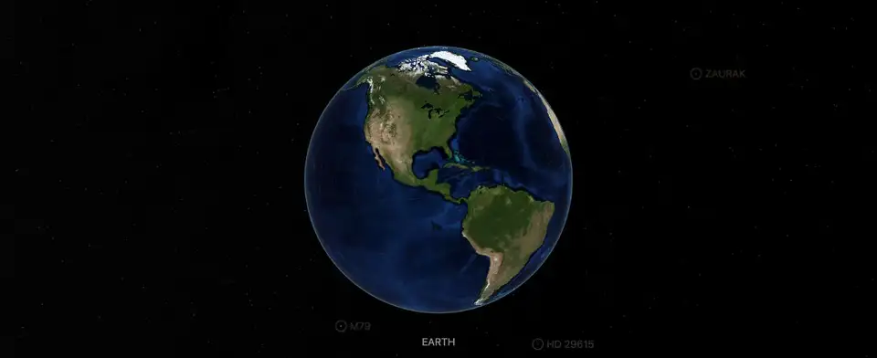
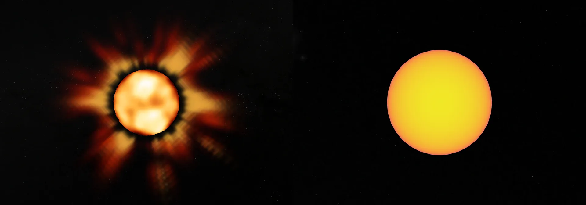
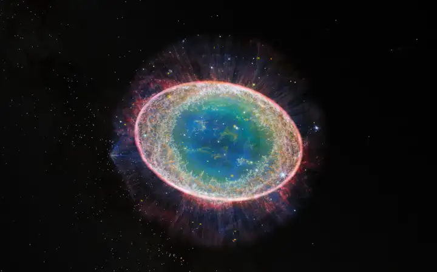
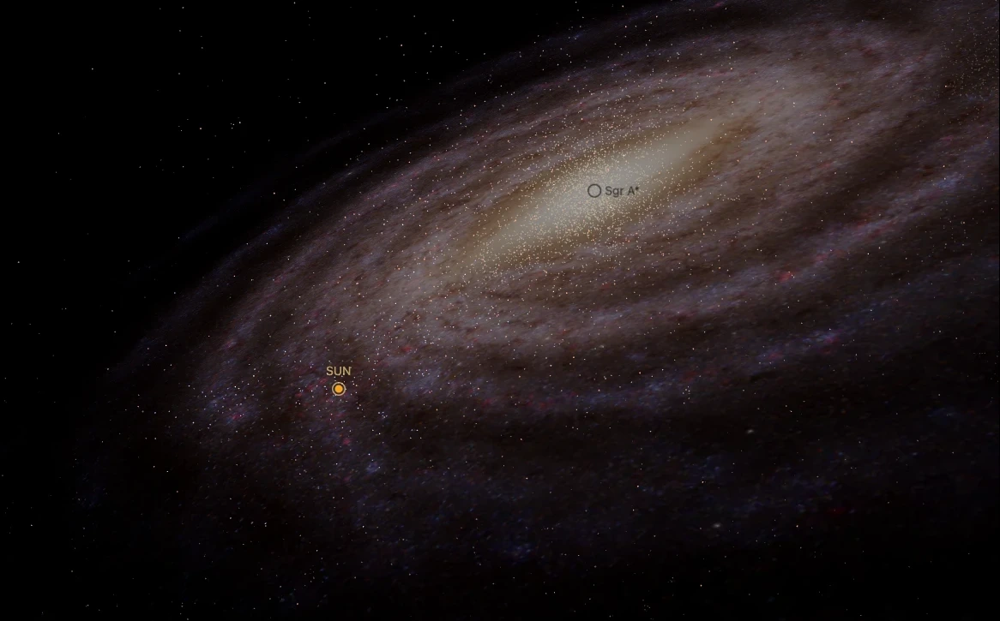
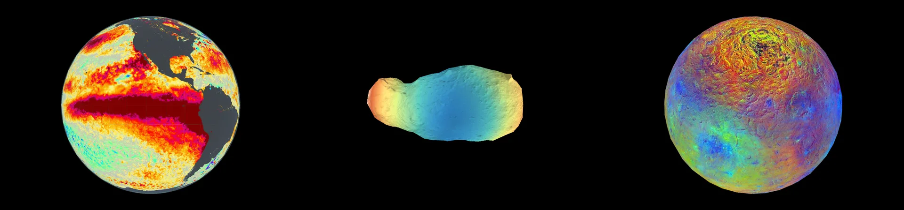

<h1></h1>

A 3D CSS astrovisualization platform that renders celestial bodies as HTML and CSS 3D geometry through [PolyCSS](https://github.com/LayoutitStudio/polycss), without WebGL or canvas. It turns open space data into browser-ready meshes, textures and volumes, all fit into one model of the universe.

Explore the cosmos at [css.earth](https://css.earth/) 🔭

Join the community at [chat.polycss.com](https://chat.polycss.com/) 🌎



## Motivation

Space agencies and observatories publish decades of public data, but it is buried in archives, formats and papers that are hard to access for the general public. css.earth mounts that data in the 3D DOM, with every pixel traceable to the original source.

Other universe browsers exist, and many of them inspired this platform: NASA's [Eyes on the Solar System](https://eyes.nasa.gov/apps/solar-system/), [OpenSpace](https://www.openspaceproject.com/), [Celestia](https://celestiaproject.space/), [Stellarium](https://stellarium.org/) and [Google Earth](https://earth.google.com/). The difference is that [css.earth](https://css.earth) does not need WebGL: it runs in any modern browser, which makes it easier to open and share. It even works without JavaScript!

## What You Can Explore

Every object has its own URL and they all share one camera, so you can fly from Saturn to another galaxy without leaving the page. The catalogue includes Solar System bodies, stars and exoplanets, plus the nebulae and galaxies below.



### The Solar System

The Sun, the eight planets, dwarf planets, moons, asteroids, comets and other trans-Neptunian objects, all on their orbits. Where a mission photographed a body, its surface comes from that mission's images; the rest are shown as shape models.

### Stars and Exoplanets

Stars whose surfaces have been imaged, such as Betelgeuse and R Doradus, and planetary systems beyond the Sun, such as WASP-43, HD 189733 and TRAPPIST-1. Some stars also carry a corona modelled from maps of their magnetic field, such as ε Eridani and HD 189733, or a debris disc, such as Fomalhaut and β Pictoris.



### Nebulae and Galaxies

The Orion Nebula, the Crab, the Lagoon and the Helix, built as 3D volumes or as pictures placed on published 3D shapes, such as the Ring and Cassiopeia A, plus the Pleiades cluster. Beyond them: the Milky Way, the Large Magellanic Cloud, Andromeda, Triangulum, the Local Group, the Galactic Centre, galaxy clusters such as the Bullet Cluster and Abell 1689, and the nearby and observable universe.

 

## How It Works

css.earth uses the [PolyCSS](https://github.com/LayoutitStudio/polycss) engine to turn celestial bodies into 3D DOM elements. The universe is a shared `matrix3d(...)` scene, and nothing is drawn to a `<canvas>` or relies on WebGL.

Every pixel has a source. What you see is built from public data from spacecraft and telescopes, such as Cassini at Saturn, New Horizons at Pluto, and Hubble and Webb at the Ring Nebula. An object can carry several datasets to switch between, and its README names the data behind each one, how it was processed and its known limits.



## Telescope API

css.earth includes a `telescope` API for finding observations of a target. `explore` looks through the JWST, Hubble, ESO, ALMA, Keck, Gemini, Chandra and Spitzer archives at once, then asks which result to retrieve.

```sh
pnpm telescope explore eris
pnpm telescope explore eris --kind cube --wavelength 2.2,2.4 --out runs/eris
```

A retrieved file can be exported as an image, a spectrum, a map projected onto its body, or a standalone 3D sphere in HTML. For some instruments, the observatory's own software is run again on the same inputs and the result is checked against the published product. See the [command guide](packages/telescope-cli/README.md) for more information.

## How to Run

Use Node.js 24 (or 22.18+) and pnpm 10. Install dependencies, download the prepared assets once, and start the dev server:

```sh
pnpm install
pnpm setup:assets
pnpm dev
```

`pnpm install` builds the shared packages whose sources changed, the renderer and the preparation tools. `pnpm setup:assets` downloads the prepared browser images and each object's baked scene files, which Git does not track. `pnpm dev` serves the site on port 4210.

To work on one object, use `pnpm setup:assets --object=mars` and open `/mars/`. For a production build, run `pnpm build`, then `pnpm preview`.

Re-preparing an object from its original sources needs more: `node packages/bake/cli/restore-source-inputs.mts --object=<id>` restores missing source files, and `pnpm prepare:objects --object=<id>` bakes the selected body. Some conversions need Python or the documented native toolchains. You do not need that to work on the shell, the renderer or the docs.

## Documentation

- [Adding a body](src/objects/README.md): package layout and the preparation steps.
- [Provenance and documentation contract](docs/provenance/CONTRACT.md): how sources, credits and evidence are recorded.
- [Documentation index](docs/README.md): surface preparation, interferometric imaging, eclipse mapping, telescopes, navigation, performance and more.
- [Contributing](.github/CONTRIBUTING.md): setup, which checks to run and where things live.
- [Celestial skill](.agents/skills/celestial-skill/SKILL.md): the workflow agents follow for body work.

## License and Data

css.earth source code is [MIT licensed](LICENSE). Scientific data, imagery and prepared derivatives keep the terms and attribution of their sources. Each object's README lists its exact provenance, presentation limits and credits, for example [Mars](src/objects/mars/README.md) and [Saturn](src/objects/saturn/README.md). NASA and other source credits do not imply endorsement.
