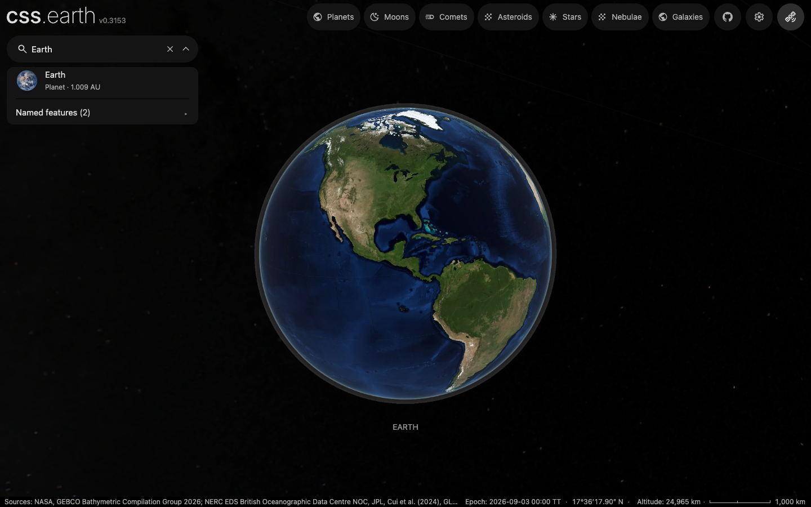

# Direct navigation and query-driven search

Refactor checkpoint: `900b3f1e4e30a3440b4eef738616de08f9ee3acb`. Integrated with main `1bd667945b` in `a1120ace5e91db460a1f41ea9317754e3fc58169`.

The change removes intermediate navigation group/system records and its separate full-world JSON reader. Navigation and markers now use the application's validated summary. Source package titles and catalogue focus bindings stay in a small preparation-only reader; it reads README content only where a descriptor does not supply the title.

Search no longer maintains hidden category tabs, counts, selection, keyboard handling, cached match flags or parallel distance/category lists. One ordered label list supplies matching and rendered rows. Old category-only native URLs retain their grouping. The real information tabs remain.

## Recorded comparisons

- Navigation payload is byte-identical to the pre-Atlas-removal implementation (`c3f222a`), SHA-256 `0498924b0935f2c3afd605cade0e5b7e9a4b75694ba24f101e9714adfbe77a5b`.
- All 681 body orbit-parent/color inputs agree between the old full context (10,798,395 bytes) and already-used summary (316,595 bytes). This removes a preparation-side read, not browser download bytes.
- `jankmonster-comparison.json` compares the snapshot committed as `817f256` with the subsequent navigation/search worktree: 44 fewer branches, 41 fewer functions, 4 fewer exports, 15 fewer mutable bindings, 2 fewer registered listeners. Same analyzer fingerprint; source counts, not performance or proof of unreachability. The audit preceded the final two Astro result components' unused-prop deletion and the main merge.
- This extension commits 228 additions / 446 deletions: 218 fewer lines. The cumulative PR against merged main is 428 additions / 2,333 deletions, including the lockfile.
- `search-flows.json` records identical ordered results for Planets (13), Moons (132), Nebulae (6), Galaxies (695), all objects (1,435), `t` (304), and no-match (0). Escape/reopen retains text; clearing restores the tree. No page errors.
- `windowed-flows.json` exercises those queries through the production JSON catalogue and virtualized rows, then Mercury → Venus keyboard focus and Escape. The browser intercepted the initial document only to replace inline dev rows with the empty catalogue placeholder; it used the real index loader and runtime. Reported row counts are the rendered window, not total result counts.

## Visual evidence

Earth, expanded tree and settled Earth search: 0 / 1,296,000 differing pixels each, at threshold 0.1 and threshold 0, including AA. Final PNG pairs are byte-identical. Chrome 153.0.8010.53, 1440×900, DPR 1; same camera, default labels/motion settings, and shared inventory-addressed prepared inputs. Unlike the earlier evidence, these search captures contain the rendered Earth.

The first tree capture caught its existing 150 ms caret transition: 36 differing pixels at threshold 0.1. The retained tree pair waits for that transition to finish. Earth/search captures were already exact and were reused. `pixelmatch.json`, capture logs, source hashes, images and diff images pin the comparison. `compare.mts` is the comparison recipe; the metadata explicitly identifies the pre-merge checkpoint.

## Checks and integration

22 existing search/navigation/focus checks pass. Astro: 210 files, zero errors/warnings, five hints. Affected ESLint passes. The final result-prop deletion is markup-equivalent and was exercised by the later browser flows. No new test or CI infrastructure.

The merge conflict was only in browser preview state: retain main's query clearing/restoration with the refactor's single `open` state. Main's catalogue reopening invalidation was retained automatically. Shell typecheck passed after resolution; `post-merge-flow.log` and `post-merge-settled.log` record live result selection.

Paired captures/counts qualify the pinned refactor checkpoint, not the expanded upstream object set added by the main merge. New upstream assets were not rebuilt or visually requalified. Some non-Earth thumbnails are absent in the sparse local checkout. Full-suite, deployment, bfcache and performance qualification were not run. Earlier router evidence remains applicable to the unchanged router files.
