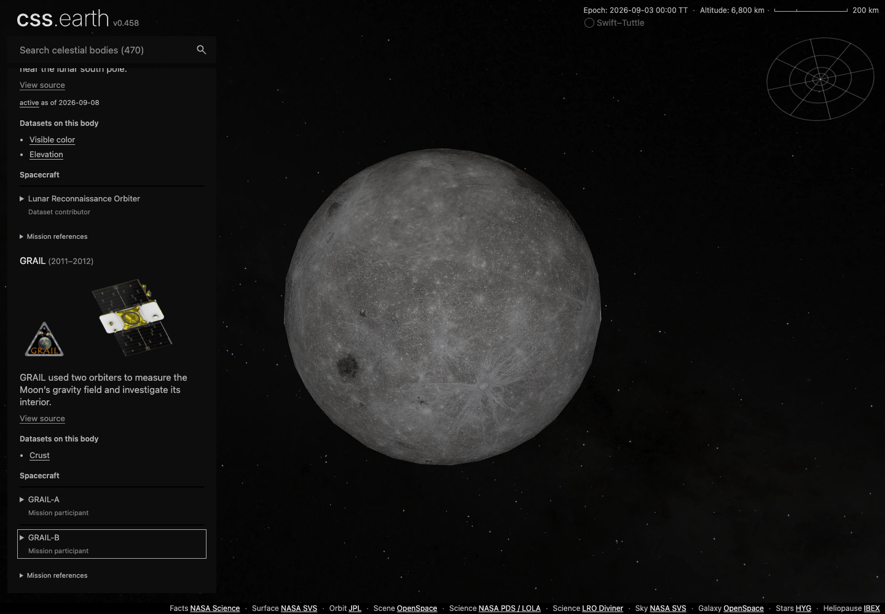
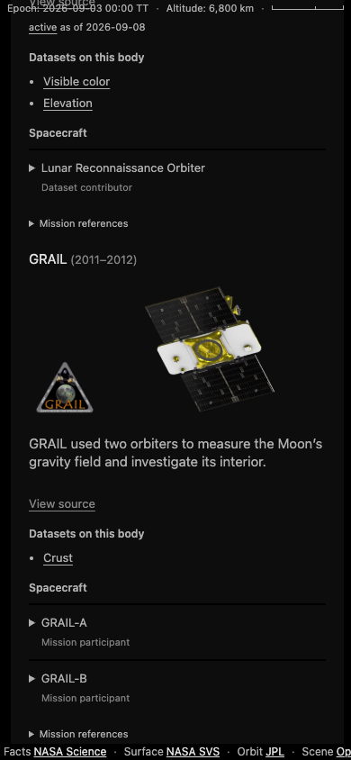

# Missions, facilities and dataset attribution

`OBJECTS` owns navigable scenes. `MISSIONS` owns individual missions.
`FACILITIES` owns what is credited with observing: spacecraft, landers, rovers and
ground telescopes. Facility is the term astronomy uses in its own records (the
[Facilities line of AAS journal articles](https://journals.aas.org/facility-keywords/) lists telescopes and spacecraft alike, each
with its instruments); the instruments a facility carries, such as MATISSE on the
VLTI, are not separate records. A facility can serve more than one mission, and a
mission can operate several facilities. The mission's participant list owns that
relationship; reverse participation is derived. The page keeps its reader label,
Machines; the repository names are facility and facilities.

A facility is whatever a dataset credits as its observer, in orbit or on the
ground. A cited `setting` of `space` or `ground` separates the two halves, and
validation keeps them apart: a ground facility is `commissioned`, `retired` and
sited at geodetic coordinates but never launched, while a space facility is
launched but never sited. Arecibo's radar shape of an asteroid is the same
contribution edge as an orbiter's imagery, so it is the same kind of record.

The catalogues live in
[`site/source/facilities/catalog.json`](../../site/source/facilities/catalog.json)
under `cssearth-facility-catalog@4`. They do not add scene loaders, routes or
camera owners. Mission and facility IDs are scoped to their domains: the
spacecraft Juno does not refer to the independently registered asteroid Juno,
whose own shape is credited to a ground telescope.

## Authoring and validation

[`exploration-catalog.mts`](../../src/platform/exploration-catalog.mts) validates
unknown input and returns immutable records. Names, descriptions, facility kinds, settings,
agencies, dates and status claims carry citations to the
[Sources catalogue](../sources-catalogue.md), with a checked date and a field or
section locator. Participation requires its own citations. Agency records use the existing
[agency owner](../../site/source/agency-logos.json); a logo is optional.

Dates retain their supplied precision. A year is not expanded to an invented
January date. Validation rejects impossible calendar dates and date intervals
that establish an end before a start. An active status must include its `asOf`
date and cannot contradict a known earlier end. The card displays the claim's
date instead of describing it as live status.

A facility carries a `band` only where its own cited source states one. Most
spacecraft carry several instruments across the spectrum, so no single band is
true of them and none is invented. A body's contributor cards collapse into one
tabbed card only when every contributor has a distinct band; otherwise they stay
separate cards, which is the ordinary case for spacecraft.

Separately operated facilities get separate records. Instruments,
containers and return capsules are not automatically facility records. Routine
extensions, encounters and manoeuvres do not automatically create new missions;
use the source's distinction. Coverage is limited to the records in the catalogue.

Artwork references use `imageId` and `emblemId`. The approved
[render library](../../site/source/facilities/render-library.json) and
[emblem library](../../site/source/facilities/emblem-library.json) own the asset
bytes and credits. A facility with no 3D model carries a published photograph
instead, pinned in
[`photograph-records.json`](../../site/source/facilities/photograph-records.json)
and prepared by
[`prepare-facility-photographs.mts`](../../tools/prepare/prepare-facility-photographs.mts)
into the same library, where `source.kind` tells a photograph from a render.

Artwork preparation is an explicit maintenance operation; normal builds reuse the
committed files. `node tools/prepare/prepare-facility-photographs.mts` re-acquires each pinned
photograph and prepares it to the library's frame.
`node tools/prepare/prepare-facility-renders.mts` clears the flat sidebar background out of the
approved renders to alpha, flood-filling only from the frame edges and refusing
any change to artwork RGB, then records where each facility sits so a card can
crop to it rather than to the empty frame around it.

Approved artwork is public domain or CC BY, with one recorded exception: the
Herschel photograph is CC BY-SA 3.0, because its only public-domain alternative
is too small for the frame and ESA's own images are share-alike. Each entry
carries its `license`, so the obligation stays attached to the file it covers. An emblem represents a mission. Group artwork remains mission
artwork; the individual GRAIL vehicles have text details rather than duplicate
portraits of the pair. The old Viking artwork remains in its approved library,
without being relabelled as a specific orbiter or lander.

## Capture evidence and the prepared graph

An optional `capture.observation` identifies a particular observation or published
image product, its target, date, instrument, bands and supporting evidence.
Use `null` for unavailable date, instrument or band information; omit the whole
record when no particular observation is identified. Attribution alone supplies
none of these facts. For example, M45's `noao-m45` record retains the published
B/V/I bands and leaves the exposure date and instrument unknown in that pinned
record. Contribution edges preserve this metadata and the product's input roles.

Source manifests use one of three explicit capture forms:

```json
{
  "capture": {
    "attributions": [
      {
        "kind": "facility",
        "facilityId": "osiris-rex",
        "missionId": "osiris-rex",
        "evidence": "The specific pinned source label or archive reference."
      }
    ]
  }
}
```

A `mission` attribution supplies `missionId` and `evidence`. An `unresolved`
attribution supplies `label`, `evidence` and `reason`. Vehicle-only attribution
omits `missionId`; the compiler must not choose one from participation. Evidence
may be prose and must not be manufactured into a URL. Source records retain the
original archive and acquisition links; the Sources card uses the published
citation URL.

The [contribution compiler](../../src/platform/exploration-contributions.mts)
walks the existing source/product lineage, including dependencies and parent
products. Each edge retains its object, product, source, lens IDs and attribution.
All forward and reverse indexes come from this one edge set. Dataset destinations
are deduplicated by `(objectId, lensId)`; multiple evidence edges remain distinct.
Mission-only evidence creates no vehicle contribution edge. Participation creates
no observation edges.

The compiler validates every authored capture, including inputs outside the
current products. It validates product lens IDs against prepared page controls,
checks those controls against the object's scene identity, and retains the
existing exclusions for schematic interiors, illustrative models, modeled noise
and schematic morphology. Empty attribution stays empty; names, publishers,
mission targets and aliases are not association rules.

[`prepare-facilities.mts`](../../tools/prepare/prepare-facilities.mts) compiles the Sources
and Missions catalogues with their validated records and graphs. The common
[site entry point](../../site/exploration-catalog.mts) parses the prepared records
against the Sources catalogue; it no longer verifies a dependency-hash closure.
Regenerate the catalogues after changing their inputs. Astro
renders the current body's cards and relevant vehicle details; the browser does
not receive the complete graph or walk source provenance.

The shared inert sidebar previews omit dataset context. Selecting a body still
shows its prepared preview immediately; the existing `/navigation/<id>/` content
request supplies its mission and source cards before the destination controls become active.
The content transport fills that deferred template while retaining the preview's
overview and controls. It does not create a separate catalogue fetch or preload
every body's mission markup.

Each selected dataset shows one card per contributing mission and a Sources
card on the right. Mission names sit over the artwork, with supplied date ranges
on the next line. Unknown attribution stays as supplied prose. The context is
hidden in overview, Factsheet and Moons views; on narrow screens it follows the
body card. The detail and overview Moons tabs share the same prepared orbit-parent
list and normal object navigation.

## Dataset navigation

A dataset view has a normal body URL, such as `/moon/#dataset=crust`. The fragment
represents the committed selection. Unrelated existing fragments are preserved.

The generic scene lifecycle exposes optional `datasets` with `ids`, `defaultId`,
`current()`, `select(id, { signal })`, and `subscribe(listener)`. Deferred mounts
expose it after readiness. Selection uses the existing asset-residency transaction:
unknown IDs and failed decoding reject, cancelled work resolves `false`, and a
successful publication resolves `true`. Cancellation settles before a pending
image decode and cannot publish after a newer navigation.

The router owns both the fragment and history:

- A same-body dataset link preserves the camera and pushes one history entry
  after the dataset commits.
- A cross-body link uses the shared camera handoff, selects after scene readiness,
  and commits one destination entry. Dataset failure leaves the destination's
  default available and publishes a canonical URL with a notice.
- Manual lens selection replaces the current history entry. It does not fill the
  back stack with every lens click.
- Ordinary body/overview navigation removes the departing dataset choice. Back
  and forward restore the saved camera and dataset, using the default when the
  fragment is absent.
- An invalid initial fragment stays visible for diagnosis while the default is
  shown. A valid selection or navigation clears that state.
- The Datasets tab opens after a requested dataset succeeds. No router simulates
  a click on a lens button or changes the object scene registry.

## Interface examples

These captures document the previous Missions tab, not the current dataset
context cards.

The Moon illustrates the distinction between a mission contribution and vehicle
participation. GRAIL links to the Crust dataset, while GRAIL-A and GRAIL-B are
labelled as mission participants. These desktop and phone examples were captured
from the production build with application sources at `bfc4ed3a682300c08cf324f23bbd5a6afd060fa1`.
The [browser evidence](../../site/test/evidence/dataset-navigation-2026-09-10.json)
records the cases, viewports, settings, build-file hashes and image hashes.





## Preparing and checking a change

Use the [Sources preparation workflow](../sources-catalogue.md#prepare-and-check)
after changing capture records, catalogue metadata or artwork. It publishes object
provenance, Sources and Missions together without acquiring or rendering images.

Run `pnpm test:node` for metadata, bindings and catalogue compilation. It covers
malformed records, source conservation, reverse links and deterministic output.
For changes to dataset selection or routing, also run the affected
[selection](../../src/platform/object-selection-runtime.test.mts) and
[router](https://github.com/layoutit/css.earth/blob/264ef405472f4713af68fa692b4b8fd0ccaf5690/site/test/navigation-router.test.mts) tests for cancellation and history.

For dataset navigation or card presentation changes, run the affected
[dataset response](../../site/test/dataset-response.test.mts),
[URL](../../site/test/dataset-url.test.mts) and
[scene session](../../site/test/scene-session.test.mts) tests. After a build,
[`rendered-page.test.mts`](../../site/test/rendered-page.test.mts) parses the
Saturn, Earth and Mercury HTML to check that each page contains one prepared
scene, a camera, prepared texture references and unique element IDs. It does
not exercise navigation or inspect browser screenshots.
A source association does not certify texture delivery or scientific accuracy.
