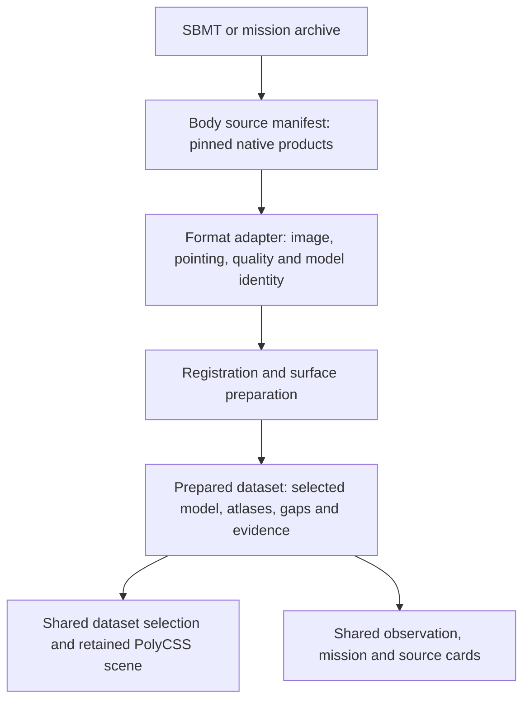

# Observations and SBMT

An observation connects measured pixels to an instrument, an acquisition, a
camera solution and a particular shape model. A displayed dataset uses one or
more observations. Preserving that relationship lets viewers inspect where a
surface came from and lets contributors add another supported observation
without building a body-specific importer or interface.

SBMT supplies native data and registration products during preparation. Its
Java application is not a browser dependency. The same observation contract
also applies to products acquired directly from PDS or a mission archive.

## Ownership

| Record | Owner and responsibility |
| --- | --- |
| Published source | The existing Sources catalogue keeps the archive identity, release, citation and reuse terms. SBMT software licensing does not replace the dataset's terms. |
| Acquired bytes | Each body's source manifest pins native files, labels, URLs and hashes. Existing acquisition recipes restore selected inputs. |
| Observation interpretation | A format adapter decodes the native image, calibration, valid pixels and camera convention. The body's preparation recipe selects the products and processing policy. |
| Shape model | The dataset selects the exact supporting source model. Existing `radialTerrainAlternatives` supports another dataset's model within the same object scene. |
| Derived surface | Existing surface preparation owns registration, visibility, photometry, mosaics, reduction, atlases and gap masks. |
| Evidence | Preparation emits measured results; provenance binds them to the contributing files and resulting dataset. |
| Presentation | Shared dataset controls, Sources and mission attribution consume prepared content. `OBJECTS` remains the sole scene registry. |

The observation ID identifies a source acquisition within its body package; a
dataset ID identifies a useful rendered view. A collection containing thousands
of images therefore does not become thousands of resident textures or menu
entries. Contributors select a bounded set for each scientifically meaningful
view. Sources and mission links remain derived from product lineage.

## Preparation boundary

Start with the native image and its actual companion products. A nearby image,
matching body name or identical acquisition timestamp does not establish byte
identity, calibration equivalence or a shared surface reference.

Adapters belong in `tools/objects/observation/`. They feed the existing
`surfaceObservations` preparation seam. They do not acquire their own renderer,
runtime camera, source catalogue or page. An adapter must state its supported
native format and reject unimplemented calibration or coordinate conventions.
SBMT is not one universal image format: SUM pointing, FITS images, backplanes,
shape files and facet fields have distinct source semantics.

Keep these checks separate:

1. Bind image, pointing and quality companions to the intended acquisition.
2. Establish the camera convention and validate registration against archived
   surface coordinates or equivalent measured camera evidence.
3. Establish correspondence to the selected source mesh. A model transfer is a
   measured operation, not an implicit consequence of sharing a body ID.
4. Apply the existing visibility, valid-pixel and photometric policies; preserve
   unsupported surface as the ordinary grid.
5. Prepare the bounded display mesh, atlases, thumbnails and measured evidence.

Acquisition, camera decoding and qualified terrain coverage are different
outcomes. An image can be inspected while its registration remains unresolved;
that does not authorize a photographic surface lens. A camera round trip or a
plausible outline is useful diagnostic evidence, not independent registration.

## Shared presentation

A viewer opens the ordinary body route, selects a dataset, rotates the same
scene and sees the selected dataset's mission and source cards. The proposed
observation disclosure adds the contributing source photographs, instrument,
acquisition time, measured coverage and registration evidence. It follows the
selected dataset and the existing mobile card layout.

Prepared evidence lives at `prepared/observations.json` under
`cssearth-prepared-observation-evidence@1`. The parser is
[`observation-evidence.mts`](../../src/platform/observation-evidence.mts).
Provenance attaches each entry to its lens product and verifies that image,
camera, shape and registration references belong to that product's lineage.
Each dataset also pins its authored recipe; the report pins its producer and
decoder dependency hashes. Changing transfer or photometry policy therefore
invalidates the old measurements even when the native images stay unchanged.
Only measured archived-control registration belongs in this report. Decoded
pointing without terrain validation remains an importer diagnostic.

Thumbnails must be pinned product outputs. Source links use the existing
published citations. The browser receives this compact presentation, not FITS
arrays, SUM files or the complete archive index.

Keep camera residuals and source coordinates in expandable evidence. Essential
interpretation—observed or modeled, retained illumination and missing coverage—
belongs beside the view. Surface percentage needs a stated model and area
denominator; a valid detector-pixel fraction is not surface coverage.

## Initial support and delivery

The initial implementation targets the DART DRACO route. The SUM reader retains
all native fields. The I/F reader preserves the full detector window and rejects
the product's documented special values; zero or dark terrain is not a gap.
Camera conversion is bounded to documented pinhole calibration. Nonzero
distortion or unexplained K-matrix terms require their own supported decoder.

The complete feature requires a producer wired through surface preparation,
qualified body datasets, generated observation evidence, and browser proof of
dataset selection and disclosure. Readers and a card component alone do not
establish that end-to-end support.

For the sampled Dimorphos image, PDS records an independently archived XYZ
backplane product using the 0.243 m v004 DSK. The current body package uses a
0.972 m v004 OBJ. Native backplane retrieval and model correspondence remain
unresolved in the current investigation; no new photographic lens is qualified
by the decoder work. The [PDS product record](https://pds.nasa.gov/api/search/1/products/urn%3Anasa%3Apds%3Adart%3Adata_dracoddp%3Adart_0401930040_12262_01_geo%3A%3A1.0)
identifies the image, geometry products and native files.

Prove a small registered result before an expensive bake, then reuse the same
route on a second dataset. Work one heavy preparation at a time and reuse local
inputs. Qualification combines source identity, independent camera/model
evidence, gap and quantity checks, and a focused headless browser check. Adding
further SBMT instruments or data kinds requires the corresponding decoder and
evidence; catalogue presence alone does not make them supported.

## Source references

- [SBMT](https://sbmt.jhuapl.edu/) and its
  [public source modules](https://github.com/NASA-Planetary-Science/sbmt): data
  exploration, registered images, shapes and scientific products.
- [USGS SUM format documentation](https://isis.astrogeology.usgs.gov/8.1.0/Application/presentation/PrinterFriendly/sumspice/sumspice.html):
  native pointing fields and exposure-time caveats.
- [Gaskell et al. (2023), Mathematics and Methods](https://doi.org/10.3847/PSJ/acc4b9):
  SPC camera and image-coordinate equations.
- [Daly et al. (2024), Dimorphos shape and terrain products](https://doi.org/10.3847/PSJ/ad0b07):
  model construction and the SBMT/PDS availability table.

The [registered mosaic guidance](../../.agents/skills/celestial-skill/references/registered-photographic-mosaics.md)
defines the shared scientific checks. The [exploration catalogue guide](exploration-catalog.md)
defines attribution and dataset navigation.
