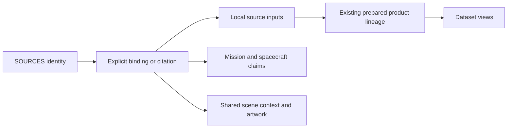

# Proposal: a SOURCES catalogue

**Status:** Proposed; application changes have not started.

**Date:** 10 September 2026.

**Repository baseline:** `5e9e1a4ade55496357cd4a70bb4ffd0afec34157`, after the
mission/spacecraft catalogue merge and the Halley photography update.

**Documentation compatibility reviewed:** PR #112 at
`b5b07438c94bd7244e076eb34c2f179861cfed1e`; see the coordination section below.

**Proposal branch base:** `8d2f45b58b5ea9a0b69a81242c51aa6e6d6ebcdf`, the merged
documentation cleanup.

**Intended implementation PR:** `feat(sources): catalogue source identities and their prepared uses`.

## Decision proposed

Add one canonical `SOURCES` catalogue for the external works and products used by
cssEarth: published datasets and releases, papers, models, reference pages,
software sources and artwork. Give each an explicit identity and derive its uses
from existing records. Connect the Sources tab, mission citations and shared
credits to that catalogue.

Keep acquired files, byte pins, acquisition operations, transformations and
product dependencies in their current owners. A catalogue entry identifies a
published source; a local manifest identifies the exact material we acquired or
authored. Those are different identities with an explicit connection.

The first implementation covers body Sources displays, mission/spacecraft
references, shared context credits and approved spacecraft artwork sources. It
provides source details and reverse dataset links inside the shared information
panel. Global source search, independent source pages, source URL state,
automatic upstream monitoring and new scientific preparation are outside this
first PR. This is not an exhaustive migration of every citation in repository
prose or every factsheet, chart and gallery field.

## Why this earns a catalogue

The [Sources tab projection](../../site/object-sources.mts) currently walks an
object's prepared provenance and groups external links by attribution text.
That preserves local input identities, but it cannot identify a source shared
between objects. The [shared credit projection](../../site/scene-sources.mts)
uses a separate list and URL normalization, including a special case connecting
the HYG repository and licence URLs. The
[mission catalogue](../../site/source/spacecraft/catalog.json) has another list
of reference titles, URLs, locators and check dates.

These representations serve different purposes. They need a common identity so
we can answer practical questions:

- Which prepared views use this published product or release?
- Which missions or spacecraft cite this paper or reference page?
- Which exact local inputs connect a source to the displayed view?
- Which uses need review after a source, attribution or interpretation changes?

The catalogue should make those answers traceable without guessing from a
publisher name, matching URLs or mission membership.

### Measured starting inventory

These are metadata counts at the baseline above, obtained by reading the
registered body descriptors, their manifests and prepared provenance. Body
registration follows `properties.catalog`, as in
[`readCatalog`](../../tools/prepare-catalog.mts). No scientific inputs were
downloaded and no image or geometry was regenerated for this proposal.

| Existing population | Count | Meaning for the migration |
| --- | ---: | --- |
| Registered object packages | 473 | Derive coverage from the registry on each run |
| Manifest `inputs` | 2,617 | Includes external products, local recipes and inactive inputs |
| Manifest `documents` | 9,331 | Includes local configuration and supporting documentation |
| Manifest `generatedIntermediates` | 444 | Local processing results; not automatically published sources |
| Prepared provenance source records | 1,623 | 1,141 `source-input`, 473 `authored-content`, eight `authored-document`, one `generated-intermediate` |
| Prepared products | 2,300 | Includes products with no selectable dataset view |
| Mission/spacecraft reference records | 37 | Citations used by 26 missions and 36 vehicles |
| Approved spacecraft artwork records | 48 | 24 render-library entries and 24 emblem-library entries; not necessarily 48 distinct external sources |

These counts are neither the number of distinct external sources nor a claim of
complete scientific provenance. For example, the retired ESO panorama URL remains
in all 473 body manifests, while shared scene credits explicitly omit that
panorama. The compiler must distinguish **declared**, **consumed**, and **currently
presented** uses. A manifest entry alone must not add a visible contribution.

### Coordination with the documentation cleanup

[PR #112, “fix(provenance): clean up catalogue source archives”](https://github.com/layoutit/css.earth/pull/112)
establishes the retention and document-ownership rules this proposal will use.
Its [reference retention contract](https://github.com/layoutit/css.earth/blob/b5b07438c94bd7244e076eb34c2f179861cfed1e/docs/provenance/CONTRACT.md#references-and-retained-files)
is the authority for what belongs in the repository. `SOURCES` identifies
references and scientific products; it does not create a replacement webpage
archive or require a retained HTML copy for each citation.

The responsibilities fit together as follows:

| Documentation cleanup | SOURCES proposal |
| --- | --- |
| Cite a work and record the supporting values, units, uncertainty and table/field/section in the body README | Give that work a reusable identity and keep claim-specific locators with the citation |
| Keep exact preparation values and extraction methods in existing data records and recipes | Bind those retained records to the work; derive their actual uses |
| Retain original scientific inputs/native labels in Git or through tested restoration recipes | Preserve those local identities and their restoration ownership |
| Remove reference-page archives and obsolete restoration requirements | Keep deleted files out of the new acquisition and catalogue requirements |
| Distinguish `source-document` from explicitly `authored-document` records | Preserve that distinction; membership in `documents` never establishes local authorship |

A fresh read of the same registered population at the reviewed PR #112 head
produces the following changes to the inventory above:

| Population | Before cleanup | Reviewed cleanup head |
| --- | ---: | ---: |
| Manifest inputs | 2,617 | 2,595 |
| Manifest documents | 9,331 | 8,253 |
| Prepared `authored-document` records | 8 | 4 |
| Prepared `source-document` records | 0 | 4 |

The 473 objects, 444 intermediates, 1,623 total prepared source records and 2,300
prepared products remain the same in these two metadata inventories. They are
revision-specific observations, not permanent test constants or evidence that
the two source trees are identical.

The documentation cleanup has landed, and this proposal is based on its merge.
The future source schema and binding migration must start from main containing
those changes, refresh the inventory and preserve that retained set. It must not
restore removed archives or reverse corrected credits to satisfy the earlier
counts. Review the proposal's retained-input examples against that new baseline;
Pluto's cited four-field numerical extract is a required compatibility fixture.

## Ownership

| Owner | Responsibility |
| --- | --- |
| `OBJECTS` | Navigable bodies and their scene capabilities |
| `MISSIONS` | Individual missions and supported claims about them |
| `SPACECRAFT` | Physical vehicles and mission participation |
| `SOURCES` | External work/product identity, bibliographic metadata and supported source-wide statements |
| Existing source manifests and acquisition records | Local paths, byte pins, acquisition details, input-specific credits and reuse terms |
| Existing prepared provenance | Source dependencies, recipes, output identities, interpretation and limitations |
| Generated source usage index | Connections from canonical sources to actual consumers |
| Shared information panel | Presentation, expansion, links, keyboard and responsive behavior |

Dataset identity stays `(objectId, lensId)` using the existing prepared controls.
There is no new global `DATASETS` owner in this PR. Source records do not mount
scenes, load object assets or own a camera.

The [provenance contract](../provenance/CONTRACT.md), including the reference
retention changes reviewed above, continues to govern evidence and body
documentation. Body READMEs explain the meaning and processing of their data.
This change adds no duplicate body `SOURCE.md` account.

## Source identity

### One record describes one identifiable thing

Use a stable internal slug as the catalogue key. Keep provider identifiers as
typed metadata: DOI, PDS4 LID/LIDVID, PDS3 dataset/product ID, repository commit or
another documented provider identifier. An internal slug is not a fabricated
provider identifier.

Separate the content kind from its identity level:

- **Kind:** `data-product`, `publication`, `model`, `reference-page`, `software`,
  or `artwork`.
- **Identity level:** `work` or `release`. A work can be an unversioned reference
  page or a product family. A release identifies a specific published edition,
  revision or version of that work.

Create a release record only when the evidence identifies a release. A local
download date and hash identify an acquisition snapshot; they do not establish a
provider release. Unknown versions remain unknown.

Examples grounded in existing records:

| Case | Proposed treatment |
| --- | --- |
| Mercury's monochrome mosaic, enhanced-color mosaic and shaded relief | Three product identities, even where credits or collection pages overlap |
| HYG's repository, licence link and recorded v4.4 use | Distinguish the work from an evidenced release; label landing and rights links by purpose |
| Earth's GeoNames downloads from mutable URLs | Record the published products and preserve the 2026-09-04 acquired snapshots in Earth’s manifest |
| One paper used by multiple small bodies | One publication identity, with distinct local files, citations and consumers |
| A mission information page cited by several fields | One page identity; retain each field's citation locator and check date |
| A composite mosaic produced locally | Local intermediate with explicit upstream bindings; a new catalogue entry only if it is itself an externally published product |

### Equivalence must be explicit

Neither an identical URL nor identical bytes proves that two records describe
the same published source. Different products can share a landing page; a mutable
URL can serve different releases; equivalent works can have several mirrors.
Credit text and agency names are presentation data, not identity keys.

An inventory tool may suggest matches. A checked migration mapping must accept
each match using the original record or provider evidence. When identity is
uncertain, retain separate records or an unresolved binding with its reason.
Never silently merge uncertain records to improve a deduplication count.

Support evidenced `version-of`, `part-of` and `derived-from` relationships between
source records. These describe the published sources. They do not create
dataset, mission or spacecraft usage edges. A release's use does not imply that
another release was used. A work-level rollup must be labelled as a rollup and
retain the specific release on each underlying edge.

IDs remain stable when a title or landing URL changes. An evidenced consolidation
can retain old internal IDs as explicit redirects to one canonical record.
Reject cycles, redirect chains and redirects that collapse distinct releases.

## Proposed records and validation

The following is a design contract, not implemented TypeScript. New validators
and compilers will be strict TypeScript and validate unknown JSON at runtime.

### Canonical metadata

Store authored records in proposed `src/sources/catalog.json`, with schema
`cssearth-source-catalog@1`. A single file is sufficient initially; partitioning
it later must preserve one catalogue and one validator.

Each record contains:

| Field | Contract |
| --- | --- |
| `id` | Unique, stable internal slug |
| `kind`, `identityLevel` | Explicit content kind and work/release distinction |
| `title` | Specific source title; never just an agency name |
| `identifiers` | Zero or more typed provider identifiers, preserved verbatim with their scope |
| `creators`, `publisher` | Optional supported metadata; absence is allowed |
| `publicationDate`, `version` | Optional; retain supplied date precision and literal version |
| `links` | Labelled landing, archive, original, mirror or rights links; a preferred citation link where available |
| `relations` | Evidenced links to other canonical records |
| `statements` | Optional source-wide credit, rights and limitations, each with evidence and applicability |
| `evidence` | Original record path/JSON pointer and hash, with Git revision for historical records; or primary URL with locator and recorded check date |

Evidence supports named fields or relationships. It does not recursively require
another canonical source just to justify the catalogue's own identity. A
migrated statement may cite a retained data record, recipe or body README at its
exact revision; that must not be presented as a new external verification.
Historical reports remain accessible at their original revisions. Historical
archive paths must not become new file-restoration or build requirements.
New factual assertions require the source evidence appropriate to that assertion.

For a numerical claim, keep the supporting values, units, uncertainty and exact
source table/field/section in the body account, with full preparation values and
the extraction method in the existing data owner. The catalogue links to those
records rather than copying their tables. A URL and a check date alone do not
replace the evidence supporting the claim. Temporary HTML acquisition can supply
selected data; its downloaded page is not retained as permanent evidence.

HTTP(S) URLs must be real, usable locations. Keep transport templates such as
Mercury's tile URLs in acquisition records; they are not clickable citation
links. Local-only or unidentified material must not get an invented external
URL. Reuse the existing date precision and URL validation where their contracts
match.

### Binding a local input

Add an explicit `sourceBinding` to migrated manifest entries. Existing `id`
continues to identify the local input. Do not rename it or reinterpret
`ContributionEdge.sourceId`, which currently refers to that local input.

```ts
type SourceBinding =
  | {
      kind: 'catalogued';
      references: readonly {
        catalogueId: string;
        role: 'material' | 'method' | 'reference' | 'artwork';
        evidence: string;
        locator?: string;
      }[];
    }
  | { kind: 'local'; reason: string }
  | { kind: 'unresolved'; label: string; evidence: string; reason: string };
```

A nonempty reference list can connect a file to several independently supported
sources. Acquisition dependencies still connect a derived file to its upstream
local files. Do not copy those dependencies into a second authored usage list.

`local` identifies material authored within the repository. It cannot excuse a
known external dependency: retain that dependency through another local input
or an explicit method/reference citation. `unresolved` preserves evidence that
does not yet support a canonical identity. It is a visible limitation, not a
validation bypass for newly added unidentified external inputs.

Validate every binding, including those outside current prepared products. A
missing canonical ID is an error; an unresolved record is accepted only in the
reviewed migration inventory or with an explicit maintained explanation. New
external inputs need a resolved binding before publication.

Prepared provenance carries the same binding beside the original local source
record. It retains all existing acquisition, dependency, credit, rights and byte
fields. Bindings on relevant document and intermediate entries are supported;
their collection alone does not establish authorship or external identity.
Preserve the cleanup's `source-document` default and explicitly authored kinds.
An unrecorded provider credit or acquisition description stays unrecorded;
binding it to a catalogue record cannot silently credit cssEarth contributors.

### Citations in missions and other metadata

Move the 37 reference identities out of the mission catalogue into `SOURCES`.
Replace field-level `referenceIds` with citations containing `catalogueId` and
the applicable `locator`, `checkedOn` and evidence. A citation's check date
belongs to the claim that was checked. It is separate from publication date,
acquisition date and a mission status's `asOf` date.

The migration preserves every existing title, URL, locator and check date in an
auditable mapping. Where two old references identify one work but have different
locators or dates, move those distinctions onto the citations. Remove the old
authored `references` array at cutover. A temporary preparation-only reader may
translate the old schema; normal consumers must have one current contract.

The exploration validator receives a validated source resolver. Source validation
must not import the mission catalogue, avoiding a circular dependency. No second
permanent global `REFERENCES` registry remains beside `SOURCES`.

### Credits and rights

Catalogue-wide statements apply only at their documented scope. Per-file and
per-use credits, modifications, restrictions and licence evidence remain in the
original owner. A source's general licence does not replace the terms attached
to a particular image, mirror, subset or derivative.

Display the applicable local credit and preserve distinct rights records when
several inputs share one source. If a new global statement conflicts with a
local record, report the conflict for review; do not choose the more permissive
text or normalize away the difference. This is an ownership rule, not a new
automated legal verdict.

## Deriving usage once

The source usage compiler consumes validated catalogue records, explicit
bindings, existing provenance and prepared controls. It emits one canonical edge
set and derives all forward/reverse indexes from that set.



These arrows describe lookup paths. The authored ownership remains in the
catalogue, binding and existing product records; there is no manually maintained
reverse graph.

### Different kinds of use

| Usage kind | Evidence and presentation |
| --- | --- |
| `product-input` | Local input/dependency reaches a prepared product; preserve object, local source ID and product ID |
| `method` | Explicit supporting method; do not label it an observation |
| `citation` | Explicit metadata claim and field location; does not imply a prepared dataset contribution |
| `shared-context` | Active shared feature and its owning provenance, such as the stellar neighbourhood |
| `artwork` | Approved library entry or other explicit presentation asset use |
| Declared but unused | Inventory status only; no active usage edge |

Each edge retains `catalogueId`, usage kind, a typed consumer identity, the owner
record path and field/input locator, and the supporting binding. Product uses
also retain their object/product/local-source tuple and validated lens IDs.
Different local evidence stays distinct even when it reaches the same view.
Binding roles survive traversal: a supporting method remains a method use, and
a reference remains a citation even when its consumer is a prepared product.
Material input alone does not establish an observation; the product's recorded
interpretation and capture evidence determine that distinction.

Use [`productSourceIds`](../../src/platform/object-provenance.mts) for dependency
and parent-product traversal. Share this existing lineage primitive with the
exploration compiler. The source index must not be built from mission edges:
those exclude schematic/illustrative products, while a model or illustration
still has a source worth crediting. Preserve interpretation and limitations in
the source detail.

Dataset destinations derive from real prepared controls and use the existing
`/<objectId>/#dataset=<lensId>` contract. Products with no lens remain product
uses and get no invented dataset link. Deduplicate visible destinations by
`(objectId, lensId)`, retaining the full underlying evidence edges.

A mission information page creates citation uses. A mission participant creates
no observation use. GRAIL's mission-only attribution and the unresolved Viking
credits stay exactly as they were after the mission migration. Catalogue source
relations cannot strengthen those claims.

Shared sources are indexed against their actual feature owner, not multiplied
into hundreds of body-specific observation edges. The UI can say “Shared star
field” or “Shared galaxy context.” Existing package records that also cite the
work remain separate, correctly labelled uses. Retired context such as the ESO
panorama remains auditable without returning to active credits.

## Preparation and delivery

### Proposed owners

| Proposed or affected path | Responsibility |
| --- | --- |
| `src/sources/catalog.json` | Authored canonical metadata |
| `src/platform/source-catalog.mts` | Pure parser, source IDs, citations and binding validation |
| `src/platform/source-usage.mts` | Usage edge compilation and index validation |
| `src/platform/prepared-sources.mts` | Prepared envelope validation |
| `tools/prepare-sources.mts` | Read existing owners, compile and return staged output |
| `site/prepared-sources.json` | Generated catalogue, bindings, usage indexes, coverage and closure pins |
| `site/sources-catalog.mts` | Build-only `SOURCES` and query API |
| Existing provenance and spacecraft preparation tools | Coordinate schema migration and publication |
| Existing source, mission and information-panel components | Render relevant records using shared controls |

New paths above are proposed and do not exist yet. Keep executable preparation
in `tools/` and pure contracts in `src/platform/`; local source directories remain
data owners.

### One publication transaction

Extend [`prepare-provenance`](../../tools/prepare-provenance.mts), which already
stages provenance and the exploration catalogue together:

1. Validate `SOURCES`, mission citations and all explicit bindings.
2. Prepare the prospective provenance documents without writing them.
3. Compile source usage from the prospective documents and the unchanged
   registered objects, controls, shared-context and artwork owners.
4. Compile the exploration catalogue using the same prospective documents and
   source resolver.
5. Validate every prepared envelope and its cross-references.
6. Publish the full set using [`writePreparedSet`](../../tools/write-prepared-set.mts).

A `prepare:sources` convenience command uses the same orchestrator and refreshes
dependent exploration output when source identities or citations change. It
must not publish an independently current source catalogue beside stale mission
or provenance records. There is one publication path, not mutually recursive
source/spacecraft preparation commands.

Hash the actual authoring inputs and executable owners: catalogue, registered
descriptors, manifests, prepared provenance and controls, applicable shared
records, artwork libraries, citation owners and compiler/schema code. Bind
prospective output hashes before publication. Avoid mutual hashes between the
two prepared catalogues: use the common input closure and the source-catalogue
identity needed by exploration.

Stale references, invalid bindings or failed staging leave the existing prepared
set intact. Interrupted publication is rejected by closure validation at the
next build. Test failure and rollback explicitly. Preserve the existing
distinction between recovered metadata and freshly byte-verified preparation.

### Keep the global data out of the browser

`site/sources-catalog.mts` is an Astro/build owner. It exposes immutable records
and queries such as `sourcesForObject`, `sourceUses` and `sourceDatasetViews`.
The browser receives rendered source details and normal destination links; it
does not import the catalogue, parse provenance or compile usage indexes.

Render only the current object's relevant source cards. Shared credits remain a
compact projection. Omit expanded source content from every inert body-preview
template and fill the Sources panel through the existing destination-content
transport, as mission details already do. Generalize the existing deferred-detail
prop narrowly; retain the shared panel controller and cancellation behavior.

The first PR renders complete deduplicated reverse lists for relevant source
cards using native disclosure elements. It adds no per-source request protocol,
global source route, search index or new hash parameter. Measure source-panel
HTML for every route, especially the most reused publication, and compare total
and compressed page sizes with the baseline. A collapsed detail still counts
toward payload and DOM size. If the inventory demonstrates that these lists need
pagination, revise this delivery decision before implementation is considered
complete; do not silently truncate “Used in cssEarth” or ship a hidden global bank.

## Sources tab and existing navigation

A source card shows its specific title, kind, known release, applicable credit,
and an ordinary link to the original source. Expanding it shows:

- Its use on the current object, including material versus method/reference use.
- Other prepared datasets using it, with real dataset links.
- Separately labelled mission/spacecraft citations and shared-context/artwork
  uses where present.
- Relevant input distinctions, interpretation and unresolved limitations.

The initial card grouping may retain compact agency/credit headings, but card
identity comes from the explicit catalogue binding. Several local files can
appear under one canonical source while retaining their product links and local
credits. Equal credits must not merge distinct products. Unresolved legacy
entries preserve their existing usable external links and explanation.

Mission and spacecraft references resolve through `SOURCES` while retaining
their original direct external links and citation locators. Source metadata
does not become a substitute for a claim-specific citation. The shared footer
continues to credit active context with its existing concise wording; its
projection uses canonical IDs rather than URL equivalence rules.

Expanding a source detail does not change the selected object, dataset, camera
or URL. Opening a source's dataset link uses the production dataset-selection
API and router introduced by the mission work. Reuse their same-body camera
preservation, cross-body transition, cancellation, manual selection and
Back/Forward behavior. Add no click simulation or parallel router.

Use native keyboard-operable disclosures, existing focus styles, readable source
titles, and the shared phone layout. Empty states distinguish no recorded active
use, declared-but-unused material and unresolved identity. A citation-only record
must never appear to have supplied observations.

## Migration scope and sequence

### 1. Freeze and classify the inventory

At the implementation revision, after the documentation cleanup, regenerate the
inventory from the registry.
Record every input, prepared source and relevant citation, and identify which
records are consumed and currently displayed. Record baseline source/output
pins, usable source links, credits, rights, capture evidence and prepared dataset
destinations before changing schemas.

Classify all manifest inputs, including unused ones. Inspect documents and
intermediates reached by current provenance and those supplying existing source
or citation UI. Do not turn the other thousands of local documents into catalogue
records merely because they are files. Record this boundary and the excluded
categories explicitly.

The first migration must cover all existing body Sources entries, all 37 mission
references, the four currently appended shared-context credits, and the approved
spacecraft artwork/emblem source records. Inventory other citation-bearing UI
records, including factsheets, charts, galleries and body resources. Bind those
already represented by the in-scope source inputs or displays. Migrating the
remaining free-standing field citations is a subsequent change. Record their
owner categories outside coverage rather than advertising the catalogue as an
exhaustive bibliography of the repository. A source can therefore have recorded
uses beyond the uses that this first index can report.

Read heterogeneous shared provenance with small owner-specific adapters for the
four active context credits. Add bindings in their authored metadata owners and
in the approved artwork libraries, with explicit validation/schema updates where
needed. Preserve supplied third-party files unchanged. Do not discover uses by
recursively searching arbitrary JSON for URL-like strings.

### 2. Establish identities and bindings

Review candidate equivalences and choose work/release boundaries. Store the
migration mapping as an executable test fixture tied to the baseline, including
old owner path, input/reference ID, chosen canonical ID or local/unresolved
classification, and justification. Candidate matching never writes accepted
identities automatically.

Author catalogue records and bindings together. Preserve all old local IDs,
capture evidence, source and output hashes, acquisition operations, terms and
limitations. Artwork images, portraits, emblems and scene assets remain byte
identical. Existing legacy identities are translated only at the explicit
preparation boundary.

Here “old” means the retained records at the implementation's post-cleanup
baseline. The #112 removals, replacement numerical extracts and ownership
corrections are already part of that baseline. Their historical mappings remain
auditable without restoring the superseded files or identifiers as live inputs.

### 3. Introduce schemas and compile the prospective set

Add the source contracts and usage compiler. Introduce
`cssearth-object-provenance@3` for source bindings,
`cssearth-spacecraft-catalog@3` for canonical citations, and a new exploration
envelope version when its embedded record contract changes. Do not silently
reinterpret the existing `@2`/`@1` formats.

Version the body source manifest contract as
`css<id>-authoritative-sources@2`, requiring a classification for each input and
validating explicit bindings on documents/intermediates when present. Update
both the generic source-manifest reader and provenance reader, restoration tools,
source authoring templates and any direct schema consumers. Their validators
must agree; no path may accept the new fields as unchecked extras. Inventory
these consumers before editing so a future body authoring run cannot quietly
reintroduce unbound `@1` inputs. The versioned change applies across the registered
packages, while preserving local source IDs and every byte pin.

Use pure preparation-only migrations for supported previous formats. Normal
build/site consumers accept the current contracts. Compare all regenerated
metadata against the fixed inventory and publish it in one validated set.

### 4. Connect presentation and remove duplicate identity owners

Replace source URL equivalence, global shared-source literals and the authored
mission reference array with catalogue-backed projections. Keep exact local
evidence in place. Extend existing Sources/details components, defer their
preview content, and route reverse links through the existing dataset contract.
Remove transitional authored metadata duplicates at cutover.

### 5. Qualify and document

Run the acceptance checks below on the actual implementation revision. Update
the existing provenance guide, exploration guide and affected body explanations.
Document the source authoring workflow in one maintained guide. Preserve this
proposal at its decision revision when it is superseded; do not leave two
competing descriptions of implemented ownership.

These stages form one implementation plan. A schema migration cannot ship alone
with unresolved normal-consumer compatibility or a stale dependent catalogue.

## Acceptance evidence

The following are required checks for the future implementation, not results
claimed by this proposal.

| Area | Required evidence |
| --- | --- |
| Identity | Reject duplicate IDs, conflicting provider identities at the same scope, unknown relations, cycles, unsafe URLs and impossible dates; preserve unknown versions |
| Binding coverage | Every in-scope entry has a resolved/local/reviewed-unresolved classification; unused inputs are validated but create no active edges |
| Citation conservation | All old mission reference fields and check dates survive; citations resolve through one canonical owner |
| Input/output conservation | Exact comparison of local source and rendered-output identities; metadata migration cannot change scene/artwork bytes |
| Rights and credit conservation | Preserve each applicable local statement and evidence; explicitly report conflicting statements |
| Documentation cleanup compatibility | Preserve the post-cleanup retained set, numerical extracts and `source-document` ownership; introduce no archived-page inputs or restoration requirements |
| Usage correctness | Hand-authored expected edges for material, method, citation, artwork, context, parent products, dependencies and no-lens products |
| Index conservation | Every reverse entry derives from an edge; no duplicate destinations, dropped evidence or fabricated consumers |
| Source semantics | Model/illustration source uses remain visible; mission observation exclusions and uncertain capture attributions remain intact |
| Publication | Byte-for-byte deterministic output from a fixed input set; stale closure, interrupted writes and invalid prospective sets fail without a mixed usable publication |
| Delivery | No global catalogue/provenance in browser JS or inert preview templates; inspect every route's source payload and report worst cases |
| Browser | Production direct load, Sources expansion, same-body/cross-body dataset links, cancellation/failure, reload/history, keyboard and phone interaction |
| Shared application | Exactly one mounted object and camera, retained shell controls, existing source/navigation conformance checks |
| Documentation | Local links and guide reachability; source and evidence claims tied to the tested revision |

Required fixtures include Mercury's three distinct mosaics/relief products, the
HYG work/release and link roles, an Earth mutable-URL snapshot, one publication
shared by several bodies, a citation-only mission page, a locally composed
multi-source product, GRAIL, unresolved Viking attribution, a schematic/model
source, a source with several local rights statements, and the retired panorama.
Also include Pluto's numerical extract and a provider label in `documents` whose
author is not cssEarth. Verify that the deleted reference page is not required
and that missing provider credits remain explicitly unrecorded.
Expected results must be independently specified, not produced by the compiler
being tested.

Run `pnpm typecheck`, `pnpm check:typescript-ownership`, the affected package,
renderer, platform and shell suites, and an assembled production build. Extend
the existing source, scene-credit, exploration and dataset-navigation tests.
Capture desktop/phone source details and inspect the images. Compare matched
before/after scene views if claiming visual parity. A missing original input,
unrun suite or failing unrelated check remains an explicit qualification limit.

## Risks and decisions to preserve during review

The main risks are mistaken source equivalence, loss of per-use evidence, an
incorrect “used here” claim, circular catalogue preparation and multiplied
sidebar payload. The identity rules, typed usage kinds, one publication path and
delivery measurements address those risks directly.

Keep these decisions explicit during review:

1. A canonical source and an acquired artifact have different identities.
2. Citation, participation, source relation and observation are different claims.
3. Local provenance remains authoritative for exact bytes and processing.
4. Unknown identity or release information is preserved rather than guessed.
5. Usage is derived once from executable records, with an honest coverage scope.
6. The existing object, shell, camera and dataset navigation contracts remain
   the only owners of the rendered application.

Before implementation, review the concrete equivalence mapping and the largest
source usage lists. Those determine how many records are needed and whether
complete contextual disclosure fits the current delivery model. The baseline
counts above deliberately do not predict a final canonical source count.
