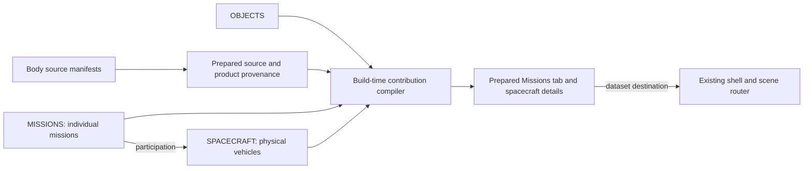

# Proposal: spacecraft and individual mission catalogues

**Status:** Accepted for implementation, with the navigation revisions below.

**Date:** 10 September 2026.

**Code examined:** `16774548b140b45e1f8cf50e21b9671055e0823f`. Repository links below describe that baseline; the proposed files and interfaces are identified separately.

## Proposed decision

Make spacecraft and individual missions first-class catalogue records. Use
`SPACECRAFT` for physical vehicles and `MISSIONS` for the missions they carry
out. Connect both to the existing source-to-product provenance, and make the
Missions tab a prepared view of those relationships.

Each individual mission needs its own identity, even when several missions
share a spacecraft or belong to the same programme. Each separately operated
science vehicle needs its own spacecraft identity, even when several vehicles
participate in one mission. A mission record does not require a rendered scene.

The first PR should migrate the existing catalogue, expose individual missions
and their contributing datasets in the current shell, and provide spacecraft
details with links back to the dataset views that use their observations. It
should retain one `OBJECTS` scene registry, one adapter and one world camera.

Suggested implementation PR title:
`feat(catalogue): model spacecraft and individual missions with dataset links`.

## What a viewer should be able to do

From a body's Missions tab, a viewer should be able to identify each contributing
mission, see its agencies and spacecraft, and open the relevant dataset view.
Expanding a spacecraft's details should show its mission participation and the
other cssEarth dataset views that have an evidenced connection to that vehicle.

The interface must distinguish three statements:

| Statement | Evidence required |
| --- | --- |
| A spacecraft participated in a mission | A mission or spacecraft reference establishing that participation |
| A mission contributed observations to a dataset | The consumed source's capture evidence |
| A particular spacecraft contributed observations to a dataset | Capture evidence identifying that vehicle |

Participation alone cannot establish dataset contribution. A mission's target
list cannot establish that cssEarth uses observations of every target. The
catalogue may contain a mission or spacecraft with no linked cssEarth dataset.

## What exists today

There is already a useful spacecraft foundation. At the examined revision,
the authored and prepared catalogues each contain **24 entries**.

| Existing owner | Current responsibility |
| --- | --- |
| [Authored spacecraft catalogue](../../site/source/spacecraft/catalog.json) | Names, descriptions, mission links, display facts and artwork references |
| [Spacecraft preparation](../../tools/prepare-spacecraft.mts) | Joins records to approved artwork and emblems; verifies image bytes and dimensions |
| [Prepared catalogue](../../site/prepared-spacecraft.json) | Data consumed by the shell |
| [Spacecraft types](../../site/spacecraft-types.mts) | Exports `SPACECRAFT` as a map of `Mission` records |
| [Dataset associations](../../site/dataset-spacecraft.mts) | Traverses product lineage and resolves `capture.spacecraftIds` |
| [Missions component](../../site/components/PlanetMissions.astro) | Groups the current body's records by agency |
| [Information panel](../../site/components/PlanetInformationPanel.astro) | Builds the body's Missions tab from its provenance |
| [Provenance contract](../object-provenance.md) | Defines evidence for consumed inputs, processing and outputs |

The current implementation already has important behavior to preserve: it
follows source dependencies, includes observations used by derived products,
deduplicates contributions, rejects unknown spacecraft references, and excludes
schematic or synthetic views from inheriting observations merely because they
consume an outer reference texture.

The architectural gaps are specific:

- `Mission` and spacecraft identity are conflated. Records include individual
  vehicles alongside “Viking orbiters” and “GRAIL · Ebb & Flow.”
- Agencies and dates are recovered from display labels such as `Mission`,
  `Launched`, `Ended` and `Status`. Presentation text controls relationships.
- The Astro consumers import the prepared JSON directly. The existing
  `SPACECRAFT` export is not their common validated entry point.
- Preparation validates record identity and description, plus artwork, but
  does not establish a complete mission/spacecraft relationship contract.
- Body and lens lookups exist; there is no canonical reverse contribution
  index for asking which cssEarth dataset views use a spacecraft's observations.

This PR should evolve those owners and preserve their existing behavior.

## Identity and ownership

### Three different domains

| Domain | Canonical meaning | Owns |
| --- | --- | --- |
| `OBJECTS` | Prepared, navigable scene objects | Scene identity, routing and package loading |
| `SPACECRAFT` | Physical science vehicles | Vehicle identity, names, physical role, sourced launch information and vehicle artwork |
| `MISSIONS` | Individual missions | Mission identity, purpose, agencies, mission dates/status, participation and mission artwork |

The mission record owns its list of participating spacecraft. The reverse list
of missions for a spacecraft is derived. Source manifests own capture
attribution; the catalogue does not maintain separate hand-written lists of
contributed bodies or datasets.

IDs are stable within their domain. References must name the domain, because
identical strings can legitimately occur in different catalogues. This already
matters for `juno`: [the object registry](../../site/objects.mts) contains asteroid
Juno, while the spacecraft catalogue contains the Juno spacecraft. A bare ID
must never select whichever registry happens to be searched first.

Renaming a vehicle or starting another mission does not create a new physical
vehicle. Preserve its spacecraft ID and record sourced aliases. Mission IDs
remain separate, even if a mission and its vehicle initially share a name.

### Cases the design must represent

| Case | Proposed representation | Attribution consequence |
| --- | --- | --- |
| Viking | Separate `viking-1` and `viking-2` mission records; separate orbiter and lander vehicle records for each | An orbital mosaic must not acquire lander attribution through mission membership |
| GRAIL | One `grail` mission; separate `grail-a` and `grail-b` vehicles, with Ebb and Flow as sourced names | Preserve a joint contribution where evidenced; do not invent two separate missions |
| OSIRIS-REx / OSIRIS-APEX | Two mission records sharing one enduring spacecraft record | Bennu observations remain associated with OSIRIS-REx; they do not become APEX observations |
| A composite using several sources | Several explicit contribution edges to the same product | Retain every supported contributor without repeating the dataset view |

These are architectural interpretations of published distinctions. NASA
describes the individual [Viking 1 mission](https://science.nasa.gov/mission/viking-1/)
and the [Viking orbiters and landers](https://science.nasa.gov/mission/viking/spacecraft-and-science/).
Its [GRAIL account](https://science.nasa.gov/mission/grail/) identifies one mission
with Ebb and Flow. Its [24 September 2023 OSIRIS announcement](https://science.nasa.gov/blogs/osiris-rex/2023/09/24/osiris-rex-spacecraft-departs-for-new-mission/)
establishes the spacecraft's transition to a new mission. These references were
checked for this proposal; they do not by themselves establish the exact
contribution of a vehicle to any particular checked-in image or dataset.

Use the source's mission distinction. A routine extension, flyby, manoeuvre or
observation is not automatically another mission. Programme names may group
entries for display, but cannot replace individual mission records or serve as
physical spacecraft IDs. The first PR does not need a separate programme registry.

### Alternatives considered

| Approach | Assessment |
| --- | --- |
| Add more fields to the existing flat `Mission` map | Leaves group, mission and vehicle identities interchangeable; the existing mixed records still need migration |
| Register every spacecraft directly in `OBJECTS` | Its current contract requires a route and scene loader. Metadata-only spacecraft need neither; qualifying a rendered package is a separate step |
| Separate missions, then infer capture missions from vehicle participation | Misattributes sources when a vehicle serves successive missions, and cannot resolve old group credits |
| Introduce a general graph database and catalogue service | Adds runtime delivery and maintenance requirements without solving a need that validated, prepared JSON cannot handle here |
| Separate mission/vehicle records and derive evidenced links at preparation time | Recommended: gives each identity one owner, retains source precision and fits the current static preparation model |

## Proposed catalogue contract

Retain `site/source/spacecraft/catalog.json` as the authored owner and advance
its schema to `cssearth-spacecraft-catalog@2`. Give it separate `spacecraft`,
`missions` and `references` sections. Logical catalogues can share a source file;
their entity types and references remain distinct.

Provide one strict TypeScript parser shared by preparation and catalogue
consumers. It must validate unknown JSON values at runtime and return immutable
records. Export the prepared `SPACECRAFT` and `MISSIONS` maps through one typed
site entry point. Components must stop importing the raw prepared JSON.

The following outlines the proposed fields, rather than supplying executable
declarations or a complete authoring format:

```ts
interface Reference {
  id: string;
  title: string;
  url: string;
  locator?: string; // Section, table, product ID or other precise location.
  checkedOn: string;
}

interface Cited<T> {
  value: T;
  referenceIds: readonly string[];
}

interface SpacecraftRecord {
  id: string;
  name: Cited<string>;
  aliases: readonly Cited<string>[];
  description: Cited<string>;
  kind: Cited<string>; // For example, orbiter, lander or observatory.
  launch?: Cited<string>; // Valid date with its supplied precision.
  imageId?: string;
}

interface MissionRecord {
  id: string;
  name: Cited<string>;
  description: Cited<string>;
  agencyIds: Cited<readonly string[]>;
  participants: readonly {
    spacecraftId: string;
    role?: string;
    referenceIds: readonly string[];
  }[];
  started?: Cited<string>;
  ended?: Cited<string>;
  status?: Cited<{ value: string; asOf: string }>;
  imageId?: string;
  emblemId?: string;
}
```

The implementation must define allowed role/status values and validate dates,
URLs, reference IDs and catalogue IDs. Preserve date precision: a published
year stays a year, rather than becoming an invented 1 January date. Launch is a
vehicle event; a successor mission's start need not be another launch. Unknown
dates are omitted. A status claim includes its observation date and source;
rendering must not calculate “active” from the absence of an end date.

Reuse the existing [agency record owner](../../site/source/agency-logos.json),
with explicit keys and validation. Its present keys, such as `NASA` and `ESA`,
can remain identifiers for this migration. Logo availability must not determine
whether an agency or joint mission can be represented. Agency labels and display
facts are prepared from fields, never parsed back into fields.

Reject duplicate IDs, unresolved references, blank evidence, impossible date
values and duplicate participation entries. Validate the mission–spacecraft
pair when a capture claims both. Where dates have different precision, reject
only contradictions that can actually be established.

### Artwork belongs to the entity it depicts

Keep the approved [render library](../../site/source/spacecraft/render-library.json)
and [emblem library](../../site/source/spacecraft/emblem-library.json), including
their byte identities, credits and source links. Explicit asset references
replace the assumption that every catalogue entity has a uniquely named image
and emblem.

A mission emblem belongs to a mission. A picture of two vehicles together must
remain labelled as a group illustration. It cannot silently become a portrait
of each vehicle. Reuse an asset through a reference where its meaning permits;
do not duplicate or rerender its bytes to obtain another record ID. A new record
without suitable artwork can use text until sourced artwork is prepared.

## Connect catalogues through provenance



### Preserve the precision of each capture claim

The existing `capture.spacecraftIds` cannot express mission attribution
separately from vehicle attribution. Replace it with an explicit attribution
list in the authored manifests and generated provenance. The proposed shapes
are:

```ts
type CaptureAttribution =
  | {
      kind: 'spacecraft';
      spacecraftId: string;
      missionId?: string;
      evidence: string;
    }
  | {
      kind: 'mission';
      missionId: string;
      evidence: string;
    }
  | {
      kind: 'unresolved';
      label: string;
      evidence: string;
      reason: string;
    };

// Source record:
// capture: { attributions: readonly CaptureAttribution[] }
```

Require a nonempty attribution list and preserve the original evidence when
migrating it. A spacecraft claim may name its mission only when the source
supports that context. A mission-only claim contributes to the mission's index
without attributing the source to every participant. An unresolved legacy
group keeps its original description and evidence, with a reason that explains
the missing specificity; it creates no invented entity or confirmed link.

For example, knowing that both a lander and an orbiter participated in a mission
does not permit expanding an imprecise source credit to both vehicles. Equally,
knowing the spacecraft without knowing which of its missions produced an input
does not permit assigning the input to all its missions.

This changes the public shape of prepared provenance. Use
`cssearth-object-provenance@2`, update its compiler and consumers together, and
provide an explicit preparation-time migration path for `@1`. Existing
historical reports remain tied to their original schema and revision. Production
consumers accept the new prepared format; they do not perform legacy identity
inference in the browser. Source manifest parsing must validate the new shape
too, rather than only passing its unknown properties through to preparation.

### Derive one contribution graph

Traverse the validated `OBJECTS` catalogue and each object's prepared provenance.
Reuse the existing product/source traversal and interpretation exclusions.
Compile contribution edges identified by object, product, source and capture
attribution. Keep the evidence and the source identity with each edge.

Derive indexes for object, mission and spacecraft from those same edges. Reverse
indexes should point into the shared edge set. They must not introduce separately
authored lists of target bodies, datasets or missions.

An explicit spacecraft attribution enters the vehicle index and, only when its
`missionId` is present, the mission index. A mission-only attribution enters only
the mission index. An unresolved attribution produces a note. When several edges
confirm the same mission/product relationship, preserve their evidence but show
one relationship. In particular, participation is never an implicit join from
a vehicle's captured inputs to every mission in its history.

The compiler must retain these distinctions:

- A product is a prepared provenance product; a lens is a user-selectable view.
  One product may support several lenses, and a lens may consume several products.
- Source and product IDs are local to the owning object. Cross-object references
  always include `objectId`.
- The UI groups contribution edges into unique `(objectId, lensId)` destinations
  and calls them **dataset views**. It must not count intermediate files and
  previews as separate datasets.
- Products without a supported lens retain their provenance but do not acquire
  a made-up navigation destination.
- Schematic interiors, illustrative models and modeled noise keep the current
  exclusions. Observational elevation or shape products retain valid lineage.
- A source lacking capture metadata is not proof that no spacecraft was involved.
  An empty result describes documented links in cssEarth, not all mission history.

Prepare all relationships and display data before serving the application. Pin
the catalogue inputs, contributing provenance documents and compiler identity
with the generated output so stale links can be detected. Missing or invalid
provenance for a registered object must fail preparation with its object ID;
it must not silently produce an incomplete global index.

Serialize records and edges in a stable order, independent of filesystem
enumeration. Generate no timestamps from the build clock: source check dates are
authored evidence. UI ordering is a separate prepared projection; preserve the
existing agency order and specify a stable mission order during migration.

## Missions tab and dataset navigation

Keep the existing Missions tab and agency controls. Each mission card should
show one individual mission, its sourced description and dates, its participant
vehicles, and the dataset views on the current body linked to that mission.
Agency counts count distinct mission IDs, including shared missions in each
credited agency. A joint mission appears once within the selected agency.

Within the card, label all known participants as **Mission spacecraft** and the
evidenced contributors separately as **Contributing spacecraft**. A mission-only
capture displays “Mission attribution; individual spacecraft not established.”
An unresolved capture belongs in a clearly labelled attribution note, with its
source link. It must not masquerade as an individual mission card. A known
vehicle with unresolved mission context remains accessible in a separate
spacecraft attribution note.

Use expandable spacecraft details within the existing information panel. Their
mission list is derived from participation; their **Used in cssEarth** list is
derived from vehicle-specific contribution edges. A related mission's datasets
can be shown as mission-level information, with that distinction visible. A
vehicle or mission with no linked data says “No linked cssEarth dataset views.”

Render the current body's relevant cards and expandable details at build time.
Do not ship a hidden card bank for every catalogue record. Expansion and agency
selection should toggle retained elements. Continue loading body content through
the existing navigation transport and dispose listeners through the shared
lifetime owner. Reuse shell typography, spacing, focus behavior and responsive
layout.

### Dataset destinations need a real selection contract

The current shell has lens selection, but no inspected shared handler that
turns a dataset anchor into lens selection. Adding links therefore includes a
small generic navigation change; a link to the body alone is insufficient.

Propose `/<object-id>/#dataset=<lens-id>` for a dataset destination. Reserve and
validate this fragment in the shared shell, using lens IDs from prepared content.
It can coexist with the current camera `?v=...` parameter. The
[shared-view parser](../../src/renderers/css/navigation/view-url.ts) accepts a
strict camera query, so do not append unrelated mission or lens query parameters
to that format.

### Production dataset selection

Expose a generic `datasets` capability through the scene lifecycle and deferred
mount when the prepared object has selectable datasets. Its `ids` come from
prepared controls, `current()` returns the committed lens, and
`select(id, { signal })` uses the existing selection transaction. It resolves
`true` only on a successful commit, resolves `false` on cancellation or
destruction, and rejects invalid IDs or preparation/decode failures. Rejection
and cancellation preserve the previous committed selection. `subscribe()` reports
committed lens changes from both manual controls and programmatic requests.
The deferred owner forwards the capability after readiness and removes its
subscriptions when destroyed. It cannot expose a diagnostic-only API.

The selection transaction must observe cancellation before publication, discard
its uncommitted demand, and settle even when its decode has not completed. A
new request supersedes an earlier request on the same retained scene. Renderer
asset decoding and retained presentation remain with their existing owners.

The router invokes the capability after scene readiness, using the active
request's cancellation signal. It opens the Datasets tab only after successful
selection. Direct loads use the scene lifetime. The shared tab API changes the
tab and its focus semantics without simulating control clicks.

### Committed URL state and history

The dataset fragment represents committed selection. The shared router is its
single URL/history owner; camera updates preserve that fragment. It synchronizes
the browser URL, the active session URL and the stored history snapshot together.
An absent dataset fragment means the body's default dataset.

| Action | Selection and history behavior |
| --- | --- |
| Dataset link within the active body | Preserve the camera; select through the generic capability; push one history entry after a successful commit |
| Dataset link to another body | Use normal object navigation, select the destination dataset after readiness, and commit one destination history entry |
| Manual lens selection | After commit, replace the current entry's dataset fragment; do not add an entry for every control change |
| Ordinary body or overview navigation | Clear the departed body's dataset fragment; use the destination default dataset |
| Back/forward | Restore the entry's camera and dataset, including the default for an absent fragment; replace neither with stale state from the departed entry |
| Initial load | Restore the camera and requested dataset; update the existing entry without pushing a duplicate |
| Failed/cancelled same-body selection | Retain the committed URL/selection pair; show a failure notice for failures, without treating cancellation as an error |

Only a successful selection may publish a new dataset fragment. Suppress manual
selection history updates while a navigation-owned selection is pending, then
commit the winning request once. A superseded request cannot publish its lens,
tab or URL. A failed destination dataset after a cross-body mount retains the
destination's valid default and canonical default URL, with an accessible notice.

Invalid dataset fragments retain the body's valid default view and provide an
accessible “Dataset view unavailable” notice. Preserve the invalid fragment on
initial load for diagnosis until the user makes a successful dataset selection
or navigates elsewhere. Other existing fragments retain their behavior.

The proposal does not add mission-specific routes or spacecraft fly-to actions
in this PR. A later global catalogue browser can consume the same identities
and indexes without rebuilding the relationship model.

## Migration and implementation ownership

The initial population is bounded by the existing 24 records, their individual
missions and the science vehicles needed to describe them. Include the
OSIRIS-APEX successor record to exercise the already documented shared-vehicle
case. This is not an import of every historical or proposed space mission.

Inventory the legacy records and every `capture.spacecraftIds` use before
editing them. For each, record a supported destination: an individual vehicle,
an individual mission, multiple evidenced contributors, or an explicit unresolved
attribution. Preserve existing IDs where their meaning remains correct. The
final number of records follows that inventory; 24 is a baseline, not a required
mission or vehicle count.

Viking must produce individual mission and vehicle records. GRAIL must produce
two vehicle records under its single mission. Do not expand their existing
capture entries from catalogue membership alone. Inspect the actual input's
archive/product documentation. All remaining grouped entries receive the same
review, including any deployed science vehicles described by their mission
sources. Launch hardware and every internal spacecraft component are outside
this catalogue's initial population.

| Owner | Proposed change |
| --- | --- |
| `site/source/spacecraft/catalog.json` | Author `@2` mission, spacecraft and reference sections; remove presentation-owned facts as the authority |
| `src/platform/exploration-catalog.mts` — new | Strict catalogue parsing, types and reference validation, without file access or scene imports |
| `site/exploration-catalog.mts` — new | Validated prepared exports for `MISSIONS`, `SPACECRAFT` and relation queries |
| `tools/prepare-spacecraft.mts` | Validate metadata, reuse approved assets and emit deterministic prepared catalogue data and contribution indexes |
| `site/prepared-spacecraft.json` | Replace the unversioned map with a versioned generated envelope containing both catalogues, indexes and input identities |
| `src/platform/object-provenance.mts`, `tools/objects/provenance.mts`, `tools/objects/provenance-records.mts`, `tools/prepare-provenance.mts` | Validate, compile and migrate explicit capture attribution and `@2` provenance |
| `src/platform/dataset-contributions.mts` — new | Share the pure contribution traversal and interpretation policy; no browser-wide provenance scan |
| `site/dataset-spacecraft.mts` | Migrate callers to prepared relation queries; retire or reduce the old helper to a compatibility re-export |
| `site/spacecraft-types.mts` | Retire the conflated type or re-export the new typed owner during migration |
| Existing Missions, spacecraft and information components | Render mission identities, participant/contributor distinctions and dataset destinations |
| Shared shell/history owners | Apply validated dataset fragments through existing tab and lens selection behavior |
| Generic scene lifecycle, deferred mount and selection transaction | Expose committed dataset state and cancellable selection; forward subscriptions and prevent late publication |
| Existing tests, new TypeScript behavior tests and body records affected by attribution changes | Prove the migration and resulting behavior |

The new file names are recommendations. Keep ownership clear if implementation
finds a smaller arrangement. The existing `@cssearth/catalog` package is the
[packed-column point catalogue format](../../packages/catalog/package.json);
this feature does not belong there merely because it also uses the word catalogue.

Implement in this order:

1. Establish the migration inventory and capture the current association results
   and Missions tab appearance for the tested revision.
2. Add the strict catalogue contract and individual mission/vehicle records,
   including reference checks and correct asset ownership.
3. Migrate source captures and the provenance compiler/readers together. Generate
   the forward and reverse contribution indexes from one traversal.
4. Switch all consumers to the prepared typed entry point, then implement mission
   cards, spacecraft details and the generic dataset destination behavior.
5. Compare association changes, inspect the affected browser views, update the
   maintained provenance guide and affected body README accounts, and qualify
   the complete PR.

Keep catalogue parsing independent of generated output. `prepare:provenance`
may validate captures against the authored catalogue; `prepare:spacecraft` then
joins the resulting provenance to metadata and assets. This preserves the
existing provenance-before-spacecraft preparation order without an import cycle.

Every lens destination must be checked against the destination object's actual
prepared controls, not just a `lensIds` string in provenance. Include that control
input in the prepared index identity so a removed or renamed lens cannot leave a
stale link. A product with an undeclared lens is an error; a product deliberately
without a lens remains non-navigable provenance.

Update preparation's existing-record reader to handle `@1` explicitly before
emitting `@2`; otherwise the old record validator will block migration. Complete
validation before publishing prepared outputs. A failure must leave a coherent
previous output set, and changed source/provenance inputs must prevent stale
output from being accepted by a subsequent build.

If the change needs to be reverted, revert its readers, source captures and
generated outputs together. Do not roll back only a schema label or retain new
captures behind an old validator.

Changing the provenance schema or compiler identity may regenerate records for
all registered objects. Account for that metadata footprint before opening the
PR. It does not require downloading or rebuilding surface imagery. Preserve
output asset hashes, and do not upgrade a `recovered` record to `prepared`
without the byte verification required by the provenance contract.

## Acceptance criteria

The implementation PR is complete only when its behavior and evidence satisfy
the following cases. These are proposed checks, not results from this document.

| Area | Required evidence |
| --- | --- |
| Individual identity | Every legacy record has a reviewed migration outcome; individual missions resolve independently; Viking and GRAIL have the stated cardinalities |
| Shared vehicle | OSIRIS-REx and OSIRIS-APEX resolve to one physical spacecraft; a Bennu source attributed to REx does not appear as an APEX contribution |
| Reference integrity | Malformed records, unknown agencies/assets/references, duplicate IDs and invalid mission–spacecraft capture pairs fail with the offending identity |
| Capture precision | Mission-only attribution does not populate every vehicle's contribution list; unresolved context remains explicit and retains its evidence |
| Lineage | Direct captures, source dependencies, parent products and multi-source composites produce the expected independently specified edges |
| Interpretation | Existing schematic/synthetic exclusions remain; observational elevation and shape attribution survives |
| Reverse lookup | Every object-side confirmed contribution is retrievable from the same mission/vehicle index; labels and counts deduplicate dataset views |
| Migration fidelity | Compare before/after associations for all registered objects; every removed, split, renamed or newly unresolved association has an explained, sourced reason |
| Asset identity | Approved image/emblem hashes and dimensions remain unchanged unless an explicitly justified asset correction is in scope |
| Reproduction | A second preparation from the same inputs is byte-identical; modified catalogue or provenance inputs invalidate the prepared result |
| UI | Individual cards, joint-agency counts, contributor labels, expandable details, keyboard controls and empty states work on desktop and phone layouts |
| Navigation | Dataset links select the right tab/lens on direct load, same-body selection, cross-body navigation and back/forward; manual selection followed by copy/reload agrees with the URL; ordinary body navigation clears the old dataset; same-body dataset-only links preserve the camera |
| Selection cancellation | Delayed decode followed by replacement, abort or destruction cannot publish a stale lens, tab or URL; failures preserve the committed selection and URL; commit notifications cover both manual and programmatic changes |
| Namespace isolation | Asteroid Juno and the Juno mission/spacecraft resolve in their own domains without introducing another rendered scene |
| Delivery | Inspect built payloads and network requests: no full provenance graph or global hidden catalogue DOM is shipped to every body, and tab interaction needs no external metadata requests |

Extend the existing [dataset-spacecraft tests](../../site/test/dataset-spacecraft.test.mjs)
and [provenance tests](../../tools/object-provenance.test.mjs). Add meaningful
TypeScript tests for the new contracts and migration. Use fixtures with known
expected relationships; merely reversing the compiler's own output would miss
a shared attribution error. Synthetic mission/vehicle fixtures may exercise
unsupported cases, but must be labelled as fixtures rather than sourced records.

Run the appropriate focused checks while implementing, then qualify the final
revision with `pnpm typecheck`, `pnpm check:typescript-ownership`, `pnpm test`
and `pnpm build`. Run the existing browser cleanliness, routing and shared-view
checks plus the `OBJECTS`-derived browser conformance appropriate to the shared
shell change. Add browser cases that actually open Missions and follow dataset
links; the inspected baseline does not establish those new flows.

For visual review, capture the same body/tab/settings before and after at matched
desktop and phone viewports. Inspect the reference, new capture and difference.
Use Mercury, Mars, the Moon, Jupiter and a body with no documented capture links
to exercise the main states. Record code revision, viewport, DPR, selected lens
and any source/prepared differences with the evidence. A focused test pass or
unchanged artwork is insufficient to claim integrated browser acceptance.

## Risks and boundaries

**Ambiguous old credits are the main data risk.** They may require consulting
the archive's product documentation. An explicit uncertainty is preferable to
assigning every participant. Such cases remain visible in the implementation's
migration account and product attribution; their existence does not erase the
individual mission records.

**The provenance migration has shared impact.** Keep it atomic with its readers
and generated metadata. If an unrelated source/asset problem blocks qualification,
report the exact blocker and keep the implementation PR in draft. Do not weaken
the catalogue validator or cite old passes as proof for the new revision.

**Reverse links can enlarge cards.** Measure built HTML and catalogue sizes
against the recorded baseline. Prepare only the current body's relevant detail
content, deduplicate destinations, and use the existing content transport when
moving to another body. A global browser or new paging protocol needs a separate
demonstrated requirement.

**Mission status can become stale.** Source and date status claims, keep identity
independent of them, and make updates a reproducible metadata maintenance task.
This PR introduces no runtime mission-status service.

**Spacecraft rendering remains a later capability.** Existing spacecraft artwork
is a prepared static image, even when it originated from a model render. A
future explorable spacecraft must supply a qualified prepared package and enter
the generic object contract. Map its spacecraft identity explicitly to its
scene identity; do not add a second adapter, world camera or shell, invent a
current trajectory, or use catalogue presence as proof of scene readiness.

The first PR therefore includes the individual mission records, spacecraft
records, sourced relationships, migration, prepared indexes and the described
Missions tab flows. Live trajectories, instrument catalogues, new 3D models,
launch-vehicle inventories and a global mission browser are subsequent work.

## Review decisions and document lifecycle

The requested individual-mission identity is a requirement. The recommendations
to review are the proposed capture union, schema migration and dataset fragment
syntax. Each has a concrete role: preserving attribution precision, keeping old
and new readers distinguishable, and making dataset links select an actual view.

After implementation, update [Prepared object provenance](../object-provenance.md)
with the final ownership and authoring rules. Preserve any still-useful design
explanation there or in a maintained architecture guide. Remove or replace this
proposal once it is superseded; implementation evidence belongs with the version
and records it tested, following the [provenance contract](../provenance/CONTRACT.md).

For this proposal, verification consists of source-code inspection, catalogue
counting and the cited mission references. No application, preparation or browser
acceptance result is claimed.
