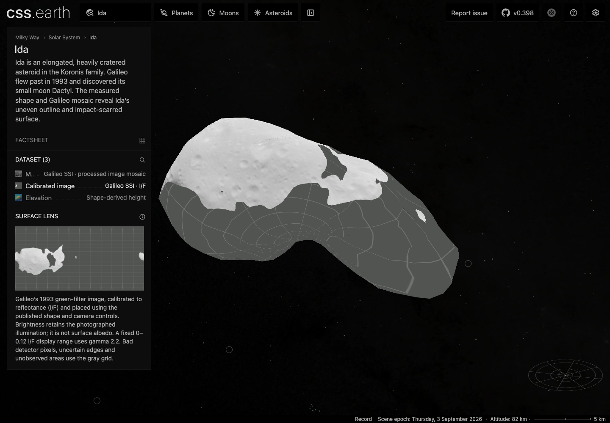
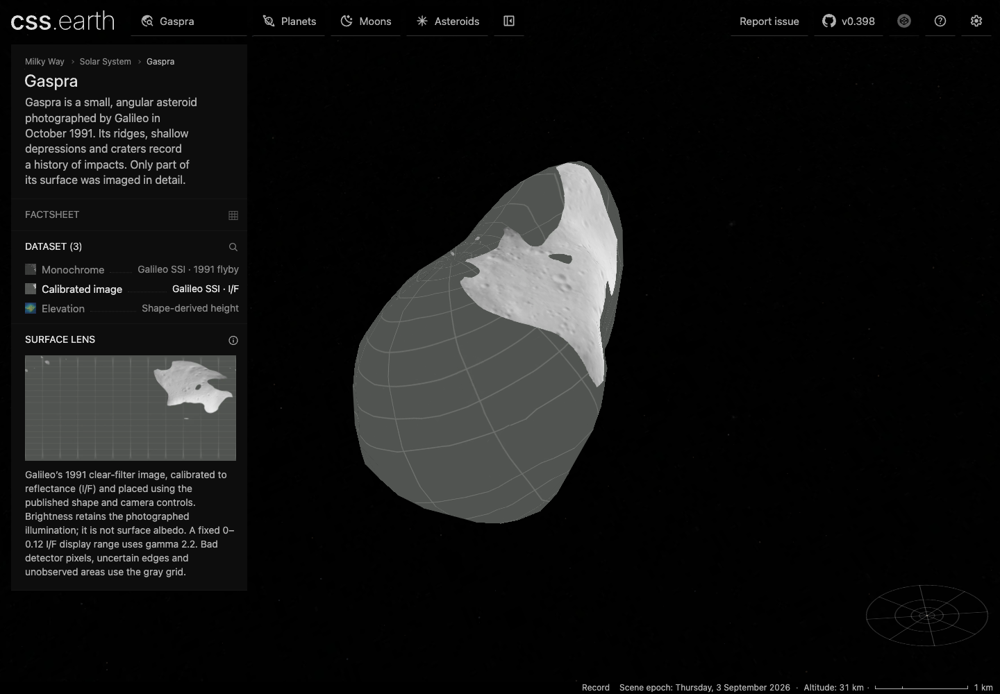
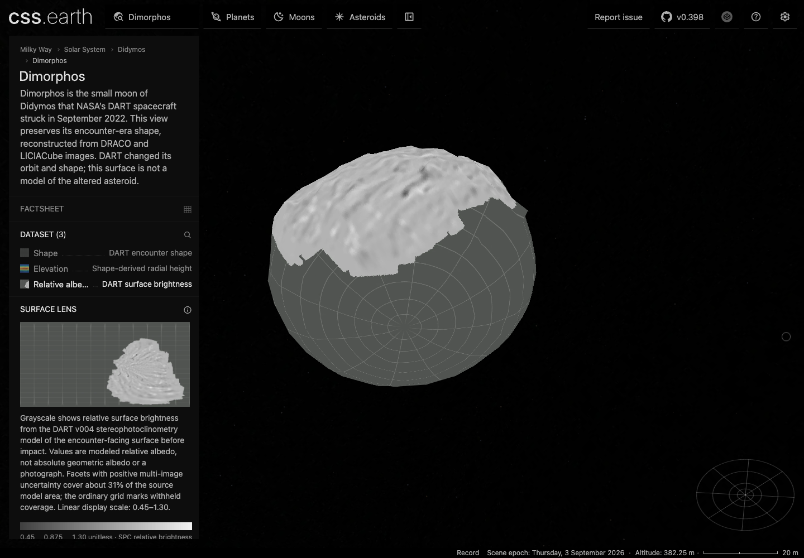

# Galileo image views and Dimorphos relative albedo

Ida and Gaspra gain a separate **Calibrated image** dataset. Dimorphos gains
**Relative albedo**. The existing default datasets remain selected on arrival;
all three bodies start with shadows off. The changes reuse the existing
shape-camera and source-facet preparers and retain 800 PolyCSS `u` raster
triangles with 128-pixel cells per body.

| Body | Source | Qualification and limits |
| --- | --- | --- |
| Ida | Galileo SSI green-filter I/F, `0202561278rcal_gre.fit` | Archived Thomas camera; four registration checks give 2.236 px RMS and 3.606 px maximum residual. Original bad-data masks and source-mesh visibility determine eligible coverage. |
| Gaspra | Galileo SSI clear-filter I/F, `107318326rcal_clr.fit` | Archived Thomas camera; four checks give 0.866 px RMS and 1 px maximum residual. Detector dropouts, saturation, special values and uncertain boundaries remain gaps. |
| Dimorphos | DART v004 SPC relative-albedo facet table | 60,464 positive-sigma facets cover 31.2138% of the original mesh area. A complete, unique centroid correspondence resolves the archive's permuted facet ordering within 0.024 mm. |

Galileo brightness retains the photographed illumination. Its fixed display
range is 0–0.12 I/F with gamma 2.2; it is not an albedo reconstruction. Dimorphos
uses a linear relative-albedo scale of 0.45–1.30. Unqualified coverage uses the
common gray grid. Neither dataset fills the unseen surface.

The Galileo registration compares the archived camera with the associated
Thomas mosaic on the full source mesh, without local camera fitting. The mosaic
shares these observations, so the results are checks of that registration,
not independent absolute ground truth or a global error bound. Enhanced color
remains deferred: the candidate color registration did not qualify.

Full source inventories, camera and quality semantics, reprojection limits,
exact input hashes and reproduction commands are in the body
[Ida](../src/planets/ida/SOURCE.md),
[Gaspra](../src/planets/gaspra/SOURCE.md) and
[Dimorphos](../src/planets/dimorphos/SOURCE.md) source notes.

## Browser evidence

These are headless Chrome captures from the existing port 4278 preview. The
[browser receipt](evidence/asteroid-calibrated-surfaces/browser.json) binds
viewport, DPR, camera, loaded resource URLs and prepared-file SHA-256 values.
Screenshots show deliberately different source coverage; they are not an
image-difference or native-renderer parity claim.

The detector images and reprojected published mosaics, with the checked patches
marked, are retained for [Ida](evidence/asteroid-calibrated-surfaces/ida-source-registration.png)
and [Gaspra](evidence/asteroid-calibrated-surfaces/gaspra-source-registration.png).
Their display stretches differ; compare landmark placement, not image brightness.

## Validation

- Source verification passes for all three packages. All 20 newly required
  archived inputs also restored through the existing acquisition operations into
  an empty temporary destination with hash verification
  ([receipt](evidence/asteroid-calibrated-surfaces/source-restoration.json)).
- The six new calibrated-image/facet-field tests, existing shared camera tests,
  affected body/source tests, updated prepared-view assertions and Didymos
  facet-field regression tests pass. `pnpm typecheck:preparation` passes.
- Existing lens race, reacquisition, failure/retry and destroy checks pass for
  all three bodies. `pnpm test:browser http://127.0.0.1:4278 <id>` passes for each
  at DPR 1 and 2, including retained drag. Fresh-view checks also confirm 800
  native raster triangles, canonical density 2, retained switching and shadows
  off at both DPRs. Ida's broader DPR 2 interaction case passed on its focused
  retry after an earlier inertia-stop assertion failure.
- The scoped runtime ownership and prepared-leaf layout audits pass for all
  three packages. No runtime rendering or input implementation changed.
- `pnpm build` completed package, renderer, preparation, all-object JSON and
  minimap generation, then Astro generated all 259 pages. Its final catalog
  assembly stopped at the absent `hiiaka-directional-sun.webp` asset. This is
  not a passing aggregate build. Direct assembly and final source verification
  pass for Ida, Gaspra and Dimorphos.
- Ten new immutable runtime files totaling 1,434,082 bytes are published. A fresh
  install downloaded and hash-verified all 115 entries in the three runtime
  manifests: 26,718,210 bytes, zero cache reuse
  ([receipt](evidence/asteroid-calibrated-surfaces/runtime-install.json)). This
  is the manifest install total, not a cold-page network measurement. Each new
  selected surface atlas remains 2048×6400 pixels (50 MiB at decoded RGBA8);
  this is not a measured GPU residency figure.

Whole-catalog validation is not fully green. `pnpm acquire:planets -- --verify-only`
stops at missing Hiiaka source inputs. `pnpm test` reaches 1,833 platform cases
with 1,822 passes: two whole-catalog audits hit the default Node heap limit, one
factsheet check lacks `asteroid-1998-ml14/source/reference/warner-2014.pdf`, and
eight cases were blocked by sandbox browser/socket permissions. The latter
files passed all ten cases when rerun with the required access. The separate
shell run has 236/242 passes: one whole-catalog density audit reaches the heap
limit, four cases encounter the existing Itokawa profile's missing lens-race
contract, and one lacks Squannit's context image. These are recorded as
unresolved aggregate results, not erased by the focused passes.
