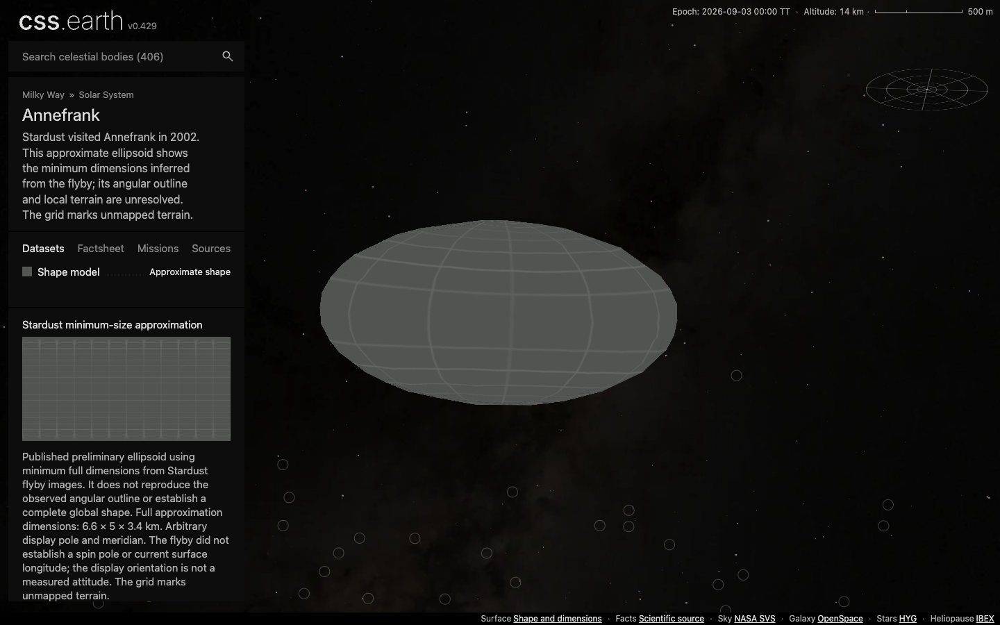
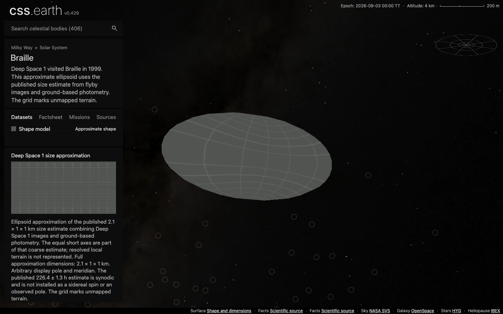

# Annefrank and Braille validation

Verified on 2026-09-09. Final production build and drag captures use `3bd9c5934`, incorporating main through `2f6f8614add9a5a22ef03b86a47edef631950ade`. Subsequent changes contain qualification scripts and evidence only.

| Check | Result |
| --- | --- |
| Scientific inputs | Each body has its own published full-axis constraints, explicit approximate status, source hashes and arbitrary-attitude disclosure. Both independent radius-table/closed-topology tests pass. |
| Mesh preparation | Existing meshoptimizer 1.2.0, 5,040 input faces → 480 native PolyCSS raster triangles per body. Both outputs are closed, one component, Euler characteristic 2. Estimated simplification errors are 41.016 m for Annefrank and 11.144 m for Braille, relative to the authored ellipsoids, not to reconstructed terrain. |
| Orbit context | Existing Horizons generator, with separate vector fixtures at the epoch and ±30 days. Maximum epoch error <0.000001 km; endpoint errors ≤580.008 km. The latter are bounded two-body propagation approximations, not encounter predictions. |
| Source/package closure | Both body manifests, prepared packages, content/controls and transport hashes pass the existing validators. Shadows and Orbit are false by default. |
| Shared integration | 395 changed existing runtimes are byte-identical to integrated main outside `heliocentricView`; all 404 prior navigation marker images preserve their exact pixels. |
| Static build | Integrated production Astro build passes. All 406 emitted transports match descriptor SHA-256 pins, and every page has the exact prepared startup preload set. Routes use main's metadata-only page loader. |
| Focused tests | Shared source-credit, route, page-data and prepared-activation checks pass. An obsolete generated route import was corrected; the route/page-data checks pass again on integrated main (35 tests). No full all-body browser suite was rerun. |
| Delivery | 62 content-addressed image assets published. Standard setup implementation downloaded all 62 into an empty destination, reused zero files and verified 14,017,574 bytes against the manifest hashes. |
| Browser | Headless Chrome 152, 1440×900, DPR 1 and 2. Both routes use the fresh installation and expose 480 native `u` raster leaves, the normal missing-data grid, approximate labels and off defaults. Inspected default, close, optional-lighting and rotated/pole views. |
| Navigation | Final integrated production build: both names appear in the 287-asteroid category and search, and in-page navigation retains one active scene and camera. |

Main hides the settings button. Optional shadows were exercised through the existing bound checkbox change event; this does not claim a visible settings-button workflow. Default settings were asserted on cold loads and route handoffs.

The DPR matrix preceded the route import correction/main integration. The matrix covers the same new-body geometry, image assets and controls; final transport identities are checked separately. Final integrated transport/preload verification, both drag captures and shared-navigation checks provide separate final-build evidence. These are focused qualifications, not an aggregate `pnpm test` / all-body browser certification or native-image parity claim.

## Drag evidence

The existing Lucy/Saturn-derived CDP workload runs three vertical drag cycles with 60 steps per leg, sequentially, at DPR 1 and with shadows off. Both traces report stable DOM identity, unchanged atlas banks, zero interaction requests and no console/page errors. The complete shared stage contains 109,528 retained nodes; the asteroid surface itself has 480 triangles. Those counts describe different scopes.

| Body | rAF interval p95 | DirectRenderer draw p95 | Pipeline sequences dropped without presentation |
| --- | ---: | ---: | ---: |
| Annefrank | 16.8 ms | 3.055 ms | 0 / 500 |
| Braille | 16.7 ms | 2.562 ms | 0 / 523 |

These measurements apply to the recorded local workload. They do not prove performance at every camera pose or GPU memory use. [Annefrank trace report](evidence/annefrank-drag.json) and [Braille trace report](evidence/braille-drag.json) bind prepared assets, served script/document hashes, viewport, hardware and camera. The raw compressed traces remain in the corresponding `output/playwright/asteroid-spacecraft-gaps/*-drag/` directories; their hashes are included in those reports.





[Annefrank rotated view](evidence/annefrank-after.png) · [Braille rotated view](evidence/braille-after.png)

## Reproduce focused verification

```sh
node docs/asteroid-spacecraft-gaps/verify.mjs
node --test --test-concurrency=1 tests/objects/unit/annefrank/source.test.mjs tests/objects/unit/braille/source.test.mjs
node docs/asteroid-spacecraft-gaps/verify-reuse.mjs
node docs/asteroid-spacecraft-gaps/verify-built-transports.mjs
node docs/asteroid-spacecraft-gaps/fresh-install.mjs
node docs/asteroid-spacecraft-gaps/browser-check.mjs
CSSEARTH_CHROME_LOG_STDIO=1 node docs/lucy-targets/drag-trace.mjs http://127.0.0.1:4278 1 output/playwright/asteroid-spacecraft-gaps/annefrank-drag annefrank
CSSEARTH_CHROME_LOG_STDIO=1 node docs/lucy-targets/drag-trace.mjs http://127.0.0.1:4278 1 output/playwright/asteroid-spacecraft-gaps/braille-drag braille
```

The fresh-install check requires an empty output destination. Use the existing preview server for browser checks. Run each finite operation serially and close its owned browser processes. [Resource receipts](resource-summary.json) report measured task process trees and helper cleanup; the integrated build peaked at approximately 1.93 GiB. No additional preview server or headed browser was launched.
