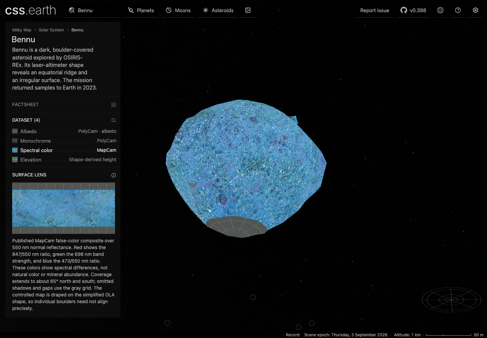
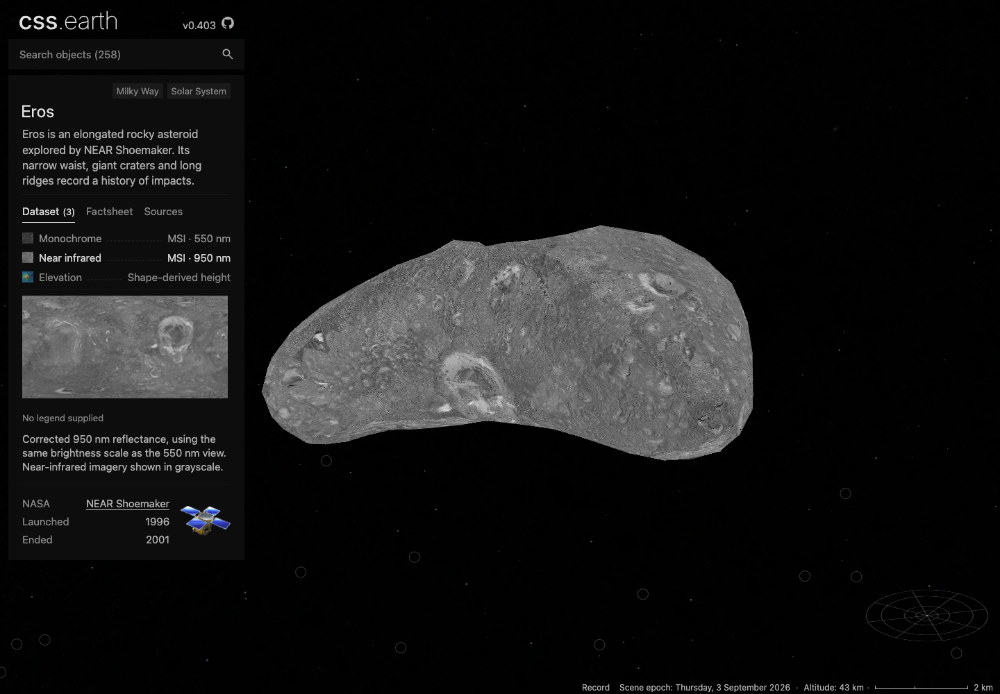
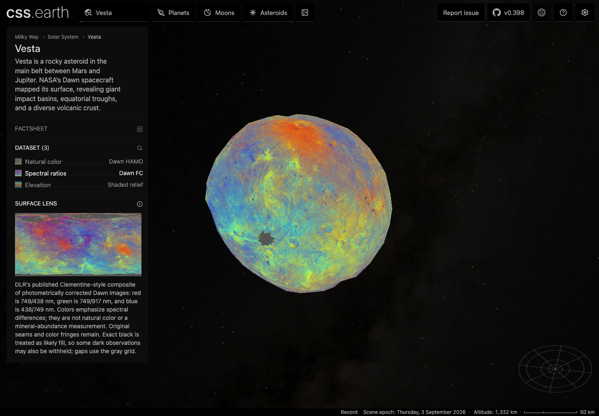

# Asteroid spectral surface views

This change adds three published datasets to existing asteroid packages. It
preserves their shapes, accepted face budgets and default views. Shadows remain
off by default, and missing observations use the shared gray grid.

| Body | New dataset | Interpretation | Retained faces |
| --- | --- | --- | ---: |
| Bennu | MapCam spectral color | Published false-color composite over 550 nm normal reflectance; cropped to approximately ±65° latitude | 800 |
| Eros | NEAR MSI 950 nm albedo | Near-infrared reflectance, with the same 0.05–0.40 display scale as the existing 550 nm view | 796 |
| Vesta | Dawn FC Clementine ratios | DLR's published red/green/blue spectral-ratio composite in the existing Claudia grid | 800 |

Bennu and Vesta are explicitly labeled as spectral colors rather than natural
color or mineral abundance. The source records describe registration,
missing-data limits, calibration and the source survey:
[Bennu](../src/planets/bennu/README.md), [Eros](../src/planets/eros/README.md),
[Vesta](../src/planets/vesta/README.md).

## Source interpretation

Bennu's mapped TIFF incorrectly presents its four 16-bit channels as grayscale
plus unspecified extra bands. Independent uncompressed TIFF strip decoding
found **zero differing samples in all four planes** against the paper's original
RGB/alpha image. The source-owned RGB band order, sRGB codes and alpha are
therefore explicit. Full-alpha validity is evaluated before byte conversion;
partial alpha and source fill remain missing. The source's cropped extent is
preserved instead of being stretched to both poles.
[Band identity and source hashes](evidence/asteroid-spectral-surfaces/bennu-band-identity.json).

Eros uses the existing floating-point observation reader. Thirty geographically
distributed anchors independently decode original TIFF strips and interpolate
I/F before applying the authored display range. All thirty agree exactly with
the prepared preview's grayscale codes.
[Source anchors](evidence/asteroid-spectral-surfaces/eros-source-anchors.json).

Vesta's ZIP member is misnamed `Ceres_clementine_HAMO-1-2_global.pds`, but its
attached label identifies Vesta and the correct map grid. A small preparation
reader streams its three band-sequential byte planes into RGB, checks the full
extraction and label, and then uses the existing projected-image resampling.
The result was inspected against DLR's own preview. Exact black remains the
same disclosed likely-fill heuristic as the existing Vesta natural-color map;
no independent validity mask or mineral measurements are invented.

## Retained rendering and delivery

The three checked-in terrain files are byte-identical to main. Every previous
surface map, triangle atlas, shadow atlas and thumbnail also retains its old
hash. The new lenses use the existing native PolyCSS `u` primitive in raster
mode, with 128 × 128 cells and one canonical asset bank at either DPR.
[Unchanged geometry and asset checks](evidence/asteroid-spectral-surfaces/retained-assets.json).

Only nine runtime files were added: an unlit atlas, a directional atlas and a
thumbnail per dataset. They total **18,690,290 bytes**, published through the
existing content-hashed asset store. This is the total new inventory, not the
cost of an initial page load. A fresh installation verified all **117 files /
74,966,750 bytes** across the three complete body inventories; this excludes
shared shell assets and JSON and is not a GPU-memory measurement.
[Published delta](evidence/asteroid-spectral-surfaces/runtime-asset-delta.json),
[fresh runtime install](evidence/asteroid-spectral-surfaces/runtime-install.json).

All three new required source inputs were also restored into an empty temporary
destination through the authored acquisition recipes and verified against their
pins. The Eros archive cache is itself hash-checked before member extraction.
[Fresh source restoration](evidence/asteroid-spectral-surfaces/source-restoration.json).

## Validation

- Twenty-eight focused body and provenance tests pass after integrating main:
  geometry, physical context, retained native triangles, source radius anchors,
  local asset hashes, source lineage and spacecraft cards.
- Fourteen decoder/profile tests pass, including RGB plane order, alpha,
  valid darkness, cropped map registration and rejection of changed labels.
- Preparation TypeScript checks pass.
- Real headless Chrome at DPR 1 and 2 passes the visual checks and each body's
  `pnpm test:browser` retained-DOM/drag check. Both shadow settings and multiple
  longitudes were inspected. The new lenses remain on the same retained leaves.
- Focused asynchronous lens conformance covers delayed requests, reacquisition,
  rejection and destruction for the new dataset on each body.
- All three final source manifests verify and their individual production
  assemblies succeed.

[Browser evidence](evidence/asteroid-spectral-surfaces/browser.json) binds the
screenshots to the final descriptor, prepared runtime, object transport and
runtime inventory hashes. These are source-versus-result inspections; a flat
source mosaic and a rotated CSS mesh are not a pixel-parity oracle.

The aggregate gates are **not fully green**. Before integrating main's dataset
cards and provenance change (`e23a357b`), `pnpm acquire:planets -- --verify-only`
stopped at Hiiaka's missing existing source files. `pnpm test` passed 761 package
tests and 340 renderer tests, then stopped on six Earth paging/destination cases;
platform and shell stages were not reached. After integration, a focused rerun
of those three failing files still produces the same six failures. The relevant
Earth inputs and test files match the integrated main, as recorded in the
[baseline evidence](evidence/asteroid-spectral-surfaces/aggregate-baseline.json).

The pre-integration normal-heap static build exhausted Node's heap. With an
8 GiB heap and the current preparation outputs (pre-build hooks disabled), Astro
generated all 259 pages. Final whole-catalog assembly then failed on the missing
existing `hiiaka-directional-sun.webp`. This is not a green all-catalog gate or a
claim of a complete static build after integration. The three asteroid production
assemblies were rechecked successfully after integration.

The final browser captures use main's dataset cards, explicit false-color
summaries and source-derived spacecraft associations. Their provenance records
were recovered and verified against the actual local source and output bytes;
the existing texture bakes were reused.

GitHub's prepared-universe job passes 310 tests and fails an older assertion
that Patroclus is absent from the visible body registry. The exact integrated
main commit fails the same assertion. Neither that test nor its registry/context
inputs change in this PR:
[PR run](https://github.com/layoutit/cssEarth/actions/runs/34308708833),
[main run](https://github.com/layoutit/cssEarth/actions/runs/34306051909).

## Preview

Use the existing server on port 4278 and select the named dataset:
[Bennu](http://127.0.0.1:4278/bennu/), [Eros](http://127.0.0.1:4278/eros/),
[Vesta](http://127.0.0.1:4278/vesta/).

