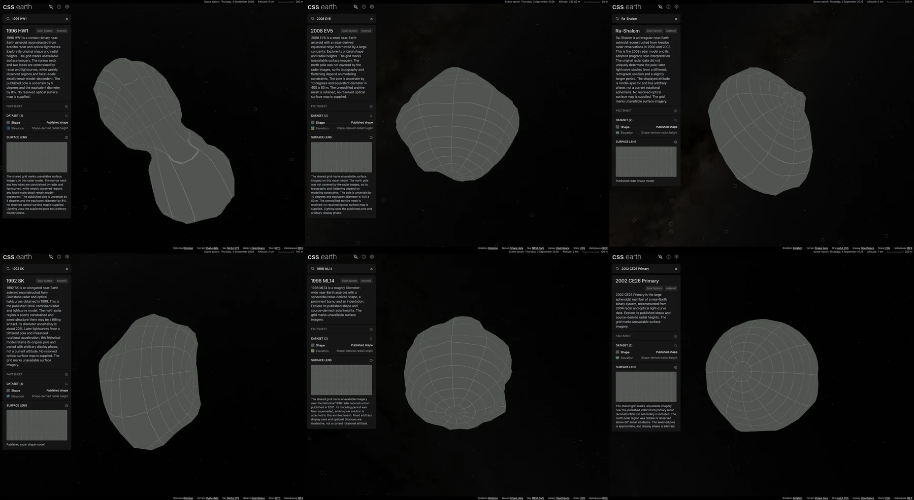

# Radar asteroid continuation

Six additional published shape models extend the registry from 84 to 90 asteroids. Original meshes come from the [NASA/JPL shape archive](https://echo.jpl.nasa.gov/asteroids/shapes/shapes.html); each package records its associated research and the limits of that reconstruction.

| Number | Body and source record | Source triangles | Prepared triangles | Reference radius (km) |
| --- | --- | ---: | ---: | ---: |
| 8567 | [1996 HW1](../src/planets/asteroid-1996-hw1/SOURCE.md) | 2,780 | 800 | 1.01 |
| 341843 | [2008 EV5](../src/planets/asteroid-2008-ev5/SOURCE.md) | 3,996 | 800 | 0.2 |
| 2100 | [Ra-Shalom](../src/planets/ra-shalom/SOURCE.md) | 2,292 | 800 | 1.15 |
| 10115 | [1992 SK](../src/planets/asteroid-1992-sk/SOURCE.md) | 1,016 | 800 | 0.5 |
| 52760 | [1998 ML14](../src/planets/asteroid-1998-ml14/SOURCE.md) | 1,020 | 800 | 0.5 |
| 276049 | [2002 CE26 Primary](../src/planets/asteroid-2002-ce26/SOURCE.md) | 2,292 | 800 | 1.73 |

Original vertices retain their published kilometer scale. Reference radii define display scale and the Elevation datum; they do not resize the source geometry. The existing source-meshoptimizer preparation preserves source connectivity and prepares 800 native PolyCSS u raster triangles per body with 128 px cells. The shared grid marks unavailable registered optical imagery. Shadows start off and remain optional.

Shape shows the published reconstruction. Elevation transfers source-surface radius minus the reference sphere through the established closest-source-point method. It includes global shape and is not an independent topographic measurement or gravitational height. Ambiguous or out-of-allowance correspondences retain the grid. Sampled fit distances and library error estimates are separate measurements; neither is an exhaustive bound.

1996 HW1 retains its contact-binary neck. Its concavities require original mesh connectivity; a single radius per direction would select the wrong surface in some directions. 2008 EV5 retains the broad equatorial ridge and concavity described by the radar study.

Ra-Shalom and 1992 SK retain the archived models' own orientation conventions, with later conflicting spin solutions disclosed. The display axes remain registered to the archived mesh. ML14 uses its historical 1998 radar geometry with fixed arbitrary display orientation because that study did not determine a pole. Its later photometric period is informational, and optional directional lighting is explicitly illustrative. CE26 displays only the documented primary reconstruction; its weakly constrained north polar region and approximate pole remain visible qualifications.

All six use the generic object package and shared Solar System navigation. Their heliocentric conics use the existing JD 2461286.5 epoch and are checked against independent Horizons vectors 30 days either side. These are fixed-epoch display fits, not long-term perturbation ephemerides.

The branch also includes main's five-comet merge (`1588a643`). The combined registry has 176 objects. All 1,043 existing solar-geometry entries and every incoming body in the world context remain unchanged. Navigation atlases and marker indices are prepared again for the combined registry.

The [validation record](asteroids-radar-expansion-validation.json) binds implementation `e060613b` to source and prepared hashes, installation totals, browser observations and trace identities.

- Source verification passes for all 176 objects. The six additions pass 24 source tests and six prepared-package tests. Independent source/scalar and decoded-atlas checks are recorded in each package's SOURCE.md.
- The required `pnpm test` run passed 634 package tests, 337 renderer tests and 1,403 platform cases before three failures. Two audit files exceeded Node's default 4 GiB heap; their focused rerun with an 8 GiB heap passes all 54 cases. The missing ML14 citation-check date is corrected, and both factsheet tests pass. The remaining shell stage passes all 234 tests. Passing stages were not repeated; the original aggregate invocation is recorded as nonzero, with all failures resolved separately.
- Full prebuild completed. Final static generation produces 177 pages, and all 176 objects assemble successfully. Initial assembly exposed a pre-existing 44-byte Haumea ring file; its original bytes were preserved and the normal installer restored the pinned release before assembly was repeated.
- A clean checkout completed normal `pnpm install --frozen-lockfile` including postinstall. The published inventory installed all 210 files with zero reuse: 47,809,188 bytes. All six mounted at DPR 1 and 2 while original geometry inputs were absent. Every prepared-object hash matches the primary checkout. The later citation-date and source-packaging updates preserve scene payloads, geometry and asset inventories.
- Both production builds pass Shape/Elevation selection, Shadows on/off, native mouse drag, retained 800 native `u` raster leaves, one mounted scene and selected-body scene-asset isolation. Both DPRs request identical canonical asset paths. The existing `pnpm test:browser` entry passes for each addition at both DPRs. HW1's 390 × 844 mobile view was inspected too.
- Solar System navigation shows 90 asteroid links, includes all five comets, and keeps Asteroids Orbits off by default. Six search/navigation hops across both DPRs retain one mounted scene and produce no browser errors.
- After runtime-only verification, the normal acquisition command restores all 26 original inputs for the six additions and verifies their complete source closures. The checked-in context PNGs and two pinned spin CSVs make that path complete.

Browser response bodies include shared shell/background assets and worker requests. Their buffers are bound to actual production files through the existing headless response-interception workflow. They are uncompressed response-body costs, not measured wire transfer. Primary and clean builds have identical non-document responses; the sole HTML difference is the Git-derived About version string. All four surface/shadow atlases per body are 2048 × 6400 pixels, or 52,428,800 bytes each at decoded RGBA size; that is not a measurement of GPU residency.

Drag measurements use headless Chrome 152.0.7977.76, a 1505 × 1237 viewport, Shape with optional Shadows enabled, and the existing 2.5-second native mouse gesture. Pallas uses the same build and settings. All cases retain 800 raster triangles and have no browser errors.

| Body | Observed draw cadence, DPR 1 / 2 (fps) | Draw time p95, DPR 1 / 2 (ms) |
| --- | ---: | ---: |
| Pallas (reference) | 59.06 / 59.06 | 3.57 / 3.62 |
| 1996 HW1 | 59.12 / 58.98 | 8.73 / 8.79 |
| 2008 EV5 | 58.98 / 58.98 | 7.56 / 7.47 |
| Ra-Shalom | 59.39 / 59.00 | 10.93 / 10.86 |
| 1992 SK | 58.99 / 58.96 | 9.84 / 9.11 |
| 1998 ML14 | 59.40 / 58.98 | 7.32 / 7.30 |
| 2002 CE26 Primary | 59.46 / 58.59 | 3.86 / 3.84 |

These short default-view traces show approximately 59 fps for this workload. They do not establish performance at every pose, zoom or hardware configuration.
