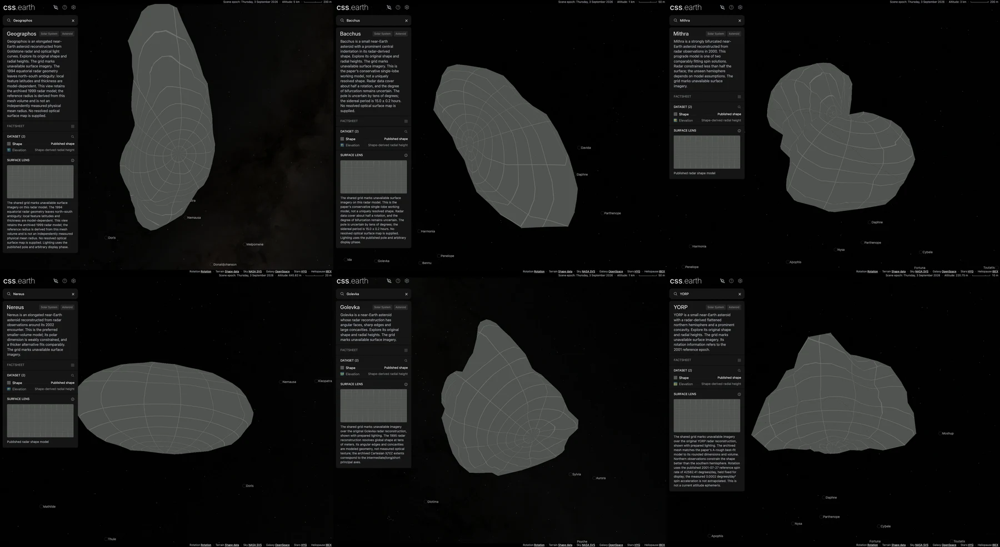

# Radar asteroid expansion

Six archived NASA/JPL radar models extend the registry from 78 to 84 asteroids. The [JPL model index](https://echo.jpl.nasa.gov/asteroids/shapes/shapes.html) supplies the original meshes; the associated research supplies scale, spin and model qualifications. This is a bounded addition, not a complete census of asteroids or radar datasets.

| Number | Body and source notes | Original triangles | Prepared triangles | Reference radius (km) |
| --- | --- | ---: | ---: | ---: |
| 1620 | [Geographos](../src/planets/geographos/README.md) | 4,092 | 800 | 1.284042 |
| 2063 | [Bacchus](../src/planets/bacchus/README.md) | 508 | 508 | 0.315 |
| 4486 | [Mithra](../src/planets/mithra/README.md) | 5,996 | 800 | 0.845 |
| 4660 | [Nereus](../src/planets/nereus/README.md) | 2,292 | 800 | 0.165 |
| 6489 | [Golevka](../src/planets/golevka/README.md) | 4,092 | 800 | 0.265 |
| 54509 | [YORP](../src/planets/yorp/README.md) | 572 | 572 | 0.0564 |

Original coordinates retain their kilometer scale. Reference radii supply display and scalar datums; they do not rescale the meshes. Geographos uses the volume-equivalent radius calculated from the selected archive geometry. The other five use the equivalent diameter associated with their published model.

The established meshoptimizer source-connectivity path reduces the four denser meshes. Bacchus and YORP retain their original triangles. Every body uses native PolyCSS `u` primitives in raster mode, 128 px cells, prepared lighting and the shared missing-imagery grid. Shadows default to off for all six bodies and remain available through the existing toggle. Both device densities use the same highest-density asset bank. No new renderer or runtime geometry path is introduced.

These Chrome captures use lighting off to expose the complete grid and silhouette. Each body is independently framed; they are not shown at a common physical scale.

## Scientific views

Each body has Shape and Elevation. No registered optical surface map was identified in the bounded source survey, so Shape retains the normal grid. Radar images, optical light curves and paper figures are not treated as geographic reflectance maps.

Elevation is source-model radius minus the documented reference sphere. The existing closest-source-point transfer evaluates this scalar on the full original mesh. Ambiguous or distant correspondences retain missing-data coverage; the flat longitude/latitude preview also withholds ambiguous rays. This is a second visualization of the shape model, not independent measured topography or gravitational height.

Source and reduced meshes were compared from front, back and both poles. Independent nearest-triangle samples use 8,192 points in each direction. Those sampled distances and meshoptimizer estimates are not exhaustive geometric bounds or observational uncertainties. Per-body notes retain the measurements, transfer allowances and source-derived scalar anchors.

The selected reconstructions are explicitly qualified: Geographos has unresolved north–south structure and later alternative interpretations; Bacchus uses the conservative single-lobe working model; Mithra retains the named prograde solution with its mirrored alternative disclosed; Nereus retains the preferred smaller-volume geometry despite its archival `alt1` filename. YORP holds the published 2001 reference rotation rate fixed and does not extrapolate its measured spin acceleration. Display meridians remain arbitrary.

## Orbits

JPL Horizons geometric heliocentric ICRF elements use JD 2461286.5. Independent vectors at that epoch and 30 days either side qualify the fixed-epoch conics. All six reproduce the fitted epoch within 1 mm. The largest endpoint differences are approximately 1,944.05 km for Geographos, 175.07 km for Bacchus, 243.37 km for Mithra, 132.45 km for Nereus, 707.11 km for Golevka and 307.55 km for YORP. The existing regression test records individual upward-rounded bounds; these fits are not long-term perturbation ephemerides. Horizons provides no GM for these records, so none is inferred from an assumed density.

The shared Solar System context and asteroid accordion include all six. The main-branch asteroid-orbit setting remains off by default.

## Validation

The [machine-readable validation record](asteroids-radar-validation.json) binds the implementation at `68b696d3` to source hashes, prepared transport hashes, installation totals and browser observations. Its subsequent shadows-default record identifies the updated prepared packages: all six start with Shadows off, the toggle restores both states, and retained raster faces stay unchanged. This settings update passed 28 focused package tests, a 162-page static build and seven live headless Chrome mounts (all six at DPR 1, plus the saved Nereus view at DPR 2). Published runtime asset hashes are unchanged.

- All six packages passed empty-directory source restoration, source/runtime closure and 28 focused source and prepared-package tests. Final content corrections and coverage assertions received focused reruns. Original and reduced front, back and pole views were inspected; 92 interior atlas anchor locations were checked against independently projected source points. Maximum observed RGB error was 8/255. Boundary RGB remains unproven where source-facet normals are nonunique or lossy WebP mixes cell-edge colors; corresponding scalar and source-point checks are retained.
- Full `pnpm test` passed 2,145 tests. Full `pnpm build` passed, producing 162 pages and assembling the complete primary checkout. Every one of the 931 prior solar-geometry entries remained unchanged.
- A fresh checkout completed `pnpm install --frozen-lockfile` with normal postinstall. The normal asset installer downloaded all 210 files for these six bodies, with zero reuse, totaling 47,072,894 bytes. Original shape inputs remained absent. Static generation produced 162 pages; the existing assembler then assembled the six additions. No source geometry or texture preparation was needed. Every fresh prepared-object hash matches the primary checkout.
- All six passed production mounts at DPR 1 and 2 in headless Chrome 152.0.7977.76, both from the primary and fresh builds. Checks covered both views, lighting transitions, native mouse drag, retained `u` raster leaves, one mounted scene and selected-body scene-asset isolation. Both DPRs requested identical canonical asset paths. The existing `pnpm test:browser` entry also passed for each addition at both DPRs.
- Solar System checks found all 84 asteroid links, all six new routes and asteroid orbits off by default. Native link transitions to Geographos, Bacchus and YORP each retained one mounted scene at both DPRs.

Browser checks served actual production buffers through local Playwright response interception, including worker requests, with fulfilled-buffer SHA-256 verification. No additional HTTP server or headed browser was opened. The existing port 4278 belongs to the concurrent UI-styles work and was left unchanged. Reported cold response bodies are approximately 58.5–58.9 MB including shared content; these are uncompressed body sizes, not wire-transfer sizes or loading-time measurements. Atlas decoded capacities do not establish GPU residency.

The aggregate `pnpm acquire:planets -- --verify-only` check stops on pre-existing missing Aegaeon inputs: the ESO panorama, Inter font and `aegaeon_mst2013.bpc` kernel. All six additions verified their own sources. Full all-object browser conformance is not claimed; the new-body checks above are scoped to this addition.

## Native drag observations

The existing 2.5-second native mouse recipe ran with lighting enabled at a 1505 × 1237 CSS-pixel viewport. Pallas supplies a contemporaneous 800-face reference.

| Body | Recorded draw cadence, DPR 1 / 2 (per second) | DrawFrame duration p95, DPR 1 / 2 (ms) |
| --- | ---: | ---: |
| Geographos, 800 faces | 59.40 / 59.00 | 9.87 / 9.96 |
| YORP, 572 faces | 58.97 / 58.61 | 8.31 / 8.34 |
| Pallas reference, 800 faces | 58.55 / 58.95 | 9.87 / 9.59 |

These short headless observations retain trace and prepared-data hashes. They do not guarantee performance on other hardware or workloads.
