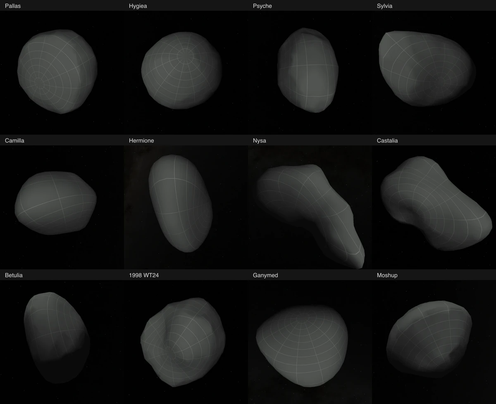
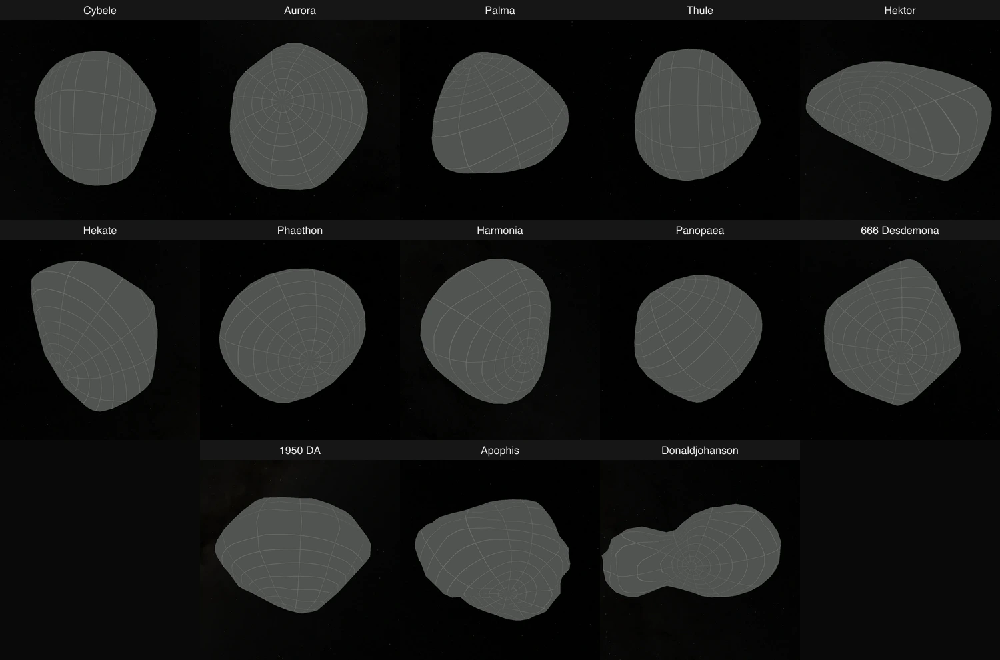

# Asteroid validation

The [65 additions](asteroids.md) use 31 VLT/SPHERE models, 26 DAMIT models, seven NASA/JPL radar models and one Lucy reconstruction. The registry contains 78 asteroids and 148 objects. This record separates evidence for the original 52 additions from the thirteen added at `a73c3efc`.

## Source and geometry

Every addition has 800 native PolyCSS `u` raster leaves, 128 px cells, the shared missing-imagery grid and prepared lighting. Twelve original DAMIT models already have 800 triangles and need no edge collapse. Coordinates retain their original calibrated scale. Geometry, atlases and lighting are prepared before runtime; DPR 1 and 2 select the same asset bank.

The original 52 packages passed empty-directory source restoration, source identity, 156 source tests and 52 prepared-body tests. Their geometry was qualified at `7cbe54ce`; later authored content and display changes were validated at `f7518f9a`.

The thirteen additions at `a73c3efc` are Cybele, Aurora, Palma, Thule, Hektor, Hekate, Phaethon, Harmonia, Panopaea, 666 Desdemona, 1950 DA, Apophis and Donaldjohanson. All thirteen passed final source-manifest verification, 39 source tests collectively, thirteen prepared-body tests, package validation and the prepared leaf census. The census found 10,400 `u` raster leaves across the separately mounted packages, with zero package or shared ownership violations. All 78 asteroid orbit entries pass the existing epoch and independent ±30-day vector checks; tolerances describe those sampled dates, not long-term propagation accuracy.

Twelve new packages restored all source inputs automatically into empty staging directories. Donaldjohanson's DSK and other inputs restored through the acquisition plan; exporting the restored DSK reproduced the checked-in compressed OBJ byte for byte. Its SWRI paper URL failed Node TLS-chain validation on this host. `curl`, with normal HTTPS certificate validation, retrieved the exact pinned paper bytes, after which every restored source hash passed. Unattended full acquisition is therefore not claimed for Donaldjohanson on this host.

Original and reduced meshes were inspected from front, back and both poles. The sources and reduced meshes have one closed outward-wound component and Euler characteristic 2. Per-body source notes retain independent nearest-triangle samples and radial-ambiguity checks. Sampled distances are not exhaustive geometric bounds or observational uncertainties.

All 65 bodies have Shape; 64 have Elevation. Donaldjohanson's source has overlapping surfaces on some radial rays, so it exposes Shape alone. Its authors reconstructed roughly 60% of the unobserved side using fitted shapes and symmetry; that limitation remains visible. Hektor uses a convex primary model, Cybele the identified 2017 reconstruction and Phaethon the 2018 convex solution. Apophis's 2026 archive release contains the preliminary 2018 Model B. Apophis and Donaldjohanson use the existing fixed illustrative display frame because a single-axis present-day spin would misrepresent their tumbling states.

The [candidate survey](asteroid-candidate-survey.json) records 217 DAMIT targets: 142 named targets and 75 provisional-designation entries, plus twelve mission/radar checks. No calibrated model remained unaccounted for in those DAMIT results. This is a dated archive survey, not proof that no additional data exists elsewhere. No geometry was synthesized to fill a source gap.

These views use lighting off to make the silhouettes and missing-imagery grids visible. Bodies are independently framed, not shown at a common physical scale.

## Browser and delivery

Chrome `152.0.7977.76` runs headlessly. The preview remains on port 4278 and now serves this PR's checkout. The earlier separate preview checkout was removed; its completed evidence remains historical. No additional preview server was started for validation.

The first 52 additions passed focused conformance at DPR 1 and 2, with 624 final camera/lens/lighting captures inspected across all bodies. Four floating-point legend labels found during inspection were corrected and recaptured. Thin raster-edge seams remain visible at some magnifications.

Their fresh checkout completed normal dependency installation and postinstall, downloaded 1,820 runtime files with zero reuse (405,843,588 bytes), and passed 104 production browser mounts. Those checks covered native drag, both lenses, lighting transitions, one active scene, retained triangles and selected-body scene-asset isolation. The served buffers, including worker requests, were bound to file hashes. Later changes to display precision and title wrapping received focused production checks.

For the thirteen additions, that isolated validation checkout was advanced to `a73c3efc`. Dependencies and the lockfile were unchanged, so the prior normal dependency installation was reused. The normal asset installer downloaded all 451 new runtime files with zero reuse, totaling 101,253,606 bytes, and verified their SHA-256 identities. Source preparation was not needed for installation.

The complete primary `pnpm build` passed. The isolated checkout also completed static generation of 149 pages. Its first assembly stopped on missing baseline scene assets; the installer restored those exact published files, and assembly then passed without repeating source preparation or static generation. The new asteroid asset publication and installation receipts are separate from the baseline restoration.

All thirteen new bodies passed the existing focused conformance cases at DPR 1 and 2. The final 152 camera/lens/lighting captures completed without page or response errors; all four contact sheets were inspected, including the full Donaldjohanson page. Shadowed views can be dark; lighting-off views expose the complete source-grid silhouette. No body needed a new rendering technique.

All 26 production mounts passed native mouse drag, supported lens and lighting transitions, one active scene, 800 retained raster triangles, complete new-body world-context membership and selected-body scene-asset isolation. The fulfilled response buffers were hash-verified, including worker requests. Every delivered body transport hash matches the final primary prepared bytes. New-package installation is 7.28–7.92 MB; observed cold uncompressed response bodies are 58.17–58.26 MB including shared content.

The existing `pnpm test:browser` entry passed for each of the thirteen additions at both DPRs, with no element topology changes during native drag. All thirteen entries are visible in the Solar System asteroid accordion and have the correct routes. Native link checks cover 666 Desdemona, Apophis, 1950 DA and Donaldjohanson, with one mounted scene after every transition. Production title and navigation-label checks passed at 390 and 1505 px widths for 666 Desdemona and Donaldjohanson; their screenshots were inspected.

Per-body installation and uncompressed response-body sizes are recorded in the browser receipts. These are not compressed network-transfer sizes or load-time measurements. Each 2048 × 6400 atlas has 52,428,800 bytes of decoded RGBA capacity; that does not establish simultaneous GPU residency.

## Native drag observations

The earlier eight traces cover about 2.5 seconds of native mouse dragging with lighting enabled at a 1505 × 1237 CSS-pixel viewport. They are short headless preview observations, not universal performance guarantees or a diagnosis of GPU saturation.

| Body | Draw cadence, DPR 1 / 2 (frames/s) | DrawFrame p95, DPR 1 / 2 (ms) |
| --- | ---: | ---: |
| Pallas | 58.58 / 58.95 | 9.32 / 9.35 |
| Camilla | 58.94 / 58.54 | 8.20 / 8.34 |
| Nysa | 58.99 / 58.95 | 12.09 / 12.14 |
| Castalia | 58.95 / 58.95 | 9.73 / 9.72 |

All eight have 800 leaves and no page errors. Records retain browser version, camera URL, prepared hashes, screenshots and raw compressed Chrome traces. They are historical evidence for the unchanged earlier body assets, not measurements of all 65 additions at the current head.

Four additional traces at `a73c3efc`, using the same native-input recipe and viewport, passed with 800 leaves and no page errors:

| Body | Draw cadence, DPR 1 / 2 (frames/s) | DrawFrame p95, DPR 1 / 2 (ms) |
| --- | ---: | ---: |
| Hektor | 58.98 / 59.00 | 7.32 / 7.79 |
| Donaldjohanson | 58.57 / 58.20 | 11.23 / 11.44 |

These are observations on the shared workstation during this run. They do not establish performance for every body, machine or camera distance.

## Aggregate checks and evidence reuse

The aggregate test run exposed missing orbit-test tolerances for the thirteen new fixtures. These were derived from the existing independent fixture comparisons, and the affected asteroid orbit file then passed. The remaining package tests passed, including the engine package that had been queued behind the astronomy failure.

The renderer run passed 306 of 307 tests; one five-second timeout passed when its file was rerun in isolation. The platform run passed 772 tests and failed thirty while incoming moon metadata was still being generated. After the build completed, all affected transport, contract, material and ownership checks passed targeted reruns. The shell suite passed all 220 tests. This is a complete set of passing component evidence with focused reruns, not a claim that the initial uninterrupted `pnpm test` command exited successfully.

`pnpm acquire:planets -- --verify-only` still stops on missing pre-existing source inputs, first Ophelia's shared star image and font in this checkout. This is distinct from successful source verification for every added asteroid. The older Sun-specific ownership failure is resolved by the incoming main-branch changes; it is not a current asteroid or shared census failure.

Completed checks were reused when the intervening changes did not affect their inputs. Early browser attempts interrupted by missing navigation markers or development rebuilds are retained as failed attempts and are not counted as passes. All 148 final navigation markers and 147 unique Sun world-context entries were prepared before the final browser run.

Local logs, source-fit reports, restoration and installation receipts, captures, response hashes and traces are retained under `output/asteroids-combined`, `output/asteroids-continuation` and the source-family output directories. Per-body provenance, pinned scientific inputs and reproducible preparation recipes are checked in beside each package.
