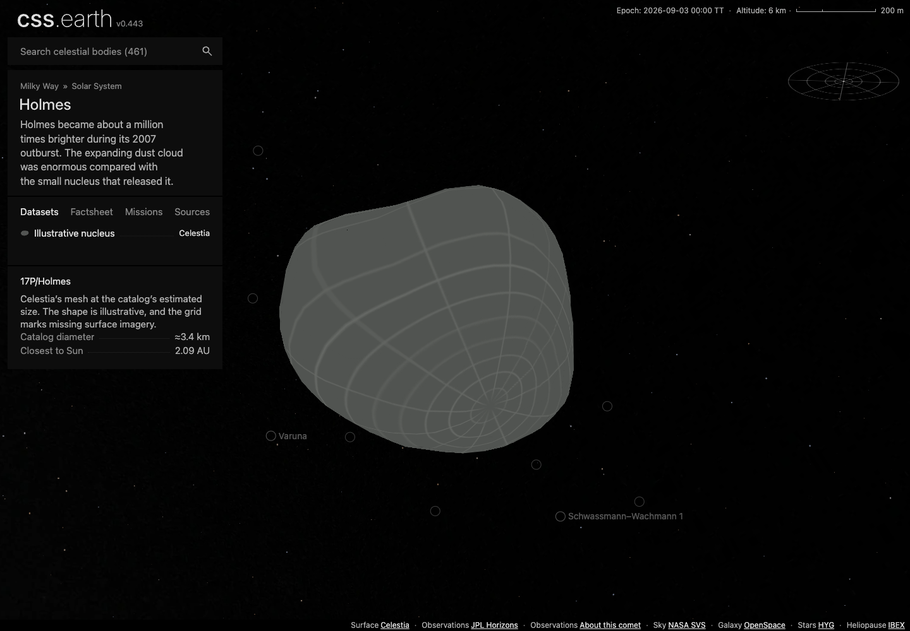
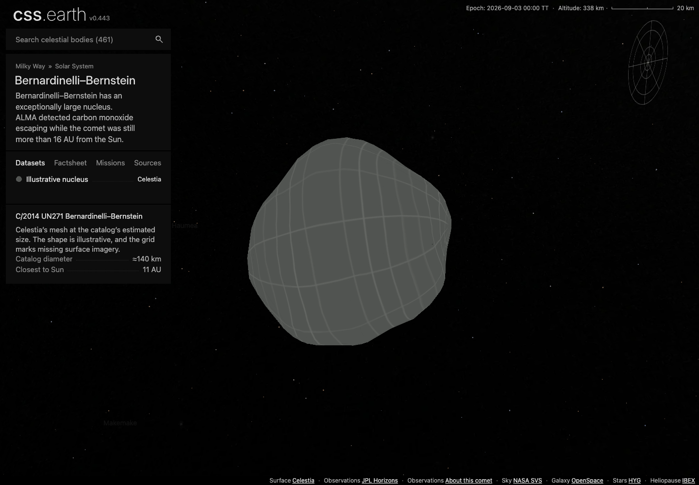

# Celestia mesh imports

Twenty additional destinations use the actual meshes assigned by Celestia's core catalog. The twelve existing comet packages keep their source shapes and datasets. Each addition has one **Celestia** dataset, the full missing-imagery grid, 800 retained PolyCSS triangles, and Shadows and Orbit off by default.

## Which meshes

Celestia assigns nineteen entries the same irregular `asteroid.cms` model. Bernardinelli–Bernstein uses `roughsphere.cms`. These are shared illustrative meshes, not twenty measured nucleus reconstructions. The original Celestia SphereMesh and Perlin implementation is compiled offline; its exported vertices and strips are preserved beside the pinned code. A fixed RNG seed makes this native realization reproducible.

The original output has 5,050 vertices; duplicate seams and poles are welded to a closed 4,802-vertex, 9,600-triangle mesh. The standard meshoptimizer preparer reduces it to 800 display triangles. Celestia's bounding-box normalization and catalog scale are preserved, while the camera uses the volume-equivalent radius. [Native source, conversion and reproduction](../tools/objects/celestia-comets/native/README.md).

| Destination | Celestia mesh | Approximate catalog diameter, km |
| --- | --- | --- |
| [17P Holmes](../src/objects/comet-17p/README.md) | asteroid.cms | 3.42 |
| [21P Giacobini–Zinner](../src/objects/comet-21p/README.md) | asteroid.cms | 2 |
| [26P Grigg–Skjellerup](../src/objects/comet-26p/README.md) | asteroid.cms | 2.6 |
| [29P Schwassmann–Wachmann 1](../src/objects/comet-29p/README.md) | asteroid.cms | 60.4 |
| [46P Wirtanen](../src/objects/comet-46p/README.md) | asteroid.cms | 1.2 |
| [55P Tempel–Tuttle](../src/objects/comet-55p/README.md) | asteroid.cms | 3.6 |
| [96P Machholz 1](../src/objects/comet-96p/README.md) | asteroid.cms | 6.4 |
| [109P Swift–Tuttle](../src/objects/comet-109p/README.md) | asteroid.cms | 23.6 |
| [167P CINEOS](../src/objects/comet-167p/README.md) | asteroid.cms | 66.17 |
| [153P Ikeya–Zhang](../src/objects/comet-153p/README.md) | asteroid.cms | 5.09 |
| [C/1983 H1 IRAS–Araki–Alcock](../src/objects/comet-c1983-h1/README.md) | asteroid.cms | 9.2 |
| [C/1956 R1 Arend–Roland](../src/objects/comet-c1956-r1/README.md) | asteroid.cms | 3.16 |
| [C/1973 E1 Kohoutek](../src/objects/comet-c1973-e1/README.md) | asteroid.cms | 4.2 |
| [C/1995 O1 Hale–Bopp](../src/objects/comet-c1995-o1/README.md) | asteroid.cms | 60 |
| [C/1996 B2 Hyakutake](../src/objects/comet-c1996-b2/README.md) | asteroid.cms | 4.2 |
| [C/2006 P1 McNaught](../src/objects/comet-c2006-p1/README.md) | asteroid.cms | 3.16 |
| [C/2013 A1 Siding Spring 2013](../src/objects/comet-c2013-a1/README.md) | asteroid.cms | 0.55 |
| [C/2014 UN271 Bernardinelli–Bernstein](../src/objects/comet-c2014-un271/README.md) | roughsphere.cms | 137 |
| [C/2020 F3 NEOWISE](../src/objects/comet-c2020-f3/README.md) | asteroid.cms | 5 |
| [C/2023 A3 Tsuchinshan–ATLAS](../src/objects/comet-c2023-a3/README.md) | asteroid.cms | 11.8 |

The catalog is pinned to [CelestiaContent 1993a082e](https://github.com/CelestiaProject/CelestiaContent/blob/1993a082ee6307c0df7fdc0828eb117a0e8e9958/data/comets.ssc). GPL-2.0-or-later notices accompany the catalog, original generator and exported geometry. Stock rock textures, assumed spin, tails and coma are not imported. The dataset explanation distinguishes the illustrative shape and estimated size from the measured models elsewhere in the explorer. The factsheet has two facts and a short introduction.

## Position and shared orbit support

Independent JPL Horizons elements and geometric ICRF vectors place each destination at JD2461286.5. Four have osculating heliocentric eccentricity above one: Arend–Roland, Siding Spring 2013, Bernardinelli–Bernstein and Tsuchinshan–ATLAS. This alone does not establish an interstellar origin.

The shared astronomy package supplies open-conic support. Open prepared trajectories do not wrap into an ellipse or connect their endpoints. All new nearby conics remain below 1,426 km error at the independent ±30-day samples. These are placement approximations, not long-term ephemerides.

Five ill-conditioned printed element sets have explicit epoch tolerances. Siding Spring's printed elements leave about 262 m error even when evaluated at 70-digit precision; the check permits 300 m. Existing twelve-comet epoch and nearby regression bounds remain unchanged. [Numerical evidence](../tools/objects/celestia-comets/source/orbit-accuracy.json).

## Rebuilding and evidence

[Catalog intake](../tools/objects/celestia-comets/README.md) documents source selection and import. Each checked-in body package then rebuilds through the generic authored-object preparer. Mesh generation, rasters, title outlines, physical frames and orbit geometry stay outside runtime.

Each body README links its source and delivery checks and browser evidence. The browser checks use the static `performance` build mode so the shared inspection API is available. The ordinary production build is checked separately. These reports identify their tested payload and stylesheet hashes; reused evidence explains what remained unchanged.

The illustrations show the two native mesh families at their individual camera scales. They are lossless browser captures, with the full grid and Shadows off.

