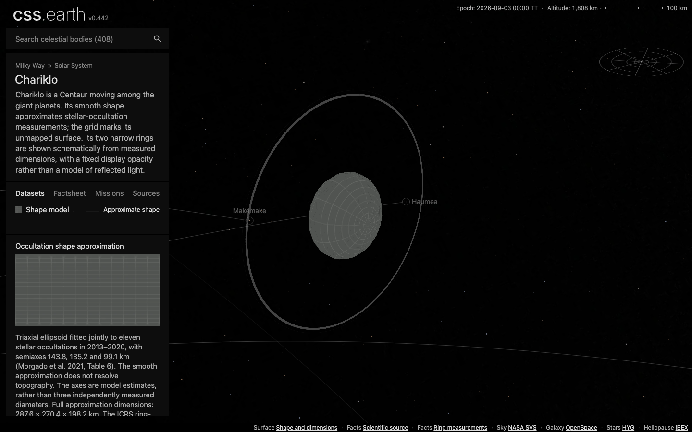
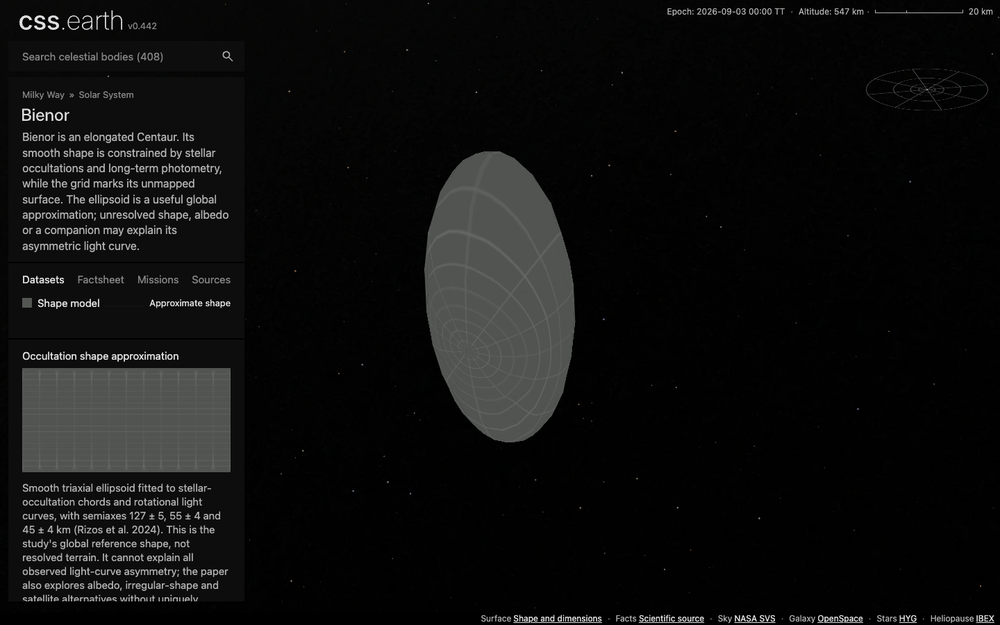

# Centaur validation

Chariklo and Bienor use published global shape constraints. These smooth ellipsoids are approximate shapes, with the standard grid marking unmapped surface detail. Chariklo's circular ring geometry uses a specific JWST occultation contact; gray display values and fixed opacity are schematic.

| Check | Evidence |
| --- | --- |
| Shape preparation | Each body: 5,040 authored faces simplified to 480 native PolyCSS `u` raster triangles. Independent literal semiaxes constrain prepared extents and ellipsoid residuals. |
| Ring preparation | Chariklo: two source-constrained annuli, 256 source quads combined into 16 retained image tiles. Aperture, gap, independent opacity and physical radii are checked. The extracted Haumea helper exactly matches the original 128-leaf geometry and image mapping. |
| Focused tests | Six tests pass: two independent body-shape checks and four annular preparation/compatibility tests. |
| Source/package closure | Chariklo verifies 17 source records; Bienor 16. Both prepared transport SHA-256 pins and asset inventories pass existing validators. Shadows and Orbit default off. |
| Orbit context | Existing JPL Horizons generator and independent vector fixtures at the repository epoch and ±30 days. Maximum epoch error is 0.000002055 km; maximum endpoint error is 820.390 km. The latter qualifies a bounded two-body approximation, not an encounter ephemeris. |
| Delivery | All 63 content-addressed image assets published, then independently downloaded through the standard setup implementation into an empty directory with one transfer at a time. Zero files reused; all 14,047,134 bytes match manifest sizes and SHA-256 hashes. |
| Static build | Main3bad integration builds 818 pages with performance diagnostics enabled. All408 body transports and their prepared preload lists match the descriptor/page pins in the built output. |
| Browser | Headless Chrome, 1440×900 CSS pixels, DPR 1 and 2: both body routes pass native triangle, normal-grid, off-default, close-view, optional-shadow and fresh-asset checks. Both names appear in the 289-asteroid category and search; route handoffs keep exactly one scene and camera. |
| Shared navigation | Both densities preserve visible pixels of all 406 previous markers. The existing marker binding and object serializer refresh 408 transports without presentation recompilation; all non-marker runtime fields are asserted unchanged. Both new records are also present in the Sun's authored world context, with matching manifest and recipe source pins. |

No complete all-body test-suite or physical-device performance claim is made. Both default views, Chariklo's optional shadows and rotated ring plane, and both close views were visually inspected. Ring dimensions remain fixed relative to the body during zoom. The default Chariklo view contains the full rings; the measured drag begins near their projected extent and rotates the same retained carrier. Ring triangles are not included in the body's surface-picking structure; no separate ring-picking capability is claimed.

## Reproduce focused checks

```sh
node --test --test-concurrency=1 tools/objects/terrestrial-layers/rings.test.mjs tests/objects/unit/chariklo/source.test.mjs tests/objects/unit/bienor/source.test.mjs
node docs/centaur-population/verify.mjs
node docs/centaur-population/fresh-install.mjs
node docs/centaur-population/browser-check.mjs
CSSEARTH_CHROME_LOG_STDIO=1 node docs/lucy-targets/drag-trace.mjs http://127.0.0.1:4278 2 output/playwright/centaur-population/chariklo-drag chariklo
```

The fresh installer needs an empty destination. Browser checks use the coordinated production server at port 4278, one headless browser at a time. Preparation runs one body at a time with a 3 GiB Node heap limit and one image-processing worker.

## Drag and visual evidence

The retained historical trace, recorded before main3bad, measured Chariklo at DPR 2 with Shadows off using the existing three-cycle, 60-step-per-leg Lucy/Saturn-derived drag. All 110,013 stage nodes retain identity, asset banks stay fixed, interaction requests are zero and browser errors are empty. The body has 480 `u` leaves; the rings add 16 image tiles. The shared stage node count has a different scope.

| Metric | Result |
| --- | --- |
| rAF interval median / p95 | 16.7 / 16.8 ms |
| DirectRenderer draw p95 | 5.114 ms |
| Pipeline sequences dropped without presentation | 0 / 655 |

This is one recorded local workload, not a physical-device or every-pose performance guarantee. [The trace report](evidence/chariklo-drag.json) binds served script/document hashes, canonical assets, screenshots, viewport, camera and raw trace hash. Raw trace bytes remain under `output/playwright/centaur-population/chariklo-drag/`.





[Chariklo rotated toward edge-on](evidence/chariklo-rotated.png) · [Chariklo optional Shadows on](evidence/chariklo-shadows.png) · [Bienor close view](evidence/bienor-close.png)

Main hides the Settings action. Optional shadows were exercised through its existing bound checkbox change event; a visible Settings-button workflow is not claimed. The prepared ring image has fixed schematic opacity; it does not calculate illumination, scattering or ring cast shadows. No source imagery or unresolved terrain is fabricated.

The current main3bad browser pass rechecked both bodies at DPR1/2, default/close views, optional Shadows and shared category/search/handoff. The trace was not repeated because body geometry and image banks are unchanged; its performance numbers describe its recorded earlier build.

After the recorded browser pass, main PR89 added two comets. The data integration retains both comet packages and composes the Centaur additions against its408-body marker atlas. Eight page/minimap tests, two focused astronomy tests and both source/package closures pass on this410-body registry. Existing captures/trace retain their stated build identities; no body assets were rebaked.
