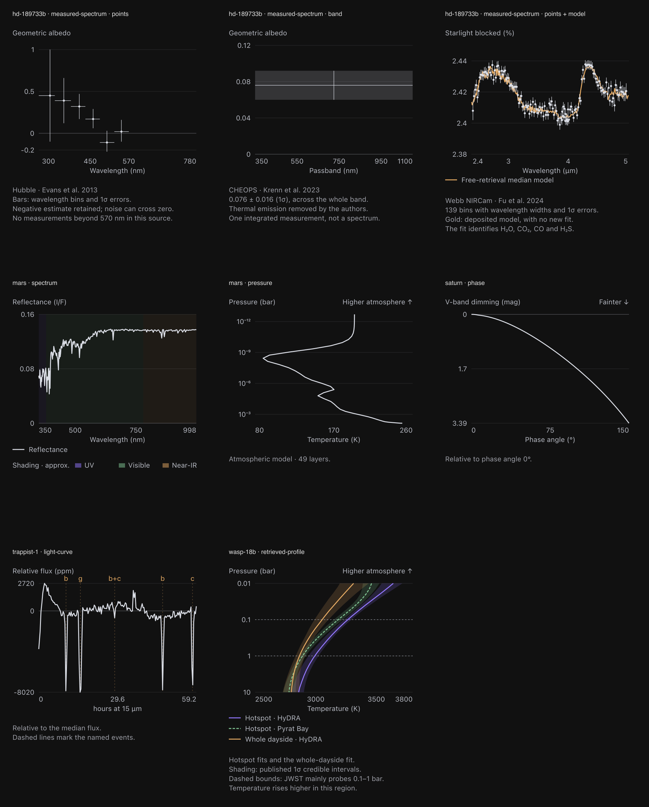
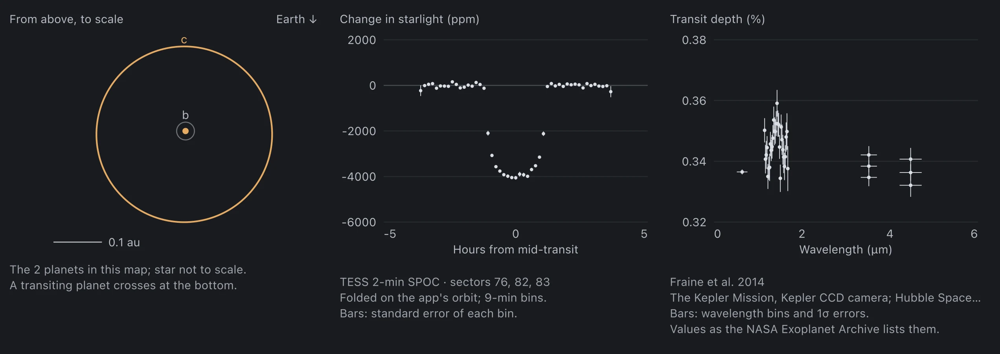
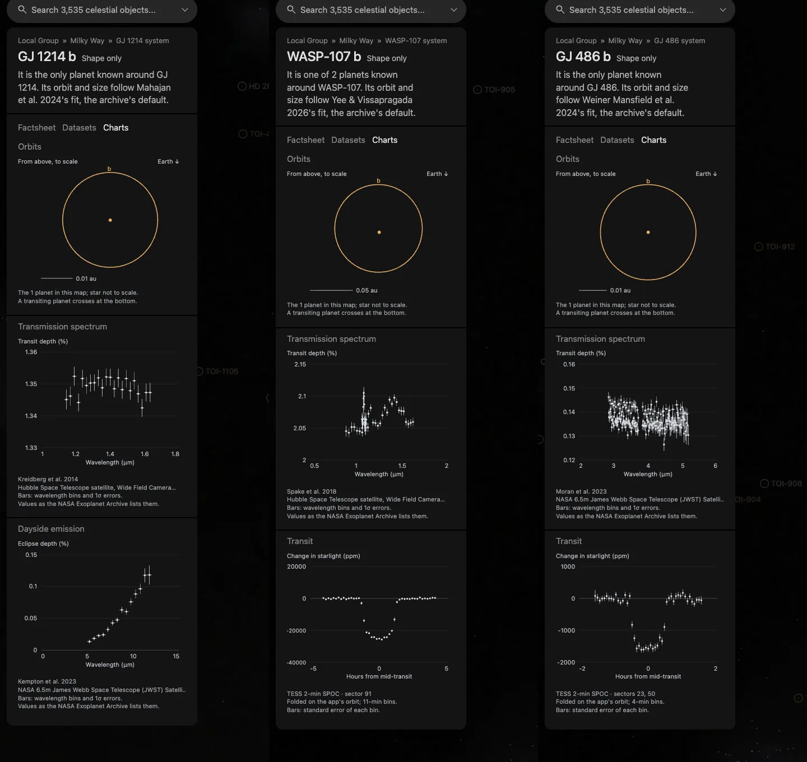

# Scientific chart recipes

Use these six prepared chart families in the shared Charts panel. Each plot is
one SVG image; sample counts do not add elements to the application's DOM.
Recipes, input tables and scientific qualifications belong to the object.
Axes, typography, grid, colors and spacing belong to the
[shared chart style](../packages/bake/src/objects/charts/chart-style.ts).



## Choose a recipe

| Kind | Use it for | Inputs and interpretation | Working recipe |
| --- | --- | --- | --- |
| `spectrum` | Modeled visible reflectance | Ordered wavelength/reflectance samples from JSON columns or numeric lines. Wavelength is converted to nm for labels; I/F stays dimensionless. Shading identifies UV, visible and near-IR regions. | [Mars](../src/objects/mars/source/content/charts.json) |
| `pressure` | One atmospheric model | PSG atmosphere layers with pressure in bar and temperature in K. Logarithmic pressure increases downward. No uncertainty is invented. | [Mars](../src/objects/mars/source/content/charts.json) |
| `phase` | Photometric phase models | Published piecewise magnitude/albedo polynomial coefficients. V-band dimming is relative to phase angle zero; fainter values run downward. Preserve the model's stated angle limits. | [Saturn](../src/objects/saturn/source/content/charts.json) |
| `light-curve` | Time-varying brightness | CSV time, flux and optional mask columns. Unmasked samples are averaged in the declared time bins and expressed in ppm relative to their median. Named events have source-backed times. | [TRAPPIST-1](../src/objects/trappist-1/source/content/charts.json) |
| `measured-spectrum` | Published points, passbands and optional model comparisons | Records or numerical columns with wavelength bins and symmetric/asymmetric errors. `points` preserves overlapping observations and negative estimates. `band` shades the whole passband between published bounds, without implying a sampled spectrum. An optional deposited model retains gaps. | [HD 189733b: Hubble, CHEOPS and Webb](../src/objects/hd-189733b/source/content/charts.json) |
| `retrieved-profile` | Atmospheric retrieval comparisons | One to three native pressure/median/lower/upper tables. Published absolute credible bounds form the bands; the observed pressure range is marked separately. These are model inferences. | [WASP-18b](../src/objects/wasp-18b/source/content/charts.json), [field guide](retrieved-profile-charts.md) |
| `system-orbits` | A star's planets from above | The hosted-orbit records of every planet of `system` (@cssearth/astronomy): a/R* times the star's radius, eccentricity and argument of periastron, sampled in the orbital plane and turned so the direction to Earth points down, where a transiting planet crosses. `highlight` names the planet drawn brighter. The star is a marker, not to scale; inclination is not shown. | Every generated exoplanet (`node packages/telescope-cli/src/new-object/new-object-cli.mts --charts`), e.g. [HD 3167 c](../src/objects/hd-3167c/source/content/charts.json) |
| `folded-transit` | A planet's transit as a telescope recorded it | The host's TESS SPOC 2-minute light-curve files, or a Kepler star's long-cadence (30-minute) quarters (`sources`, pinned in the manifest): good-quality PDCSAP flux, each transit divided by a straight line fitted to the light 0.6 to 1.5 transit durations either side (`durationHours`, the archive's) and folded onto the planet's hosted orbit (`foldTransits`, objects/raster), then averaged in `binMinutes` bins with each bin's standard error, in ppm. The generator draws it only when the dip, the middle 60% of the transit below the baseline, is at least 5 times its standard error; otherwise its report says the mission does not resolve the transit. Kepler is asked only when TESS shows no such dip. | Generated exoplanets with 2-minute TESS data (`node packages/telescope-cli/src/new-object/new-object-cli.mts --charts`), checked on HD 189733 b's three sectors; Kepler-11 and Kepler-90, whose 14 planets TESS does not resolve, from Kepler's quarters |

## Shared presentation

All charts show numeric ticks and the quantity and units on both axes. Zero is
emphasized when it lies in the plot. Pressure and magnitude plots explicitly
label their vertical direction. Labels describe the plotted quantity rather
than relying on the panel heading.

The palette is violet `#9478ff`, green `#83c997` and amber `#e6ab64`, with subdued
gray labels and grid lines. **Standalone curves and measured points use neutral
off-white `#dadde5`**, including reflectance, atmospheric profiles, phase curves
and light curves. The comparison model and event markers use amber. Colored
wavelength regions have their own shading key, separate from the curve key.
Comparisons of retrieved profiles use the series palette, with a dashed second
curve and a legend; a single retrieved profile also uses off-white.
Error bars, legend labels and line styles carry meaning in addition to color.

Credible bands and broadband error regions have 18% opacity. Wavelength regions
have 7% opacity. **Shading must identify something:** a published interval or
a labeled wavelength region. It never creates uncertainty for a source that
does not supply it. Keep these different meanings explicit in descriptions.
Wavelength shading uses illustrative 380 and 780 nm boundaries and is labeled
approximate. [CIE's visible-radiation definition](https://cie.co.at/eilvterm/17-21-003)
explains why the limits depend on flux and observer. This catalog defines our
presentation conventions; it does not claim compliance with a journal's figure
specification or independent qualification of every source model.

The SVG width is 306 units. Height grows for the legend and notes; full content
preparation derives image dimensions from the generated SVG. The content
recipe also records dimensions for consumers of the authored document.
Keep its alt text, source reference and chart title meaningful.

Generated exoplanets get their charts from `new-object` (`packages/telescope-cli/src/new-object/planets/planet-charts.mts`): HD 3167 c's orbits, HAT-P-11 b's transit folded from three TESS sectors (landing on 0 hours once its orbit took the ephemeris that predicts today) and its transmission spectrum from Fraine et al. (2014), as the NASA Exoplanet Archive lists it.



The generator keeps an archive planet only when one of these charts shows a measurement: a transit in TESS's light curves or, for a Kepler star, in Kepler's; an archive spectrum; or its dayside color. Batch 1 (every transiting host within 200 pc) kept 729 of 1,045:



## Add or reuse one

1. Copy the matching entry into the object's `source/content/charts.json`,
   under `schema: "cssearth-chart-assets@1"`. Set its own `publicBase`, `id`,
   `title`, `description`, `output` and `metadata`.
2. Bind the input paths in the object's manifest and source records. Keep
   provider/version, units, uncertainty definitions and acquisition routes.
   Use published tables, not digitized decorative approximations.
3. Set the family's fields from the working recipe. Expected row counts,
   column mappings, scales and plot limits are explicit. Measured-spectrum
   `source.columns` uses `x`, `xError`, `y`, and `error`; record inputs support
   separate `minus` and `plus`. Its `x`/`y` objects specify labels, limits and
   ticks. See the [retrieved-profile guide](retrieved-profile-charts.md) for
   absolute quantile columns and pressure conversion.
4. Register the chart in the object content and normal authored preparation.
   Independently check representative values, units, orientation and error
   bounds against the source. Inspect the actual panel at desktop and mobile
   sizes. Preserve the data's scientific limits in the body README.
5. Publish changed prepared assets and commit only their inventories, following
   the [delivery guide](../.github/CONTRIBUTING.md#publishing-prepared-assets-maintainers).

## Preview and refresh existing charts

```sh
# Render all registered charts under output/chart-recipes/.
node site/build/prepare/authored/prepare-charts.mts

# Refresh an existing object's chart images, content sizes and inventory.
node site/build/prepare/authored/prepare-charts.mts --object=mars --write

# Omit --object to refresh every existing chart package.
node site/build/prepare/authored/prepare-charts.mts --write

# Regenerate this illustration from the same sources and renderers.
node site/build/prepare/authored/prepare-chart-catalog.mts --write
```

The partial refresh preserves all other inventory entries, textures, galleries
and content fields. It restores only missing content and refuses local content
that differs from its inventory. New chart URLs require normal object
preparation. It does not claim a surface rebake. Publish the refreshed files to
R2 before committing inventories. The catalogue generator also emits contact
sheets of every chart under `output/chart-recipes/` for visual inspection.

## Current catalog

| Objects | Families |
| --- | --- |
| [Mercury](../src/objects/mercury/source/content/charts.json) | Reflectance, phase |
| [Venus](../src/objects/venus/source/content/charts.json), [Earth](../src/objects/earth/source/content/charts.json), [Mars](../src/objects/mars/source/content/charts.json), [Jupiter](../src/objects/jupiter/source/content/charts.json), [Saturn](../src/objects/saturn/source/content/charts.json), [Uranus](../src/objects/uranus/source/content/charts.json), [Neptune](../src/objects/neptune/source/content/charts.json) | Reflectance, atmospheric profile, phase |
| [HD 189733b](../src/objects/hd-189733b/source/content/charts.json) | Three measured-spectrum variants |
| [TRAPPIST-1](../src/objects/trappist-1/source/content/charts.json) | Light curve |
| [WASP-18b](../src/objects/wasp-18b/source/content/charts.json) | Retrieved profiles |

This redesign covers 28 charts in 11 packages. The illustration and contact
sheets are rendered from those packages' recipes. Focused checks exercise
coordinate direction, units, absolute credible bounds, asymmetric errors,
source row counts, preserved model gaps and partial inventory publication.
The source numerical readers and models for the 27 existing charts are
unchanged; their earlier scientific evidence still applies to those values,
not to the new appearance. WASP-18b's new profiles have their own independent
[Figure 4 checks](../src/objects/wasp-18b/README.md#evidence).

For this redesign, all 28 rendered charts were inspected in contact sheets.
Mars, HD 189733b, TRAPPIST-1 and WASP-18b cover every family in the actual shared
panel: Chromium at 1440 × 900 / DPR 1 and 390 × 844 / DPR 2 showed no console
errors or horizontal chart overflow, with one mounted scene and no inline SVG
sample elements. The [mobile Mars panel](images/chart-panel-mobile.png) shows
the same off-white curve convention in reflectance and atmospheric profiles.
WASP-18b's [body evidence](../src/objects/wasp-18b/README.md#evidence) also checks
that switching wavelength maps retains its chart image.
