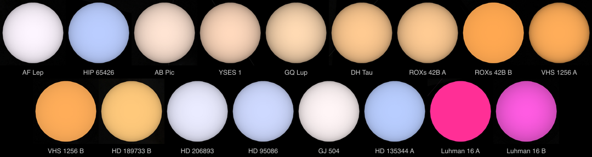
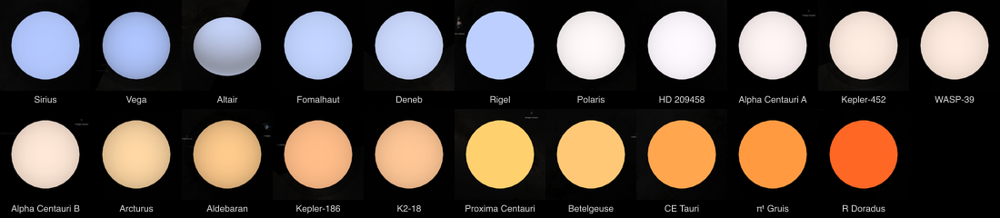

# Source-backed surface color

Source calibration, image registration and display color answer different
questions. A registered, calibrated infrared image does not establish the color
of a surface to a human observer. These rules apply to every body and preparation
lane; the runtime renderer only receives prepared display assets.

## Source interpretation comes first

| Source | Preparation | What the result can claim |
| --- | --- | --- |
| Publisher-prepared RGB image or RGB mosaic | Preserve the published channel order and display processing; honor an embedded color profile where the decoder supports it. Do not apply a second transfer intended for raw measurements. | The publisher's documented natural, approximate, enhanced or false-color interpretation. Three channels alone establish none of these. |
| Calibrated spectral bands | Validate the native band identities and units, register each observation, retain floating values through sampling and compositing, and apply an explicit scientific display at the end. | A band composite. Calibration or an sRGB output does not qualify it as natural color. |
| Archive-derived, sharpened spectral mosaic | Preserve the archive's band identities and processing. Treat the values according to the archive, without relabeling them as untouched radiance or reflectance. | The published derived/enhanced interpretation, with our additional display transfer identified. |
| One measured band | Use its documented monochrome display and coverage. | Monochrome observations, not recovered surface color. |
| Calibrated sky survey bands (nebula lab) | Calibrate each band to MJy/sr, subtract one measured background, divide by that band's own measured range, then apply one common asinh display. See [sky survey bands](#sky-survey-bands). | A band-normalized false-color view that shows where each band is bright. Hue does not show physical band ratios. |
| Numeric scientific field or categories | Use the declared palette, range, units and legend. | A visualization of that field, not photographed color. |
| Shape-only model | Use the existing model presentation. | Measured or modeled shape, without a photographic color claim. |

Do not infer a missing visible band from infrared/ultraviolet, invent a camera
color matrix, white-balance to an assumed neutral patch, or adjust saturation
until a body looks plausible. A natural-color reconstruction requires a cited
method applicable to the actual instrument and inputs, its supported calibration
and registration, and evidence appropriate to that claim. If that evidence is
missing, retain an explicitly scientific interpretation or defer the natural-color
view. A description or a successful geometric fit cannot supply missing evidence.

NASA explains the distinction between [measured visible RGB and false-color
band combinations](https://science.nasa.gov/earth/earth-observatory/how-to-interpret-a-false-color-satellite-image/).
Even the Cassini visible-band approximation in [Ordóñez-Etxeberria et al. (2019),
section 5](https://arxiv.org/abs/1905.02978) explicitly acknowledges instrument/eye
response differences and a synthetic red band. That Jupiter-specific method is
not a universal calibration for other bodies.

## Keep measured values until the display boundary

The shared [color transfer](../tools/objects/color-transfer.mts) builds one
band-composite display per product. The route names the actual ordered bands and
their quantity from what it reads, checked against native labels where the product
has them, and the recipe declares only the common `displayRange`. Each route
refuses any other key, so a recipe has no place for natural-color claims,
independent channel gains or automatic white balance. Photometrically matched
color is compared with its monochrome base in display-linear light, so that method
fixes its range at 0 to 1. Already encoded image bytes cannot be sent through the
floating-band encoder.

The common range assigns normalized measurements to **linear display channels**.
This assignment is a scientific visualization, not an instrument-to-eye transform.
Interpolation, photometric corrections and overlap blending precede display
encoding. Missing-band footprints remain missing. Only the final output clips
values and quantizes them to eight bits.

The final transfer follows [IEC sRGB, as published by the ICC](https://registry.color.org/rgb-registry/files/sRGB.pdf):
for a bounded linear channel `L`, the code value is `12.92 L` below or at
`0.0031308`, and `1.055 L^(1/2.4) - 0.055` above it. An 18% linear channel maps
to byte 118, not 46. Writing linear measurements directly as display bytes
exaggerates channel differences when the display decodes those bytes.

This correct encoding does **not** turn IR/UV data into natural color. It makes
the chosen scientific display consistent with its declared linear channel values.
The display range is an explicit visualization choice, not a measured albedo
maximum or a new calibration constant.

## Current routes and scope of the repair

The preparation audit distinguishes producers, not body names. The retained
[all-object registration review](provenance/surface-registration-review.md)
provides the full 473-package disposition and its earlier reviewed revision;
this color repair does not promote its unresolved registration cases:

- `controlled-shape-color`: Pan, Atlas, Daphnis, Prometheus, Pandora, Janus,
  Epimetheus, Hyperion and Proteus, through the
  [shared surface-observation pipeline](../tools/objects/surface-observations/README.md).
  Each band set names its red, green and blue photographs, and native labels
  must agree with the selected filters and calibrated reflectance units. A point
  is colored only where all three bands qualify, and it keeps the one band set
  the lens selects. Level matching scales the three bands by one gain, so their
  measured ratios stay. The bands remain floating through the shared footprint,
  photometry and surface transfer; the same encoder finishes them.
- `terrestrial-observed-color`: Europa's Galileo I/F bands and the Voyager
  ISS bands of Triton and the five classical Uranian moons. Photometry and common brightness matching run before the final
  encoding. The already prepared monochrome base is decoded only as a display
  reference for that matching; its brightness does not establish natural color
  or new radiometric calibration. Two profile policies are recipe choices, not
  defaults: `withheld: "next-observation"` lets the next densest observation own
  a texel the densest one views or lights too steeply, for observations from
  one encounter (Europa's orbits keep the default, `monochrome`, so no other
  date's color fills a withheld footprint); `bandLevels` scales each
  observation's bands onto one named reference observation through the median
  ratios where their corrected footprints overlap, solved by weighted least
  squares over every overlapping pair on a coarse grid, and records the pairs
  and gains in the photometry report; the brightness match to the base is
  then one pooled gain for the lens, clamped so 99.9 % of texels encode
  without clipping, instead of one gain per observation. The reference is chosen from evidence
  recorded in the body README, never by preference for a look. `bandRatios` ties the
  composed footprint's whole-disc band ratios to a published whole-disc colour
  named in the recipe (the Uranian moons use Bell and McCord 1991): each named
  band takes one gain so its cosine-weighted mean against the reference band's
  mean equals the published ratio, and the report carries the measured ratios,
  the published ones and the gains. It answers a documented filter-calibration
  defect of the archive product, never a preference for a look; spatial colour
  differences stay the observation's own.
- `pds4-float-rgb`: Charon's archive-produced, pan-sharpened MVIC composite.
  Its values are derived band values, not untouched I/F. The reader validates
  the archived wavelengths and applies its explicit common display range once.
- `nh-mvic-camera`: Arrokoth's registered, PSF-matched MVIC cube, through the
  [shared surface-observation pipeline](../tools/objects/surface-observations/README.md).
  Its native PDS label binds BLUE/RED/NIR/CH4 order, wavelengths and data-number
  units. The selected NIR/red/blue values remain floating through the shared
  footprint, photometry and surface transfer; the same encoder finishes the
  atlas samples and map preview, and its policy appears in the standard report.
- Published RGB/byte-band mosaics, static images, geographic imagery, giant-planet
  observations, scientific palettes and shape presentations do not enter this
  floating-band encoder. Their established source display interpretation is
  preserved; this change does not requalify them as natural color.

The audit located twelve active surfaces in four affected routes. The new shared
surface-observation pipeline from PR #173 is included in this repair. It also
searched 2,015 preparation JSON files smaller than 1.5 MB for authored color
matrices, white balance, saturation and tonal overrides; the only matching
active color-space fields were Io's existing sRGB decoder settings. That search
is a configuration inventory, not independent scientific validation of every
published image or a claim that every body has measured natural color.

## Sky survey bands

The [sky band composer](../tools/objects/observation/sky-band-composite.mts) turns
calibrated infrared survey bands into the nebula lab's working images. Its route
table owns the calibration: the WISE Explanatory Supplement DN-to-Jy factors for
1.375 arcsec atlas pixels, and the IRAC Handbook surface-brightness corrections
for the CDS IRAC maps. A recipe names bands, a grid, one background percentile,
one peak percentile and one display. It cannot hold a band gain.

Surface bodies keep one common range, so that measured band ratios survive.
Sky bands do not. At M8, the median 8 µm brightness above background is about
eight times the 3.6 and 4.5 µm values. With one common range, the image is red
everywhere and shows no structure in the shorter bands. Each sky band is
therefore divided by its own range: from its background percentile to its peak
percentile. This is the usual practice for survey false color. It is still a
visualization, and the lens description must say that hue shows each band's
relative brightness, not physical band ratios.

Dividing by the band's own range cancels its calibration factor, so the MJy/sr
conversion does not change the image. It gives the recorded background and peak
physical units, and lets a later common-range display compare bands. What the
image shows comes from the band selection and the declared normalization and
stretch, not from calibration.

The shared [Lupton et al. (2004)](https://doi.org/10.1086/382245) asinh display then
maps the mean of the normalized bands and scales every band by the same factor.
Pixels brighter than the display are scaled down as a whole, which keeps their hue.
`tools/objects/color-transfer.oracle.test.mts` matches every byte of Astropy's
`make_lupton_rgb` for color and one-band cases.

The WISE HiPS maps carry a separate level for each atlas tile, which shows as
rectangles once faint emission is stretched. WISE bands are therefore built from
the AllWISE atlas tiles, with one level fitted for each tile from its overlaps
([wise-atlas-mosaic.mts](../tools/objects/observation/wise-atlas-mosaic.mts)).

The compositor also selects WISE atlas tiles by their projected footprint polygon, not its bounding box, and leaves out a grid-edge tile whose overlaps are too small to fix its level only when the joined tiles already cover every pixel it observed; such a tile is recorded in the evidence.

Scanned photographic plates saturate, so the sky band route measures that from the plate itself: a flat-topped
core a point spread function cannot produce, grown to where the ring median reaches the plate's own background
([plate-saturation.mts](../tools/objects/observation/plate-saturation.mts)). Those pixels are neither light nor
zero. A recipe that declares `coverage: "alpha"` composes an RGBA raster whose alpha is 0 wherever no band
observed a pixel, and the nebula lab carries that channel through rectification into the coverage its material
and fits read. Plate-to-plate background steps are a separate defect and are not corrected: the plate footprints
are not in the pinned inputs, and a segmentation of the plate's own background map cannot separate a seam from
the extended light of the object on it.

Two routes extend this. Two bands display as red and blue, with their mean as green, following the [CDS DSS2 colour survey](https://alasky.cds.unistra.fr/MocServer/query?ID=CDS%2FP%2FDSS2%2Fcolor&get=record&fmt=json). Bands without a documented flux calibration, the DSS2 photographic plates and the ESASky Herschel HiPS, keep `toMJyPerSr: null` and record their levels in relative source units. Dividing by each band's range means the image looks the same either way. The missing calibration only limits what the recorded levels can claim.

JWST bands come either from MAST's level-3 mosaics or from the pipeline's level-3 stage re-run onto the recipe grid; both are
already MJy/sr, so the route applies no factor. [JWST imaging](jwst-imaging.md) describes both routes, the reproduction check
against MAST and what they cost. A recipe may set `pointSources: "mask"` to report stars found on each band as no coverage
([point-sources.mts](../tools/objects/observation/point-sources.mts)), which a lens that places the image in depth needs.

## Star photospheres

A star whose surface is not imaged still has a measured colour: its spectrum. The `stellar-photometric-color` kind
([stellar-photometric-color.mts](../tools/objects/observation/stellar/stellar-photometric-color.mts)) reads one archived spectrum
in its own layout, averages it into 1 nm bins from 380 to 780 nm, weights it by the CIE 1931 2° observer and converts it to
sRGB with the D65 white, brightest channel full. It reads HST CALSPEC and the STIS libraries, Gaia DR3 XP, X-Shooter, UVES,
LAMOST and the Pulkovo, Kiehling, Burnashev and Kharitonov spectrophotometric catalogues. Plain column tables can carry a one-sigma error column: a bin below zero within three errors counts as no light, and the colour range is the spectrum moved one error down and up. A record may set `gamut: 'desaturate'` when a measured colour falls outside sRGB; the least white needed to bring it inside is mixed in and reported. A stretch with no data inside
380-780 nm must be declared as a gap, with its reason. Checked against the Sun, the route turns CALSPEC's solar spectrum
into #fff2ee, the colour the Sun's swatch takes from a different spectrum (ASTM E490) with Colour Science.

The star's catalogue swatch, minimap dot and navigation marker take the same colour
([stellar-spectra/author.mts](../tools/objects/source-authoring/stellar-spectra/author.mts)). A star with no usable
spectrum keeps the star field's temperature fit at a cited effective temperature
([star-catalogue-color.mts](../tools/objects/star-catalogue-color.mts)).

**Cross-checks.** A colour record may name a second spectrum from a different instrument. Preparation records its colour
beside the lens colour, and [object-package-consistency.test.mts](../tools/contract/object-package-consistency.test.mts) fails when
the two differ by more than 12 levels in any channel unless the record states the disagreement.

**Limb darkening**, in this order of preference:

1. Coefficients measured on the star, from transits of its planet or from interferometry, in or near the visible.
2. The Claret & Bloemen (2011) V-band model grid (ATLAS, 3,500 K and hotter) at the star's cited temperature and gravity,
   labelled as a model. Cooler stars and brown dwarfs use the Claret (2017) PHOENIX grid instead (down to 2,300 K). Both
   are read bilinearly between the four surrounding grid nodes.
3. None, when the star lies outside both grids or falls in a hole in them. The value is not extrapolated, and the lens
   says why it stays flat.

The plate is a round overlay fitted to the sphere's outline at its drawn size, geometry scale included.

**Gravity darkening.** A star that spins fast is flattened and hotter at its poles. Where a paper publishes a Roche-von Zeipel
fit (ω, β, the polar temperature, the radii and the pole's orientation), [gravity-darkening.mts](../tools/objects/observation/gravity-darkening.mts)
rebuilds the surface from those numbers and writes a temperature for each latitude row. Its tests require the paper's
equatorial radius and temperature to come back within their errors. The measured flattening is drawn as an ellipsoid.

## Evidence must match the claim

Check native band identities, units and registration separately from display
encoding. Numeric reference cases prove the transfer, late clipping and the
absence of double encoding. A rendered comparison can show the display change;
it cannot validate natural color without a suitable source reference.

The raster lane retains decoder reports per prepared density in its surface
metadata. Camera composites keep the policy in their source-grid report; the
shared surface-observation lane includes it in its standard display report.

Keep the input/output hashes, color policy and inspected product captures with
the body evidence. Reuse unchanged camera holdouts only with an explanation of
why the display-only work leaves their geometry and source samples applicable.
Follow the [visual-comparison contract](provenance/CONTRACT.md#say-what-the-checks-prove);
do not Pixelmatch different spectral combinations to claim fidelity.

For the 2026-09-13 refresh, each body's capture records the exact recipe, runtime,
transfer and delivered-image hashes, compared with retained geometry at
`8cc1a2fae`. Source registrations and native observations are unchanged. Captures
made before the final capture-helper edits remain applicable: those edits add an
optional viewpoint, an installed-Chrome selector and larger diagnostic response
buffers; they do not change prepared data or rendering. Europa's capture faces
its measured color footprint rather than the unchanged initial viewpoint.

A photographic refresh resolves declared monochrome dependencies for decoding
and minimaps while packing only the selected surface. Caption updates re-pin the
checked-in runtime's transport without recompiling texture geometry or seam
treatment.
