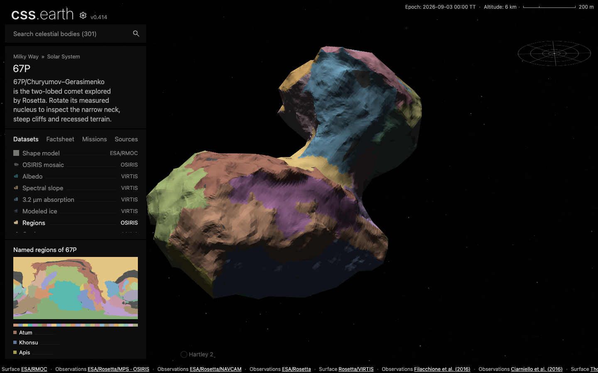
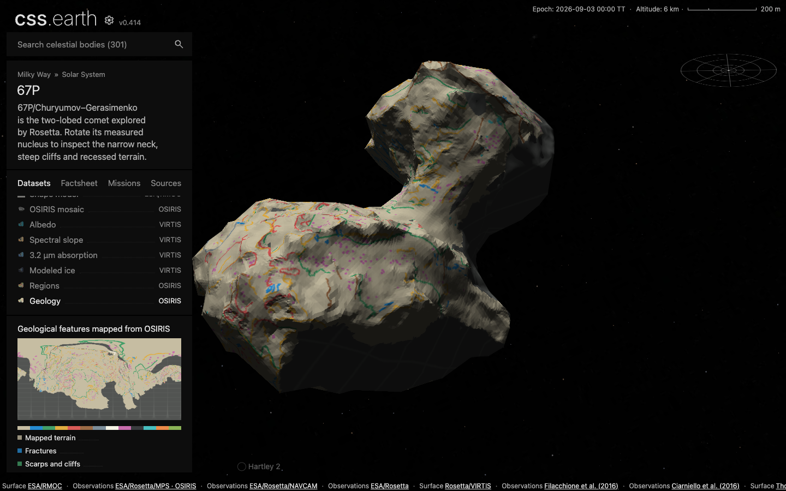

# 67P regions and geological features

Two datasets use the existing 1,000-triangle RMOC MTP019 scene and the shared
selector, camera, lighting, facts and legend. No additional scene, feature picker
or region navigation is introduced.

## Sources selected

| Product | Use | Disposition |
| --- | --- | --- |
| Thomas et al. (2018), [SHAP7 region cells](https://doi.org/10.17632/2845znt54k.1), version 1 | 26 region IDs on 124,938 source triangles | Regions; also the mapped-region boundary of Geology. Original VTK bytes, CC BY 4.0. |
| ESA (2021), [ESA-AURORA_67P-GEOMAP_OSIRIS_V1.0](https://doi.org/10.5270/esa-kokoti7), `Complete_Paths` | 843 geological polylines | Geology. Original SBMT latitude/longitude/radius vertices converted to Cartesian kilometres, then metres. |
| Same archive, `Complete_Ellipses` | 2,265 geological feature locations | Geology. Original Cartesian centres retained. Dots show locations, not ellipse footprints or measured diameters. |
| Same archive, `Regions_50k_facets` and `region_order.mat` | Independent region names / boundary reference | Validation only. The boundary export omits Ash; the MATLAB order calls index 11 `repeat`. The VTK cell population and Thomas Table 1 area identify that region as Ash. |
| Same archive, QuACK global and regional PNG/SVG maps | Published cartographic reference | Not draped onto the nucleus: generalized QuACK longitude/latitude is not ordinary spherical longitude/latitude. |
| Same archive, proposed Anubis–Atum / Aker–Babi boundary changes | Alternative 2021 boundaries | Not substituted into the 2018 VTK region release. These datasets retain that release's definitions. |
| Thomas et al., SHAP7 subregions | Finer regional divisions | Outside these two views. No undocumented conversion of regional descriptions into material classes. |

The feature study is [Leon-Dasi et al. (2021), A&A 652,
A52](https://doi.org/10.1051/0004-6361/202140497). It maps 17 regions, mostly in the
north, using OSIRIS images on SHAP4S. The ESA Product User Guide §5 explicitly
notes that SHAP4S and the SHAP7 region surface are similar but not identical.

The guide §2.1 requests the attribution “European Space Agency, 2021,
ESA-AURORA_67P-GEOMAP_OSIRIS_V1.0”, its DOI and the paper citation. These are
retained. No additional Creative Commons license is asserted for that archive.
The ESA landing page's citation text incorrectly names an unrelated Mars dataset;
the product-specific guide supplies the citation used here. The separate Thomas
VTK release explicitly uses CC BY 4.0.

## Interpretation and preparation

Regions uses discrete, authored colors for original VTK region IDs. Colors do not
encode mineralogy, age, elevation or a numeric ordering. The VTK model determines
category coverage; the displayed geometry remains the accepted RMOC mesh.

Geology uses the study's feature classes, identified by its original SBMT color
codes. Minor variants of the same archival symbol color are grouped explicitly
in the recipe. It includes fractures, scarps/cliffs, terraces, niches, ridges,
depression rims, pits, boulders, outcrops, bright patches, crater candidates and
circular mounds. The neutral background indicates a region included in the study,
not a claim that every feature was detected. Original names, duplicates and
question marks are retained in preparation provenance. Source names are not used
to silently repair or reclassify the original symbol codes.

The 17 mapped regions are Aker, Anubis, Anuket, Apis, Ash, Aten, Atum, Babi,
Hapi, Hathor, Hatmehit, Imhotep, Khepry, Ma'at, Nut, Serqet and Seth. Other regions
use the missing-data grid. Symbols outside that released regional coverage are
withheld. Points are 24 m cartographic dots and lines are 16 m cartographic strokes;
these are readable symbols rather than measurements of feature size or width.

For each display texel, preparation finds the closest point on the full RMOC
source within 50 m, then the closest SHAP7 point within another 50 m. Region IDs
come from that original SHAP7 triangle, with no interpolation of categorical
values. Both distances are acceptance bounds, not claims of source accuracy.

Feature paths are split into at most 10 m segments and independently projected
onto SHAP7 within 50 m. Failed segments and large projection jumps are withheld.
Locations use the same bounded projection. Symbols are rasterized directly in 3D,
so surface sheets sharing longitude/latitude do not receive one another's marks.
Overlapping symbols select the smallest normalized stroke distance, then original
feature order for exact ties. A symbol's lateral width is independent of its
projection-distance allowance.

Flat companion maps withhold ambiguous radial rays. The native triangle atlas
samples the 3D source surface directly, including concavities that the flat
preview cannot represent. Atlas bleed is clamped to the display triangle.
Flood lighting retains exact category colors; Shadows adds the existing modeled
lighting. Thumbnails and the per-view overview use the same sampler.

The source geometry, XML/TSV files and source-index maps are preparation inputs
and evidence. The browser consumes prepared rasters and the unchanged native
PolyCSS triangles. It performs no VTK/SBMT decoding, feature projection or drawing.

## Qualification

Initial registration survey: 9,472 regularly spaced full RMOC face centroids gave
median SHAP7 separation 5.34 m, p95 21.66 m, p99 54.83 m and maximum 134.80 m.
110 samples exceeded 50 m and are not candidates for forced filling. This survey
is separate from the 50 m final per-texel acceptance rule.

All 14,036 archival path vertices: median 8.20 m, p95 18.16 m, maximum 83.44 m;
24 exceed 50 m. All 2,265 location centres: median 8.82 m, p95 16.70 m, maximum
33.85 m. These figures compare model registration, not instrument accuracy.

The displayed terrain is byte-identical to the accepted 1,000-triangle mesh.
All 50 previous runtime assets retain their hashes. The six additions total
1,914,090 bytes; the complete 56-file inventory is 21,526,278 bytes.

Of 1,782,240 triangle-interior atlas texels, Regions covers 98.60% and Geology
71.84%. Those fractions describe the display atlas, not physical surface area.
Rejected model correspondence and unsupported study coverage retain the grid.
The per-texel original-cell / feature indices are hash-bound preparation evidence;
they are absent from the runtime object and network requests.

Qualification passes: 26 focused preparation tests, 354 universe preparation
tests, 14 body/legend tests, 42 shared package/router/legend tests, all three 67P
source/runtime closure checks, preparation typecheck, the 302-page production
build, and all 13 shared browser-conformance cases. The six new upstream inputs
were also restored into an empty directory and byte-verified. The unchanged
geometry and coverage measurements are in [qualification.json](evidence/67p-geology/qualification.json);
interaction results are in [conformance.json](evidence/67p-geology/conformance.json).

The live viewer was inspected at DPR 1 and 2 with both new datasets in Flood and
Shadows. Dataset and lighting changes retain the camera and all 1,000 nodes;
all 26/13 legend entries remain accessible in the shared sidebar. Production
and fresh-delivery evidence is recorded in [browser.json](evidence/67p-geology/browser.json).

R2 publication and a separate empty-directory installation verified all 56 files
(21.53 MB, zero reused). The production browser at DPR 1 and 2, plus a fresh-asset
proxy run, loaded the exact compiled object hash and the four new lighting atlas
hashes. No original VTK/SBMT files or source-index maps were requested.

