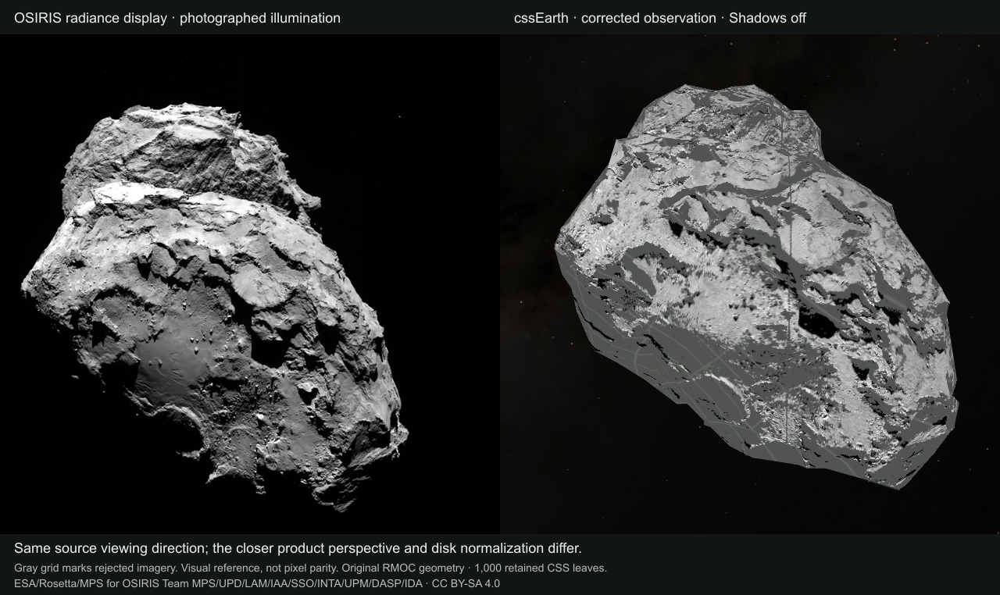

# 67P OSIRIS application lens

8 September 2026. The 67P package adds **OSIRIS observation** through the existing
object adapter and shared lens controls. Shape model remains the default.
The retained geometry, source vertex positions and 1,000 native PolyCSS `u`
leaves are unchanged. Runtime selects prepared image banks; camera calibration,
source correspondence, quality filtering and illumination correction happen
only in preparation.

## Pinned observation and quality

The single orange-filter exposure starts at **2014-08-05T19:44:22.918 UTC**.
It is grayscale, not true color. Both original PDS files are acquired from the
public [OSIRIS archive](https://pdssbn.astro.umd.edu/holdings/ro-c-osinac-5-prl-67p-m06-geo-v1.0/)
and verified byte-for-byte before preparation:

| Product | Bytes | SHA-256 |
| --- | ---: | --- |
| `n20140805t194314611id50f22.img` GEO | 151,028,736 | `de0884a0d83f972bb7f7025dfa784d2b153763dda035b43afa918c8023fe511b` |
| `n20140805t194314611id40f22.img` L4 quality companion | 37,776,896 | `e7d60cefabbc04c08c90caf0d281a3c65746f8f08c016e73e93287b0087102b8` |

All 4,194,304 L4 radiance pixels must exactly equal the GEO image before its
quality map is accepted. Identity, time, filter, instrument, pipeline version
and image-wide quality are also checked. The calibration pipeline's bit table
defines bit 0 as positive VALID. Only flags 1 and 9 (VALID plus LOSSY) are
accepted. LOSSY is explicitly allowed for this visual display; bad, saturated,
readout, nonlinear, shutter, reserved and missing-VALID samples are rejected.
Zero and negative finite radiance are retained when other conditions permit.
The source-owned interpretation, primary manual URLs and their hashes are in
[osiris-georeference.json](../../src/planets/comet-67p/source/reference/osiris-georeference.json).

## Surface transfer and lighting

The corrected SHAP7 GEO coordinates determine a projective camera from 10,011
pixel/XYZ pairs. The disjoint 1,781,834-pixel holdout has maximum residual
0.002383 pixel. This is internal geometric consistency, not independent
photographic parity. The unchanged RMOC mesh is a different source model.

Every accepted atlas texel uses a closest full-source RMOC triangle point
within 50 m, all four bilinear GEO contributors within 20 m, and a full-mesh
observer ray with 0.5 m visibility tolerance. These are display acceptance
bounds, not source accuracy estimates. Atlas bleed is clamped to its retained
triangle. There is no backside filling or nearest-vertex painting.

Lommel–Seeliger disk normalization divides each source pixel's linear radiance
by `D = 2 cos(i) / (cos(i) + cos(e))` **before interpolation**. Incidence and
emission are bounded at 80 degrees and gain at 3. The reference is `D(0,0)=1`.
A linear 1–99 percentile grayscale display stretch follows. This is the disk
normalization used in the OSIRIS photometric literature
([Fornasier et al. 2015](https://doi.org/10.1051/0004-6361/201525901)); this display
does not recover albedo, phase behavior, roughness or photographed cast shadows.

Uniform flood preserves the corrected photograph's detail on every side of the
mesh. Shadows applies the common fixed-epoch Sun recipe. These are two static
banks for the existing Shadows control. The visible lens description states
that residual photographed shadows remain and modeled lighting uses the shared
3 September 2026 epoch. Gray grid means missing or rejected **imagery**, not
an unmeasured shape.

The accepted source set contains 1,325,727 geometry-backed pixels, including
1,246,823 flagged LOSSY. Quality rejects 5,285 pixels and photometry rejects
460,833. The triangle-interior transfer accepts 280,572 of 1,782,240 atlas
samples; these are texel counts, not surface-area percentages. Maximum accepted
closest-source distance is 49.991169 m, contributor separation 19.999976 m and
photometric gain 2.916629. Prepared `surfaces.json` records every rejection count.

## Delivery and verification

The added runtime payload consists of two 1024 × 4032 WebP banks and one
96 × 48 thumbnail, totaling 876,388 bytes:

| Asset | SHA-256 |
| --- | --- |
| `comet-67p-osiris-surface@2x.webp` | `79c63db7373b3d73748ec8d6151b483a0e11da9b2f13f001227e4a7c8bef0b37` |
| `comet-67p-osiris-shadow@2x.webp` | `70e1d5a46f7d8d8d40805bfacc8c3ed719837fa11b17f8444db5bd28da02536a` |
| `comet-67p-osiris-thumbnail.webp` | `a6b4ced4aae9b778f41c5e4243026065ea606b25c71fc7d1e8a9845dd507d64f` |

The [production receipt](evidence/osiris-production-proof.json) binds the exact
prepared bytes, browser-loaded image banks, source geometry and captures:

- Source acquisition verification passed for all 170 objects; final 67P verification passed after the lighting adjustment.
- `pnpm test` passed: package and renderer tests, 1,400 platform tests and 234 shell tests. The initial run exposed a missing multi-lens race declaration; it was fixed and the whole suite rerun green.
- `pnpm build` passed. After the lighting adjustment, preparation and the final build were repeated; redundant full-registry prebuild was skipped because the prepared inputs had just been regenerated.
- `pnpm test:browser` passed all 340 object/DPR combinations and both navigation sequences. The final 67P build was rechecked at both DPRs.
- All 13 common 67P conformance cases passed against the development viewer, including desktop/mobile input, pre-ready controls, density, races, reacquisition, rejection and destruction. Production removes those diagnostic handles.
- The production lens capture retained all 1,000 leaves across model/OSIRIS switching, both lighting states and dragging. No geometry or topology changed, no forbidden scene rendering was found, and no requests occurred during drag. Each DPR recorded 344 expected `visibility` updates from the shared prepared-facing renderer; all geometric leaf properties remained unchanged.
- All three new public runtime asset URLs were fetched after publication and matched their pinned byte counts and SHA-256 hashes.

The [DPR 1](evidence/osiris-dpr-1-trace.json) and
[DPR 2](evidence/osiris-dpr-2-trace.json) production Chrome traces use the existing
three-cycle, 60-step-per-leg vertical-drag workload, now selecting OSIRIS with
Shadows on. DrawFrame median/p95 spacing was 16.690/17.793 ms and
16.717/17.999 ms respectively. Chrome reported 0 and 2 dropped-without-presentation
sequences. Both retained their entire scene, made zero interaction requests,
and reported zero console/page errors. This is one headless workload on the
recorded hardware, not a guarantee across devices or trajectories. Raw compressed
traces remain under `output/comet-performance/osiris-dpr-{1,2}/`.

The [historical trial](67P-OSIRIS-TRIAL.md) retains its raw-image comparison;
its exact camera projection is a separate experiment. The product comparison
above uses the source viewing direction with a closer application camera.
It is a visual reference, not pixel parity.

Reproduce with the commands in the [object README](../../src/planets/comet-67p/README.md).
Original IMG files remain ignored acquisition inputs. Their labels, pinned
hashes, recipe, prepared descriptors and licenses are versioned.

Image credit: **ESA/Rosetta/MPS for OSIRIS Team MPS/UPD/LAM/IAA/SSO/INTA/UPM/DASP/IDA**,
CC BY-SA 4.0; RMOC geometry retains its separate CC BY-SA 3.0 IGO terms.
See [NOTICE.md](../../src/planets/comet-67p/NOTICE.md).
