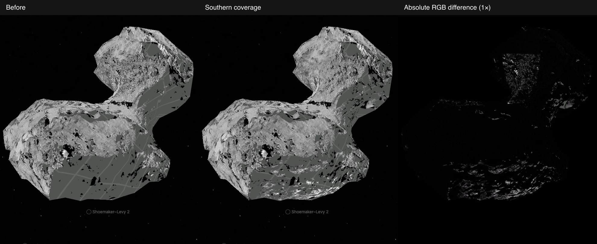
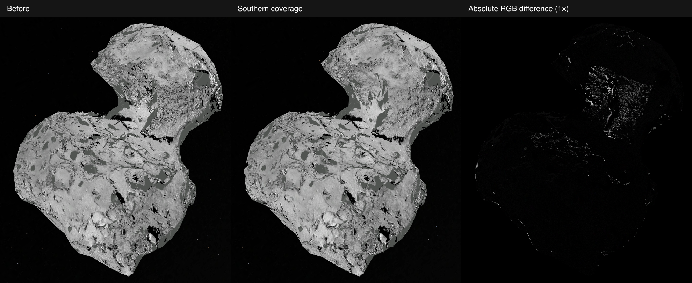

# 67P: southern OSIRIS coverage

The existing OSIRIS view gains photographed terrain in the southern hemisphere. Eight orange-filter images replace the previous six-image mosaic: four August 2014 observations remain, and four October–November 2015 observations replace the two September close-ups. There is still one OSIRIS dataset, on the same 1,000-triangle RMOC mesh. Viewer Shadows defaults off.

The final preparation increases accepted displayed surface area from **56.25% to 71.26%**, measured at the same 24 deterministic points per triangle and weighted by triangle area. This estimates coverage of the displayed mesh, not exact coverage of the real nucleus. Grid remains wherever no photograph qualifies. The new selection adds 15.22 percentage points and relinquishes 0.21 percentage points supplied only by the retired September close-ups.

## Selected observations

The new pairs come from the PDS [MTP022 GEO archive](https://pdssbn.astro.umd.edu/holdings/ro-c-osinac-5-esc4-67p-m22-geo-v1.0/) and its [matching L4 radiance and quality archive](https://pdssbn.astro.umd.edu/holdings/ro-c-osinac-4-esc4-67pchuryumov-m22-v2.0/).

| UTC observation | GEO filename | Purpose |
| --- | --- | --- |
| 26 October 2015 | `n20151026t125938783id50f22.img` | Connect northern and southern coverage |
| 31 October 2015 | `n20151031t234514781id50f22.img` | View near the south pole |
| 4 November 2015 | `n20151104t112633715id50f22.img` | Complement the polar view |
| 15 November 2015 | `n20151115t050650703id50f22.img` | Additional overlap and surface detail |

The manifest pins every image and quality companion. Their complete radiance planes must agree before quality flags are used. Every selected GEO product names the archive's corrected `cg-dlr_spg-shap7-v1.0_4Mfacets.ver` model. The 29 October candidate naming the erratum-affected `spc-v2.0` model was rejected. A July 2015 view had inadequate compatible overlap and was also excluded.

## Brightness preparation

The old and new observations were acquired at substantially different solar distances. Raw radiance cannot be matched with a small exposure gain alone. The [OSIRIS calibration pipeline, section 3.13](https://pdssbn.astro.umd.edu/holdings/ro-c-osinac-5-prl-67p-m06-geo-v1.0/document/calib/osiris_cal_pipeline_v06.pdf) defines `I/F = π d² radiance / solarFlux`. Both quantities and their units come from each image's original calibration HISTORY. Already-normalized inputs are rejected.

The existing Lommel–Seeliger disk correction retains its 3× gain and 80-degree incidence/emission limits. A separate bounded phase correction uses the single-particle HG and shadow-hiding terms in [Fornasier et al. (2015), equations 6 and 8 and Table 4](https://arxiv.org/abs/1505.06888): `g = −0.37`, `B0 = 2.5`, `h = 0.079`, normalized to 50 degrees. Corrections occur on linear source pixels before interpolation. The phase correction permits only 40–70 degrees and at most 1.5× adjustment in either direction.

This is a single-scattering approximation, **not the full Hapke model or an albedo map**. It omits roughness and multiple scattering, preserves photographed cast shadows, and combines observations across a perihelion passage. The published parameter fit covered 1.3–54 degrees; using it for these 47–64-degree observations is a modest extrapolation, checked additionally through their measured overlaps. Real surface changes and some seams remain.

Residual brightness gains use only co-located positive samples with incidence and emission no greater than 65 degrees. This stricter calibration limit excludes the more sensitive near-limb and near-terminator comparisons; it does not remove valid dark or steep-angle pixels from the displayed image. The overlap minimum of 128 samples, maximum log-MAD of 0.25, and 1.35× residual gain budget remain unchanged. The final fitted gains range from 0.908 to 1.157.

## Geometry and display

The camera fit, detector quality, source-shape correspondence and ray visibility remain separate checks. Every bilinear contributor must satisfy the original 20 m correspondence limit; the retained point must match the full RMOC mesh within 50 m, with visibility agreement within 0.5 m. The largest independent camera holdout residual is below 0.0025 source pixel. No geometry limit was relaxed.

Lowest emission angle chooses the source. The first observation owns the common display stretch. The lossless prepared source-index raster records which image supplied each texel and remains outside runtime delivery. No renderer, shared shell, camera or navigation code changes are involved.

The brightness fit uses 64 samples per triangle. An independent set of 63 disjoint samples per triangle produces a connected fit within 0.8% of those gains. Geometry and coverage eligibility are unchanged by this stricter calibration.

## Browser comparison

Both atlas versions were mounted in the same renderer at the same saved camera poses. The baseline requests were fulfilled with the exact OSIRIS asset bytes from commit `bd265cf3a091c4ef17e9be76dfeb23410364884f`. Each triangle's projected bounds, transform, dimensions and atlas coordinates matched before and after. The images below are unscaled browser crops; the difference panel shows absolute RGB differences without amplification.

The changed pixels include both newly photographed areas and brightness normalization. These are coverage comparisons, not measurements of physical surface change between 2014 and 2015.

## Preparation and delivery

Lighting is evaluated once per atlas pixel and texture scale, then reused across surface banks sharing those exact points and normals. The cache retains double-precision values and avoids 28,672,000 repeated lighting evaluations. This is preparation-only work. The terrain file and **53 of 56 runtime assets remain byte-identical** to the base commit; only the OSIRIS surface, shadow bank and thumbnail change.

Those three immutable assets were published to the runtime store. A fresh installation downloaded all 56 current assets into an empty directory and verified their complete SHA-256 hashes and byte counts: 21,933,880 bytes, with no reused local files.

## Verification records

| Check | Result |
| --- | --- |
| Source and package qualification | Original inputs, manifest and prepared provenance verified; geometry, camera, dataset IDs and default Shadows unchanged |
| Package tests | 762 passed |
| Focused photometry, mosaic and source-lighting tests | 19 passed |
| Final prepared 67P tests | 9 passed |
| Generic 67P browser conformance | 15 cases passed, including mobile, DPR 1/2, dataset changes and motion |
| Matched browser and production checks | 6 comparison captures and 2 production captures; one scene, 1,000 retained triangles, one OSIRIS row, default Shadows off, no page errors |
| Production build and asset assembly | 818 pages built; all implemented objects assembled successfully |
| Wider preparation/body suite | 185 passed; 2 Europa checks could not read missing local original `Agenor.tif` and `Agenor_FOM.tif` inputs |

The wider suite is not fully green: those two missing-source failures are outside the changed comet package. No unrelated source files or tests were changed to bypass them.

### Integration with current main

The branch incorporates `7ae81ba2d` (Chariklo and Bienor). Its updated marker counts and indices are retained, and all 410 pinned object transports were restored before the final build. The three overlapping 67P metadata files combine that navigation update with this mosaic's content and hashes. The imagery and all geometry remain unchanged by this integration.

The integrated source, runtime, router and comet suite passes 107 checks. Three existing Earth runtime fixture checks fail on `page:normal:0:level:512` image dimensions. A separate registry audit passes nine checks and fails two: the static loader inspector does not recognize the registry's packaged loaders, and Earth's browser profile lacks retained-interaction evidence. The minimap index check passes on the updated main. A broader exploratory platform/shell run was stopped during unrelated navigation-atlas regeneration; it is not reported as a completed run.

The original comparison and 15-case conformance records above precede that integration. The final production build, assembly and DPR-1/DPR-2 browser capture are recorded separately in [integration validation](evidence/67p-southern/integration.json).

Evidence: [source acquisition](evidence/67p-southern/source-acquisition.json), [coverage](evidence/67p-southern/coverage.json), [independent brightness check](evidence/67p-southern/calibration.json), [package qualification](evidence/67p-southern/qualification.json), [runtime delivery](evidence/67p-southern/runtime-delivery.json), [browser captures](evidence/67p-southern/browser.json), [comparison construction](evidence/67p-southern/comparison.json), and [browser conformance](evidence/67p-southern/conformance.json).
