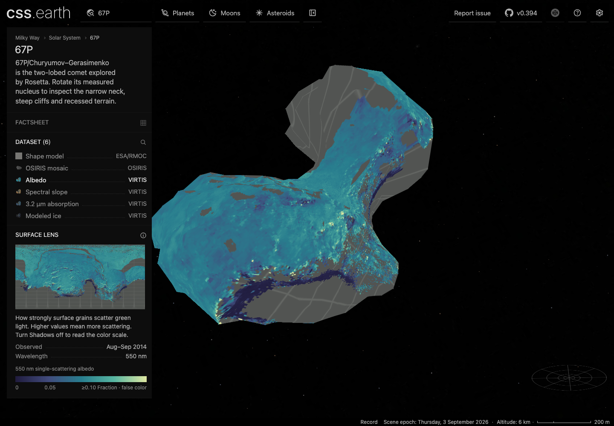
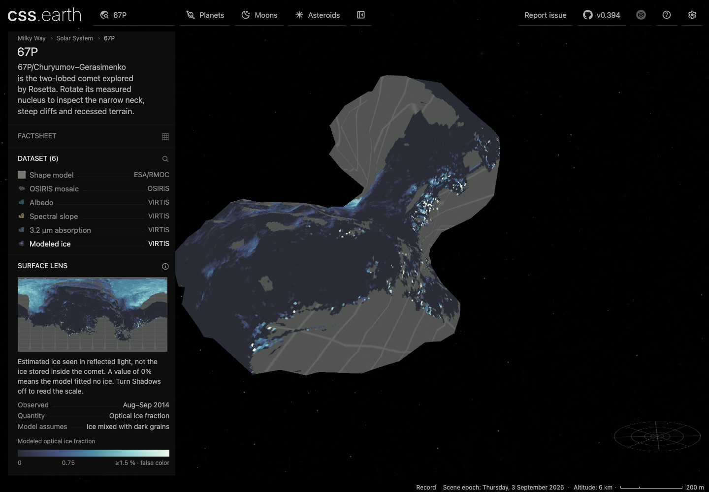

# 67P: VIRTIS scientific surface views

This package adds four complementary scientific views to the measured 67P nucleus: 550 nm single-scattering albedo, visible spectral slope, 3.2 µm absorption depth, and modeled optical ice fraction. All four use **MTP006**, with the same archive interval of **1 August 2014 10:00 through 2 September 2014 09:59:59 UTC**. The interval is the mission planning period, not a claim of continuous observations. Shape model and OSIRIS mosaic remain available.

The viewer uses the existing shared shell, lens controls, legend, minimap, lighting toggle, and retained 1,000-triangle RMOC nucleus. Source interpretation, projection, ambiguity tests, palettes, thumbnails and lighting are computed during preparation. Runtime only switches the prepared material bank. Each dataset row names its instrument; observation dates and two or three useful facts sit beside a short explanation. The optional lens facts use the shared content contract and existing factsheet styles.

## Quantities and display

| View | Original product | Source → display units | Display scale | Meaning and limits |
|---|---|---|---|---|
| Albedo | `AL01_GLB_M006_M006_V01` | fraction → fraction | 0–0.10 | Single-scattering albedo at 550 nm; distinct from geometric albedo and image brightness. |
| Spectral slope | `SL01_GLB_M006_M006_V01` | nm⁻¹ × 10,000 → %/100 nm | 0–30 | Reflectance slope from 500–800 nm, normalized at 550 nm. Neither visible true color nor mineral abundance. |
| 3.2 µm absorption | `BD01_GLB_M006_M006_V01` | fraction × 100 → % | 0–25 | Depth of the broad absorption relative to the continuum, not a direct organic-abundance estimate. |
| Modeled ice | `WI01_GLB_M006_M006_V01` | fraction × 100 → % | 0–1.5 | Optical cross-section fraction from a Hapke intimate-mixture model with dark terrain and fitted micrometer grains. Not mass fraction, volume fraction or subsurface ice content. Localized patches may violate the mixing assumption. |

Each view has a continuous false-color scale and explicit endpoint clipping labels. Values outside the displayed scale retain their original numerical value and use the palette endpoint. Shadows off preserves palette colors; Shadows on adds modeled lighting at the shared 2026 scene epoch, not the VIRTIS observing illumination. The compact lens factsheets give observation dates and reading guidance; the scene header separately shows the modeled lighting epoch. Scientific atlases use lossless WebP; the forensic numeric index is not delivered to the browser.

## Original data and coordinate contract

[The PDS/PSA VIRTIS map archive](https://pds-smallbodies.astro.umd.edu/holdings/ro-c-virtis-5-67p-maps-v1.0/) supplies the original tables, PDS3 labels, [interpretation document](https://pds-smallbodies.astro.umd.edu/holdings/ro-c-virtis-5-67p-maps-v1.0/document/ro_virtis_map_eaicd.asc), and bibliography. Exact URLs, byte counts, SHA-256 hashes, credits and acquisition operations are in the body source manifest. Large tables and the reference mesh are reacquirable; original small labels and interpretation documents are checked in.

All tables have 259,200 fixed 31-byte records: latitude, longitude and value, separated by commas and terminated by CRLF. Coordinates are Cheops planetocentric, east-positive, spaced by 0.5°. The first three tables run **90° to −89.5°**; the ice table runs **−90° to 89.5°**. The parser verifies every row against that product's explicit coordinate order. It does not infer a common north-up image layout. A nominal half-degree bin is not a claim of half-degree resolving power; observations were combined within bins.

Nearest published-coordinate sampling preserves the source values, wraps longitude, withholds degenerate polar half-cells and performs no interpolation into missing coverage. The source missing sentinel is −1. Valid zeroes are retained, including 70,957 ice rows. Physical-range rejection applies to albedo and absorption fractions outside [0,1]; spectral slopes can be negative. Counts before geometric withholding:

| View | Valid rows | Missing rows | Rejected physical-range rows | Below / above display scale |
|---|---:|---:|---:|---:|
| Albedo | 166,159 | 93,038 | 3 | 0 / 223 |
| Spectral slope | 166,207 | 92,993 | 0 | 300 / 885 |
| 3.2 µm absorption | 164,926 | 93,494 | 780 | 0 / 1,701 |
| Modeled ice | 162,839 | 96,361 | 0 | 0 / 283 |

## Transfer onto an irregular nucleus

The archive explicitly warns that one latitude/longitude can correspond to several surfaces around the neck. Painting the cylindrical map onto every intersecting branch would invent coverage. This implementation projects each retained atlas sample to the closest full-resolution RMOC triangle within the existing 50 m mesh-reduction allowance, then samples the scientific map using that point's Cheops coordinates.

A cell is withheld if its center or any of its eight edge/corner stencil directions has multiple radial intersections on either the RMOC mesh or the published SHAP5 reference. Each accepted atlas sample must also have a unique actual radial direction on both meshes. This finite stencil is a conservative approximation, not a mathematical proof over the continuous footprint. Gray grid identifies missing, physically rejected, ambiguous or distance-rejected coverage. It does not distinguish those causes visually; the preparation records distinguish source validity and aggregate transfer rejection.

The VIRTIS processing document names **SHAP5 v1.1**. The [public 097K SPC SHAP5 release](https://archives.esac.esa.int/psa/ftp/INTERNATIONAL-ROSETTA-MISSION/SHAPE/RO-C-MULTI-5-67P-SHAPE-V2.0/DATA/TRIPLATE/SPC_LAM_PSI/SHAP5/CG_SPC_SHAP5_097K_CART.LBL) is later. Its 48,420 vertices and 96,834 facets provide a frame and ambiguity cross-check; they are not claimed to be the original processing mesh. The transfer is **approximate angular registration**, not exact original-facet registration. The 50 m limit measures retained-to-RMOC correspondence, not total scientific registration accuracy. SHAP5 never replaces the rendered geometry.

Every accepted atlas texel has a prepared, hash-bound original table-row index (`*-source-index.json`, gzip UInt32LE). Code zero means withheld; all other codes are original one-based record numbers, preserving even the ice table's opposite order. The index includes atlas bleed, which is clamped to its own retained triangle. Coverage statistics separately count triangle interiors; neither rectangular atlas occupancy nor a cylindrical pixel percentage is presented as physical surface area.

## Independent interpretation checks

[Filacchione et al. (2016), DOI 10.1016/j.icarus.2016.02.055](https://doi.org/10.1016/j.icarus.2016.02.055), Tables 3–4 and Sections 4.1–4.4 establish the albedo, slope normalization and band-depth meanings. The [author manuscript](https://elib.dlr.de/107055/1/filacchione_composition_icarus_2016.pdf) was inspected visually at printed pages 22–23. Independent test anchors include:

| Quantity and coordinate | Published MTP006 value | Decoded archive value |
|---|---:|---:|
| Albedo, Ma'at 16.5°E 24.5°N | 0.051 | 0.0508 |
| Albedo, Aker 56°E 12.5°S | 0.063 | 0.0629 |
| Albedo, Imhotep 115°E 11°S | 0.053 | 0.0526 |
| Visible slope, Ma'at 16.5°E 24.5°N | 17.99 %/100 nm | 18 %/100 nm |
| Visible slope, Imhotep 115°E 11°S | 20.04 %/100 nm | 20 %/100 nm |
| 3.2 µm depth, Aker 56°E 12.5°S | 6.9% | 6.88% |

These are rounded independent unit/orientation anchors, not proof of exact equivalence between the 2016 paper and the 2019 archive. Other GCPs differ: Babi albedo is 0.055 in the paper and 0.0499 in the archive, and its absorption is 14.8% versus 16.45%. The discrepancy is recorded rather than corrected, smoothed or hidden by claiming all points agree. The original archived values own the rendered map.

[Ciarniello et al. (2016), DOI 10.1093/mnras/stw3177](https://doi.org/10.1093/mnras/stw3177), Section 4.3 and Appendix A establish the optical mixture interpretation. The ice table's 0.04 maximum is rendered as 4%, and its zero-valued measurements remain visible. This is a unit/interpretation check, not an independent per-cell validation of the fitted ice abundance.

## Reproduction and evidence

Restore the pinned sources with the body's acquisition command, build preparation, then run `node tools/objects/dist/prepare-authored.js comet-67p --write`. The normal object build derives controls, legends, body thumbnails, minimaps and the runtime inventory from the same package.

Focused tests cover malformed PDS records, explicit latitude order, wrapping and extent, valid zeroes, physical bounds, distance limits, real nonconvex multiple-intersection geometry, footprint-edge rejection, publication numeric anchors, lossless atlas colors and runtime exclusion of the forensic index. The browser profile derives all six lenses and exercises the ice-to-albedo acquisition race.

Validation results and deliverable hashes are recorded in `67P-VIRTIS-VALIDATION.json` after the final build. This document does not qualify exact SHAP5 v1.1 registration, original VIRTIS measurement errors, composition retrieval accuracy, or unobserved terrain.

## Current integrated preview

Chrome at DPR 1 after integrating main’s 227-object registry and explorer update, with Shadows off so the legend colors remain readable. These captures use the development preview. Both DPRs, all 13 interaction cases and the exact image hashes pass after integration; the earlier production build and 178-object browser audit retain their original scope in the validation JSON.

[Visible spectral slope](evidence/67p-virtis-integrated-slope.png) · [3.2 µm absorption](evidence/67p-virtis-integrated-absorption.png)
