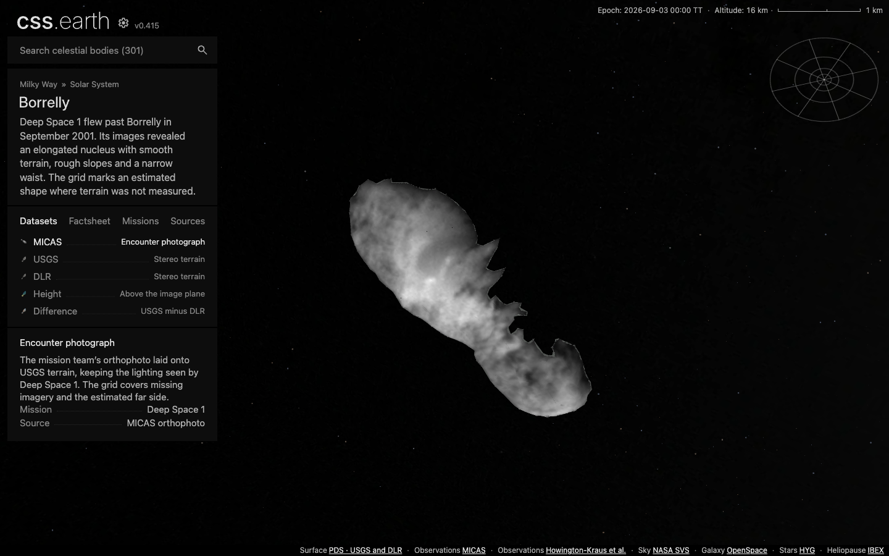
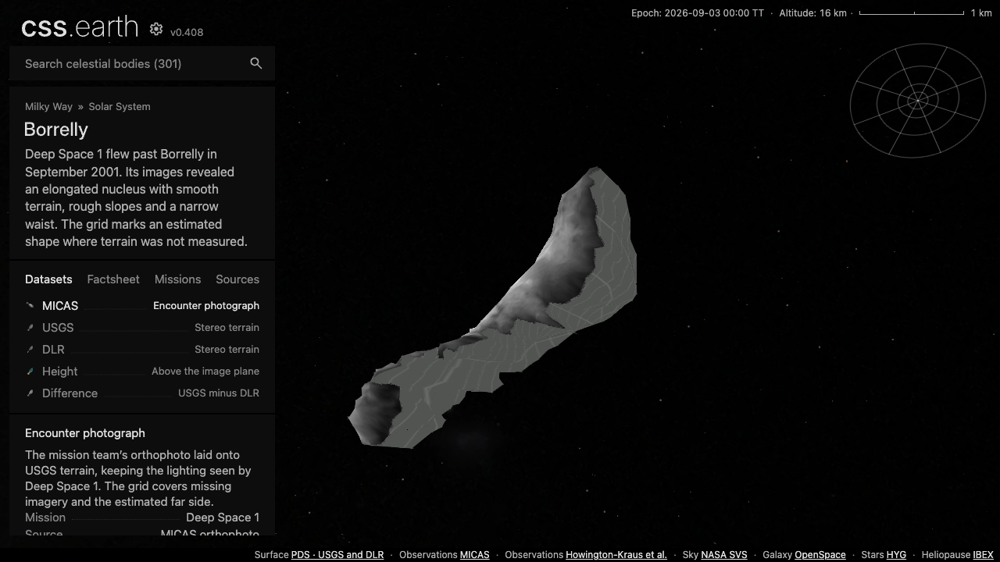
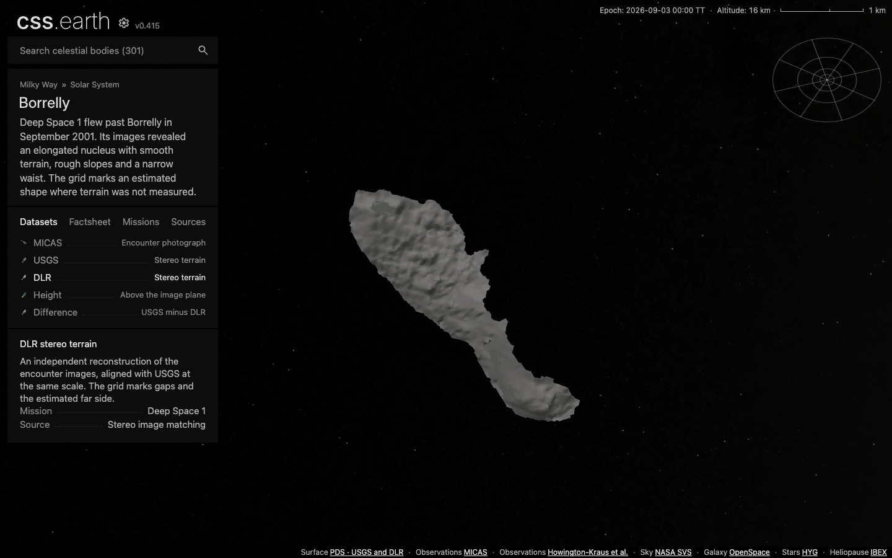
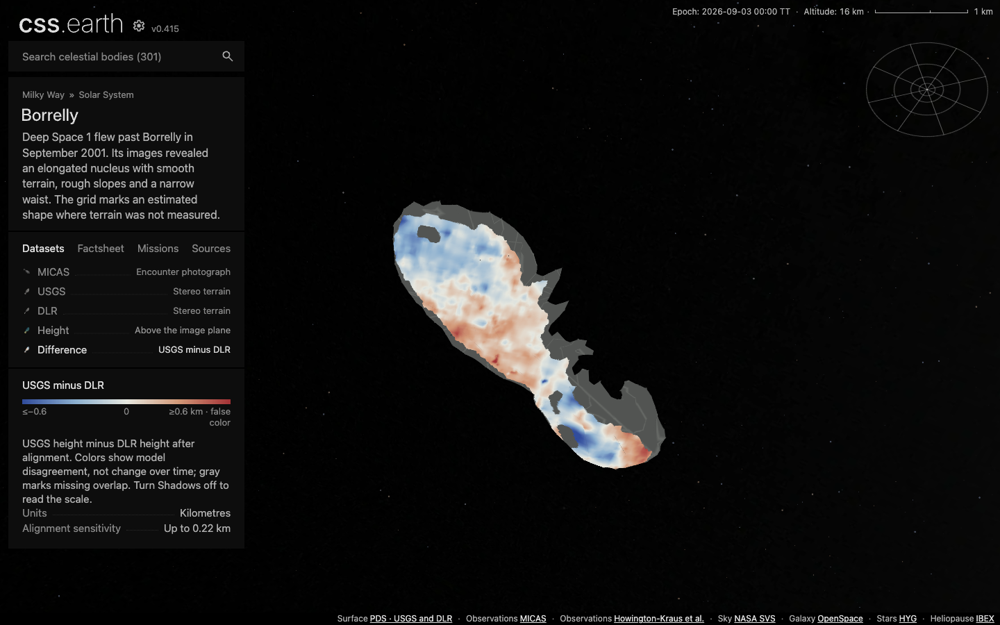

# Borrelly: encounter terrain and photography

Borrelly adds a seventh comet through the same object adapter and retained scene. Five datasets belong to one scene: MICAS photography, USGS terrain, DLR terrain, USGS image-plane height, and the difference between the registered terrain models. The completed package and its qualification evidence are recorded below.

## What the sources establish

The [reviewed PDS DEM release](https://pdssbn.astro.umd.edu/holdings/ds1-c-micas-5-borrelly-dem-v1.0/) contains 62,879 USGS XYZ/normal rows and 3,765 DLR XYZ rows. Both describe the visible terrain from the 22 September 2001 encounter. Neither closes the unobserved side. The viewer adds an illustrative completion fitted to each outline, with the shared missing-data grid on every added face. It carries no observed texture or scalar values.

The USGS grid is sampled every 16 m. That is an oversampled representation, not 16 m imaging resolution. [The mapping paper](https://www.isprs.org/proceedings/xxxiv/part4/pdfpapers/277.pdf) describes an original 150 m stereo grid and a highest-resolution image near 46.6 m/pixel. Height is displacement toward the camera above an arbitrary plane, not distance along gravity or from the nucleus centre. Negative and zero values remain valid.

The [rescued mission website](https://pdssbn.astro.umd.edu/holdings/ds1-c-micas-3-rdr-visccd-borrelly-v1.0/document/derived/topo/topo.htm) supplies a rectified MICAS image and its XYZ cubes. PDS explicitly identifies this collection as insufficiently documented for formal review. We use its photograph with original illumination and do not claim to requalify radiometric calibration. Every valid XYZ pixel matches exactly one reviewed USGS post, and every post is accounted for. Maximum height difference is 0.000000500001 m, consistent with decimal rounding of the released ASCII table. Pixel coordinates are exactly `X = 16*sample - 3144`, `Y = 3448 - 16*line`, with zero-based indices. This establishes image placement independently of appearance.

The original image and terrain masks agree at all 170,168 pixels. Bilinear sampling requires four valid image contributors and a source-surface correspondence within 85 m. Gray edge pixels denote missing photographic support. Uniform lighting retains the photographed illumination; the Shadows setting adds an illustrative fixed-epoch lighting bank.

## Comparing USGS and DLR

DLR X/Y are pixels, while USGS X/Y are metres. The archive only gives an approximate DLR scale. The paper describes a separate registration procedure and does not provide its final transform. The comparison therefore uses an explicitly derived image-plane similarity registration, with a vertical datum offset. It does not claim to reproduce the authors' original affine comparison or its 120 m statistic.

Registration uses every thirteenth DLR post as controls. Remaining posts are held out. Repeating the fit for all thirteen control offsets measures sensitivity to the chosen controls. The held-out RMS range is about 200–206 m, with image-plane positions differing by up to 215 m across these fits. These are empirical model/alignment differences, not accuracy against ground truth. The Difference dataset must be read with this qualification.

Only triangles supported by both releases contribute to the difference. USGS height minus registered DLR height is expressed in kilometres. No missing edge is extrapolated. The two terrain views share the same physical coordinate conversion and camera.

## Geometry and placement

The USGS display mesh has 1,999 triangles and retains all 1,269 boundary edges. DLR uses a separate 799-triangle bank and retains its 373 boundary edges and three holes. Image-plane reduction preserves the source posts and repairs internal diagonals that would otherwise produce folded or vertical triangles. Topology and every boundary edge are checked after reduction.

The USGS envelope is reduced as one closed mesh to 994 triangles: 452 use original source posts and 542 involve estimated geometry. DLR retains 799 source and 1,063 estimated triangles (1,862 total). Both completed meshes are closed, outward wound, connected and genus zero. The original outline constrains the initial envelope; a second USGS reduction removes redundant boundary detail within a 100 m sampled source-fit limit; DLR uses a 110 m limit. The rear depth scale is assumed to be 3.15 km, using the width reported by [Buratti et al. (2002)](https://pubs.usgs.gov/publication/70024562). This does not establish a measured third axis or hidden terrain. The source package records the equation and assumptions.

Independent checks sample every source vertex and face centroid toward the measured display mesh, and every measured display face centroid and edge midpoint in reverse. They are sampled distance checks, not continuous Hausdorff bounds. The USGS maxima are 91.69 m from source to display and 74.18 m in reverse; DLR maxima are 100.10 m and 96.59 m. Estimated completion faces are excluded. Material transfer independently applies the same 85 m limit at every prepared texel.

The source height datum is preserved in the Height view. A common 2.2 km translation recentres the presentation and does not assert a measured centre of mass. The 4 km navigation reference is half NASA's reported approximate 8 km nucleus length; it is not a volume or mean radius. Geometry retains its actual source dimensions.

JPL Horizons elements and independent vectors use the shared JD 2461286.5 epoch. The central-epoch position differs by less than 1 mm; measured conic errors at minus/plus 30 days are 356.11/337.54 km, under a 410 km regression guard and the existing 10,000 km nearby-placement budget. Attitude and phase are explicitly illustrative. No 2026 spin solution or long-term ephemeris is claimed.

## Qualification

The production build contains 302 pages. Source restoration verifies all 32 pins, including eight fresh downloads from the archives. All 45 runtime assets were downloaded into an empty directory and hash-verified: 9,040,800 bytes. The browser then loaded those fresh bytes through all five datasets. The [browser record](evidence/borrelly/browser.json) binds actual prepared-object and atlas response hashes to the captures.

| Check | Result |
| --- | --- |
| Body source, scalar anchors and complete grid coverage | 5 tests pass |
| Shared DEM, ISIS2, completion and scientific raster behavior | 8 tests pass |
| Borrelly source and runtime-asset closure | 3 tests pass |
| Dataset content and shared navigation/router contracts | 39 tests pass |
| CI universe preparation | 354 tests pass |
| CI shell and activation groups | 331 tests pass |
| CI renderer subset | 242 tests pass |
| Renderer and preparation typechecks | Pass |
| Desktop, mobile, DPR and dataset lifecycle conformance | All 13 cases pass on the final geometry |
| Production dataset capture | All five datasets, both lighting states, DPR 1/2 and fresh R2 installation pass |
| Native surface targeting | Both geometry banks, six views at DPR 1/2; zero interior mismatches |
| Retained scene and navigation | Earth through all seven comets twice at each DPR; one scene, retained shell and universe |
| Integration with main | All 300 existing packages preserve geometry, materials and cameras; only marker bindings, payload hashes and the Sun source pin change |

[Qualification counts](evidence/borrelly/qualification.json), [source restoration](evidence/borrelly/source-restoration.json), [registration holdouts](evidence/borrelly/registration-holdouts.json), [USGS source fit](evidence/borrelly/source-fit-usgs.json), [DLR source fit](evidence/borrelly/source-fit-dlr.json), [USGS picking](evidence/borrelly/surface-hit-usgs.json), [DLR picking](evidence/borrelly/surface-hit-dlr.json), and [navigation](evidence/borrelly/navigation.json) preserve the measured scope.

The earlier unrestricted repository suites were not green: they encountered missing inputs in other body packages and Earth/other-body fixture failures. The current CI scopes listed above have been rerun successfully. This record does not claim a fresh unrestricted all-body preparation run or testing on physical mobile hardware.

The directional lighting is illustrative and can emphasize coarse terrain facets. The MICAS photograph already contains encounter illumination; the default view preserves that photographed lighting. Neither the gridded rear nor the registered Difference view establishes a measured hidden shape or change over time.

## Drag measurements

Four production Chrome 152 captures used the same 1440 × 900 viewport and three repeated 60-step drag cycles with Shadows enabled, on the M3 Max Mac. Renderer script hashes match across the four runs. All retain the same 2,856 native leaves, loaded atlases and DOM nodes, with no interaction-time requests or browser errors.

| Displayed bank | DPR | Median RAF interval | 95th percentile RAF interval | Median renderer draw duration |
| --- | --- | --- | --- | --- |
| MICAS / USGS | 1 | 16.7 ms | 33.4 ms | 20.4 ms |
| MICAS / USGS | 2 | 16.7 ms | 33.4 ms | 21.0 ms |
| DLR | 1 | 50.0 ms | 83.3 ms | 45.7 ms |
| DLR | 2 | 50.0 ms | 83.4 ms | 47.3 ms |

The default bank displays 994 triangles; DLR displays 1,862 and remains more expensive to draw. These are recorded browser timings, not a claim of sustained presented-frame rate or physical-mobile performance. The earlier 8,100-leaf trace predates the shared UI integration and is not treated as a controlled performance baseline for this revision. The triangle reduction itself is exact: 1,966 → 994 for USGS and 3,024 → 1,862 for DLR.

Trace records: [MICAS DPR 1](evidence/borrelly/trace-micas-dpr-1.json), [MICAS DPR 2](evidence/borrelly/trace-micas-dpr-2.json), [DLR DPR 1](evidence/borrelly/trace-dlr-dpr-1.json), [DLR DPR 2](evidence/borrelly/trace-dlr-dpr-2.json). Compressed raw traces remain in the local qualification output; each record includes their byte count and hash.

## Views

[Height](evidence/borrelly/height.png), [MICAS with Shadows](evidence/borrelly/micas-shadows.png), and [screenshot hashes](evidence/borrelly/screenshots.json) complete the visual record.
