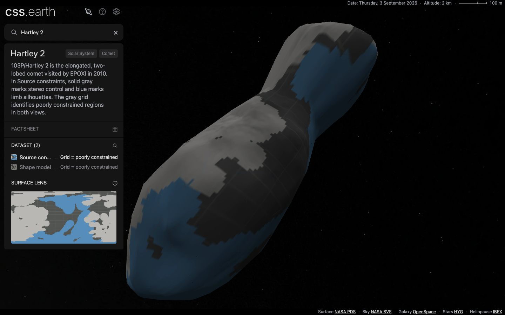
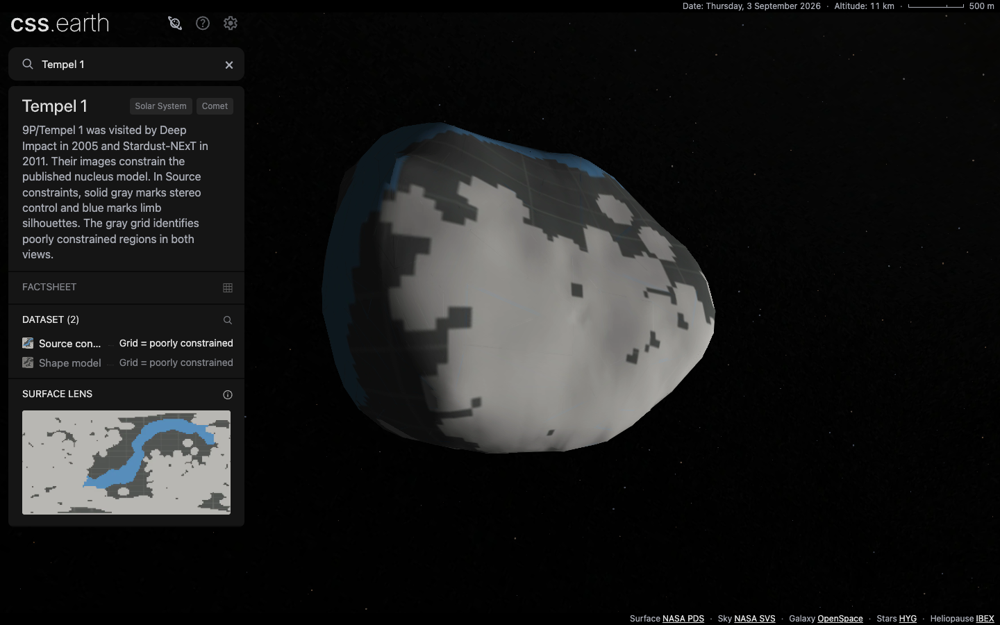

# Hartley 2 and Tempel 1 constraint grids

Both existing views now mark PDS flag 3 with cssEarth's shared gray grid. In **Source constraints**, flag 1 remains solid gray for stereo control and flag 2 remains blue for limb silhouettes. In **Shape model**, flags 1 and 2 remain neutral gray. The visible panel and lens descriptions identify the grid as **poorly constrained**, not necessarily wholly unobserved terrain. The materials are not observed albedo.

The original 2013 PDS labels define flag 3 as a point not constrained by either control points or a limb silhouette. Hartley 2 has 3,846 such source vertices; Tempel 1 has 3,468. These counts are not surface-area percentages. Neither input, source frame nor geometry has changed. Wild 2's ellipsoid-completion grid retains its separate meaning, and 67P receives no inferred coverage boundary.

The existing nearest 2-degree categorical sampler chooses the mask before any filtering or lighting. Both 512 × 256 source materials reproduce from the original flag tables. Comparing every texel with the preceding categorical maps confirms that stereo and limb texels are byte-identical, and that every former poorly constrained texel receives exactly the shared grid in both views. Raster filtering softens boundaries; the map is not a quantitative interpolation of uncertainty. [Material comparison](evidence/constraint-grid-materials.json).

The two comets retain 1,000 native CSS triangle leaves each. Both lighting atlases per view, their thumbnails, the constraint minimap, and the model-view context image/navigation marker use the same material interpretation. The model view has no duplicate minimap. Geometry and targeting are byte-identical to the preceding comet branch, and the camera and scene match apart from coverage text. [Geometry and scene identity](evidence/constraint-grid-geometry.json).

## Qualification

Application commit: `bf484759`. Eight focused material/source/geometry tests pass, including Wild 2's unchanged grid reproduction. Source verification passes for all 75 objects, and the full production build passes.

The full `pnpm test` passes, including 308 renderer, 738 platform and 220 shell tests. The checks ran after preparation, production build and fresh installation completed. [Gate logs and exact prepared hashes](evidence/constraint-grid-gates.json).

Each comet passes the shared Chrome retained-DOM check at DPR 1 and 2: 26,830 scene nodes, including 1,000 body leaves. Sixteen additional raw production captures cover both lenses at DPR 1/2, both lighting states, native drags and close zoom. The capture checks prove retained scene-node identity across those actions and verify the actual loaded atlas bytes against the inventory. All sixteen images were inspected. Source category boundaries remain visibly coarse, fine triangle-edge artifacts remain, and the grid is faint in dark-facing regions. These are source-backed model views, not photograph-matched pixel-parity evidence.

[Hartley 2 DOM checks](evidence/constraint-grid-hartley-dom.json) · [Tempel 1 DOM checks](evidence/constraint-grid-tempel-dom.json) · [capture record and loaded hashes](evidence/constraint-grid-visuals.json).

Navigation through Earth and all four registry-derived comets passes at both DPRs, with the shared shell/universe retained and one mounted scene throughout. [Navigation evidence](evidence/constraint-grid-navigation.json).

Normal fresh runtime installation downloads 34 files per comet with zero reuse. Every byte/hash matches the inventory and the files served by the production preview: **7,497,588 bytes** for Hartley 2 and **7,449,078 bytes** for Tempel 1. These whole-inventory totals include background assets but exclude shared shell and JSON transfer. Relative to the preceding material, the increases are 56,054 and 60,322 bytes. [Fresh installations](evidence/constraint-grid-install.json).

Atlas dimensions and bank counts are unchanged. Each comet has four 1,024 × 4,032 body atlases across its two views, totaling 66,060,288 calculated RGBA bytes; this is not measured GPU residency. No new frame-rate claim is made for the texture change. [Atlas dimensions, sizes and hashes](evidence/constraint-grid-assets.json).
