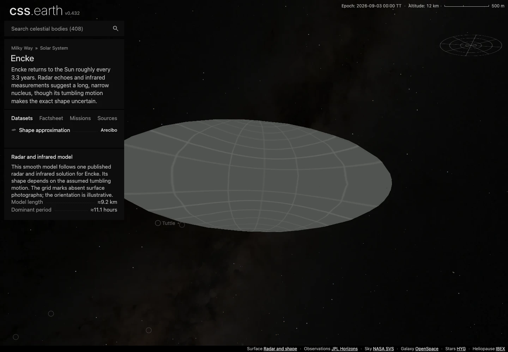
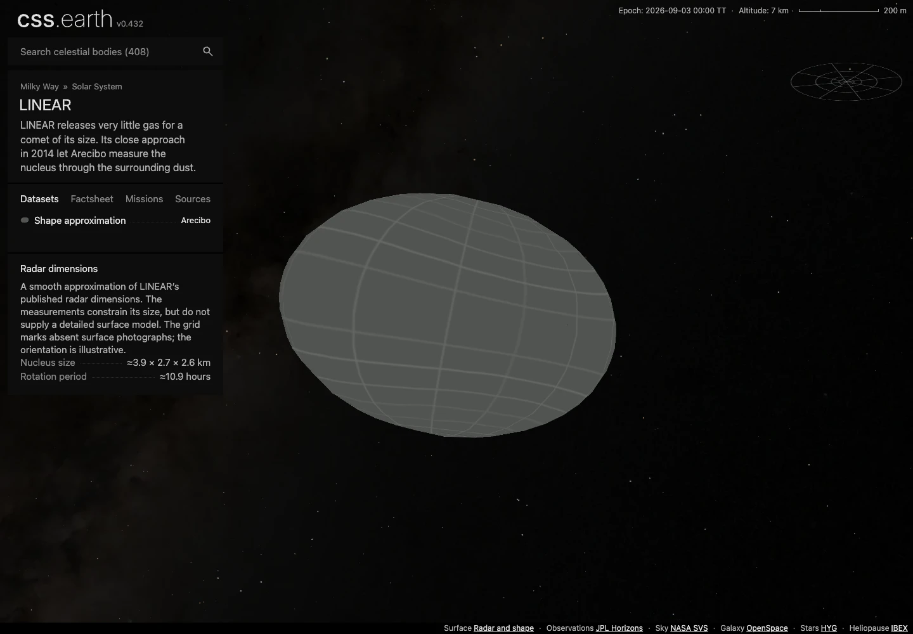

# Encke and LINEAR: two radar-constrained nuclei

This addition brings the comet catalog to twelve objects. Encke and LINEAR each have one **Shape approximation** dataset, 800 raster triangles, the gray missing-imagery grid over the complete surface, and Shadows off. Both use the existing object scene, camera, navigation, and controls. No renderer code changes.

## What the shapes represent

| Object | Selected constraint | Prepared model | Main limitation |
| --- | --- | --- | --- |
| 2P/Encke | Harmon & Nolan (2005), Table 3: SAM1, 11.1 hours, semimajor axis 4.58 km, axis ratio 2.60 | Prolate ellipsoid, full dimensions 9.16 × 3.5231 × 3.5231 km | Depends on a particular tumbling solution; not a unique recovered shape. |
| 209P/LINEAR | Schleicher & Knight (2016), section 2.2: radar dimensions 3.9 × 2.7 × 2.6 km, citing Howell et al. (2014) | Triaxial ellipsoid with those full dimensions | Numeric size constraints; an original radar surface mesh was not retrieved. |

[Harmon & Nolan](https://doi.org/10.1016/j.icarus.2005.01.012) also consider an Encke axis ratio of 2.04 and another rotation solution. The selected 2.60 case agrees more closely with the infrared size under their assumptions. Its projected-area effective radius is not a volume radius. The package uses the stated semimajor axis directly and obtains both smaller semiaxes by division by 2.60. The alternatives stay in the source record; they do not create nearly identical sidebar datasets.

[Schleicher & Knight](https://doi.org/10.3847/0004-6256/152/4/89) report later three-axis LINEAR dimensions. The original [DPS 2014 abstract 209.24](https://aas.org/sites/default/files/2020-02/DPS_46_Abstract_Book.pdf) gives preliminary projected dimensions of about 2.5 × 3 km and cautions that the observations may not determine a detailed shape. This package explicitly selects the later values. The abstract was inspected online; its PDF download returned HTTP 403, so no local byte verification is claimed for that abstract.

The selected paper PDFs have their original URLs, byte counts and SHA-256 hashes recorded in each package's `source/reference/source-record.json`. They are references for the checked-in numeric models and are not redistributed or needed for a build. PDS Stooke/radar releases and the [JPL radar publication index](https://echo.jpl.nasa.gov/publications/pubs.html) did not yield downloadable original meshes for these two nuclei during this intake. That is an unresolved access boundary, not proof that no mesh exists.

## Surface, scale and attitude

Radar delay-Doppler brightness is not an optical surface map. Neither selected source supplies usable optical texels for these models. Every surface triangle therefore receives the existing missing-imagery grid; there is no invented terrain or albedo pattern.

The shared preparation loader accepts an explicit `published-semiaxes` convention. It converts the three kilometre semiaxes directly to metres and rejects mixed thermal-radius inputs. Existing ratio-and-thermal-radius packages keep their previous convention. Each new camera reference radius is the cube root of the three-semiaxis product; the rendered shape retains the separate axes.

The existing subdivided-octahedron recipe supplies 2,048 source triangles, reduced by the existing mesh simplifier to 800. Qualification checks two oppositely wound incidents per edge, Euler characteristic 2, and distance from every prepared vertex, edge midpoint and face centroid to the analytic ellipsoid. The 100 m preparation bound measures geometric approximation, not observational accuracy.

Both attitudes are fixed and illustrative: RA 0°, Dec 90°, meridian 0°. They do not claim a measured pole or current rotational phase. The 11.1-hour and 10.93-hour periods are explanatory facts, not simulated rotations. The opt-in Shadows bank illustrates lighting on this fixed attitude. It starts off, as required by the comet scene contract.

## Position and navigation

Each package retains the original JPL Horizons element and geometric-vector responses with exact request URLs. They use heliocentric ICRF coordinates, without apparent-position corrections, at JD 2461286.5. The shared scene holds that epoch. The queried TDB-to-TT difference is below 2 ms.

| Check | Encke | LINEAR |
| --- | ---: | ---: |
| Element-derived position versus independent epoch vector | 0.000000326 km | 0.000000655 km |
| Largest position difference in the ±30-day fixtures | 238.631 km | 455.295 km |
| Body-specific regression guard | 275 km | 524 km |

The nearby vector comparison checks the existing conic approximation; it is not a long-term propagation or outgassing model. Both objects enter the same registry, navigation atlas and Sun context as the existing bodies. Their context images are prepared snapshots of their own gridded models.

## Reproduction and qualification

After building the shared packages, renderer and preparation tools, regenerate solar geometry and acquire/prepare `comet-2p` and `comet-209p` through the normal authored-object commands. Rebuild navigation, serialize the prepared object bindings, and regenerate the Sun world context. The checked-in context PNGs are reproducible source intermediates, byte-checked by the existing radial snapshot recipe.

The evidence directory is [evidence/encke-linear](evidence/encke-linear). Its source restoration receipt records fresh downloads of the common sky and font binaries and verification of every source document and generated context snapshot. Final browser, runtime delivery, integration and production results are recorded there with their tested scope and any limitations.

The [qualification receipt](evidence/encke-linear/qualification.json) covers main `3badfb535` and its shared page metadata contract. Both objects use the generic route and declare their existing surface rules under `src/styles`; the renderer diff is empty.

- 762 package tests, 424 renderer tests, 425 world-frame/context tests, 56 router/metadata tests, 10 geometry/parameter tests and six source/runtime closure checks passed.
- Both objects passed all 22 browser-conformance cases, including mobile, DPR 1/2, retained DOM, drag, wheel, dataset controls and interrupted startup. The wheel-publication test now waits for the preceding camera reset's queued frame before counting wheel effects; its assertion is unchanged.
- Four production cases independently verified 800 native raster leaves, 64-pixel atlas cells, Shadows off, one dataset, exact atlas response hashes and retained nodes through lighting changes, drag and wheel.
- All 62 runtime files (14,289,928 bytes) were published and downloaded into an empty destination through the unchanged installer, then byte- and hash-verified.
- All 408 pinned scene transports reproduced; the 818-route production build and complete asset assembly passed. Existing geometry, materials and camera data are unchanged. Shared atlas indices/counts and their scene/page hashes account for the existing-package edits.

The old static ownership/leaf census cannot parse the `packaged(descriptor)` registry helper introduced by main PR #50. That audit is not claimed as passing. The current package/source checks, renderer validation and actual browser retention evidence remain separate, recorded checks. Original Horizons response whitespace is intentionally preserved.

