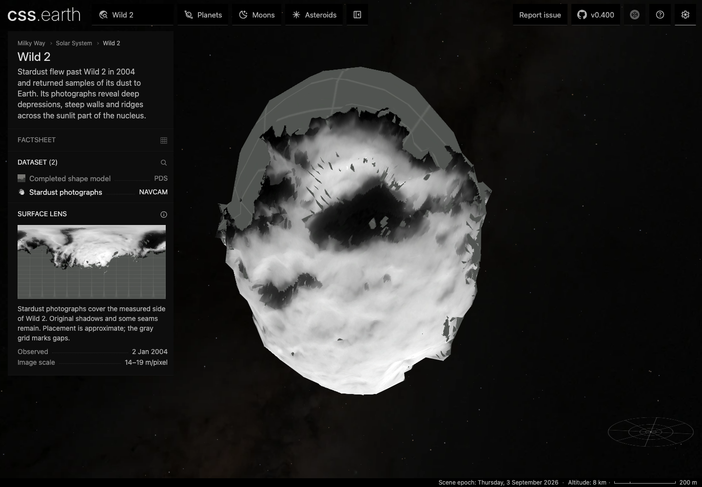
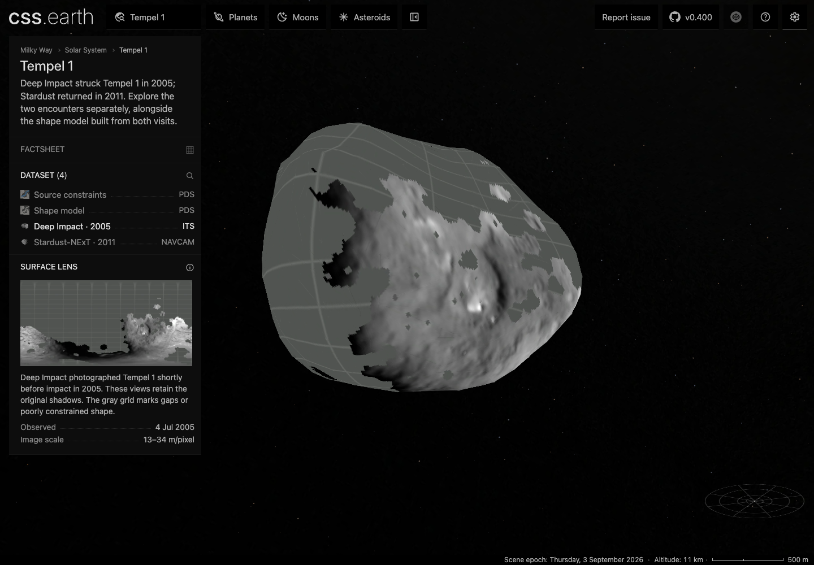
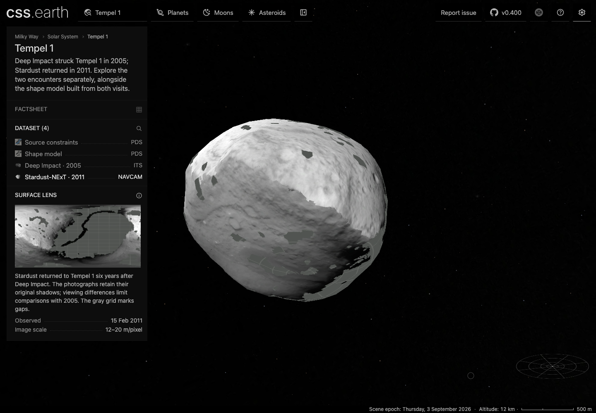
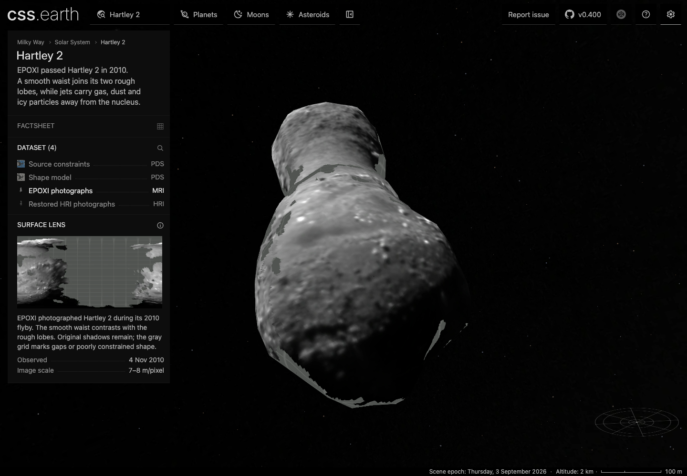
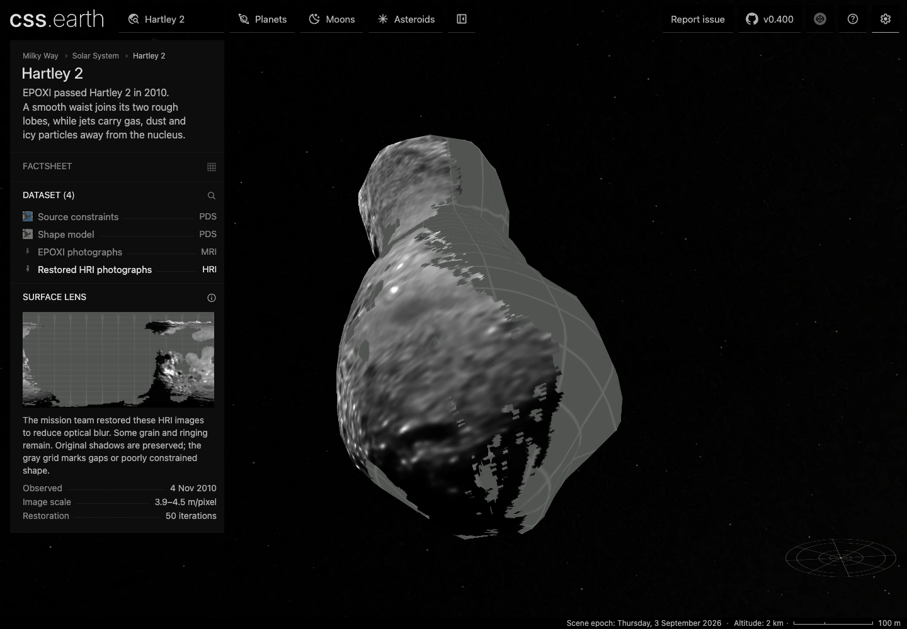

# Wild 2, Tempel 1 and Hartley 2 encounter photographs

Five optional datasets add spacecraft photography to the three existing nuclei. Tempel 1 keeps its 2005 and 2011 encounters separate; Hartley 2 offers MRI photographs and the mission team's restored HRI images. Shape geometry, defaults, navigation and the shared shell are unchanged. Dataset rows use instrument names. Each view has a short explanation and two or three facts.

## Selected observations

| Body / view | Archived products | Instrument / sampling |
| --- | --- | --- |
| Wild 2 / Stardust | N2073, N2075, N2077; 2 January 2004 | NAVCAM; 14–19 m/pixel |
| Tempel 1 / Deep Impact · 2005 | 9000632, 9000639, 9000654; all before impact | ITS; 13–34 m/pixel |
| Tempel 1 / Stardust-NExT · 2011 | N30036, N30039, N30042 | NAVCAM; 12–20 m/pixel |
| Hartley 2 / EPOXI | 6000001, 6000002, 6000003 | MRI; 7–8 m/pixel |
| Hartley 2 / Restored HRI | 5004004, 5004008; 50 restoration iterations | HRI; 3.9–4.5 m/pixel sampling, not resolved terrain scale |

The original products, labels, source-format documents, camera controls and acquisition recipes are pinned beside each body. The source notes record the alternatives examined and why they were not selected: [Wild 2](../../src/planets/comet-81p/source/reference/encounter-photography.md), [Tempel 1](../../src/planets/comet-9p/source/reference/encounter-photography.md), [Hartley 2](../../src/planets/comet-103p/source/reference/encounter-photography.md).

## What the photographs represent

These are calibrated-radiance photographs with their original shadows. Bounded overlap gains reduce brightness seams; they do not recover albedo or remove the physical phase dependence. The finest nominal image scale wins among valid observations. Selecting a source never depends on pixel brightness. Valid dark and negative calibrated pixels remain eligible.

Preparation checks all four bilinear contributors against detector validity and the original source mesh. Full-mesh rays establish visibility; a bounded closest-surface transfer places the image on the existing simplified geometry. Estimated Wild 2 faces and source-flagged poorly constrained Tempel/Hartley faces remain grid-marked. Photographed shadows are retained without a sunlight-incidence cutoff. Grid areas are missing accepted photograph/shape correspondence, not black surface material.

Wild 2's photographic placement is approximate. Its released stereo grid is bound to the archived encounter trajectory, then checked against separate topographic patches; the runtime pole is unchanged. Tempel uses its published pole and encounter Sun longitudes. Hartley uses the published three-axis frame near closest approach; its short sequence is not a full reconstruction of the comet's tumbling. Independent holdout controls are reprojected at preparation time. Full residuals, source-scale tolerances and limitations remain in each prepared observation report.

The 2005/2011 Tempel lenses permit encounter inspection, not a precise before-and-after change measurement. HRI restoration reduces camera blur but can leave grain and ringing. Spacecraft-visible jets and particles outside the mesh do not become surface texture.

## Qualification

Numerical, browser, source-restoration and payload results are recorded with the final prepared assets below. The [independent FITS anchors](evidence/encounter-decoder-anchors.json) bind 14 original products to an Astropy read, including quality values and negative/nonfinite radiance cases. The regression tests also exercise detector overclock exclusion, retained shadowed pixels, projection handedness, independent EPOXI camera axes, disjoint footprints and recomputed holdout residuals.

| View | Accepted surface area | Largest frame holdout RMS | Existing scene leaves |
| --- | ---: | ---: | ---: |
| Wild 2 / NAVCAM | 38.82% | 66.82 m | 992 |
| Tempel 1 / ITS | 30.92% | 58.28 m | 1,000 |
| Tempel 1 / NAVCAM | 49.73% | 27.72 m | 1,000 |
| Hartley 2 / MRI | 43.34% | 11.66 m | 1,000 |
| Hartley 2 / restored HRI | 32.31% | 13.29 m | 1,000 |

The [numerical receipt](evidence/encounter-qualification.json) records every frame, source hash, fit and holdout result, overlap gain and coverage calculation. Coverage is estimated with 32 equal-area samples per retained triangle; it excludes atlas bleed. Both `terrain.json` and `scene.json` remain byte-for-byte identical to main at `e97ee9532b17beaf0c7ae38281c5bef12b64fa5b` for all three bodies.

[Fresh source restoration](evidence/encounter-source-restore.json) downloaded 40 files (242,690,950 bytes) into three new empty source directories and verified the resulting source packages. The 90 tracked source pins were also checked against the exact Git blobs, preserving the archive labels' original fixed records.

[Detailed Chrome conformance](evidence/encounter-conformance.json) passes 39 cases across the three bodies, including desktop/mobile interaction, pre-ready input and material request races. [Production lens readbacks](evidence/encounter-browser.json) pass six body/DPR runs: all five datasets, both lighting settings, DPR 1 and DPR 2. The same highest-density atlases are selected at both densities. Every scene retains its nodes across lens changes and dragging, with no runtime source-data requests, drag image fetches, forbidden rendering features or browser errors.

## Runtime delivery

The three runtime inventories contain 114 files totaling 24,416,222 bytes. This change adds 15 immutable images (2,190,882 bytes): five surface atlases, five shadow atlases and five minimaps. All local bytes match the manifests. [Delivery verification](evidence/encounter-runtime-delivery.json) currently records the new remote objects as unavailable; a fresh remote installation remains pending. No source FITS, reconstruction grids or source-index rasters are runtime downloads.

## Production views

These are unaltered Chrome screenshots at 1440 × 1000. Additional viewer shadows are disabled so the original photographic shading is visible. Each [capture receipt](evidence/encounter-posters.json) includes its saved view URL, scene transform, selected atlas, image hash and browser version. The pale grid deliberately exposes gaps; the photographs do not cover a complete nucleus.

### Wild 2 — NAVCAM

### Tempel 1 — Deep Impact ITS, 2005

### Tempel 1 — Stardust-NExT NAVCAM, 2011

### Hartley 2 — MRI

### Hartley 2 — restored HRI

