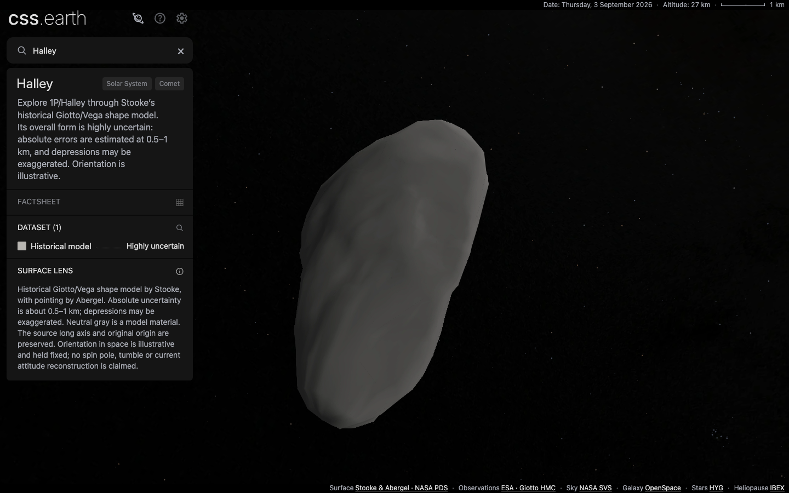
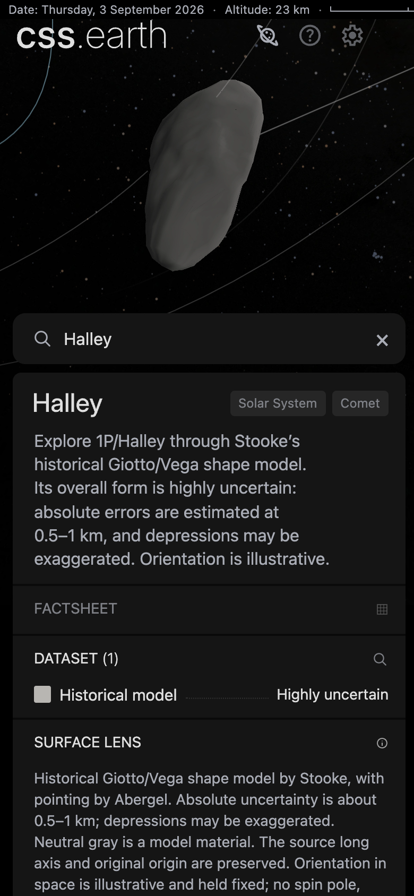
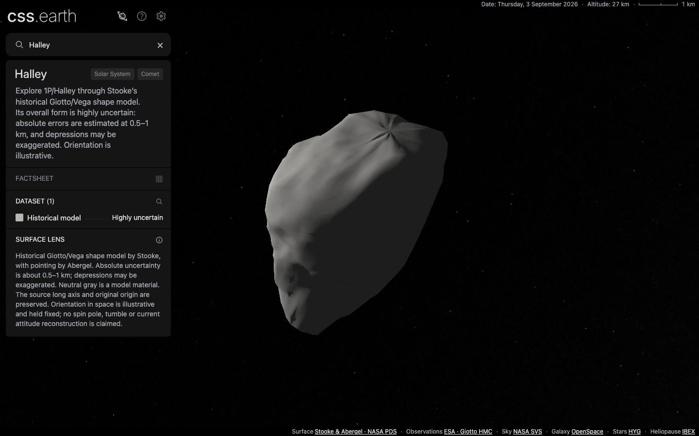

# Halley historical model

Halley is the fifth comet in PR #37, at `/comet-1p/`. Application revision
**f3e5c127ea705db533c0b61790c7f022680bb89a** adds a source-backed historical
nucleus model through the existing object adapter. The scene has **1,000 native
CSS triangle leaves** and a single **Historical model** view, visibly labelled
**Highly uncertain**. The shared shell supplies navigation, drag, zoom, Shadows
and Orbit controls.

The subsequent [Giotto encounter-image intake](HALLEY-GIOTTO.md) decodes seven
pinned original frames but leaves the photographic lens unqualified: the
binding to Stooke body coordinates and usable surface coverage remain
unresolved. It changes no application or prepared scene assets.



## Scientific scope

The [specific PDS4 product](https://sbnarchive.psi.edu/pds4/non_mission/small_bodies.stooke.shape-models/data/1682q1halley.xml)
archives Philip Stooke's Giotto/Vega reconstruction, with pointing by Alain
Abergel. Its 2,701 longitude/latitude/radius rows use kilometres and east-positive
longitude. The exact table, label, bundle description and source pins are retained
beside the package. [SOURCE.md](../../src/planets/comet-1p/SOURCE.md) records the
coordinate conversion, attribution, rejected texture candidates and limitations.

The archive estimates absolute errors of **0.5–1 km**, relative point-to-point
errors around 100 m, and warns that facets and depressions may be exaggerated.
The source even considers the convex hull comparably plausible. We retain the
archived shape and disclose that uncertainty beside it. This is not a resolved
terrain or photographic-albedo claim.

The table supplies no regional confidence flags. A selective grid would invent
a confidence boundary, so Halley uses a whole-model label. Its neutral gray
material and prepared lighting are inspection aids. The original model origin
and long-axis local frame are preserved. The displayed attitude is illustrative
and fixed; no current spin pole, tumble, period or rotational phase is claimed.
No coma, tail or outgassing is added.

JPL Horizons elements at JD 2461286.5 place the model in the shared solar context.
The [independent vector residuals](evidence/halley-orbit-errors.json) are
1.862 millimetres at the epoch and
557.989/551.882 km at minus/plus 30 days. The osculating conic is qualified for
nearby placement only, with a 642 km regression guard under the separate
10,000 km budget. It is not a long-term ephemeris.

## Geometry and preparation

The source grid becomes 2,522 unique vertices and 5,040 triangles. Seam/pole
duplicates retain the longitude-zero sample. The generic radius loader's
existing 1 mm tolerance now includes binary roundoff at its boundary; larger
disagreements still fail. Independent cardinal anchors and the existing
west-positive Larissa/Proteus conversions pass regression tests.

Meshoptimizer 1.2.0 reduces the closed mesh to 1,000 triangles using source
positions, with an estimated error of 59.14 m. Both meshes remain single closed
outward components with Euler characteristic two. Volume changes by about
−0.321%. The source equivalent-volume radius, 4.57906433330178 km, supplies
display scale, not a precisely measured radius. The [mesh record](evidence/halley-mesh.json)
contains topology, bounds, volumes and simplifier settings.

The [source-fit record](evidence/halley-source-fit.json) separates geometric
distance from view-dependent range differences. Across finite unweighted
samples, source-to-prepared surface distances have p95 38.69 m and maximum
114.82 m; prepared-to-source distances have p95 43.88 m and maximum 129.24 m.
These are not exhaustive Hausdorff bounds or observational uncertainties.

Six 96 × 96 orthographic views cast 55,296 rays: 39,130 hit both meshes, 120 hit
only the source, and 46 hit only the reduced mesh. Conditional line-of-sight
range differences have p95 94.52 m and maximum **6,225.26 m**. At silhouette and
occlusion transitions a ray can hit a distant surface despite a small nearest
surface distance; the large range outlier is retained in the report. It must not
be described as a bounded 59 m geometry error.

Source normals and directional/flood lighting are baked into two fixed atlases.
An authored `framingScale` of 0.7 fits the elongated body in the initial desktop
view without changing its physical size, origin, mesh or targeting triangles.
The [existing-payload audit](evidence/halley-existing-payloads.json) finds only
heliocentric marker index/count changes in 66 existing scene/runtime JSON files.
Object geometry and material ownership remain in each package.

## Validation

The [gate record](evidence/halley-gates.json) binds commands and log hashes.
The full unit suite passed; the final framing-only correction additionally
passed seven Halley/camera tests, all-source verification and a fresh full build.
The application revision above owns the final browser captures and traces.
The first conformance attempt used the production server, which deliberately
omits its required development diagnostics; that timeout is excluded. The
accepted nine-case run uses the development server. All other browser evidence
here uses the production build.

| Check | Result |
| --- | --- |
| Source verification | PASS, all 76 registered objects |
| Full `pnpm test` | PASS, 1,784 tests across packages, renderer, platform and shell |
| Final `pnpm build` | PASS, all routes and runtime assembly |
| Loader/coordinate regressions | PASS, nine tests, including Larissa and Proteus |
| Final Halley/camera tests | PASS, seven tests |
| Production `pnpm test:browser` | PASS, 152 object/DPR cases plus two six-hop navigation runs; zero problems |
| Detailed Halley conformance | PASS, nine cases, including desktop, mobile, startup and DPR 1/2 |
| Native surface targeting | PASS, six views at each DPR: 705 painted interior hits and 4,083 clear misses; zero mismatches per density |
| Five-comet navigation | PASS, 11 visits at each DPR through all five comets and Earth, including repeats; one scene, retained shell/universe, no node/style growth |
| Fresh source/runtime restoration | PASS, exact pinned downloads and production byte identity |

The [surface-targeting report](evidence/halley-surface-hit.json) compares prepared
picking with the actual native CSS triangle footprints, excluding recorded
raster-boundary samples. [Detailed conformance](evidence/halley-conformance.json),
[all-object DOM checks](evidence/halley-dom-all.json) and
[five-comet navigation](evidence/halley-navigation.json) retain their full results.

Production captures inspect default, rotated and close views, both lighting
states and DPR 1/2. The [visual record](evidence/halley-visuals.json) includes
camera matrices, runtime and actual loaded atlas hashes, raw screenshot hashes,
retained-node checks and request sizes. All eight desktop captures and both
390 × 844 DPR-2 mobile captures were inspected. The default desktop conservative
leaf bounds fit within the viewport at both densities. Close views retain source
facets, sharp pole-normal patterns and fine triangle-edge hairlines; they are not
additional observed detail. These are unmodified Chrome captures, without a
photograph/browser pixel-parity claim.



## Installation and transfer costs

A fresh source directory restored three downloaded inputs and verified all
19 manifest entries. All 31 immutable runtime assets were published to the
existing content-addressed store. The normal
`pnpm setup:assets --object=comet-1p` command then downloaded **31 files, zero
reused**, totalling **7,093,310 bytes**. Every installed asset matches the
inventory and production build; see [asset identity](evidence/halley-assets.json).

That inventory is not the entire page transfer. Each fresh desktop browser
context measured **505 HTTP responses**, **27,282,699 encoded response-body
bytes**, and **27,418,348 response-body-plus-header bytes**, including shared
shell, navigation, context and prepared JSON. Chrome request-size accounting
excludes transport overhead. Both DPRs loaded the same atlas bytes; lighting
switches, the captured drags and zoom added zero requests. There is only one lens,
so no separate lens-switch download is claimed.

Each 1,024 × 4,032 body atlas represents 16,515,072 RGBA bytes; the two banks
total **33,030,144 calculated RGBA bytes**. This is calculated pixel storage,
not measured GPU residency.

## Production drag traces

Chrome 152.0.7977.76, headless on Apple M3 Max (Mac15,11, 36 GiB),
1440 × 900 CSS pixels at emulated DPR 1/2. Four sequential runs use the same
production build, Shadows enabled, and three vertical drag cycles with 60 pointer
steps per leg. No other task-owned test/build/browser workload ran during these
traces; this remains a shared workstation. Body shape and default framing differ,
so the matched input does not imply an identical painted footprint.

| Body | DPR | Median draw interval, ms | p95, ms | Maximum, ms | Largest main task, ms | Dropped without presentation |
| --- | --- | --- | --- | --- | --- | --- |
| Halley | 1 | 16.680 | 17.694 | 55.532 | 52.168 | 2 |
| Halley | 2 | 16.683 | 17.703 | 71.502 | 54.521 | 2 |
| 67P control | 1 | 16.673 | 17.657 | 59.715 | 46.276 | 2 |
| 67P control | 2 | 16.669 | 17.622 | 54.489 | 54.876 | 2 |

Halley's median/p95 cadence is close to 67P in these runs. Its longest draw gap
is 71.50 ms, and each run records two pipeline sequences dropped without a
recorded presentation. These captures do not establish uninterrupted 60 fps or
other-device performance. Every run retains all 27,075 stage nodes, including
1,000 nucleus leaves, with zero page/console errors and zero interaction-time
requests. The canonical atlas URLs remain unchanged.

[Halley DPR 1](evidence/halley-drag-comet-1p-dpr-1.json),
[Halley DPR 2](evidence/halley-drag-comet-1p-dpr-2.json),
[67P DPR 1](evidence/halley-drag-comet-67p-dpr-1.json) and
[67P DPR 2](evidence/halley-drag-comet-67p-dpr-2.json) contain per-category timings,
GPU details, loaded HTML/JavaScript/atlas hashes, prepared hashes and compressed
trace hashes. The [identity audit](evidence/halley-trace-identity.json) verifies
those bytes against the actual production build and records all eight inspected
before/after screenshot hashes. Draw intervals come from Chrome DrawFrame events;
requestAnimationFrame is recorded separately. Nested duration spans overlap and
must not be summed into a frame budget.



Reproduce one run after building and serving the production site:

```sh
node tests/objects/browser/comet-67p/drag-trace.mjs http://127.0.0.1:4258 1 output/comet-intake/halley/recheck-dpr-1 comet-1p
```

Raw compressed traces and the complete capture set remain locally in
`output/comet-intake/halley/`. Compact reports and selected raw screenshots are
checked in under `docs/comets/evidence/halley-*`.

## Integration limits

The evidence above was captured on the original comet branch, based on
1398bd9025940b6fb0d0188dfa518cdfacba782e. Subsequent integration checks against
newer main are recorded separately in [MAIN-INTEGRATION.md](MAIN-INTEGRATION.md).
The seven independently reproduced baseline preparation-suite failures remain
documented in [QUALIFICATION.md](QUALIFICATION.md); that separate full preparation
suite was not rerun for the Halley addition. PR #37 remains for the user to merge.
