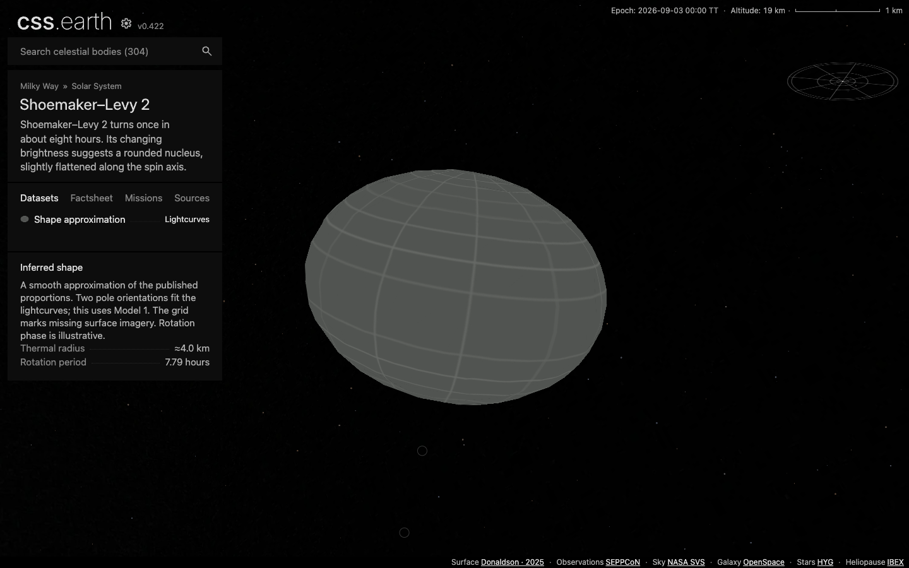
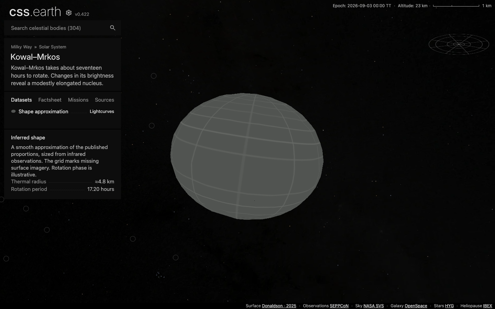
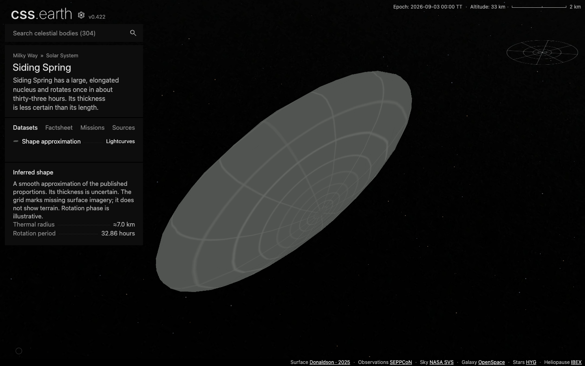

# Three lightcurve-based comet shapes

137P/Shoemaker–Levy 2, 143P/Kowal–Mrkos and 162P/Siding Spring extend the comet collection from seven to ten objects. Each has one **Shape approximation** dataset, an 800-triangle nucleus, two facts and a short explanation. The shared missing-imagery grid covers the entire surface. Shadows start off and can be enabled in Settings.

The [Donaldson thesis](https://era.ed.ac.uk/items/cf7f5ebf-4f32-4f86-95d2-b8dd2e37c8ad) supplies physical axis proportions and nominal poles. [SEPPCoN](https://doi.org/10.1016/j.icarus.2013.07.021) supplies thermal radii. These are smooth approximations, not the original convex meshes. No local terrain, photographic texture or present rotation phase is claimed.

| Object | Physical a/b | Physical b/c | Thermal radius | Rotation |
| --- | ---: | ---: | ---: | ---: |
| 137P | 1.06 | 1.30 | 4.04 km | 7.7883 h |
| 143P | 1.21 | 1.24 | 4.79 km | 17.1988 h |
| 162P | 1.60 | 2.20 | 7.03 km | 32.864 h |

The thermal radius is used as a volume-equivalent display radius. This explicit convention does not establish a measured volume or absolute axis lengths. The source packages retain uncertainties and alternative-model dispositions. 137P uses Model 1 while documenting the valid mirror solution. The rejected 143P mirror model is excluded. For 162P, the physical extents are kept separate from its inertia-equivalent axis ratios.

137P’s ecliptic pole is repeated consistently in the detailed thesis results, but Table 5.2 prints an inconsistent right ascension. Preparation converts the ecliptic coordinates directly; the package records that discrepancy. All three attitudes hold an illustrative fixed meridian at the shared 3 September 2026 epoch.

## Preparation and validation

The shared parameter loader subdivides an octahedron and scales it to the authored ellipsoid. The established meshoptimizer path reduces 2,048 triangles to 800, preserving a closed surface. Both material banks and the grid are baked into 64-pixel atlas cells. The default bank preserves the plain grid without directional darkening. Only the opt-in Shadows bank uses source-normal lighting and cast shadows. There is no runtime geometry, texture generation or extra scene owner.

Numerical checks use the published ratios, independent Horizons vectors and analytic ellipsoid surfaces. The sampled distance bounds use projected analytic surface points, covering every retained vertex, edge midpoint and face centre. They bound nearest-surface distance for those samples; they are neither exhaustive bounds nor observational accuracy. The fixed pole conversion is independently inverted to recover the published coordinates. Existing Tuttle geometry checks cover the extracted common tessellation.

## Delivery and browser evidence

The [review receipt](evidence/lightcurve-review.json) pins the compiled payloads, source manifests and all 93 runtime assets. A fresh installer downloaded all 93 files and verified their hashes. Production browser responses matched those bytes at DPR 1 and 2. Each nucleus retained 800 native `u` leaves with 64 × 64 pixel raster cells. Each material atlas is 1,024 × 3,200 pixels: 13,107,200 decoded RGBA bytes per bank. This is pixel storage, not measured GPU residency.

The three packages passed 33 shared browser-conformance cases. After integrating the latest navigation changes, the desktop cases passed again for all three and for Tuttle. Production checks covered the actual grid pixels, both lighting settings, drag, wheel, compact layouts and stable DOM identity. Search navigation visited all three while retaining the shared sidebar and one object camera. All ten comets passed the default-off and opt-in Shadows checks across 29 datasets.

The generic browser tests now account for prepared depth groups repeating transform wrappers under one camera. Camera setter limits are checked and restored in one task: deliberately holding the furthest dolly distance enters the solar-system overview, so it cannot be held during the following tests of a retained detailed object.

Other completed checks:

- 668 astronomy tests, including independent Horizons vectors for the three additions.
- 12 focused geometry and lighting tests; 30 source and runtime-asset closure checks across all ten comets.
- 73 shared shell, router, overview and framing checks after integration of main `6c8169e95`.
- Clean source restoration with 17 byte-verified entries per new package; package, renderer and preparation typechecks.
- All 304 pinned JSON transports reproduced; the 305-route production build and complete runtime-asset assembly passed.
- A semantic audit against main preserved the geometry, materials and camera fields of all 301 existing packages. Their descriptor/runtime changes are shared marker bindings and payload hashes; the Sun also receives the three world-context source entries.

Repository-wide checks are not all green. Nine renderer failures involving Earth paging and Deimos depth fixtures were independently reproduced from main `3eeb7a414`. Broader platform/shell runs also encountered existing fixture/profile errors and default-heap exits; the shell run was stopped after those exits. The new objects' missing unit-test directories found by that run were fixed, and the discovery check then passed. These aggregate runs are not claimed as passing gates.

