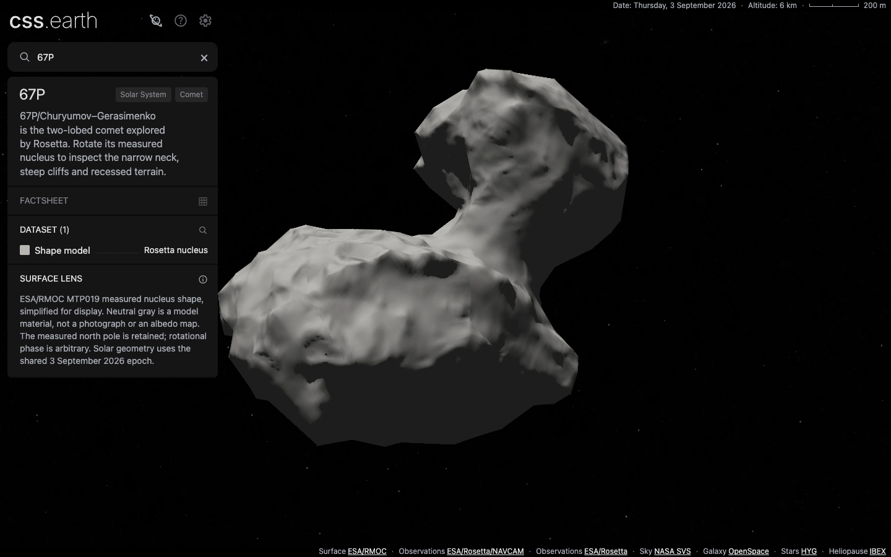
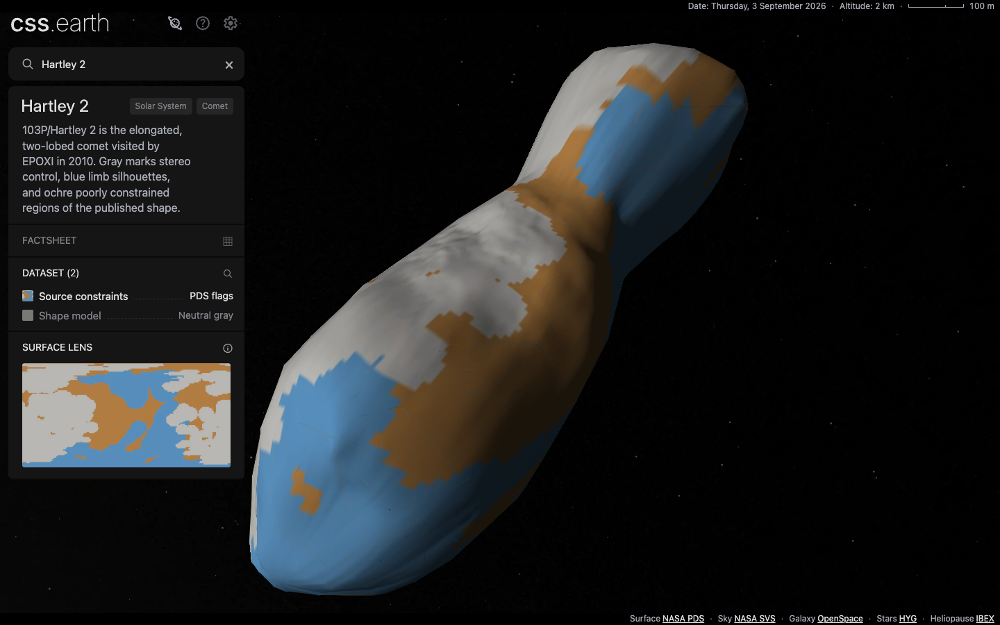
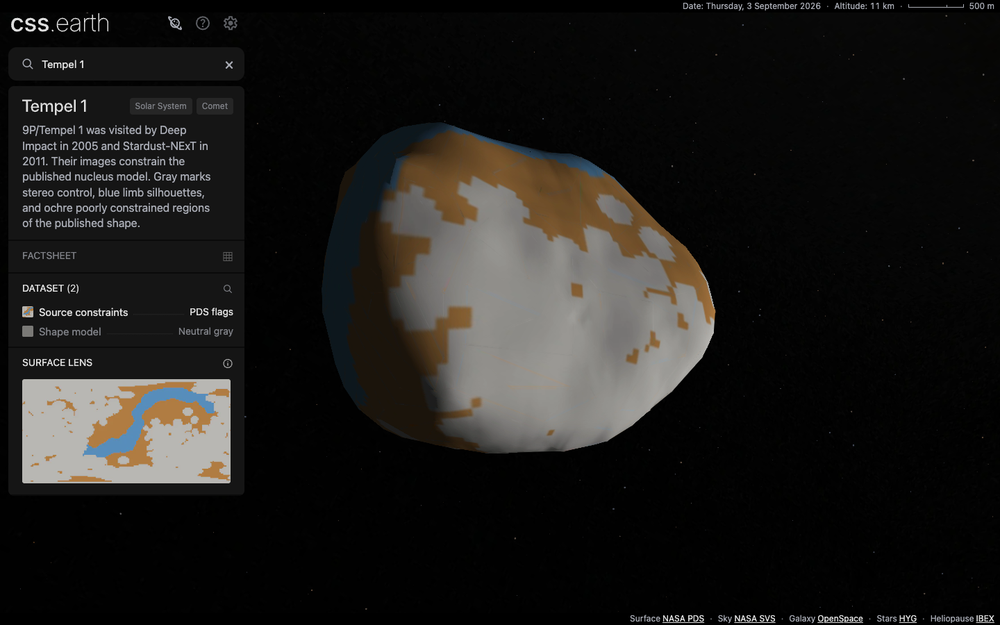
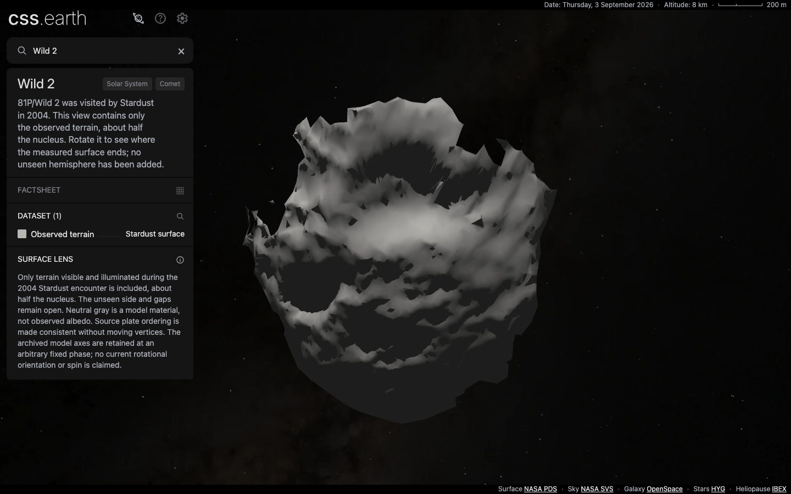

# Qualification record

[Tuttle](TUTTLE.md) adds the sixth comet with independent size/pole/orbit checks. [Its Arecibo comparison](TUTTLE-ARECIBO.md) qualifies two separate inferred models, dataset-specific surface targeting, and a fresh restoration of all 34 published assets. The records separate focused passes from unresolved aggregate failures.

[Encounter photography](ENCOUNTER-PHOTOGRAPHY.md) records the latest Wild 2, Tempel 1 and Hartley 2 material qualification. Earlier geometry records below retain their original scope.

[Halley's qualification](HALLEY.md) adds the fifth comet and brings the registry
to 76 objects. It records current aggregate checks, a nine-case Halley interaction
audit, production navigation, native surface targeting and matched drag traces.
Halley's historical model has 1,000 leaves and a whole-model uncertainty label.

Wild 2 uses the closed, completed PDS model at 992 leaves; [its completion record](WILD2-COMPLETION.md) and [estimated-region grid update](WILD2-GRID.md) supersede the original Wild 2 evidence below. Hartley 2 and Tempel 1 now mark their source-flagged poorly constrained regions with the [shared grid in both views](CONSTRAINT-GRIDS.md), retaining 1,000 leaves each. 67P is unchanged. The original qualification below remains historical evidence for unchanged geometry and behavior, not the latest material hashes.

## Original four-comet qualification

The original PoC contained 67P, Hartley 2, Tempel 1 and Wild 2's observed terrain, integrated with base **1398bd9025940b6fb0d0188dfa518cdfacba782e**. That application build and its aggregate checks use **67217245**; subsequent evidence commits do not change application code or prepared runtime bytes. The shared scene epoch is **3 September 2026**, JD 2461286.5. Arbitrary model phase is not a current rotational orientation.

| Check | Result |
| --- | --- |
| `pnpm acquire:planets -- --verify-only` | PASS, all 75 registered objects |
| `pnpm test` | PASS: packages, 308 renderer tests, 738 platform tests and 220 shell tests |
| `pnpm build` | PASS, including all static routes and runtime assembly |
| `pnpm test:browser http://127.0.0.1:4258` | PASS: 150 object/DPR cases and two six-hop navigation cases; zero problems |
| Detailed comet conformance | PASS: 9 cases each for 67P and Wild 2 on the final implementation, including DPR 1/2, mobile and pre-ready behavior. The 13-case Hartley 2 and Tempel 1 records remain valid for their unchanged lenses and controls |
| Registry-derived comet navigation | PASS, production, DPR 1/2: nine visits per density through Earth and all four comets, including repeats; one scene throughout; shell/universe identity and node/style counts retained |
| Focused comet geometry and trace tests | PASS, seven tests: original source positions, closed or preserved open topology as applicable, categorical source constraints, nearest-surface diagnostics and Chrome trace event interpretation |
| Wild 2 open-surface targeting | PASS, six rotated views at each DPR: 654 native front-face interior hits, 4,135 clear misses including 417 hidden-backface-only misses, zero mismatches per density. Raster-boundary samples are recorded separately |
| Source-fit and close-view measurements | Recorded with finite-sampling and rendering limits in [GEOMETRY.md](GEOMETRY.md) |
| Fresh source restoration | PASS: thirteen real downloads across four empty source directories; exact hashes verified; checked-in authored inputs copied explicitly |
| Fresh runtime restoration | PASS: 130 downloads, zero reused files, 29,322,242 bytes across the current four inventories. Wild 2's 31-file installation uses the normal `pnpm setup:assets --object=comet-81p` command; those downloaded bytes also serve the production browser checks |
| Production drag traces | PASS: eight production captures at c94c7abe retain DOM and atlas identity, with zero errors or interaction-time requests; measured timing limits in [PERFORMANCE.md](PERFORMANCE.md) |
| `pnpm test:preparation` | 500/507 pass; all seven failures reproduce on the unchanged isolated base (477/485 pass there, including one additional Sun manifest-pin failure corrected here) |

The seven preparation failures concern Mercury/Venus celestial compatibility, Ceres refresh coverage expecting `presentation/surface-map.json`, Kleopatra's extra `.gitignore` file, Mercury physical-scene compatibility bytes, Mercury marker/phase/catalogue bytes, Mercury Sun-presentation compatibility bytes, and the missing-marker rejection expectation. The exact-base worktree at `/tmp/cssEarth-comets-baseline-1398` uses restored matching inputs/assets, built packages and regenerated payloads, with no tracked diff. No tolerance or assertion was weakened to hide these failures. Log hashes are in [gate-log-hashes.json](evidence/gate-log-hashes.json).

The initial final-build attempt stopped with `ENOSPC` while copying assets. A subsequent full build passed after recovering space through independent copy-on-write copies of identical pinned source files; every source hash remained unchanged. The failed attempt is retained locally and is not a passing build record.

Integration also corrected two inherited contract issues: the Sun content manifest pins its existing checked-in bytes, and major-body label styling selects registry classifications instead of a literal Sun id. The latter preserves current styling and passed 54 focused ownership/layout checks. Neither change adds a comet-specific shell path.

Wild 2 adds one preparation capability for genuinely open observations and one optional prepared front-face rule for targeting. Existing plans retain their original two-sided hit behavior. The [native-targeting report](evidence/81p-open-surface.json) binds the exact runtime bytes restored after the face-budget trials; the tested picker and harness are unchanged. Points within half a CSS pixel of a source edge are raster-boundary evidence, not interior assertions. That original version left the unseen side open; the current version uses the explicitly labeled PDS completion.

The [existing-payload audit](evidence/81p-existing-payloads.json) compares Wild 2's integration with the three-comet implementation: 65 existing scene/runtime files change only shared heliocentric marker indices/counts. Existing object-owned geometry and materials are unchanged. The application still mounts one object scene through its generic adapter and shared shell.

## Visual evidence and limits

Wild 2's [flood-lit view](evidence/81p-front-flood.png), [close view](evidence/81p-close-flood.png) and [unobserved-side view](evidence/81p-open-side.png) expose both its measured coverage and the limitations of a 996-face, 64-pixel-per-triangle presentation. The [capture record](evidence/81p-visuals.json) includes actions, camera transforms, image hashes and hashes of the actually loaded body atlases. Close-view texture/facet artifacts are not observations; the source-lighting and encoded-edge measurements are in [GEOMETRY.md](GEOMETRY.md#wild-2-close-view-limits).

These are unmodified Chrome screenshots. The original NAVCAM reference beside 67P has a different observer, epoch, pose and optical model; no photograph/browser pixel-parity claim is made. Hartley 2 and Tempel 1 colors identify source constraints, not observed albedo. Wild 2's neutral material also is not observed albedo. The models retain the coordinate, coverage, illumination and orbital-placement limits in their source notes.

The earlier missing-graphics interpretation of Hartley 2 screenshots was disproved by identical file hashes and direct pixel checks. The [capture verification](evidence/capture-anomalies.json) preserves that correction; no application paint fix was made. Production attempts with the development-only conformance harness, hot-reload-interrupted captures and response-body collection failures are excluded from accepted evidence.

[Borrelly](BORRELLY.md) now adds the seventh comet with its observed terrain, explicitly gridded estimated completion and five datasets; its own record gives the new qualification scope. Halley's historical model is now included with the limitations in [HALLEY.md](HALLEY.md). No tail, coma or outgassing simulation is added. The completed Wild 2 shape uses published estimated geometry, explicitly labeled.
