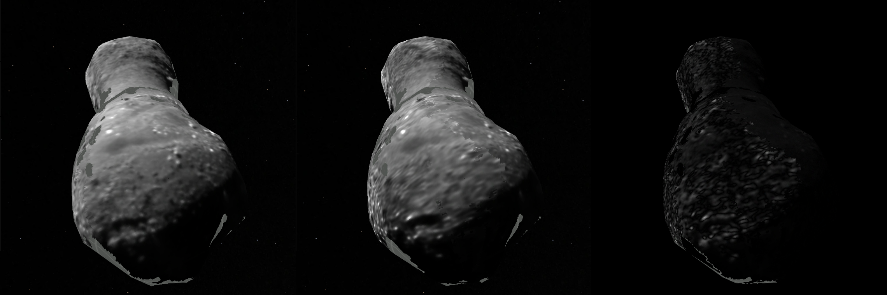
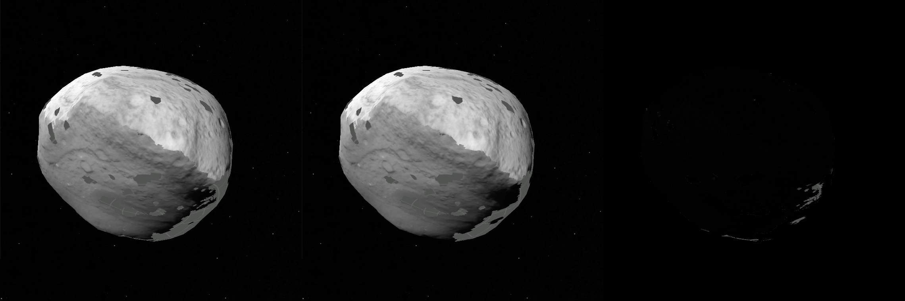
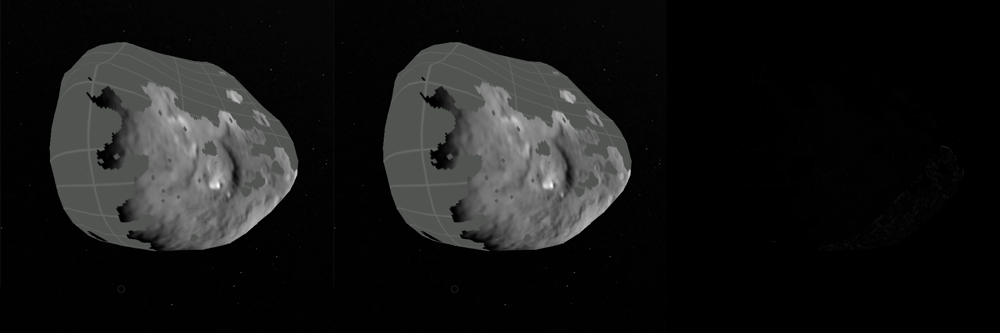
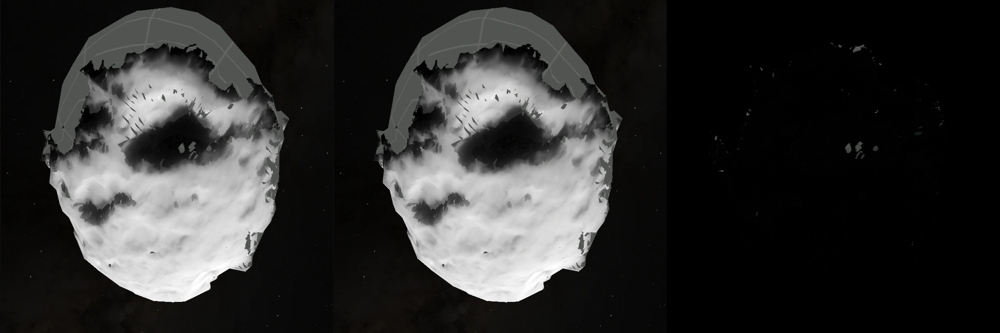
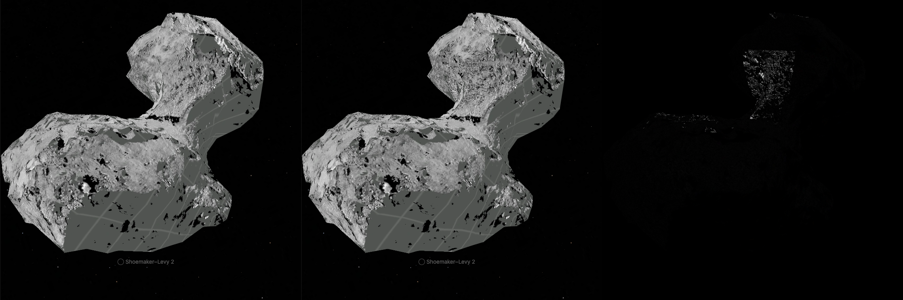
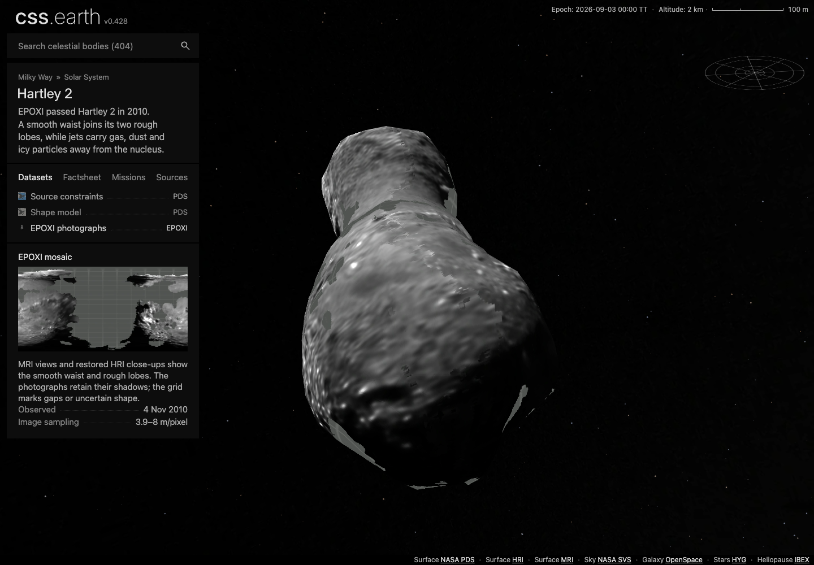

# Comet surface imagery: fuller mosaics, fewer rows

This pass improves the photographic views on four existing nuclei. Compatible images feed one mosaic per encounter. Hartley 2's MRI and restored HRI views become one EPOXI view; Tempel 1's 2005 and 2011 visits remain separate. No photographic dataset row is added.

| Existing view | Before | After | What changes |
| --- | ---: | ---: | --- |
| 67P / OSIRIS | 56.04% | 56.25% | Two closer September images supply small patches within the existing orange-filter mosaic. |
| Wild 2 / NAVCAM | 38.82% | 39.14% | One qualified frame extends the edge of the photographed footprint. |
| Tempel 1 / ITS, 2005 | 30.92% | 31.14% | Two closer frames improve sampling within about 21.48 km² of the existing footprint. |
| Tempel 1 / NAVCAM, 2011 | 49.73% | 54.57% | Three additional directions extend the encounter mosaic. |
| Hartley 2 / EPOXI | MRI 43.34%; HRI 32.31% | 55.75% combined | HRI supplies finer accepted sampling; MRI fills its footprint gaps. One row replaces two. |

Percentages estimate accepted **displayed surface area**, using the unchanged retained mesh: 24 deterministic samples per triangle for OSIRIS and 32 for the other cameras, weighted by triangle area. They exclude atlas bleed and do not claim global cartographic completeness. Grid areas still lack accepted photograph/shape correspondence. Original photographed shadows remain; the additional viewer Shadows setting defaults off.

## Source choices

**Hartley 2:** MRI 6000001–6000003 and the existing 50-iteration HRI restorations 5004004/5004008 cover a short encounter interval. Their independently checked cameras, compatible radiance units and clear-filter visible imagery support one grayscale display. Matching filter labels and central wavelengths do not prove identical spectral responses. All ten overlap pairs pass, with gains 1.00–1.12 under the existing 1.5 limit. HRI grain and ringing remain visible; detector sampling is not a claim of resolved terrain scale. No new source products are needed for this merger.

**Tempel 1:** ITS 9000644 and 9000673 join the three accepted pre-impact frames; the closest accepted sampling improves from 13.47 to 11.03 m/pixel. NAVCAM N30033, N30045 and N30048 join the three existing NExT frames. N30033 anchors the common grayscale stretch, keeping all six gains inside the existing [1/3, 3] bound (0.426–2.337). All 15 NExT overlap pairs pass. The two encounters remain distinct visual composites, not a precise measurement of surface change.

**Wild 2:** N2079 passes nine fitted and six independent withheld topographic patches. Its 24.97 m/pixel sampling loses priority wherever a closer accepted image exists. N2081 supplies only four fit and four holdout patches, below the six-point minimum, so it is excluded.

**67P:** September 13 and 20 orange-filter GEO products retain the exact SHAP7 identity required by the archive erratum. Every L4 radiance pixel matches its L5 companion; their maximum disjoint camera residuals are 0.00190 and 0.00161 source pixels. The existing lowest-emission selection remains in force, and the new images supply about 1.76% of the displayed area. Gains remain 1.00–1.21 under the original 1.35 limit. A September 12 close-up and a July 29, 2015 southern view were tried but do not connect to the accepted overlap graph under the existing limits. They are excluded from this mosaic; this is not evidence that those archive products are unusable for other work.

Exact products, raw labels, source hashes, measured controls and acquisition operations live beside each body. See [67P](../../src/planets/comet-67p/SOURCE.md), [Wild 2](../../src/planets/comet-81p/source/reference/encounter-photography.md), [Tempel 1](../../src/planets/comet-9p/source/reference/encounter-photography.md) and [Hartley 2](../../src/planets/comet-103p/source/reference/encounter-photography.md).

## Preparation and qualification

No renderer, shared runtime, adapter, shell, camera or mesh changes are part of this pass. The same source-distance, detector, visibility, registration and photometric acceptance limits apply. All processing occurs during preparation; runtime selects fixed image banks on retained triangle leaves.

The [independent FITS anchors](evidence/encounter-decoder-anchors.json) now cover all 20 encounter products, including their quality maps and negative/nonfinite radiance. The regression gate reprojects the actual camera fit and holdout coordinates against each source-shape hash.

The [final numerical and geometry receipt](evidence/surface-imagery-qualification.json) binds every photographic frame to the prepared result and confirms byte-identical terrain files, unchanged camera/geometry recipes and unchanged acceptance limits against the integrated main branch. The integrated preparation, package, router and runtime suite passes 87 tests; the four source packages pass 12 closure tests. Twelve geometry/science tests also pass.

[Source restoration](evidence/surface-imagery-source-restore.json) downloads the 16 new archive files through their acquisition recipes (433,735,312 bytes) into fresh destinations. Unchanged source inputs were copied from the previously qualified packages; this is a restoration test of the new inputs, not a fresh download of every historical source.

[Runtime delivery](evidence/surface-imagery-delivery.json) verifies 15 changed image URLs by HEAD and downloads all 167 current runtime files into an empty directory, with exact byte lengths and SHA-256 hashes. The changed versions total 4,100,318 bytes. Across these four bodies, the current inventory decreases from 170 files / 45,942,500 bytes to 167 files / 45,663,340 bytes. Older content-addressed releases remain available.

The [validation record](evidence/surface-imagery-validation.json) records integrated test counts, build and assembly hashes, and the unrelated renderer failures.

## Browser and production checks

The production site contains 406 generated routes for the 404-object registry. The build uses the repository's pinned JSON restore, followed by minimap preparation, Astro's production build and runtime assembly. The four comet packages were fully prepared before this build. This is not a claim that the slower all-object `pnpm prebuild` completed.

The production [image and DOM readbacks](evidence/surface-imagery-browser.json) cover all five photographic views at DPR 1 and 2: actual atlas bytes match the runtime manifests, both densities use the same image banks, one object remains mounted, triangle identities remain stable, and dragging requests no new scene assets. No forbidden render elements/styles or source-data requests appear. All [28 dataset selections across ten comets](evidence/surface-imagery-shadow-defaults.json) keep Shadows off. To check the alternate prepared lighting bank, the probe clicks the retained Shadows input programmatically because the shared shell intentionally hides Settings; this is not an accessible-Settings UI claim.

The browser conformance helper now handles that same hidden Settings contract when enabling motion, while retaining the normal panel-opening and Escape checks whenever Settings is visible. This is a test-only change. The production renderer and shared shell are unchanged by this PR. All [60 comet conformance cases](evidence/surface-imagery-conformance.json) pass on the integrated branch, including desktop, mobile, both pixel densities, pre-ready state, and lens race/reacquisition/rejection/destruction.

The current renderer unit suite reports **367 passing and nine failing tests**. The failures are in `paging/capabilities`, `navigation/surface-target`, `validation/depth-partitions` and `validation/paged-presentation`. Those test files and their Earth/Deimos tracked fixtures match main. The full repository aggregate is not green.

## Matched visual comparisons

Each panel triplet shows **the previous atlas on the current renderer, the current atlas, and the absolute RGB difference**. Browser, camera, viewport, geometry and lighting match exactly; both old and current texture readbacks match their respective manifests. These isolate the intended material change and do not claim pixel parity with source photography. The [visual record](evidence/surface-imagery-visuals.json) includes hashes, transforms and pixel statistics. Both front and turned views were captured; the panels below use the front views.

### Hartley 2 / EPOXI

### Tempel 1 / NAVCAM, 2011

### Tempel 1 / ITS, 2005

### Wild 2 / NAVCAM

### 67P / OSIRIS

### Consolidated Hartley sidebar

