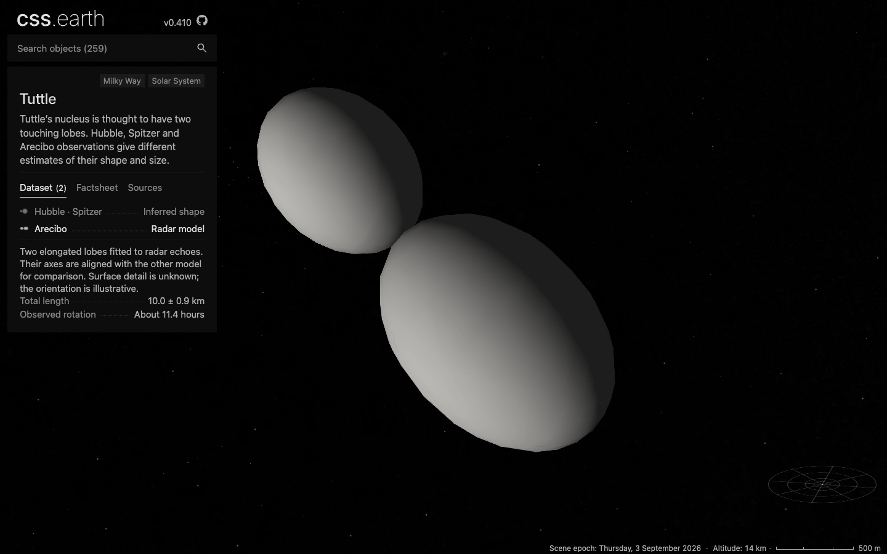

# Tuttle: Hubble/Spitzer and Arecibo

Tuttle now has two selectable datasets in the same object scene. **Hubble · Spitzer** remains the default; **Arecibo** shows the longer radar model. Switching preserves the camera and physical scale. Each dataset has a shape thumbnail, a short explanation and two facts.

The [latest main integration](TUTTLE-MAIN-INTEGRATION.md) preserves both models alongside all 300 objects and records the refreshed build, browser and merge checks. The detailed source-fit and timing receipts below retain their original revision bindings.

[Hubble/Spitzer at the same camera](evidence/tuttle-arecibo-dpr-1-model-shadows.png), [Arecibo at DPR 2](evidence/tuttle-arecibo-dpr-2-arecibo-shadows.png), [flood lighting](evidence/tuttle-arecibo-dpr-2-arecibo-flood.png), [surface flight and drag](evidence/tuttle-arecibo-dpr-1-turned.png), and [820 px layout](evidence/tuttle-arecibo-dpr-1-mobile.png) show the production build. The small-layout image follows a surface flight and is not its initial framing. Faceting and faint triangle seams remain visible at close zoom.

## Source interpretation

[Harmon et al. (2010), section 3](https://echo.jpl.nasa.gov/asteroids/harmon.etal.comet.tuttle.pdf) gives full lobe dimensions of **5.75 × 4.11 × 4.11 km** and **4.25 × 3.27 × 3.27 km**, combined length **10.0 ± 0.9 km**, and a synodic rotation period of **11.385 ± 0.004 hours**. The checked-in model uses those original dimensions without Spitzer rescaling. Limited aspect coverage and 300 m radar range resolution do not establish a unique spin pole or a resolved global terrain mesh.

The default retains the Hubble sphere proportions and Spitzer size scale used in [Groussin et al. (2019)](https://arxiv.org/abs/1911.04897). Their thermal comparison favors that family. Its lobe radii remain 2.6563 and 1.1384 km. The [original Tuttle review](TUTTLE.md) retains its independent aspect-angle, pole and Horizons checks.

The two alternatives use aligned axes for comparison, with an equal-density volume origin calculated independently for each model. Arecibo's displayed attitude is illustrative; the alignment does not claim a radar pole or an observed rotation phase. Neither view adds measured surface detail. Unresolved Spitzer images and spectra do not supply another surface texture.

## Preparation and geometry

Each model starts with 4,096 source triangles and reduces independently to 1,000 retained native CSS triangles, locking the exact contact point. The [geometry-bank check](evidence/tuttle-arecibo-geometry-banks.json) verifies that the default model's prepared faces are unchanged. The renderer retains 2,000 leaves and displays only the selected 1,000, inside one object scene and the existing shared camera. Geometry, thumbnails, atlases and lighting are prepared before runtime.

The generic prepared surface-hit contract now carries a triangle range for each dataset. Committing a selection changes both the visible bank and its picking range. An inactive shape cannot intercept surface input. Other objects retain their existing single-mesh behavior. Selection-dependent display conservatively leaves this scene on native CSS depth ordering; no per-frame geometry generation or second scene owner is introduced.

The [Arecibo source-fit report](evidence/tuttle-arecibo-source-fit.json) measures 6,148 source vertices/centroids against the reduced surface: nearest-surface p95 **34.59 m**, maximum **53.68 m**. In the other direction, 4,000 samples give p95 **33.02 m**, maximum **53.06 m**. Six orthographic grids test 55,296 rays, with 452 source-only silhouette hits and zero prepared-only hits. These finite samples are not an exhaustive error bound or observational uncertainty. Large conditional range differences near occlusion transitions are reported separately from nearest-surface distance.

## Browser and delivery checks

The [production receipt](evidence/tuttle-arecibo-browser.json) records Chrome **152.0.7977.84**, 1440 × 900 at DPR 1/2, and a third run using freshly restored runtime files. Actual transported prepared JSON and JavaScript hashes bind the screenshots to application source `4162dd8c91e1f056b4c888b7d06a3777ac27ba9e`.

All three runs retain the same 2,000 leaves and geometry, render one object scene, and report zero console errors, forbidden scene elements/styles, or network requests during surface flight, drag and wheel interaction. Both shadow and flood banks are checked against their published asset hashes. The 820 px layout has no horizontal overflow and preserves the camera on wheel input. These are desktop Chrome checks, not physical-phone evidence.

Independent analytic ellipsoid intersections choose screen points exclusive to each model. Native double-clicks distinguish the visible surface from the inactive silhouette in both directions. The test prevents the cancelable empty-sky deselection event during this comparison, isolating surface flight from the shared overview flight; it records the expected background deselection requests. Production deselection behavior is unchanged. Settings is hidden by the current shared shell, so lighting is exercised through its existing input binding programmatically.

The [retained-DOM audit](evidence/tuttle-arecibo-dom.json) passes at both DPRs. Five [shared lens conformance cases](evidence/tuttle-arecibo-lens-conformance.json) pass against the development server: initial shell, racing selection, reacquisition, rejection/retry and destruction. The [comet navigation receipt](evidence/tuttle-arecibo-navigation.json) covers all six comets at both DPRs, 26 visits with one scene and retained shell/universe.

The [runtime restoration](evidence/tuttle-arecibo-runtime-delivery.json) installed all **34 files / 7,324,578 bytes** into an empty destination, reused zero files and verified every size and SHA-256. The browser fixture served restored scene bytes, including both lighting banks for both models. The [source fixture](evidence/tuttle-arecibo-source-restoration.json) reverified all **21 source entries**, reusing the two unchanged previously downloaded binaries and updating the checked-in authored inputs.

Normal production cold responses total **30,570,555 body bytes** at either DPR. First selection of Arecibo adds **202,810 body bytes** for its two atlases. The fixture proxy separately records 63,548,928 cold body bytes; those are not production transfer costs. Each canonical atlas is 1024 × 4032 pixels. Four atlases amount to 66,060,288 calculated RGBA bytes if all are decoded together, not measured GPU residency.

## Matched drag samples

The existing three-cycle, 60-step-per-leg vertical drag harness ran sequentially for both models at DPR 1/2, with the same default camera, 1440 × 900 viewport, production application and Chrome version on the M3 Max workstation. All four runs retained the 74,007-node stage, 2,000 body leaves, 1,000 displayed leaves and their atlas bindings, with zero errors or interaction requests.

| Dataset | DPR | Draw interval p95 | Largest draw interval | Style event p95 | Dropped/unpresented sequences |
| --- | ---: | ---: | ---: | ---: | ---: |
| [Hubble · Spitzer](evidence/tuttle-arecibo-trace-model-dpr-1.json) | 1 | 17.696 ms | 58.438 ms | 5.542 ms | 4/397 |
| [Hubble · Spitzer](evidence/tuttle-arecibo-trace-model-dpr-2.json) | 2 | 17.879 ms | 66.240 ms | 5.597 ms | 0/395 |
| [Arecibo](evidence/tuttle-arecibo-trace-arecibo-dpr-1.json) | 1 | 17.891 ms | 36.506 ms | 5.388 ms | 2/393 |
| [Arecibo](evidence/tuttle-arecibo-trace-arecibo-dpr-2.json) | 2 | 18.104 ms | 23.260 ms | 5.272 ms | 0/399 |

These are individual samples on a shared workstation, not a cross-device guarantee or evidence that one model is faster. The receipts bind application revision, actual loaded bytes, prepared hashes, exact interaction window, hardware/browser identity and local compressed trace hashes.

## Gate scope

Renderer/preparation builds and typechecks, the 260-page Astro build, Tuttle assembly, seven model/provenance tests, package/source/asset closure, shared radial/lighting/preview/provenance regressions, and presentation/transport validation pass. The [gate receipt](evidence/tuttle-arecibo-gates.json) gives the exact scope and log hashes.

Repository-wide readiness is not all green. The older aggregate limits remain in the [original review](TUTTLE.md#gate-status-and-remaining-limits). The previous remote CI run also stopped on a Patroclus assertion after 311 passes: its test expects that primary to be absent although main already includes it. [The evidence](evidence/tuttle-arecibo-prior-ci-limit.json) verifies the assertion and Patroclus source record are unchanged from main; it is not a new whole-suite baseline run. The focused results above do not imply that those aggregate gates passed.
