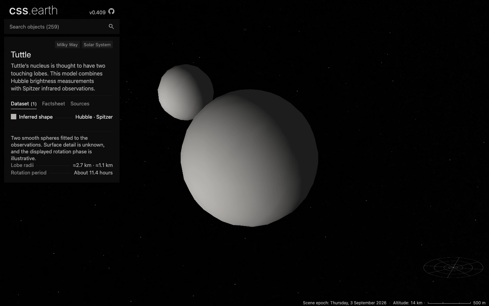

# Tuttle inferred nucleus

This is the original single-dataset review. [The Arecibo comparison](TUTTLE-ARECIBO.md) supersedes its dataset count, thumbnails, scene bank, transfer sizes and browser/performance results. The source geometry, HST pole and orbital checks below remain applicable.

Tuttle adds a sixth comet at `/comet-8p/`, using the same scene, camera, settings
and navigation as the existing bodies. Its **Inferred shape** dataset has two
smooth touching lobes. The explanation identifies the unknown surface detail
and illustrative rotation phase; two facts give the lobe radii and observed
rotation period.

The selected [Hubble/Spitzer model](https://arxiv.org/abs/1911.04897) preserves
the HST model's 7:3 radius ratio and applies the square root of the published
thermal flux scale. The displayed radii are 2.6563 and 1.1384 km; the factsheet
shows approximately 2.7 and 1.1 km. The paper reports ±0.1 km for each rounded value. The independent radar
family remains documented separately, rather than being blended into this
geometry. [The package source notes](../../src/planets/comet-8p/README.md)
record candidate dispositions, coordinates, uncertainties and credits.

## Geometry and source checks

The shared preparation loader tessellates published contact-ellipsoid
parameters, preserving their full connectivity. Meshoptimizer reduces 4,096
source triangles to 1,000 native PolyCSS triangles. The source contact point is
locked during reduction. No runtime geometry or lighting is derived.

The source-to-prepared comparison samples every source vertex and face
centroid. Nearest-surface distance has p95 31.99 m and maximum 47.66 m. In the
other direction, prepared face centroids and edge midpoints give p95 31.29 m
and maximum 47.97 m. These finite samples are not an exhaustive geometric bound
or observational uncertainty. Six orthographic views include 382 source-only
silhouette hits; their largest conditional range difference is 1.60 km near
occlusion transitions. A range difference along a ray is not a nearest-surface
distance.

Independent Spitzer vectors reproduce the paper's 92° and 65° aspect angles
within 0.12°. Horizons placement agrees within about 1.3 mm at the prepared
3 September 2026 epoch and within 438 km at ±30 days. The scene holds an
arbitrary fixed phase, with the published HST pole and no current spin claim.

## Delivery and validation

The 31 published runtime files total **7,119,056 bytes**. The normal installer
restored all 31 into an empty destination, reusing zero files, and verified every
size and SHA-256. The browser also exercised those downloaded scene files through
a temporary local proxy. Shared application files came from the production build.
The proxy's transfer totals are recorded separately from normal production costs.

Required ignored source inputs were restored from their pinned acquisition URLs;
the source fixture includes the explicitly copied, checked-in authored inputs.
All 19 Tuttle source entries verify. The scene's package/source/asset closure has
three passing checks. Four independent Tuttle model tests, fourteen existing mesh
and lighting tests, and five surface-preview tests pass.

The new main's preview preparation assumed every terrestrial recipe used an
ellipsoid. The fix dispatches the affine ellipsoid recipe explicitly and honors
the existing exclusion for model-only flat maps. The regression uses a solid-body
recipe, declared lens controls and an intentionally absent image, so it exercises
both failures without inventing a surface map.

[Geometry comparison](evidence/tuttle-geometry.png),
[source-fit samples](evidence/tuttle-source-fit.json),
[source restoration](evidence/tuttle-source-restoration.json),
[runtime restoration](evidence/tuttle-runtime-delivery.json), and
[asset dimensions](evidence/tuttle-payload-sizes.json) retain their exact hashes.
The geometry diagram compares the tessellated source parameters with the reduced
mesh under one orthographic camera. It is not a photograph/browser pixel oracle.

## Production browser review

[DPR 2](evidence/tuttle-dpr-2-shadows.png),
[flood lighting](evidence/tuttle-dpr-1-flood.png),
[surface flight and drag](evidence/tuttle-dpr-1-turned.png), and
[820 px layout after surface flight](evidence/tuttle-dpr-1-mobile.png)
show the same production application, revision
`18095d92b0be53f3873cff55f1b39e838f71c473`, in Chrome 152.0.7977.76.
The small-layout image is a close view after flying toward the surface, not the
initial framing. These are desktop Chrome captures, not physical phone tests.

The [browser receipt](evidence/tuttle-browser.json) binds the actual transported
prepared object and JavaScript hashes to the screenshots. DPR 1, DPR 2 and the
fresh-runtime run each retain all 1,000 surface elements and their geometry,
mount one object, and report zero forbidden scene elements/styles, console
errors or requests during interaction. Native double-click, drag and wheel
input exercise surface flight and zoom. Wheel input preserves the camera at
820 px. The card has two facts and its expected short explanation.

The current shared shell hides Settings. Both prepared lighting banks were
therefore exercised through the existing input binding programmatically;
this does not establish a visible Settings interaction. The shared panel also
omits the empty legend component when a dataset has no legend, avoiding the
unhelpful “No legend supplied” placeholder.

Normal production cold responses total **30,510,850 body bytes** at either DPR;
switching lighting adds zero body bytes because both banks are already loaded.
The fresh-file proxy separately records 62,797,744 cold body bytes and 105,472
bytes on the lighting switch. Those proxy totals are not production transfer
measurements. The two canonical 1024 × 4032 surface atlases together represent
33,030,144 calculated RGBA bytes, not measured GPU residency.

The [retained-DOM check](evidence/tuttle-dom.json) passes at both DPRs.
The [six-comet navigation run](evidence/tuttle-navigation.json) passes 26 visits
across both DPRs, preserving the shared shell and universe with one object scene.
It ran after integration of main `4848897e`, before the final copy and empty-legend
trim; those edits did not change navigation. The
[ownership report](evidence/tuttle-ownership.json) finds one generic package entry
and one camera factory. Its static result is not a native lifetime observation.

## Matched drag sample

Tuttle and Halley were measured sequentially on the same M3 Max workstation,
production application and Chrome version at 1440 × 900. Each run uses three
vertical drag cycles, 60 steps per leg, shadows enabled and no wheel input.
Both bodies render 1,000 surface elements. Every run retained scene identity
and atlas bindings, with zero interaction requests or console errors.

| Body | DPR | Draw interval p95 | Largest draw interval | Style event p95 |
| --- | ---: | ---: | ---: | ---: |
| [Tuttle](evidence/tuttle-trace-comet-8p-dpr-1.json) | 1 | 18.395 ms | 48.463 ms | 5.551 ms |
| [Tuttle](evidence/tuttle-trace-comet-8p-dpr-2.json) | 2 | 18.183 ms | 58.347 ms | 5.485 ms |
| [Halley](evidence/tuttle-trace-comet-1p-dpr-1.json) | 1 | 19.111 ms | 56.540 ms | 5.870 ms |
| [Halley](evidence/tuttle-trace-comet-1p-dpr-2.json) | 2 | 18.561 ms | 49.784 ms | 5.714 ms |

These are individual headless Chrome samples on a shared workstation, not a
cross-device guarantee or evidence that either body is faster. Reports include
loaded bytes, prepared hashes, browser/GPU identity, exact interaction windows,
main-thread event costs and hashes of the local compressed traces.

## Gate status and remaining limits

The full build passes after merging main's dataset cards and spectral surfaces.
The final copy and panel edit then passed Tuttle preparation, a 260-page Astro
build and assembly. Focused source/model, package/asset closure, shared mesh and
lighting, preview, canonical image-density, provenance and card checks pass.
The [gate receipt](evidence/tuttle-gates.json) retains counts, scope and log hashes.

The [existing-payload audit](evidence/tuttle-existing-payloads.json) checks 504
existing JSON files against main `4848897e`. Existing runtime changes are marker
indices/counts and their resulting prepared hashes. The Sun additionally gains
the single Tuttle entry and its source pins. Existing body geometry and other
runtime data remain equal under that semantic comparison.

Aggregate readiness is **not all green**:

- The pre-integration `pnpm test` run passed 761 package tests, then stopped at
  six Earth renderer expectations (340 renderer tests passed). The preparation
  aggregate had 1,175 passes and 112 failures across existing candidate,
  source-closure and compatibility checks. These older aggregate runs were not
  repeated after main integration, and not every failure was independently
  reproduced on a clean baseline.
- The integrated shell run initially had 250 passes and eight failures. Focused
  reruns cleared the memory limit, stale prepared provenance and legend failures.
  Four existing Itokawa browser-profile failures remain outside this change.
- The all-object source verifier stops at Aegaeon's stale content size pin.
  [Both involved files are byte-identical to main](evidence/tuttle-main-source-limit.json).
  Tuttle's 19 source entries verify independently.
- The older detailed zoom conformance test requests comet diagnostics after
  zooming out has navigated to the Sun. That mismatch reproduced on Tuttle and
  Halley. It is not counted as a passing conformance suite. The pre-integration
  platform aggregate was interrupted and supplies no completion claim.

An earlier [all-object browser regression](evidence/tuttle-all-object-browser.json)
passed 518 object/DPR cases and two navigation sequences before PR53/PR61 were
integrated. Its [complete console log](evidence/tuttle-all-object-browser.log)
is retained as historical evidence; the current Tuttle and comet-navigation
receipts above cover the integrated application.
