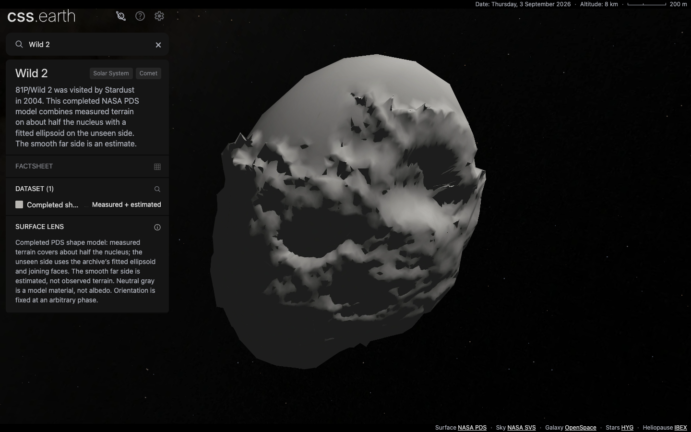
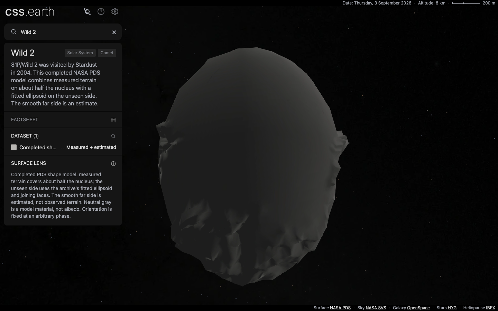

# Wild 2 completed shape

Wild 2 now uses the full NASA PDS plate model, reduced to 992 retained CSS triangle leaves. The mesh is closed. The active lens, panel introduction and coverage fact identify the estimated far side.

## Source and geometry

The original `wild2_cart_full.tab` supplies 8,761 vertices and 17,518 plates. Its flags identify 6,432 observed vertices and 2,329 ellipsoid vertices, with 12,364 observed plates, 4,338 ellipsoid plates and 816 joins. The label assigns the joining faces no physical meaning beyond connecting the segments. The loader validates the flags against each plate's vertices and records the category counts in preparation metadata.

The full model is one consistently wound closed component, Euler characteristic 2. Reduction preserves that topology and original full-model vertex positions. Its volume differs by 2.29% from the source full model; this is not a measured-volume accuracy claim. Each observed-only source vertex has a unique counterpart in the full release within 11.22 mm (mean 3.49 mm). They are distinct published coordinate products, not byte-identical point sets.

A 1,000-face target needs a 55 m simplifier allowance and yields 992 faces after removing eight exactly opposite, coincident faces. The library estimate is 54.33 m. Independent finite nearest-surface samples give source-to-prepared mean 17.49 m, p95 46.56 m and maximum 159.19 m; the reverse maximum is 96.21 m. These measurements are not exhaustive error bounds or source-observation precision. [Full source-fit report](evidence/81p-full-source-fit.json).

The unseen geometry, material, arbitrary fixed phase and lighting are model interpretations. There is no new observed terrain, albedo map, uniform spin, tail or coma. Lighting and companion imagery are regenerated from the selected full mesh; runtime consumes prepared assets through the existing generic adapter.

## Qualification

The implementation is `b2cdc391`; subsequent documentation commits do not alter its application or prepared runtime bytes.

| Check | Result |
| --- | --- |
| Source verification | PASS: `pnpm acquire:planets -- --verify-only`, all 75 objects |
| Main suite | PASS: `pnpm test`, including 308 renderer, 738 platform and 220 shell tests |
| Build | PASS: full `pnpm build`, static routes and runtime assembly |
| Focused geometry/source tests | PASS: eight Wild 2 / source-parser tests and five geometry/lighting-preparer tests |
| Mounted DOM | PASS: `pnpm test:browser http://127.0.0.1:4258 comet-81p`, DPR 1 and 2, stable nodes during drag |
| Comet navigation | PASS: Earth and all four comets, nine visits per DPR, one scene and retained shell/universe |
| Surface targeting | PASS: six rotated views per DPR, 1,415 painted-surface hits and 3,243 background misses, zero mismatches per DPR |
| Fresh sources | PASS: normal acquisition into an empty source destination, four downloads; all 20 declared inputs/documents verified |
| Fresh runtime installation | PASS: normal `pnpm setup:assets --object=comet-81p`, 31 downloaded, zero reused; 7,233,398 bytes verified and served by the production preview |

The new browser checks target the changed surface and shared comet navigation. The previous full 150-case browser run remains evidence for unchanged objects. The separate preparation suite's seven reproduced baseline failures remain documented in [QUALIFICATION.md](QUALIFICATION.md); that full suite was not rerun for this focused change. No existing assertion was weakened to hide a failure.

The first main-suite attempt failed with `ENOSPC`; it is not a passing run. The retry passed after disk space became available. [Accepted gate-log hashes](evidence/81p-full-gate-logs.json), [source restoration](evidence/81p-full-source-install.json), [DOM evidence](evidence/81p-full-dom-cleanliness.json), [navigation](evidence/81p-full-navigation.json) and [targeting](evidence/81p-full-surface-hit.json) identify the checks.

The install total covers this object's inventory, including its background assets; it is not a measured full cold network transfer including shared shell and JSON.

## Visual inspection

The [capture record](evidence/81p-full-visuals.json) binds the user camera URL, default front, flood-lit front, close zoom and previously empty-side view to the exact runtime and loaded atlas hashes. All five raw Chrome screenshots were inspected. The inferred side is a continuous smooth surface. Reduced facets, sharp cast-shadow edges and texture-cell artifacts remain visible, particularly at close zoom; they are rendering/model limits, not new geological observations. These are source-backed model views, not photograph-matched pixel-parity evidence.

## Drag performance

Two replacement production traces use Chrome 152.0.7977.76 on an Apple M3 Max, 1440 × 900, Shadows on, three vertical drags with 60 steps per leg. Both retain all 26,822 scene nodes (including 992 body leaves), the canonical @2x atlas, and zero interaction requests or console/page errors.

| DPR | Draw interval median (ms) | p95 (ms) | Maximum (ms) | Maximum main task (ms) | Dropped pipeline sequences |
| --- | ---: | ---: | ---: | ---: | ---: |
| 1 | 16.739 | 19.340 | 54.644 | 34.912 | 8 |
| 2 | 16.748 | 19.094 | 59.149 | 39.671 | 10 |

[DPR 1 trace report](evidence/81p-full-drag-dpr-1.json) · [DPR 2 trace report](evidence/81p-full-drag-dpr-2.json). Compressed raw traces remain under `output/comet-performance/full-81p-retry-dpr-{1,2}/chrome-trace.json.gz` with hashes in the reports. Prepared hashes were reverified after capture. These are shared-workstation samples, not a claim of uninterrupted 60 fps or a controlled hardware comparison.

Each body atlas is 1,024 × 3,968 pixels: 16,252,928 calculated RGBA bytes, or 32,505,856 across the two lighting banks. This is not measured GPU residency. The prior open-surface budgets and traces remain historical.

The first replacement capture stalled before producing a screenshot, with a defunct renderer process. Its task-owned Chrome process was stopped and it is excluded from performance evidence; the two fresh captures completed successfully.
