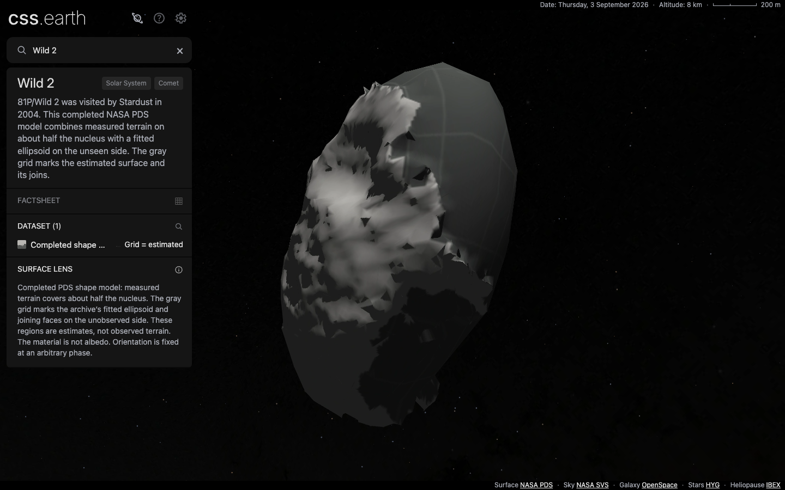
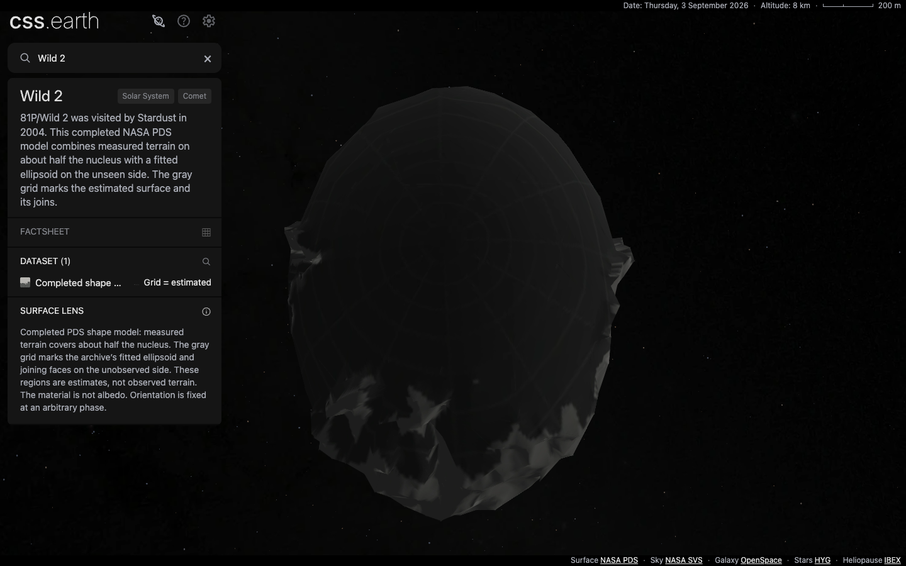

# Wild 2 coverage grid

The completed Wild 2 mesh now displays cssEarth's shared gray coverage grid on the published ellipsoid and artificial joining regions. Observed terrain retains the neutral model material. The visible lens detail says **Grid = estimated**. These are source-derived coverage categories, not observed colors or albedo.

The original PDS plate flags select the material before raster filtering and lighting: flag 0 retains neutral gray, while flags 1 and 2 receive the shared grid. A 512 × 256 equirectangular material is reproduced from the pinned full table. All 17,518 source plate centers agree with their radial projection's observed-versus-estimated classification. This finite check is not an exhaustive subpixel boundary proof; raster filtering and mesh reduction limit boundary precision. Tests also verify that observed black is preserved and that both estimated categories use the existing grid style.

The mesh, targeting triangles, camera and retained leaf layout are unchanged from `8f43abc2`: **992 body leaves**. The terrain file and surface-targeting data are byte-identical. The prior [closed-mesh source-fit and targeting evidence](WILD2-COMPLETION.md) remains applicable to that unchanged geometry. Both lighting atlases, the lens thumbnail, context image and navigation marker were regenerated from the same material. This lens has no minimap.

## Validation

Application commit: `71d2efd9`. The material generator and Wild 2, Hartley 2 and Tempel 1 focused tests pass (seven tests). Source verification passes for all 75 objects. The full production build and a normal fresh Wild 2 runtime installation pass: 31 downloads, zero reuse, **7,278,674 bytes**, each hash checked against both the inventory and the files served by the production preview. That is 45,276 bytes more than the uniformly colored completion; it excludes shared shell/JSON transfer.

The full `pnpm test` passes, including 308 renderer, 738 platform and 220 shell tests. An earlier attempt overlapped preparation and failed three checks on temporarily mismatched Wild 2 source pins; that run is excluded. The complete retry ran after preparation and build finished. [Accepted gate-log hashes and excluded attempt](evidence/81p-grid-gate-logs.json).

Real Chrome 152.0.7977.76 passes the shared retained-DOM check at DPR 1 and 2: 26,822 scene nodes, 992 body leaves, and no reported problems. Six raw production screenshots cover the user's exact camera URL, default view, Shadows on/off, close zoom, and the estimated far side. Their capture record binds the runtime and actual loaded atlas bytes. All six were inspected. The grid follows the existing lighting and is faint on dark-facing surfaces; close-view facets and texture-cell artifacts remain. These are model views, not photograph-matched parity evidence.

[Source-category registration](evidence/81p-grid-registration.json) · [unchanged geometry and targeting](evidence/81p-grid-geometry-identity.json) · [fresh installation](evidence/81p-grid-runtime-install.json) · [DPR 1/2 DOM check](evidence/81p-grid-dom-cleanliness.json) · [visual capture record](evidence/81p-grid-visuals.json).

Navigation through Earth and all four registry-derived comets passes at DPR 1 and 2, retaining the shared shell and universe with exactly one mounted object scene. [Navigation record](evidence/81p-grid-navigation.json).

Both body atlases remain 1,024 × 3,968 pixels, totaling 32,505,856 calculated RGBA bytes. This is not measured GPU residency. The previous closed-mesh drag traces describe the prior material; this change makes no new frame-rate claim. [Current atlas sizes and hashes](evidence/81p-grid-atlases.json).

## Other comets

Hartley 2 and Tempel 1 have explicit PDS flags for stereo control (1), limb silhouette (2), and regions not constrained by either method (3). Flag 3 is a suitable candidate for the same grid with a **poorly constrained** label; it is not identical to Wild 2's ellipsoid completion. Their existing source-constraint lenses remain unchanged in this update. Their vertex counts are not surface-area percentages.

The selected 67P MTP019 documentation describes full-nucleus coverage. Its OBJ supplies no equivalent per-region coverage flags, so no grid boundary is inferred from visual smoothness or simplification. 67P remains unchanged.
