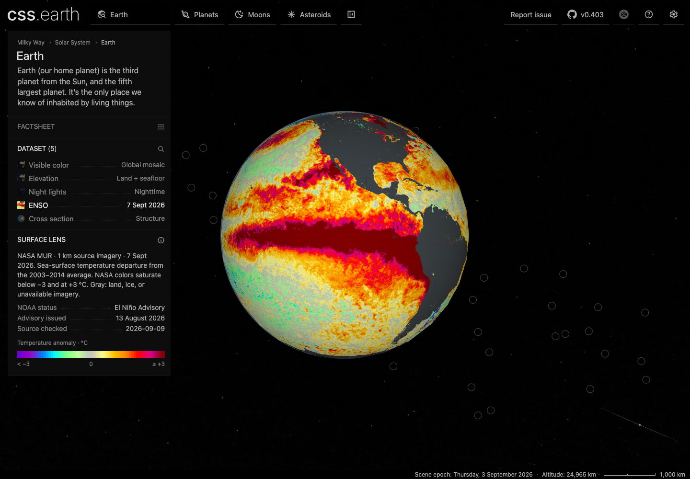

# Current ENSO view

Earth’s ENSO lens uses NASA’s open **MUR v4.1 sea-surface temperature anomaly imagery**, delivered through [NASA EOSDIS GIBS](https://www.earthdata.nasa.gov/engage/open-data-services-and-software/api/gibs). The current snapshot is **7 September 2026**, the latest default advertised and actually returned when checked on 9 September UTC. It requires no Earthdata login. The observation date, 2003–2014 climatology, NASA color scale, source, and separately dated NOAA ENSO advisory appear beside the globe.

The [underlying MUR analysis](https://podaac.jpl.nasa.gov/dataset/MUR-JPL-L4-GLOB-v4.1) uses a 0.01° grid. GIBS exposes its 1 km imagery as a 40,960 × 20,480 global grid: 80 × 40 tiles of 512 pixels. All **3,200 tiles** are retained with individual hashes, sizes, URLs and actual response dates. Every populated tile must attest the requested date and MUR v4.1 layer. GIBS sometimes omits those headers for completely transparent tiles; these are accepted only after decoded alpha verifies they contain no observations.

This is NASA’s published color imagery, not the raw numerical netCDF field. The preparation intermediate preserves its [0.1 °C color bins](https://gibs.earthdata.nasa.gov/colormaps/v1.3/GHRSST_Sea_Surface_Temperature_Anomalies.xml), including saturation below −3 and at +3 °C. It does not reconstruct continuous measurements from RGB. Transparent land, ice, and unavailable imagery remain gray. The legend is generated from the same pinned NASA color table.

## Resolution and payload

Pixel-center nearest sampling creates a reproducible **16,384 × 8,192** preparation intermediate. The existing Earth atlas then samples it into the unchanged **8K runtime texture budget**. “1 km source imagery” describes the source; the displayed globe does not retain every native source pixel. Scene geometry, retained nodes, camera behavior and non-ENSO assets remain unchanged.

The 3,200 original PNGs total **47,638,424 bytes** and their retained archive is **45,833,893 bytes**. These sources never enter the browser. ENSO’s ten prepared assets, including its 603-byte legend, total **3,766,713 bytes**, compared with **2,332,732 bytes** for the accepted CoralTemp 5 km version: **+1,433,981 bytes**. Earth’s complete 151-asset manifest totals **38,359,462 bytes**. Manifest size is the complete available asset set; the browser receipt separately records actual requests at initial entry, first ENSO selection and after switching all lenses. Text and JSON traffic in that local production fixture is uncompressed.

The source and palette changed together. The previous CoralTemp analysis uses a 1991–2020 baseline and a different display range, so screenshots are not a controlled comparison of resolution alone. That accepted 5 km checkpoint remains at `20a6cf6c`.

The ENSO surface and polar atlases use **WebP Q60 with encoder effort 6**, preserving alpha at quality 100. Against the initial MUR Q84 assets this saves **2,758,700 bytes (42.3%)** without changing dimensions. A direct-from-prepared-pixels sweep covered Q90 through Q10 plus lossless. The largest atlas shrank from 2,073,954 bytes at Q84 to 1,161,284 at Q60. There was no abrupt numerical cliff; visual inspection found fine structures merging around Q30–40 and clearly smearing at Q20. Q60 leaves a margin above that deterioration. The [compression sweep](evidence/earth-enso/compression-sweep.json) records every size, RGB error and alpha check; the [identical-scale crops](evidence/earth-enso/compression-cliff.png) show the judgment.

Like the earlier version, the runtime atlas uses resampling and lossy WebP, so its displayed RGB is not an exact numerical data lookup. The pinned source intermediate and lossless legend remain exact.

The final production browser run requested only the ENSO thumbnail and legend (**5,017 bytes**) before selection. Selecting ENSO brought its cumulative requests to **3,766,713 bytes**. The complete page cold-load requested **65,506,769 bytes** in the uncompressed local HTTPS fixture, including shared scene/navigation resources; this is not a deployed compressed transfer measurement. Compression of ENSO does not resolve that separate page-wide cost.

## Refresh and reproduction

Run `pnpm refresh:earth-enso` to discover the current GIBS default, download and verify the complete native imagery, refresh the NOAA advisory, update source pins and visible content, and rebuild Earth’s prepared package. The refresh refuses an older snapshot, a substituted date or layer, an unexpected native grid or color table, and incomplete tile coverage. Download concurrency is eight, with bounded retries and a 250 MB source-transfer guard. There is no automatic refresh schedule.

To recreate the ignored 16K intermediate from the checked-in archive without network access, run:

```sh
node tools/objects/paged-ellipsoid/mur-imagery.mts restore src/planets/earth/source/science
```

Restoration checks the archive hash and every tile hash, reconstructs the mosaic, and requires a byte-identical PNG hash before installing it. Ordinary Earth preparation then consumes that pinned intermediate. A refreshed observation requires requalifying the independent source witnesses and browser evidence before publication.

The advisory is contextual: [NOAA’s issued ENSO advisory](https://www.cpc.ncep.noaa.gov/products/analysis_monitoring/enso_advisory/ensodisc.shtml) is dated 13 August 2026 and states El Niño Advisory. This status is not inferred from imagery colors.

## Rendering and verification

The camera frames the eastern Pacific and both Americas at 110° W, with north up and the equator horizontal. The 650 ms shortest-path rotation preserves zoom; reduced motion applies the target immediately. The 4× approach limit is unchanged.



The [evidence receipt](evidence/earth-enso/receipt.json) binds the source archive, prepared payload, actual served production scripts, browser requests, screenshots and recording. The focused Earth/router suite passes all 47 checks, and all 60 source records verify. Offline restoration reproduces the accepted intermediate byte for byte. Independent Python/Pillow [native witnesses](evidence/earth-enso/mur-native-witnesses.json) bind named ocean and masked locations to original archived NASA tile pixels; JavaScript tests compare those witnesses against the preparation intermediate.

Production browser evidence at DPR 1/2 checks native drag/wheel input, all five lens switches, retained node identities, north-up orientation, short transition timing, unchanged camera distance, matching asset selections, an aligned legend, and absence of runtime scientific-data requests. Physical mobile has not been tested. The broader Earth invocation previously passed 128 checks and failed its unchanged retired-city `places.test.mjs`; that test is outside this globe MVP change.

## PR integration on current main

The PR branch integrates the accepted dataset checkpoint `ba1a180c7` onto main `4848897ee`, preserving its source-attributed facts, sidebar minimaps, and provenance preparation. All 151 runtime asset pins remain identical to that checkpoint. ENSO also has a new 80814-byte sidebar minimap, recorded separately from the globe asset manifest. Fresh checks pass 62 Earth/router/minimap/provenance tests, 11 renderer contract tests and all 60 source records. The [integration receipt](evidence/earth-enso/main-integration.json) binds the new prepared payload.

The screenshots, 259-page production build and DPR1/2 browser recordings above belong to the accepted dataset checkpoint. They have not been rerun after integrating current main. Their 5,017-byte preselection and page-wide traffic figures therefore must not be treated as new measurements of the integrated PR.
