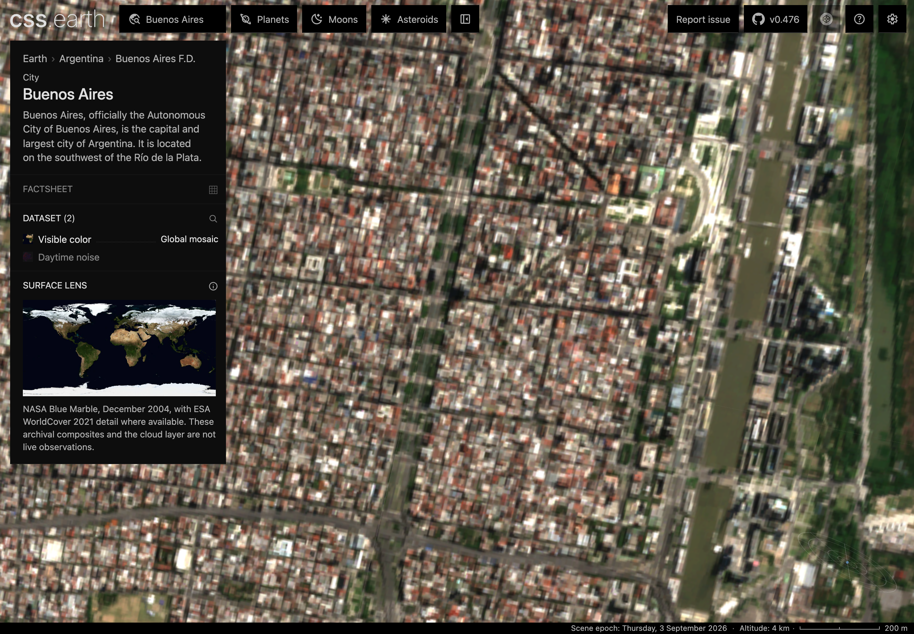
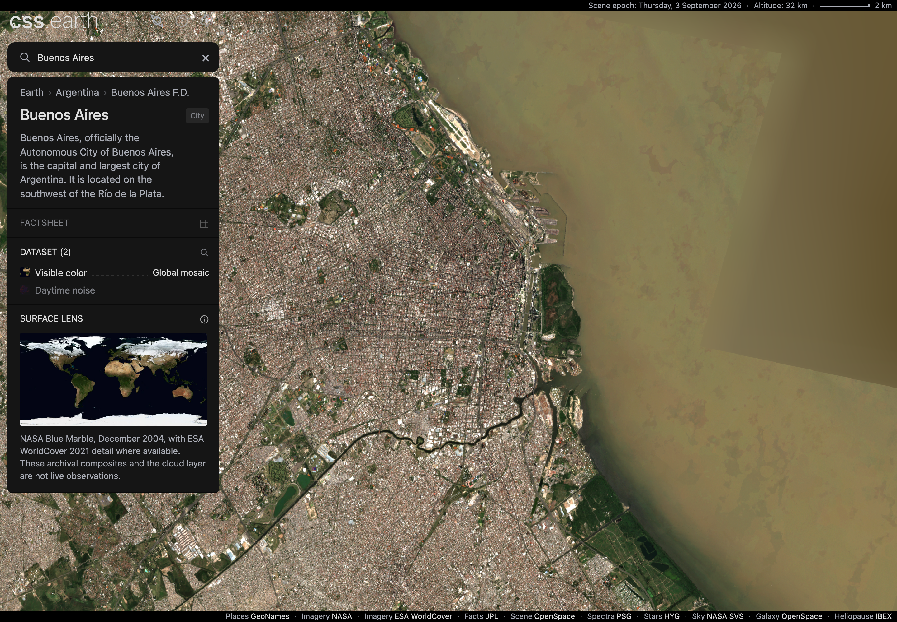
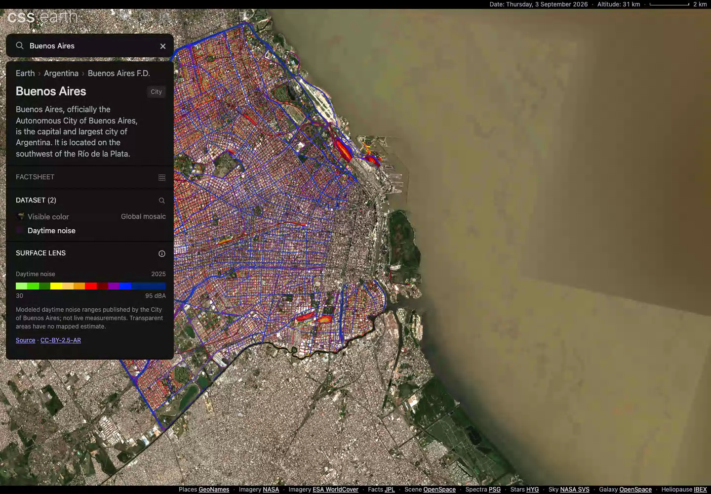

# Geographic feature qualification

Earth zoom is verified on production candidate `eac10e8b`, which integrates main
through `c61d1bf9` with 227 registered bodies. The actual city-entry route exposed
an integration defect: searching for Buenos Aires called a removed destination
`setOpen` method and threw before displaying results. Removing that obsolete
call restores the existing city search and zoom route.

The [fresh zoom receipt](evidence/earth-exploration/takeover-zoom.json) records a
passing production build and real headless Chrome runs at DPR 1 and 2. Both use
the same compiled application bytes and cover globe, regional and city views,
then an additional 8x close-up: approximately 4 km altitude with a 200 m scale
bar. Requested 1.2x wheel gestures measure 1.200005–1.206663x; reversing restores
1.0x. The largest error on an 80 px drag is 0.0889 CSS pixels. A map grab stops a
real destination flight without later resumption. Both runs have no application
errors, failed HTTP responses or visible imagery warnings at the measured views.
Canceled requests are recorded separately. This is Chrome-generated input, not
physical-trackpad or display-presentation evidence.

PR 6 remains draft: zoom qualification is complete for these finite cases, while
B16's broader merge assessment remains open. The full aggregate rerun was
interrupted when the user redirected priority to the actual zoom. Current-candidate
full source/preparation gates, all-body built-browser coverage and refreshed
geographic fault/history/ownership checks remain incomplete. Main has advanced
beyond the integrated snapshot; no merge or deployment is claimed.

The earlier audit memory failure is repaired: it retained roughly 4 GB of
prepared source text across the registry. A bounded text cache now preserves all
source digests and rejects changed rereads. The 227-body audit passes with a
768 MB heap limit, and its two regression suites pass 55 tests. Those checks
precede the one-line city-search repair and do not substitute for a full current
aggregate pass. The old disk blocker has cleared; no cleanup was performed.

The [previous gate receipt](evidence/earth-exploration/regroup-status.json) retains
its historical 161-body scope. Earlier measurements below keep their original
candidate identities and are not relabeled as new zoom or merge-readiness proof.

## Earlier repairs and focused evidence

- A canceled destination can no longer replace a newer Back/Forward restoration
  or publish an extra history entry after its detail request completes.
- Failed visible imagery and directory entries can retry through the active
  dataset control at the same view. Ready detail and backing remain available,
  and the existing source area reports the failure.
- Nonpacked directory responses are bounded while streaming, before their final
  declared length and SHA-256 checks.
- The persistent shell's callbacks no longer retain the first mount's async
  scope. A real Earth -> Mars transition previously retained all 2,103 detached
  Earth nodes. After the fix, none remain reachable after collection. The
  [strong retainer path](evidence/earth-exploration/scene-retainer-before.json)
  identifies the old motion-handler ownership.

An automatic overview handoff now rechecks the live camera after loading, before
retiring Earth. Reversing toward Earth during the load cancels the stale handoff
and preserves the current view. The [regression receipt](evidence/earth-exploration/overview-handoff.json)
records both delayed unit cases and all 13 passing Earth browser conformance cases.

The [input response receipt](evidence/earth-exploration/input-response.json)
covers globe, regional and city scales at DPR 1 and 2 on the earlier 155-body build.
A requested 1.2x zoom measures 1.200005–1.200786x; reversing restores 1.0x.
The largest error on an 80 px drag is 0.0204 px. Grabbing the map interrupts a
real destination flight without later resumption. The no-video DPR 1 run measures
32.7–48.7 ms event-queue p95 and 17.4–17.6 ms from delivery to the first observed
CSS motion. This is Chrome-generated trusted input, not a physical trackpad or
display-presentation latency test. The subsequent shell-lifetime correction
changes ownership only; input controllers, policy and prepared geometry are unchanged.

The [image ownership receipt](evidence/earth-exploration/image-ownership.json)
uses the corrected shell before the final main merge and eight independent, bounded native traces. All have
complete renderer association and no data loss. The first attempt's single
64 MiB trace overflowed and is excluded from native totals.

At Earth startup, retained image dimensions represent approximately 439 MB of
Earth RGBA pixels and 373 MB of shared context/navigation pixels. These are
nominal dimensions, not proof that every decode is resident. The surface bank
and shared context remain separate from geographic paging budgets.

| State | Geographic blobs | Bound blobs | Native image-cache counter | Renderer private footprint |
| --- | ---: | ---: | ---: | ---: |
| Globe | 0 | 0 | 508 MiB | 466 MiB |
| Buenos Aires visible | 71 | 69 | 911 MiB | 691 MiB |
| Noise / visible revisit | 87 | 85 / 69 | 960 MiB | 696 / 695 MiB |
| After the real 123-second expiry wait | 69 | 69 | Not reported | 624 MiB |
| Mars after Earth | 0 | 0 | 204 MiB | 600 MiB |
| Earth remount | 0 | 0 | 658 MiB | 633 MiB |

The expiry wait removes all 18 unbound images. Leaving Earth releases its image
handles, geographic blobs and detached scene; the shared context persists.
Chrome's native caches can remain populated after application owners release
resources. Native cache/compositor figures overlap, and GPU image allocations
are children of cache accounting; they must not be added together or to nominal
image dimensions. A missing allocator is reported as unavailable, not zero.
This shorter ownership route does not replace the older 140-action endurance
runs or establish a universal browser/GPU memory ceiling.

## Historical production build and visible checkpoints

These September 8 runs use `0292b3ba`. They precede the current repairs and main
integration. Their `interactionCallback` fields measure spacing between animation
frame callbacks during interaction, not event delivery or input latency. The
measurements and original receipt field names below retain that historical scope.

The historical production build at `0292b3ba` was qualified sequentially, with no
concurrent preparation, build or browser qualification. All three Earth runs
served the same five application/worker script hashes. The
[final measurement receipt](evidence/earth-exploration/final.json) preserves those
hashes, raw capture-time summaries, resource peaks and the analyzed native
snapshots. [Visual review and frame provenance](evidence/earth-exploration/final-visual-review.json)
records the new video hash and approximate seek positions.

| Final-build run | Result | Measurement boundary |
| --- | --- | --- |
| DPR 1, six cycles, 140 actions | Pass; frame-callback interval p95 18.5 ms, maximum 67.1 ms; search p95 47 ms | No video, screenshots or memory dumps |
| DPR 2, six cycles, 140 actions | Pass; retained scene and coherent entity/lens/history through loading, cancellation, offline recovery and revisits | Fresh video and eight native-memory snapshots |
| DPR 2, two cycles, 56 actions | Pass; frame-callback interval p95 18.5 ms, maximum 58 ms; search p95 45.2 ms | No video, screenshots or memory dumps |

Both timing controls have zero frame-callback intervals over 100 ms during interaction. Their frame
p95 is 16.8 ms; two frame gaps over 100 ms occur during startup. The final native
run's two longer callbacks occur at memory-snapshot marks. These are local Chrome
measurements, not physical trackpad/phone qualification or deployment evidence.

The final runs retain at most 200 bound pages and 47,735,391 bytes of encoded
image blobs. Native image-cache accounting across revisits 3–6 is 1.39–1.43 GB;
the final detailed Buenos Aires view records 1.60 GB. Late renderer private
footprint is 1.66–1.74 GB. All eight snapshots have complete renderer association
and no reported trace data loss. GPU image allocations are children of the
cache total. This is a finite observed plateau, not a hard limit on all Chrome
or physical GPU memory.

Final imagery/entity network queues are empty in all three runs. At the native
snapshot, one 32 ms analytics beacon is still pending; it returns HTTP 204 during
cleanup. That request is retained in the receipt. The raw instrumentation also
retains 4–6 unsettled image-decode calls, a counter that cannot distinguish
canceled native promises from active jobs. Application cancellation releases
owned images without waiting for native promise settlement; the receipt does
not claim every browser decode promise settled.

The new full-size frames show the sixth polar return and final Buenos Aires
noise selection. A 16-frame contact sheet across the recording was also reviewed.
Incoming edge detail can remain coarser during transport. These unretouched
frames are from a lossy Chrome video; they do not establish native-renderer or
source-pixel parity. Imagery and article credits follow the
[Earth source records](../src/planets/earth/SOURCE.md).

## Earlier endurance measurements

[Earlier machine-readable measurements and script hashes](evidence/earth-exploration/endurance.json)
retain each run's commit, harness identity, resource peaks and trace association.

Chrome 152.0.7977.76 ran headlessly on an Apple M3 Max with 36 GiB of memory.
The desktop viewport was 1440 × 1000. An owned local HTTPS fixture served the
unchanged production build; imagery and geometry used real public services.
This is local-browser evidence, not a deployment or physical-device result.

The route follows actual destination arrival and then applies input immediately,
without waiting for imagery between routine actions. It also interrupts flights,
corrects search, pans and zooms during downloads, navigates parents and history,
switches card-owned lenses, goes offline, retries and revisits.

| Run | Result | Measurement boundary |
| --- | --- | --- |
| Desktop DPR 1, 56 actions | Pass; frame-callback interval p95 18.5 ms, maximum 55.3 ms, none over 100 ms | No video, screenshots or memory dumps |
| Desktop DPR 2, 56 actions | Pass; frame-callback interval p95 18.4 ms, maximum 58.8 ms, none over 100 ms | No video, screenshots or memory dumps |
| DPR 1 and 2, six cycles each | 140 actions pass per run; one scene, retained scene identity and zero final pending requests | Native-memory observers; DPR 1 also records video |
| 800 × 900, DPR 2, emulated touch, 4× CPU slowdown, 10 Mbps down/1 Mbps up and 150 ms latency | 56 actions pass; frame-callback interval p95 45.4 ms, maximum 147.2 ms, 12 intervals over 100 ms | Recovery works; smooth performance on this constrained profile is not established |

The desktop timing controls have a 16.8 ms frame-interval p95. Their three
frame gaps over 100 ms occur during startup. Those startup gaps remain visible
in the evidence; local uncompressed fixture startup is not a production-hosting
latency estimate. The constrained run is not a physical phone or trackpad test.

The two six-cycle runs retain at most 197 bound page slots and 46,989,941 bytes
of live encoded image blobs. All eight native snapshots per run are associated
with their renderer by explicit trace start/end marks; both traces report no
data loss. GPU image allocations are children of image-cache accounting and
must not be added to that total.

DPR 2 image-cache accounting is about 1.39–1.43 GB during the last four revisits.
DPR 1 records Chrome eviction and reacquisition, with a final 1.51 GB image-cache
snapshot. Late renderer private-footprint samples are approximately 1.7–1.8 GB
in both runs. This is substantial browser residency. The observed plateau and
enforced application limits support this finite endurance result; they are not
a hard bound on all Chrome/GPU memory or proof of indefinite operation.

Memory snapshots account for every frame-callback interval over 100 ms during interaction in the
native runs. Timing conclusions therefore use the separate observer-free runs.
One earlier timing attempt hung during browser teardown and one recording attempt
failed to write its report when the disk filled. Both remain marked invalid;
neither is counted as a passing run.

## Rendering and input correction

A close polar view hid loaded detail beneath overlapping original surface faces.
Two captured faces reproduced the failure. Uniform CSS coordinate scaling about
the perspective eye restores that detail while preserving its screen projection.
The physical camera, paging coordinates, prepared geometry and source images
remain unchanged. Ruler and drag hit distances convert back to physical units.

Focused Longyearbyen input checks at DPR 1/2 measure 1.19997× for a requested
1.2× zoom and 99.9875 pixels for a 100-pixel drag. Ruler scale remains correct;
the DPR 2 saved view restores with zero pixel error. Existing PolyCSS seam bleed
and the accepted destination flight remain unchanged.

The shared conformance run also reproduced a click through visible Despina to
Neptune behind it. The picker now respects the context renderer's existing
paint order and uses the same prepared surface hit test as surface flight.
Foreground targets and targets outside the silhouette remain selectable. The
original interaction sequence passes at DPR 1 and 2 after this correction.

A native wheel event also reproduced approximately 330 ms of queue delay before
a 0.1 ms handler. The old 200 ms animation used the event's creation timestamp,
so its first frame could consume the entire zoom. The controller now measures
that interval from receipt with the document's monotonic clock, retaining event
timestamps for device classification. Distance, gain and animation duration are
unchanged. Delayed-event unit regressions cover both camera models; the original
Ganymede wheel interruption sequence passes at DPR 1 and 2. This fixes expired
animation windows; it does not remove Chromium's input queue latency.

## Historical repository gates

`pnpm test` passes in one invocation at `fed30392`: 513 package, 331 renderer,
830 platform and 234 shell checks, totaling 1,908. This includes the two surface
occlusion regressions and the queued-wheel regressions. Renderer and preparation
type checking pass. The earlier 1,904-check receipt remains attached to its
native-memory candidate.
The historical production build at `0292b3ba` generates 72 pages and passes the
retained-DOM gate for all 71 registered objects at DPR 1 and 2, plus six
shared-navigation hops at each density without node or stylesheet growth.

The [cumulative shared interaction record](evidence/earth-exploration/shared-conformance.json)
covers all 863 expected cases across
71 registered objects at DPR 1/2. After the wheel correction, full suites were
repeated on 14 affected/reference objects; two used the subsequent harness fix.
Other passing cases precede the timer correction. This is cumulative coverage
plus targeted final regression, not 863 assertions from one exact commit or one
invocation. Original failed attempts remain in the record.

The harness now verifies actual empty sky, including views where another body
fills a viewport corner, and observes wheel completion before testing a resting
pose. Triton's reproduced DPR 2 case had one wheel frame pending while its
canceled flight stayed at exactly 18 frames; the corrected test observes wheel
completion and proves the flight does not resume. Ariel's earlier browser-close
hang is superseded by a clean full-suite exit, not silently counted as a pass.

These diagnostics-dependent checks use the development server; the standard production build
omits those globals (main now also provides an explicit performance build). Test-owned Astro servers close after batches of
at most six objects because a long-lived development process reached its V8 heap
limit. That development-server failure is separate from browser residency and
the production fixture. `CSSEARTH_CONFORMANCE_RECORD=0` retains conformance JSON
without recording a video for every object/DPR pair.

At the historical candidate, Earth source verification passed all 62 records
but aggregate verification lacked ignored inputs, including Naiad's pinned
radius table. This gap is resolved for the current 161-body integration: exact
manifest-matching local inputs were restored and `pnpm acquire:planets --
--verify-only` passes for the entire registry. No source values were invented
or hashes relaxed to obtain that result.

## Delivery scenarios

[Unit prices and assumptions](earth-delivery-assumptions.json) were checked on
2026-09-08 against [Cloudflare R2 pricing](https://developers.cloudflare.com/r2/pricing/).
The modeled retained inventory is 27.264 GB, including the unchanged 25.344 GB
fine geometry release and 373,667,172-byte coarse release. This is a declared
inventory basis, not a live account invoice or complete bucket inventory.

The table repeats the earlier `eb53bfeb` stress-route measurements and conservatively
counts every observed R2 attempt, including canceled,
offline and browser-cached requests, before applying an assumed CDN hit rate.
It repeats measured desktop stress routes; those routes are not typical visitor
behavior or a forecast. Free allowances are assumed available account-wide.

| Actions per session | Daily sessions | Assumed CDN hits | Modeled R2 storage and reads/month |
| ---: | ---: | ---: | ---: |
| 56 | 100 | 0% / 90% | $0.27 / $0.27 |
| 56 | 1,000 | 0% / 90% | $20.79 / $0.27 |
| 56 | 10,000 | 0% / 90% | $234.99 / $20.79 |
| 140 | 100 | 0% / 90% | $3.15 / $0.27 |
| 140 | 1,000 | 0% / 90% | $60.75 / $3.15 |
| 140 | 10,000 | 0% / 90% | $634.23 / $60.75 |

Provider traffic is separate: these scenarios observe up to 1,395 and 4,028
provider attempts per 56- and 140-action session respectively. Direct API access
does not establish capacity for the resulting traffic. A monthly spending ceiling,
provider capacity agreement, taxes and other account services are not established.
The older short-journey receipt is retained but does not represent these longer
exploration sessions.

Supported entity/source limits and reproducible maintenance commands are in
[entity selection](entity-selection.md). Representative tests do not certify
worldwide valid pixels, imagery freshness, terrain, buildings or survey accuracy.
Physical-device qualification, merge and application deployment remain separate
decisions.
