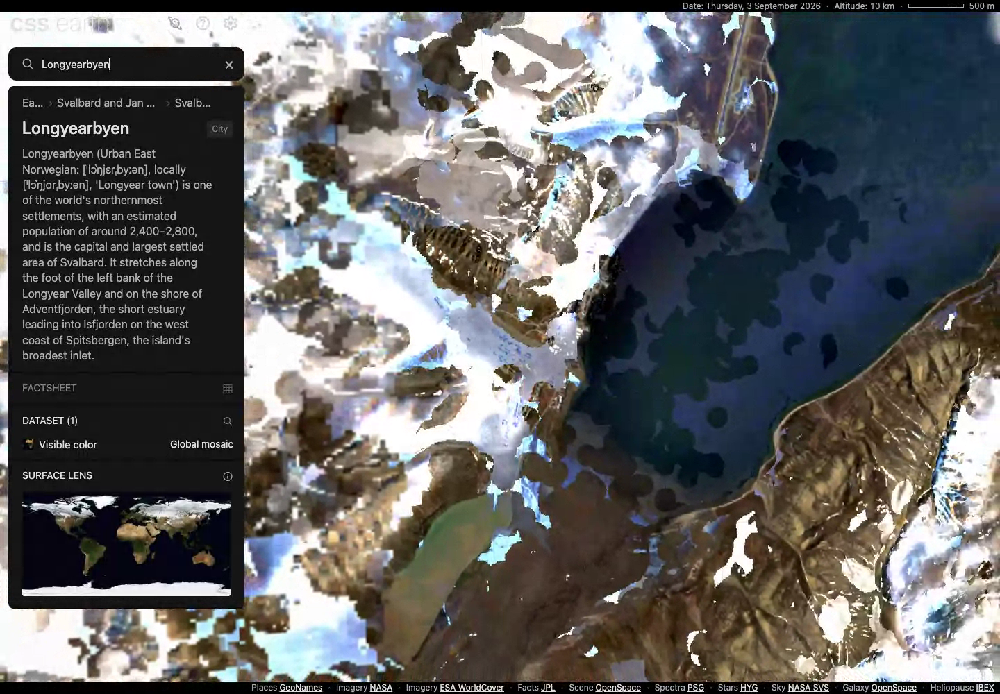
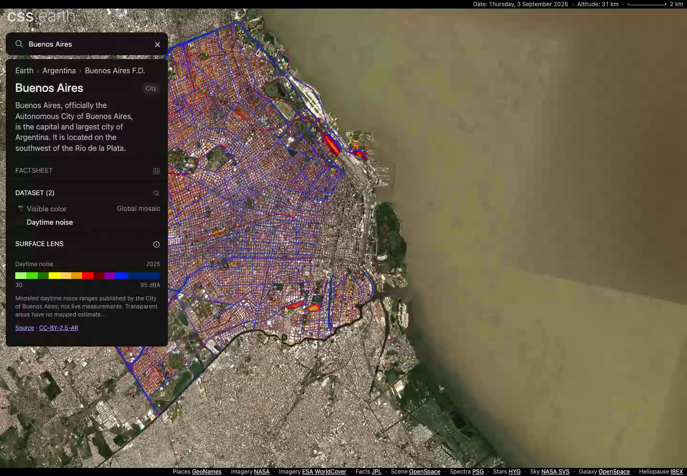

# Geographic feature qualification

The polar rendering and geographic endurance candidate is `eb53bfeb`. Its built
Earth runs record the same five application/worker script hashes. Commit
`74f06f15` subsequently fixes shared picking through visible surface geometry;
its verification is recorded separately below. The PR remains the review record;
asset publication is separate from application deployment.

## Visible checkpoints

These frames come from the final DPR 1 six-cycle recording. They show the
Longyearbyen return and the final Buenos Aires noise selection. Incoming edge
detail can remain coarser during transport. The frames are not native-renderer
or source-pixel parity claims; [capture provenance](evidence/earth-exploration/capture.json)
records their source video, seek positions, application identity and command.
Underlying imagery and article credits follow the [Earth source records](../src/planets/earth/SOURCE.md).

## Continuous exploration

[Machine-readable measurements and script hashes](evidence/earth-exploration/endurance.json)
retain each run's commit, harness identity, resource peaks and trace association.

Chrome 152.0.7977.76 ran headlessly on an Apple M3 Max with 36 GiB of memory.
The desktop viewport was 1440 × 1000. An owned local HTTPS fixture served the
unchanged production build; imagery and geometry used real public services.
This is local-browser evidence, not a deployment or physical-device result.

The route follows actual destination arrival and then applies input immediately,
without waiting for imagery between routine actions. It also interrupts flights,
corrects search, pans and zooms during downloads, navigates parents and history,
switches card-owned lenses, goes offline, retries and revisits.

| Run | Result | Measurement boundary |
| --- | --- | --- |
| Desktop DPR 1, 56 actions | Pass; callback p95 18.5 ms, maximum 55.3 ms, none over 100 ms | No video, screenshots or memory dumps |
| Desktop DPR 2, 56 actions | Pass; callback p95 18.4 ms, maximum 58.8 ms, none over 100 ms | No video, screenshots or memory dumps |
| DPR 1 and 2, six cycles each | 140 actions pass per run; one scene, retained scene identity and zero final pending requests | Native-memory observers; DPR 1 also records video |
| 800 × 900, DPR 2, emulated touch, 4× CPU slowdown, 10 Mbps down/1 Mbps up and 150 ms latency | 56 actions pass; callback p95 45.4 ms, maximum 147.2 ms, 12 intervals over 100 ms | Recovery works; smooth performance on this constrained profile is not established |

The desktop timing controls have a 16.8 ms frame-interval p95. Their three
frame gaps over 100 ms occur during startup. Those startup gaps remain visible
in the evidence; local uncompressed fixture startup is not a production-hosting
latency estimate. The constrained run is not a physical phone or trackpad test.

The two six-cycle runs retain at most 197 bound page slots and 46,989,941 bytes
of live encoded image blobs. All eight native snapshots per run are associated
with their renderer by explicit trace start/end marks; both traces report no
data loss. GPU image allocations are children of image-cache accounting and
must not be added to that total.

DPR 2 image-cache accounting is about 1.39–1.43 GB during the last four revisits.
DPR 1 records Chrome eviction and reacquisition, with a final 1.51 GB image-cache
snapshot. Late renderer private-footprint samples are approximately 1.7–1.8 GB
in both runs. This is substantial browser residency. The observed plateau and
enforced application limits support this finite endurance result; they are not
a hard bound on all Chrome/GPU memory or proof of indefinite operation.

Memory snapshots account for every interaction callback over 100 ms in the
native runs. Timing conclusions therefore use the separate observer-free runs.
One earlier timing attempt hung during browser teardown and one recording attempt
failed to write its report when the disk filled. Both remain marked invalid;
neither is counted as a passing run.

## Rendering and input correction

A close polar view hid loaded detail beneath overlapping original surface faces.
Two captured faces reproduced the failure. Uniform CSS coordinate scaling about
the perspective eye restores that detail while preserving its screen projection.
The physical camera, paging coordinates, prepared geometry and source images
remain unchanged. Ruler and drag hit distances convert back to physical units.

Focused Longyearbyen input checks at DPR 1/2 measure 1.19997× for a requested
1.2× zoom and 99.9875 pixels for a 100-pixel drag. Ruler scale remains correct;
the DPR 2 saved view restores with zero pixel error. Existing PolyCSS seam bleed
and the accepted destination flight remain unchanged.

The shared conformance run also reproduced a click through visible Despina to
Neptune behind it. The picker now respects the context renderer's existing
paint order and uses the same prepared surface hit test as surface flight.
Foreground targets and targets outside the silhouette remain selectable. The
original interaction sequence passes at DPR 1 and 2 after this correction.

## Repository gates

`pnpm test` passes in one invocation: 513 package, 328 renderer, 829 platform and
234 shell checks, totaling 1,904 at the endurance candidate. After the picking correction, the renderer
suite passes 330 checks, including two new occlusion regressions; renderer and
preparation type checking pass.
The production build generates 72 pages. The unchanged built application passes
the retained-DOM gate for all 71 registered objects at DPR 1 and 2, plus six
shared-navigation hops at each density without node or stylesheet growth.

The full diagnostics-dependent interaction-conformance gate is still running.
It must use the development server; production correctly omits those diagnostic
globals. Built DOM and continuous-exploration results are recorded separately.
`CSSEARTH_CONFORMANCE_RECORD=0` retains conformance JSON without recording a
video for every object/DPR pair.

Earth source verification passes all 62 declared records. Aggregate source
verification remains incomplete because this checkout lacks some ignored source
inputs, including Naiad's manifest-pinned analytic radius table. Passing CI,
prepared-runtime hashes and browser checks do not establish that missing source
closure. No all-object source-readiness claim is made.

## Delivery scenarios

[Unit prices and assumptions](earth-delivery-assumptions.json) were checked on
2026-09-08 against [Cloudflare R2 pricing](https://developers.cloudflare.com/r2/pricing/).
The modeled retained inventory is 27.264 GB, including the unchanged 25.344 GB
fine geometry release and 373,667,172-byte coarse release. This is a declared
inventory basis, not a live account invoice or complete bucket inventory.

The table conservatively counts every observed R2 attempt, including canceled,
offline and browser-cached requests, before applying an assumed CDN hit rate.
It repeats measured desktop stress routes; those routes are not typical visitor
behavior or a forecast. Free allowances are assumed available account-wide.

| Actions per session | Daily sessions | Assumed CDN hits | Modeled R2 storage and reads/month |
| ---: | ---: | ---: | ---: |
| 56 | 100 | 0% / 90% | $0.27 / $0.27 |
| 56 | 1,000 | 0% / 90% | $20.79 / $0.27 |
| 56 | 10,000 | 0% / 90% | $234.99 / $20.79 |
| 140 | 100 | 0% / 90% | $3.15 / $0.27 |
| 140 | 1,000 | 0% / 90% | $60.75 / $3.15 |
| 140 | 10,000 | 0% / 90% | $634.23 / $60.75 |

Provider traffic is separate: these scenarios observe up to 1,395 and 4,028
provider attempts per 56- and 140-action session respectively. Direct API access
does not establish capacity for the resulting traffic. A monthly spending ceiling,
provider capacity agreement, taxes and other account services are not established.
The older short-journey receipt is retained but does not represent these longer
exploration sessions.

Supported entity/source limits and reproducible maintenance commands are in
[entity selection](entity-selection.md). Representative tests do not certify
worldwide valid pixels, imagery freshness, terrain, buildings or survey accuracy.
Physical-device qualification, merge and application deployment remain separate
decisions.
