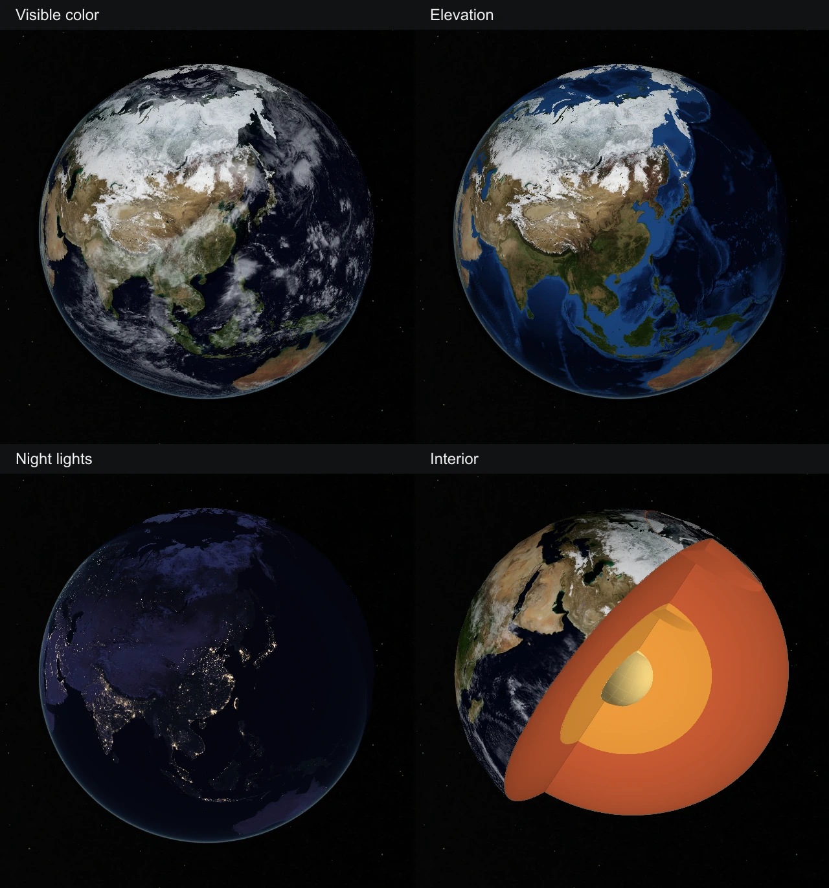

# Earth globe MVP

Earth uses the shared globe camera and shell. Its default zoom is 1.1, maximum zoom is 4, and scene scale is 0.02, matching Mercury. The wheel limit produced the same painted camera transform for Earth and Mercury at both tested DPRs. The geographic close-up remains outside the MVP.

The four datasets are NASA Blue Marble visible color with archival clouds, Blue Marble topography and bathymetry, Black Marble 2016 night lights, and the source-backed schematic interior. The cutaway presentation is rotated to show both the surface and layers clearly. Source geometry and raster banks are retained.

Earth no longer declares geographic paging or destinations. Its normal mount has no city search catalog, WorldCover requests, city slots, or Buenos Aires noise lens. The preparation operator only runs those lanes when the authored descriptor declares them. Earlier geographic sources and tooling remain preserved for future work. Runtime asset closure falls from 159 files / 53,079,990 bytes to 141 files / 34,592,749 bytes; 544 geographic slots are removed.

Verification: 70 Earth and router tests, 3 source-pinned world-navigation tests, all 50 Earth source records, and the shared browser profile's initial-shell and DPR 1/2 interaction cases pass. The unmodified production recording tests Earth and Mercury wheel approach, saturation, drag, return, retained nodes, and Earth lens switching at both DPRs with zero browser errors, HTTP failures, or city requests. The static build produces 259 pages using Node 24 with a 12 GiB heap; Earth asset assembly matches its runtime manifest exactly.

The [evidence receipt](evidence/earth-globe-mvp/receipt.json) binds the prepared Earth payload, browser states and local media hashes. The 41.2-second uncut MP4 and original WebM are in `output/playwright/earth-globe-mvp-20260908/final/`. Physical mobile and full-repository aggregate qualification are outside this focused proof.

Rebuild with `pnpm build:packages`, `pnpm build:renderer`, `pnpm build:preparation`, then `node tools/objects/dist/prepare-authored.js earth --write`. Use `NODE_OPTIONS=--max-old-space-size=12288 pnpm exec astro build` and `node tools/objects/dist/operations.js assemble earth` for the production build and Earth delivery closure.
