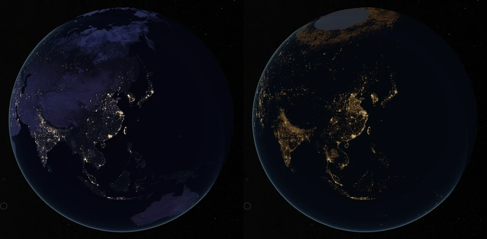
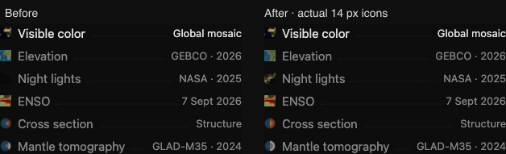

# Earth annual night lights

The Night lights dataset now uses NASA Black Marble VJ146A4.002, annual 2025,
`AllAngle_Composite_Snow_Free`, through the public raw GeoTIFF mosaic by
Jurij Stare, lightpollutionmap.info. It replaces the active 2016 display JPEG.

The right-hand view is warm false color, not the measured color of the lights.
The gray polar cap marks the actual extent of the public raster. Aurora
contamination in the northern band is retained and disclosed.

Source identities, geographic numerical samples, units and the processing
record are in
[the pinned source receipt](../src/planets/earth/source/science/night-lights-2025/provenance.json).
[Earth's source record](../src/planets/earth/README.md) describes the numeric
area averaging, logarithmic display and coverage handling; the
[notice](../src/planets/earth/NOTICE.md) retains NASA and mirror attribution.

The ten night-light images total **3,009,118 bytes**, versus 1,678,834 bytes for
the previous night-light set. The native ~974 MB archive is used only during
preparation. Q90 was selected after comparing q60–95: on a detailed atlas
page, q95 added 43% over q90, while q85 lost more faint image pixels.
This comparison concerns encoding, not radiometric accuracy.

The camera, navigation and entire retained scene tree equal the baseline.
The other five Earth datasets' globe assets are unchanged. Night lights retain the
existing unshaded presentation: toggling Shadows does not darken this annual
radiance map. Cross-section Shadows continue to pass the shared browser tests.

The 14 px dataset-list thumbnails were checked for all six datasets. Night
lights use a 3° New York crop centered at 74°W, 40.7°N, sampled from the same
prepared radiance colors, so the icon shows a bright city network instead of
mostly dark equatorial Africa. Elevation uses a 40° Andes/Pacific crop
centered at 72°W, 20°S to distinguish mountains and ocean depths from visible
color's Africa view. Structure and tomography expose a half-disc section in
the icon, retaining source layer proportions and their respective colors.
This preview framing does not change the globe's cutaway. ENSO retains its
equatorial Pacific map crop.

All six thumbnail selections load at their intended 14 px size at DPR 1 and 2.
The four revised thumbnails total 8,032 bytes; their fresh CDN installation
and independent HEAD checks verify the published hashes and sizes. The other
166 asset hashes, retained scene, controls and camera transforms are unchanged.

Validation: 42 relevant tests pass, including seven new numeric integration,
registration, missing-data and color-transfer tests. All six Earth datasets
pass browser conformance at DPR 1 and 2. The 302-page production build and
Earth's exact asset assembly pass. A fresh CDN installation verifies all 170
Earth assets; independent HEAD checks verify the ten changed files.

The wider Earth/provenance suite has the same six failures as its baseline:
five retired city-detail fixture failures and an outdated eight-bank assertion.
The branch adds seven passing tests (138 to 145); it does not change those
retired paths. This work does not qualify fresh delivery of every other body.
