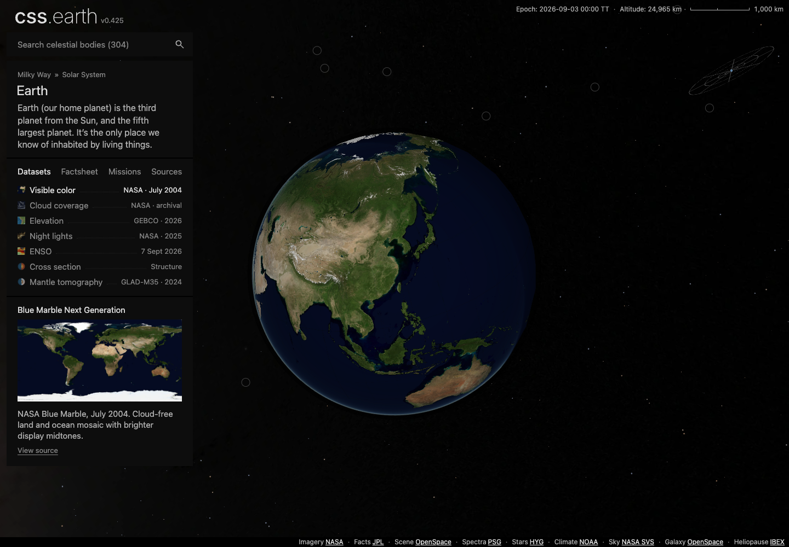
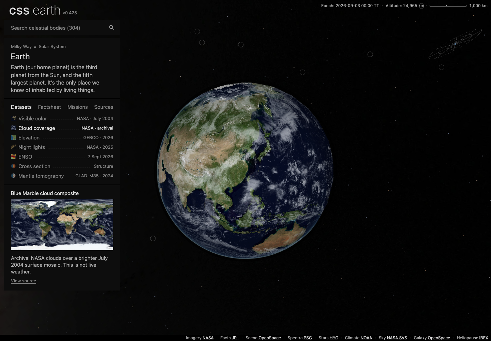

# Cloud-free Earth default

Visible color now uses the July 2004 NASA Blue Marble mosaic without clouds. Cloud coverage is a separate archival dataset. Both share the same brighter surface base, with a prepare-time display gamma of 1.25. Dataset selection remains manual at every zoom level. One retained surface serves the selected image bank.

The July source JPEG is unchanged. The adjustment is applied before cloud compositing and atlas projection, with matching poles, cutaway exterior, thumbnails, and minimaps. Scientific palettes and lighting banks are unchanged. The cloud source and surface mosaic come from different observation periods; this is not live weather. Source dates and links are visible with each dataset.

Validation on the integrated branch:

- Packages, renderer, and preparation build successfully; renderer and preparation typechecks pass.
- 68 of 69 focused Earth, caption, and router tests pass. The ownership audit fails on five Node built-in imports in `site/prepare-body-overview.mjs` and `tools/objects/content/spectrum-data.mjs`. The exact same five errors reproduce on an isolated, unchanged main at `83f1b66bb`. This PR does not change those owners.
- The new July JPEG restores through its authored acquisition operation into an empty directory and matches its 21,125,326-byte SHA256 pin.
- All 179 published Earth runtime assets (43,612,473 bytes total install size) download into an initially empty directory and pass size and SHA256 checks. Connection resets required retries within that directory; reused files came only from earlier verified downloads in this attempt. This is total installed asset size, not initial page transfer.
- The prepared object transport reproduces its descriptor hash. No automatic-switch or duplicate cloud-overlay implementation is included in the final diff.

The browser capture method and results are in `browser-results.json`. Desktop uses native wheel input; mobile camera updates check selection persistence because the shared mobile policy disables wheel input. These checks do not claim native mobile pinch coverage. All captures use the freshly downloaded Earth images with retained DOM identity and no page reload.

Full aggregate build/test and all-object browser conformance are not claimed. See `verification.json` for pinned implementation/base revisions and the baseline failure.
