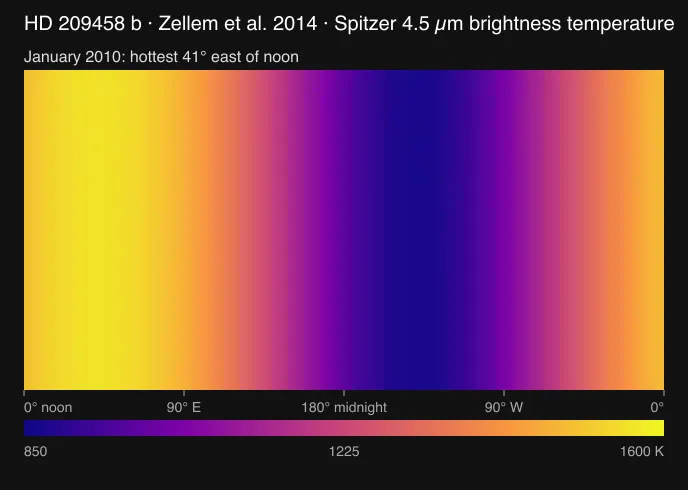
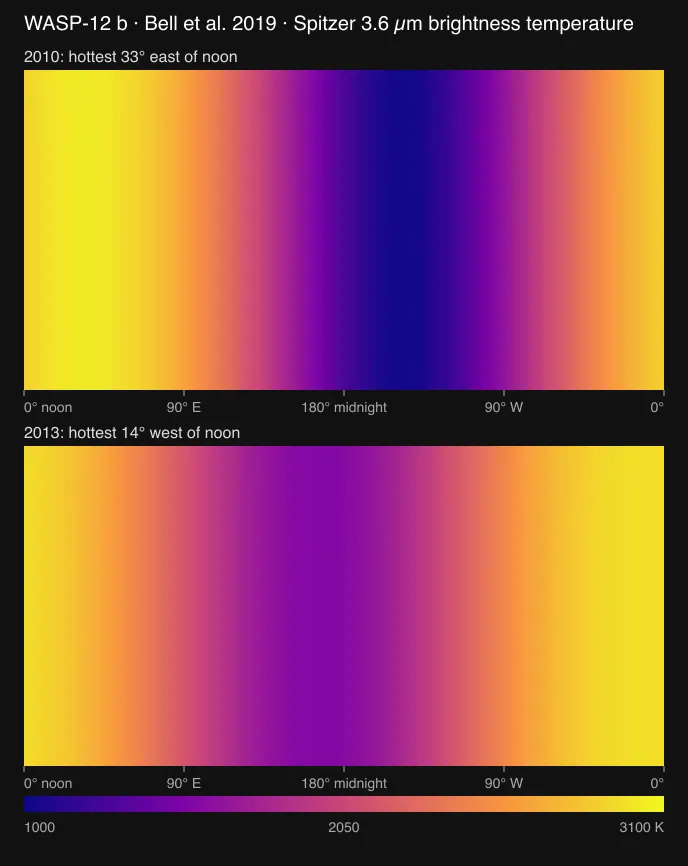

# Eclipse mapping

A hot Jupiter's map reaches this project as a light curve, not as a picture: the planet's brightness as it turns and as the star hides it. This guide describes how a light curve becomes a map here, which checks a map must pass, and what has been measured. Each planet's README records its own run.

## Method

`tools/objects/eclipse-map/eigenmap-fit.mts` fits maps by eigencurves, the method of Rauscher et al. (2018) as ThERESA implements it (Challener & Rauscher 2022). It shares no code with ThERESA or starry.

1. **Harmonic light curves.** Every real spherical harmonic Y_lm up to degree `lmax` ([spherical-harmonics.mts](../tools/objects/eclipse-map/spherical-harmonics.mts), starry's normalization: Y_00 = 1, mean square 1) is integrated into a light curve by [phase-curve.mts](../tools/objects/eclipse-map/phase-curve.mts). That integrator places the planet with the package's hosted orbit, turns it with its synchronous rotation and hides every cell that passes behind the star. One geometry pass per time serves every harmonic.
2. **Eigencurves.** ThERESA takes the truncated SVD of the curves stacked with their negatives. The same right singular vectors are the eigenvectors of that matrix's Gram matrix, computed here exactly by Jacobi rotations. They order the curves into orthogonal eigencurves, strongest first; each has an eigenmap.
3. **Fit.** The system flux is 1 + s_corr + C0·uniform(t) + Σ c_k·eigencurve_k(t), plus optional systematics columns (instrument baselines, ramps, decorrelation vectors). It is linear, solved by weighted least squares. Every cell that faced the observer is kept at positive intensity by a log-barrier Newton solve, ThERESA's `posflux`.
4. **Choose and sample.** The Bayesian information criterion compares degrees and eigencurve counts. A seeded Metropolis sampler draws the posterior, with positivity as a hard prior. The hot spot is located on the continuous map, not on a grid cell.

**Conventions.** Latitude and longitude are body-fixed: longitude 0 is the substellar meridian, east is the direction of rotation. The map is in planet-to-star flux per unit intensity, so a uniform map of amplitude C0 gives flux C0 when a full hemisphere shows. `brightnessTemperature` inverts it at one effective wavelength (Rauscher et al. 2018, eq. 8).

**Light time.** Given the host star's radius, the geometry places the planet where it was when the light seen at each time left it. Times stay referenced to the observed transit, as a transit fit reports them, so eclipses are seen 2a sin(i)/c later than an instantaneous geometry predicts: 15 s for WASP-43b, 22 s for WASP-18b, 31 s for HD 189733b. ThERESA models no light time; starry measures it from the barycentre, so a starry t0 comes a sin(i)/c after the transit is seen.

**Spin axis.** The planet spins about the orbit normal, because the geometry is the package's own orbit. The public ThERESA code leaves the map's inclination at 90°, which tilts the axis off the orbit normal for any orbit that is not edge-on (see [WASP-43b's re-runs](../src/objects/wasp-43b/source/reference/theresa-reruns.md)). That tilt cannot occur here.

**Transit timing.** A light curve that covers transit is fitted against the package orbit before its eclipse map is fitted. [batman-package 2.5.3](https://github.com/lkreidberg/batman/tree/v2.5.3) owns the quadratic limb-darkened transit, including eccentric geometry and exposure integration when the product records its duration. SciPy 1.18.1 owns the bounded nonlinear least-squares fit. cssEarth supplies BMJD_TDB times, the fixed source-backed orbit, the sample mask, a quadratic local baseline and physical limb-darkening bounds. The result carries model samples, residuals, software versions and a local timing uncertainty under that fixed model; it does not include uncertainty in the orbital elements or baseline choice.

## From raw exposures

`tools/objects/jwst/reduce-tso.mts` turns raw JWST time-series exposures into the light curves the fit reads, with [Eureka!](https://github.com/kevin218/Eureka) on the STScI `jwst` pipeline.

- **Toolchain.** `tools/objects/jwst/toolchain.mts install` builds Python 3.11 with micromamba and installs `requirements.lock`, every package at its pinned version or commit, under `output/toolchains/eureka`. One patch is applied: Eureka! 1.4 crashes on a scalar detector gain, which MIRI uses. The CRDS reference context is pinned per program, so reference files match the recorded run.
- **Program.** A directory under `tools/objects/jwst/programs/` pins the raw segments by name and size, the control files, and the deposit to compare with. `wasp-43b-miri-1366` holds the 30 segments (44.2 GB) of the WASP-43b MIRI phase curve, with Bell et al. (2024)'s Eureka! v1 settings carried over to Eureka! 1.4's option names.
- **Run.** Stages 1 and 2 go in batches of five segments, one worker, and a batch does not start with less than half the memory free: a segment's ramp fit peaks near 17 GB. Stage 3 extracts every segment, and Stage 4 makes the white light curve and 14 channels. All of them are exported to CSV, as is the deposit. So is the star's median extracted count spectrum, the band response for a temperature map. `--raw` points at segments already on disk; missing ones download from MAST with resume.
- **Check.** `compare-light-curves.mts` pairs integrations by time and reports correlation, the difference after a straight-line drift, scatter and errors. `reduce-tso.test.mts` holds the run to Bell et al.'s published curves.

Measured on 2026-09-17 from the 30 raw segments, against Bell et al.'s deposited Eureka! v1 light curves:

| Light curve | Paired integrations | Correlation | Difference after the drift | Point-to-point scatter, ours and theirs |
| --- | --- | --- | --- | --- |
| White, 5–10.5 µm | 9,194 | 0.990 | 172 ppm | 342 and 373 ppm |
| Channels 5.0–10.0 µm (10) | 9,194 | 0.927 to 0.994 | 328 to 673 ppm | |
| Channels 10.0–12.0 µm (4) | 9,194 | 0.870 to 0.931 | 846 to 2,430 ppm | |

The two reductions differ by a straight-line drift of 2,221 ppm per day, which a map fit takes up in its baseline terms; the cause is not identified. From 10 µm the channels disagree most; Hammond et al. (2024) excluded the data above 10.5 µm for shadowing. The run took 37 minutes: stages 1 and 2 at 316 to 348 s per five segments with a peak of 16.7 GB, stage 3 in 204 s, stage 4 in 44 s.

### HD 189733b: from raw exposures to a map

`hd-189733b-miri-2021-002` and `hd-189733b-miri-2021-011` pin the two MIRI eclipses of JWST program 2021 (seven segments, 6.4 GB each) that Lally et al. (2025) mapped. Their deposit ([Zenodo 15103479](https://zenodo.org/records/15103479), CC BY 4.0) has no Eureka! control files. So the programs take Bell et al.'s MIRI settings with the two choices the paper states for this star: a linear background outside a 24-pixel aperture, and a white light curve in the Spitzer 8 µm band (6.37–9.43 µm). The deposit is read as separate files, each checked by the md5 Zenodo lists. Downloads run three at a time, because MAST throttled one connection to 0.6 MB/s where three together reached 16 MB/s.

| Eclipse | Paired integrations | Correlation | Difference after the drift | Scatter, ours and theirs |
| --- | --- | --- | --- | --- |
| 1 (observation 002) | 17,019 | 0.988 | 245 ppm | 352 and 330 ppm |
| 2 (observation 011) | 17,024 | 0.985 | 249 ppm | 355 and 327 ppm |

Their curves are outlier-clipped, which is why their scatter is lower.

[`hd-189733b-raw-map.test.mts`](../tools/objects/eclipse-map/hd-189733b-raw-map.test.mts) fits a map to both raw eclipses with the model of their ThERESA configuration:
- MIRI only, degree 5, 3 eigencurves.
- Their clipping and baselines.
- An exponential ramp and decorrelation vectors on eclipse 1.
- Errors scaled to each eclipse's scatter.

It compares that map with the one they deposited:

| Map | Reduced χ² | Hot spot | Dayside correlation with the deposited map |
| --- | --- | --- | --- |
| From our raw eclipses | 1.061 | 41.3° E, 7.3° N | 0.938 |
| From their deposited curves, same fit | 1.052 | 44.0° E, 6.0° N | 0.898 |
| Deposited map (their fit, with Spitzer) | | brightest cell centred at 37.5° E, 7.5° N | |

The paper gives the hot spot at 33.0° E. The raw reduction and this repository's fit reach the deposited map's brightest cell.

## Timing and the ramp on other planets

WASP-43b's offset moved with two choices the data barely constrain: the detector ramp's time constant and the eclipse timing. The same probes on the other maps this repository reproduces, measured 2026-09-17 on the deposited light curves (offset: Hammond et al.'s cos-latitude weighted meridional maximum):

| Planet, data | Eclipse timing | Light time (2a sin i/c) | Ramp time constant |
| --- | --- | --- | --- |
| WASP-43b, MIRI phase curve (Bell et al. 2024) | about 0.04° per second | 15 s: with the measured transit, offset +0.15° | 0.10 or 0.27 d fit within χ² 14: 5.45° or 7.45° |
| HD 189733b, two MIRI eclipses (Lally et al. 2025) | about 0.5 to 1° per second; χ² changes by less than 9 across a 30 s window | 31 s: offset 42.3° without, 26.4° with (22° on the raw reduction) | 5 to 226 min fit within χ² 8: 44° to 40° |
| WASP-18b, NIRISS eclipse (Coulombe et al. 2023, 8 bins) | at most 2.3° for ±30 s | 22 s: at most 0.5° | curves deposited already detrended |

- **HD 189733b.** Its eclipse-only map is limited by timing. Lally et al.'s ThERESA configuration has no light time, and neither does the reproduction test below. With it, the same fit moves the offset about 16° west, and a 10 s ephemeris error moves it another 5 to 10°. The paper's 33.0° and the deposited map's brightest cell at 37.5° both fall inside that range. Their deposited map's own meridional peak, read from its 15° grid, lies near 29 to 31°.
- **WASP-18b.** Its map longitude hardly moves with timing, so the timing trap does not apply there. The ramp question lies upstream of the deposited, detrended curves and cannot be tested from them.

## Checks

- [`spherical-harmonics.test.mts`](../tools/objects/eclipse-map/spherical-harmonics.test.mts): the harmonics are orthonormal on the sphere and match their closed forms at degree 1.
- [`eigenmap-fit.test.mts`](../tools/objects/eclipse-map/eigenmap-fit.test.mts):
  - Jacobi eigenvectors diagonalize a random symmetric matrix.
  - A synthetic map with its hot spot 20° east and 15° south, integrated on a finer grid with 30 ppm noise, comes back where it was put when BIC chooses the model. The posterior covers the injected longitude.
  - The temperature inversion returns the star's temperature for a planet as bright per area as the star.
- [`eigenmap-fit.oracle.test.mts`](../tools/objects/eclipse-map/eigenmap-fit.oracle.test.mts): the production eigencurve decomposition matches NumPy's independent LAPACK SVD under the signed-harmonic convention in pinned ThERESA source. Sign-invariant eigenmap and eigencurve projectors cover full-rank, rank-deficient and uniformly rescaled inputs.
- [`numerics.oracle.test.mts`](../tools/objects/eclipse-map/numerics.oracle.test.mts): independent NumPy and Astropy results cover spherical harmonics, the weighted linear fit, posterior covariance, Planck radiance and brightness-temperature inversion. Phase-curve tests separately enforce uniform-sphere normalization and mirror/time-reversal symmetry through eclipse.
- [`transit-fit.test.mts`](../tools/objects/eclipse-map/transit-fit.test.mts): an eccentric transit made with the shared orbit geometry and an independent 2,500-ring stellar-disc integration is recovered by the batman/SciPy boundary. The real WASP-43b check below independently holds its timing to Hammond et al.'s propagated ephemeris.
- [`tests/objects/unit/wasp-43b/eigenmap-fit.test.mts`](https://github.com/layoutit/css.earth/blob/943c34c8bac83509725d55ab91b48832fd65a4e8/tests/objects/unit/wasp-43b/eigenmap-fit.test.mts): on the deposited JWST NIRSpec white-light curve of WASP-43b, the fit must reproduce ThERESA run with the corrected axis.

| Degree 3, 6 eigencurves, positive | This fit | ThERESA, axis corrected |
| --- | --- | --- |
| χ² over 4,202 samples | 8,809.6 (90 × 180 grid), 8,809.7 (180 × 360) | 8,811.1 |
| Best-fit hot spot | −2.31°, +7.09° | −2.5° latitude (least squares) |
| Posterior hot spot, median (16–84 %) | −2.88° (−4.00 to −1.63), +7.25° (6.88 to 7.50) | −4.1° (−5.2 to −3.2), +6.86° (+0.33 −0.27) |
| Runtime | basis 1.3 s, 200,000 posterior steps 4.4 s | hours in PyMC3 and theano |

With positivity dropped, BIC prefers degree 4 with 12 eigencurves and a hot spot near −14°, as the ThERESA re-runs found. With it kept, degrees 2 and 3 with 6 eigencurves are best. The latitude depends on the model; the eastward shift does not.

## Limits

- **Raw reductions are one instrument mode so far.** `reduce-tso.mts` carries settings for MIRI slitless spectroscopy, reproduced on the WASP-43b phase curve and the two HD 189733b eclipses. NIRSpec and NIRISS observations need their own control files and their own comparison with a deposit before a map is fitted from them.
- **Systematics are the analyst's model.** Baselines and decorrelation vectors enter as linear columns. A nonlinear ramp's time constant is profiled over a grid and refined, on the most flexible candidate, then refined again for the chosen model. A light curve can admit more than one systematics solution. WASP-43b's MIRI curve fits a fast ramp with a steep trend and a slow ramp with a gentle trend, with offsets 2° apart; Hammond et al. (2024) took the slow one ([WASP-43b's README](../src/objects/wasp-43b/README.md)). Different systematics models move the hot spot by more than the statistical uncertainty.
- **Eclipse timing moves longitude.** A map's longitude trades against the eclipse times it assumes, most strongly for eclipse-only data with sharp ingress and egress (next section). An ephemeris propagated to a visit can be off by tens of seconds, so a lens recipe can take the transit time from its own light curve ([`transit-timing.mts`](../tools/objects/eclipse-map/transit-timing.mts)). Where a visit has no transit, the map's longitude is only as good as the ephemeris.
- **Integration grid.** Occultation is decided per cell centre. At 90 × 180 cells, χ² agrees with the 360 × 720 grid to within 0.2.
- **Posterior.** Metropolis with a Gaussian proposal and positivity as a hard prior. It reports the statistical spread under one fixed systematics model, like the published intervals it is compared with.

## Maps as lenses

A planet package can fit its map during preparation instead of shipping a map file. The `eclipse-map-fit` format ([eclipse-map-fit.mts](../tools/objects/terrestrial-layers/eclipse-map-fit.mts)) reads a light curve pinned in the package, calls `fitLightCurveMap` ([light-curve-map.mts](../tools/objects/eclipse-map/light-curve-map.mts)) and paints the temperature map like any scientific lens. The recipe names the light curve, the systematics, the candidate models, the band and the stellar spectrum.

- **Offset.** `meridionalOffset` is Hammond et al. (2024)'s longitudinal offset: where the map, averaged over latitude with weight cos(latitude), peaks. It compares with a phase curve's peak offset; the map's own hottest point can differ.
- **Model choice.** Every candidate degree and eigencurve count is fitted. The lowest BIC wins, except that models within 2 of it count as equal, and then the one with fewest parameters, then the lowest degree, is taken. A recipe that lists one model fixes it.
- **Band temperature.** A light curve adds up the star's counts over its band. So the temperature is the one at which the count-weighted planet-to-star intensity, Σ C_i·B(λ_i, T)/I_i ÷ Σ C_i, equals π·value·(1 + s_corr)/rp². C_i can be the star's own extracted counts per detector column, or a filter transmission times wavelength times the stellar intensity. I_i is a model stellar spectrum averaged over each sample's extent. The inversion is tabulated in 0.25 K steps. With one sample and a blackbody star it reduces to `brightnessTemperature`.
- **Checks.** [`light-curve-map.test.mts`](../tools/objects/eclipse-map/light-curve-map.test.mts) tests the reduction to one wavelength, a band with an uneven star and uneven counts, bin averages, and an injected map under a ramp and a drift. [WASP-43b's lens test](https://github.com/layoutit/css.earth/blob/943c34c8bac83509725d55ab91b48832fd65a4e8/tests/objects/unit/wasp-43b/lens-fits.test.mts) runs its shipped recipes. It compares the MIRI dayside and nightside with Bell et al. (2024): 1,527 K against 1,524 ± 35 K, and 840 K against 863 ± 23 K.

### A published fit, drawn as the paper made it

When a paper publishes its phase-curve model but no map file, the `published-phase-curve-map` format ([published-phase-curve-map.mts](../tools/objects/terrestrial-layers/published-phase-curve-map.mts)) draws that model without refitting. The package pins the paper's table as `cssearth-published-phase-curve@1`, one `{ value, cell, where }` per number.

- **Sinusoids.** A two-term sinusoid phase curve becomes a map of longitude through Cowan & Agol (2008, ApJ 678, L129, equation 5): each light-curve sinusoid of order j comes from a map sinusoid of the same order and phase, scaled by 2, π/2 and 2/3 for j = 0, 1, 2. The map has no latitude information and is drawn the same at every latitude. The constant term is set so that the planet shows its eclipse depth at mid-eclipse. Papers write the same Fourier series three ways, and each is read as printed: amplitudes and peak times ([KELT-9b](../src/objects/kelt-9b/README.md)), cosine and sine counted from mid-transit ([HD 209458 b](../src/objects/hd-209458b/README.md)), and SPCA's C1, D1 as fractions of the eclipse depth counted from mid-eclipse ([WASP-12 b](../src/objects/wasp-12b/README.md)).
  The two newest maps, as the packages' own sidebar maps show them (longitude 0 is noon, east to the right): HD 209458 b, one sinusoid from Zellem et al. (2014), and WASP-12 b's two Spitzer visits from Bell et al. (2019), whose hot spots sit on opposite sides of noon.

  
  
- **SPIDERMAN.** A SPIDERMAN spherical-harmonic fit is evaluated by SPIDERMAN itself, in its own pinned environment ([spiderman.ts](../packages/telescope/src/node/spiderman.ts)), with the paper's coefficients under SPIDERMAN's own parameter names. [WASP-76b](../src/objects/wasp-76b/README.md) uses it.
- **Temperature.** The intensity ratio is 2J/rp² for the sinusoid map and π·value·(1 + dilution)/rp² for SPIDERMAN. It becomes a brightness temperature at the band's wavelength against the star's band temperature that the paper's own eclipse depth, radius ratio and day side imply. The paper's night side, converted the same way from the model, is the check.
- **Checks.** [`published-phase-curve-map.test.mts`](../tools/objects/terrestrial-layers/published-phase-curve-map.test.mts) integrates the sinusoid map over the visible hemisphere and gets the light curve back to 1e-9. It holds each planet to its paper's amplitude, offset, day side and night side.
