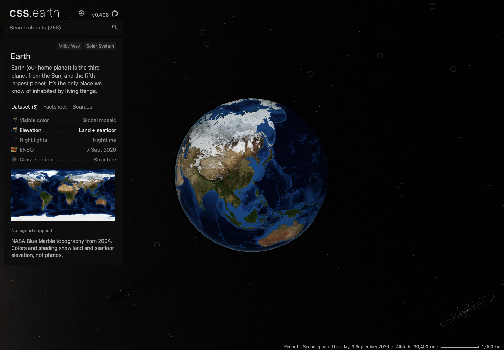
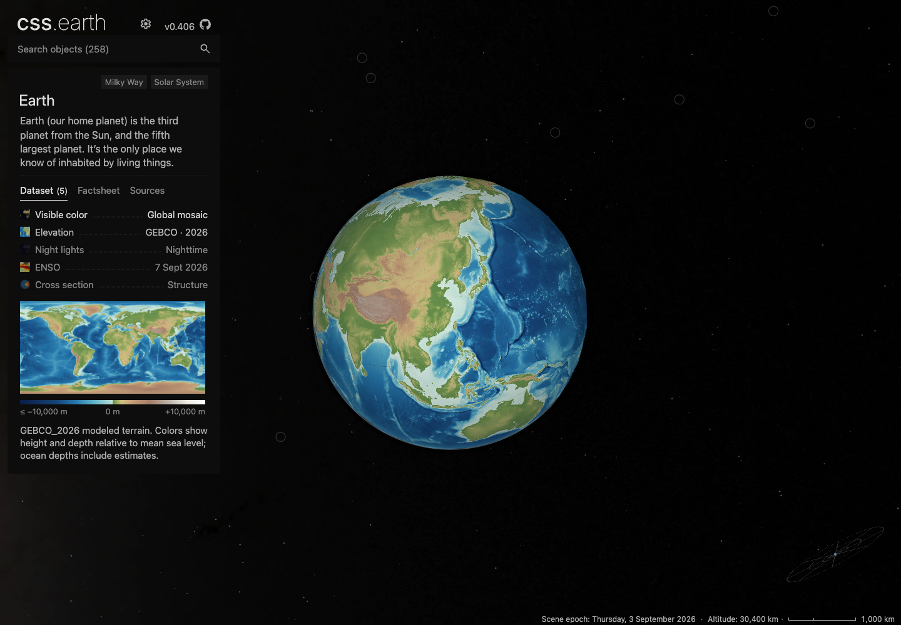
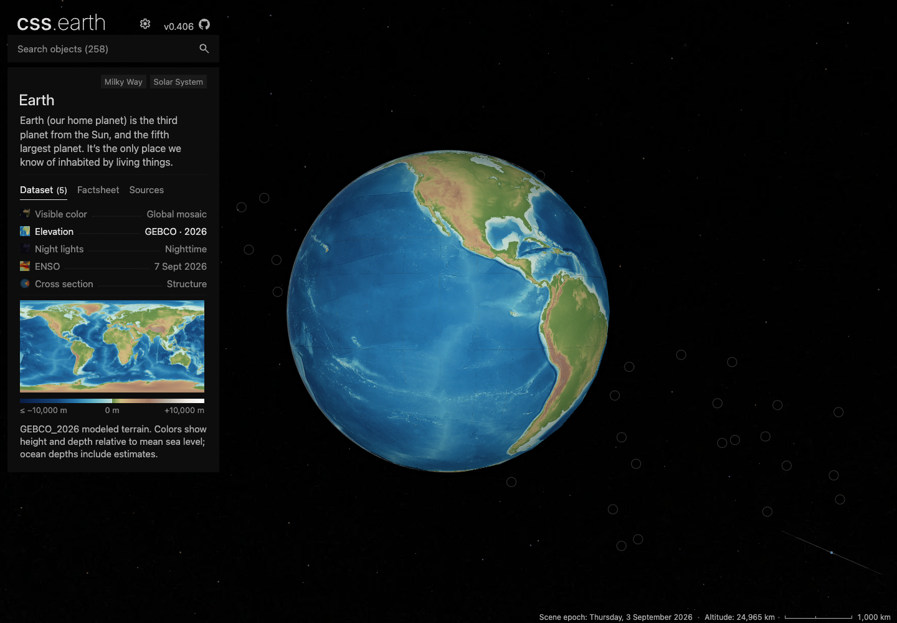
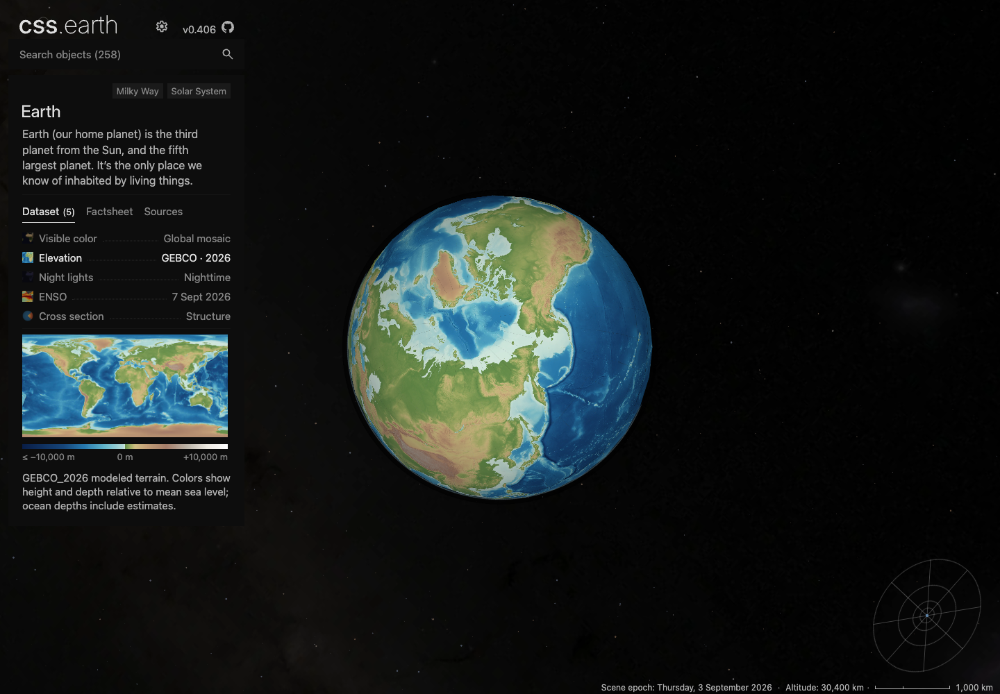

# Earth elevation: GEBCO_2026

The old Elevation lens used Blue Marble land colors and shaded relief. Vegetation, snow and imagery brightness did not represent height, and the lens had no numeric legend. This change uses signed GEBCO heights for land, the ice surface and the seafloor, with a common height/depth palette and an unshaded meter scale.

## Source and interpretation

- [GEBCO_2026](https://www.gebco.net/data-products-gridded-bathymetry-data/gebco2026-grid), DOI `10.5285/4f68d5c7-45eb-f999-e063-7086abc036fa`, created 17 April 2026. Primary land-and-ice-surface grid, not the under-ice bedrock alternative.
- Twenty complete anonymous CEDA DAP2 responses cover all 4,320 sampled latitude rows. The retained 8,640 × 4,320 grid selects every tenth native cell (2.5 arc-minute spacing). Source responses are retained verbatim inside gzip files; their axes, counts, signed values and hashes are validated.
- Bilinear interpolation acts on heights before color mapping onto the 8,192 × 4,096 raster. This is a sampled overview, not a peak-preserving reduction or full native 15 arc-second rendering. GEBCO combines observations and estimates; cell spacing is not a guarantee of measurement density.
- Colors represent meters relative to assumed mean sea level, with the publisher's coastal datum exceptions. Below-sea-level inland terrain also receives negative-height colors. Greenland and Antarctica depict the ice surface.
- Cartographic relief uses the shared scientific-raster helper: latitude-adjusted spacing, 4× slope exaggeration, northwest light at 45°, 60% ambient contribution. Geometry and camera contracts are unchanged. Deep values at or below −10,000 m saturate at the legend's labeled lower end.
- Globe pages, poles, thumbnail and minimap derive from the same interpreted raster. The legend uses the same palette without relief shading.

`acquisition.json` records all twenty blocks (150,721,760 provider bytes; 66,736,203 bytes pinned as gzip). `source-witnesses.json` retains independently requested ASCII cells, including Tibet +5,050 m, Andes +4,035 m, Amazon +63 m, central Pacific −4,451 m, Mariana −10,358 m, Greenland +2,884 m and Antarctica +2,320 m. These are specific sampled cells, not regional extrema.

`source-restoration.json` records live restoration of one binary latitude block and the metadata into an empty source directory through the shared acquisition implementation, enforcing the manifest hashes. All twenty checked-in blocks were validated; the restoration check did not redownload all twenty.

## Payload and delivery

Q75 was selected after inspecting the Andes/coast/deep-ocean crop against the uncompressed interpreted raster. Q45 visibly softened fine relief. `encoding-sweep.json` describes the flat 8K source-map experiment; it is not a measurement of runtime atlas transfers.

The actual Elevation runtime assets, including seven atlas pages, poles, thumbnail and the new legend, total **2,510,604 bytes**, down from **4,255,972 bytes (41.0%)**. All other 142 Earth runtime assets retain their hashes. The full Earth inventory is 152 files / 36,614,094 bytes; lenses are acquired on selection, so that inventory total is not an initial-page payload claim. See `payload.json`.

All 152 immutable runtime assets were published through the existing publisher. `runtime-installation.json` records a subsequent anonymous download into an empty directory using the shared setup implementation: **152 downloaded, 0 reused**, each checked against its exact length and SHA-256.

## Reproduction

From a checkout with the supported Node version:

```sh
pnpm install --frozen-lockfile
node tools/objects/dist/operations.js acquire earth
node tools/objects/dist/operations.js acquire earth --verify-only
node tools/objects/dist/prepare-authored.js earth --write
node --test tests/objects/unit/earth/elevation.test.mjs
```

The acquisition command restores only missing pinned sources. Existing source bytes are never silently treated as a newer GEBCO release. The ordinary preview route remains `pnpm setup:assets --object=earth` followed by the shared site runtime.

## Scope and validation

The change also corrects Visible color's stale WorldCover claim: the MVP lens uses the NASA Blue Marble December 2004 mosaic and an archival cloud composite. It fixes a missing `config`/`sourceDirectory` argument in the existing cross-section cloud preparation caller, discovered by rebuilding the complete Earth package. The rebuilt non-Elevation runtime assets match the baseline hashes.

No shared camera, input policy, scene geometry, runtime renderer or city-paging capability changes are included. The baseline is merged main `be69e2aaa2f636ebcf4e82156fd6de2e25724d73`.

Detailed final checks and mounted captures are recorded in `validation.json`.

116 focused tests pass, and the static site builds all 259 routes. The six focused shared browser cases pass in the development build. Stock production captures at DPR 1 and 2 separately verify actual dataset/settings clicks, retained scene nodes, visible meter labels, zero page errors and zero failed requests; production diagnostic hooks remain disabled.

The aggregate renderer run has 343 passing and nine failing tests. The same nine failures reproduce on the baseline: six retired Earth city-paging expectations and three Deimos depth-partition expectations. Full desktop/density conformance is not green either; exact assertions and baseline results are retained in the evidence. Fine cell boundaries remain visible in smooth ocean areas. These results qualify the dataset change, not an aggregate all-body or seam-free renderer release.

Before and after use the same serialized camera and 1,440 × 1,000 viewport. The before view is the baseline development build; the after view is the stock production build using freshly downloaded assets.








