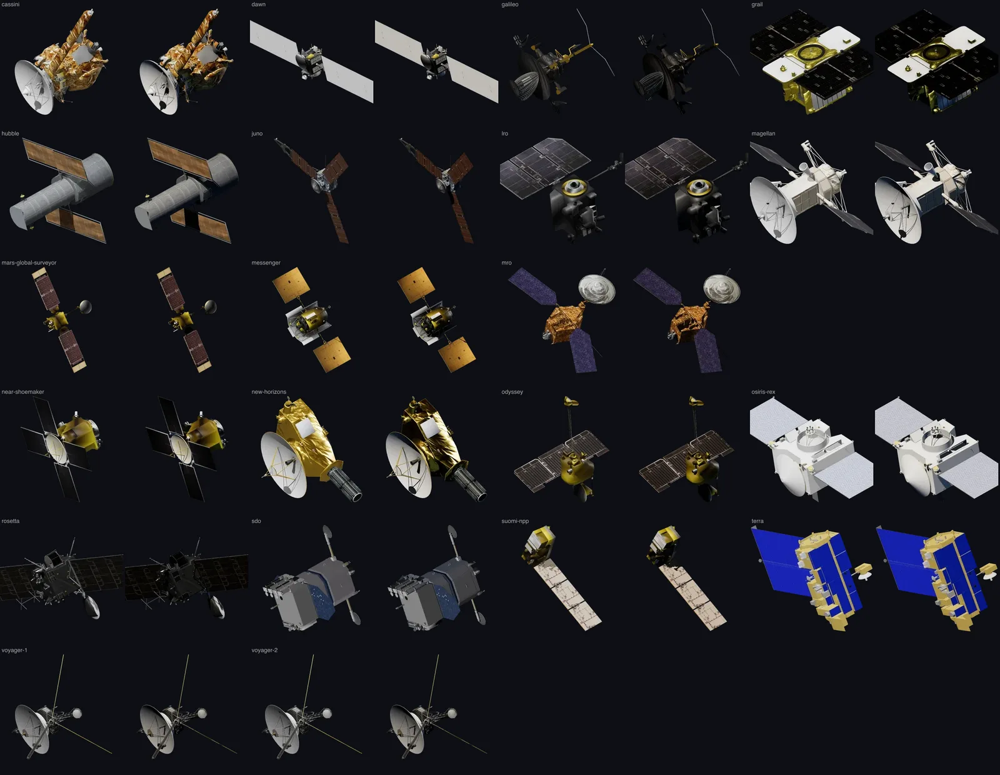

# Facility thumbnails

## Sources and appearance

[The artwork library](../site/source/facilities/render-library.json) pins the original
models, textures and credits. The 21 model thumbnails use the same fixed camera
and lights with the source materials unchanged: one hard, slightly warm sun key
that casts shadows, a faint blue fill standing in for light from a planet, and a
rim light that separates edges from the dark sidebar. Reflections see a black sky
with a small sun disc and a dim blue glow below, not a lit room. The earlier
white studio setup lit every side evenly and made the models read flat. These
are illustrations, not reconstructed mission illumination.

Mostly black models such as Galileo and Rosetta come out darker than before,
because the studio fill no longer lifts their shadow sides. Eight published
photographs and three official artwork images retain their existing pixels.

Three.js runs only during preparation. The application loads committed WebP
images; it does not load Three.js or render models at runtime. Masters are
1200 × 600, reduced to 592 × 296 with genuine transparency. Alpha bounds provide
the sidebar crop without discarding dark spacecraft parts as background.

## Inward-facing poses

Each model has an authored 3D pose in
[`tools/facility-renders/poses.mts`](../tools/facility-renders/poses.mts). Its record
identifies the prominent dish or camera opening, a mission reference, the
matching source-model hash and the feature's approximate facing axis.
The model rotates before capture so that axis projects down-left from the
upper-right spacecraft card, with a slight turn toward the viewer. The camera,
environment and lights remain fixed; highlights and self-shadows follow the new
geometry. The UI never rotates the finished image, including Cassini.
The subject crop keeps its proportions and fits within a 148px-high thumbnail
slot, so upright models do not enlarge the spacecraft card.

These are illustrative poses based on model inspection and mission diagrams,
not calibrated instrument frames or reconstructed flight attitudes. One image
represents each spacecraft across datasets. Articulated instruments retain the
source model's configuration; we do not claim all instruments point together.
Prominent dishes provide the visual front on Cassini, Voyager and New Horizons.
Hubble and other camera-led models use their optical opening. The pose records
distinguish communication antennas from radar dishes; pointing an antenna inward
is a composition choice and does not assert it observes the selected body.
New source models require another pose review.

## Regeneration

Run `node tools/prepare/prepare-facility-renders.mts` for candidates, or append `--write` to replace
the model images and library together after inspection. `--only=cassini` limits
the selection. `--cache=<directory>` reuses verified downloads;
`--output=<directory>` selects the review directory. Both default to
`output/facility-lighting-preview`. Normal builds reuse the committed images.
`--inspect-axes --only=<id>` renders six source-axis views for identifying
instrument faces. `--inspect-rolls --only=<id>` compares four model rotations
around the inward facing axis with lighting fixed. Inspection modes cannot
publish images; save the chosen quaternion in the pose record before regeneration.

The tool requires installed Chrome, and macOS `usdcat` plus `unzip` for Voyager.
It checks every source file's byte count against the library before use. The output includes
before images, PNG masters, candidate WebPs, a candidate library and a report of
materials, geometry counts, camera/model poses and omitted components. Inspect each
image for incomplete geometry, unreadable materials and clipping before writing.
Writing refreshes the facility/source graphs in the same transaction. This narrow
refresh preserves attribution and checks every unrelated source pin; it refuses
changed source records or artwork membership. It does not reacquire nebula preview
images or rebake other datasets. The artwork test in
`site/test/dataset-facilities.test.mts` verifies the resulting image identities.

## Model-specific preparation and limits

Cassini omits three reviewed, thin antenna-wire components from the thumbnail
copy: 50 triangles in its aluminum mesh. The dish, dish supports and gold
instrument boom remain. This rule validates component sizes and triangle count;
it does not remove thin parts from arbitrary models. The source GLB is unchanged.

Voyager's pinned USDZ contains binary USD. `usdcat` exposes its source arrays;
the bounded reader retains all four meshes, original JPEG textures, UVs,
transforms and material values. Both Voyagers use the same reviewed 3D pose,
with the dish aimed inward and every boom retained.

The fixed lighting recipe is in
[`tools/facility-renders/render.mts`](../tools/facility-renders/render.mts).
The library records preparation code hashes and browser/package versions.
Rerenders on another GPU or browser may differ at antialiased edges; the
committed WebP hashes identify the actual published images.
