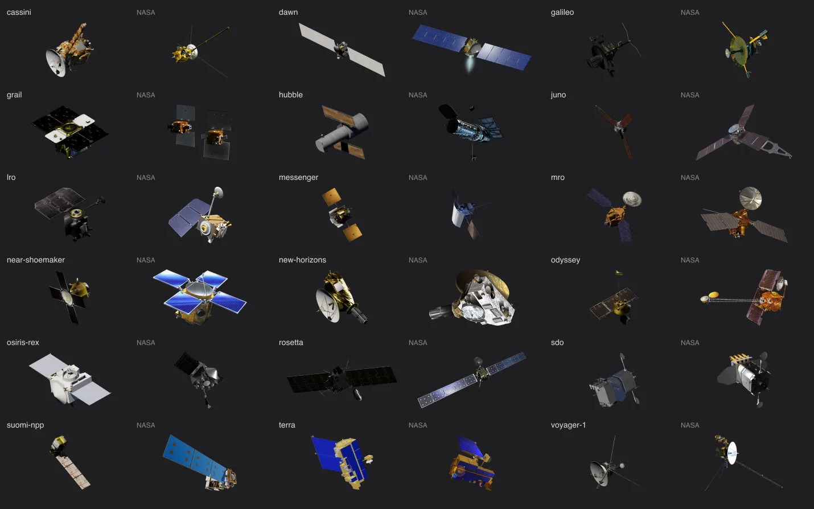

# Facility thumbnails

## Sources and appearance

A spacecraft card shows NASA's official artwork for that spacecraft whenever
NASA publishes it. The [spacecraft icons collection](https://science.nasa.gov/multimedia/spacecraft-icons/)
covers 22 of our spacecraft, from Cassini to Voyager; both Voyagers share one
image. [`photograph-records.json`](../site/source/facilities/photograph-records.json)
records each original file, its credit and its byte count, and
[`prepare-facility-photographs.mts`](../tools/prepare/prepare-facility-photographs.mts)
clears the near-black matte below 12% opacity that six of the files carry (it
shows as a box on the card), trims the transparent margin, fits the result inside
521 × 255 without upscaling and centres it on a transparent 592 × 296 frame. Each image keeps NASA's angle,
colours and any lens flare the artist painted in.

We used to render all of these from 3D models under one lighting setup. NASA's
artwork reads better at card size, and some models could not be rendered well:
the NASA 3D Resources Terra GLB names its two textures by a Windows path outside
the file, so its panels came out flat blue, and the textured NASA Eyes models
are mirror-like foil that goes dark against a black sky.

Magellan and Mars Global Surveyor have no NASA artwork, so they are still
rendered from their NASA 3D Resources models. Telescopes and ground stations use
published photographs from the same records file.

## Model renders

[The artwork library](../site/source/facilities/render-library.json) records each
model, its credit and its byte count. Both renders use the same fixed camera and
lights with the source materials unchanged: one hard, slightly warm sun key
that casts shadows, a faint blue fill standing in for light from a planet, and a
rim light that separates edges from the dark sidebar. Reflections see a black sky
with a small sun disc and a dim blue glow below, not a lit room. These are
illustrations, not reconstructed mission illumination.

Three.js runs only during preparation. The application loads committed WebP
images; it does not load Three.js or render models at runtime. Masters are
1200 × 600, reduced to 592 × 296 with genuine transparency. Alpha bounds provide
the sidebar crop without discarding dark spacecraft parts as background.

Each model has an authored 3D pose in
[`tools/facility-renders/poses.mts`](../tools/facility-renders/poses.mts). Its record
identifies the prominent dish or instrument deck, a mission reference and the
feature's approximate facing axis. The model rotates before capture so that axis
projects down-left from the upper-right spacecraft card, with a slight turn
toward the viewer. These are illustrative poses based on model inspection and
mission diagrams, not calibrated instrument frames or flight attitudes. New
source models require another pose review.

## Regeneration

`node tools/prepare/prepare-facility-photographs.mts` acquires each recorded
photograph or artwork file, checks its byte count and writes the thumbnails and
their library entries. `--only=terra,cassini` limits the run.

`node tools/prepare/prepare-facility-renders.mts` renders the model thumbnails for
review, or with `--write` replaces the model images and library together after
inspection. `--only=<id>` limits the selection. `--cache=<directory>` reuses
verified downloads; `--output=<directory>` selects the review directory. Both
default to `output/facility-lighting-preview`. `--inspect-axes --only=<id>`
renders six source-axis views for identifying instrument faces.
`--inspect-rolls --only=<id>` compares four model rotations around the inward
facing axis with lighting fixed. Inspection modes cannot publish images; save the
chosen quaternion in the pose record before regeneration.

The render tool requires installed Chrome. Writing refreshes the facility/source
graphs in the same transaction; it refuses changed source records or artwork
membership. The fixed lighting recipe is in
[`tools/facility-renders/render.mts`](../tools/facility-renders/render.mts).
Rerenders on another GPU or browser may differ at antialiased edges. Normal
builds reuse the committed images, and the artwork test in
`site/test/dataset-facilities.test.mts` checks their byte counts, sizes and credits.
