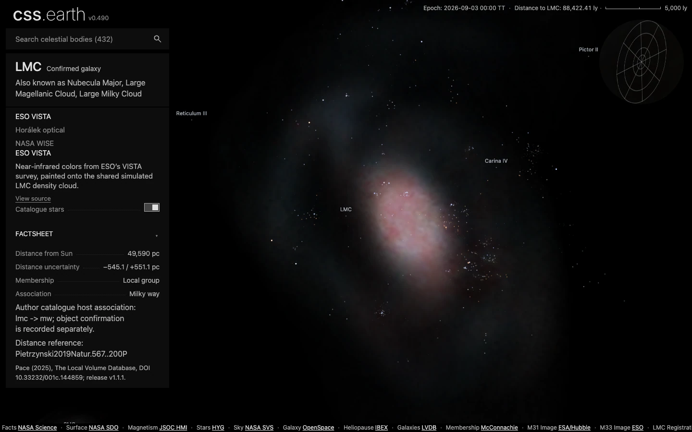
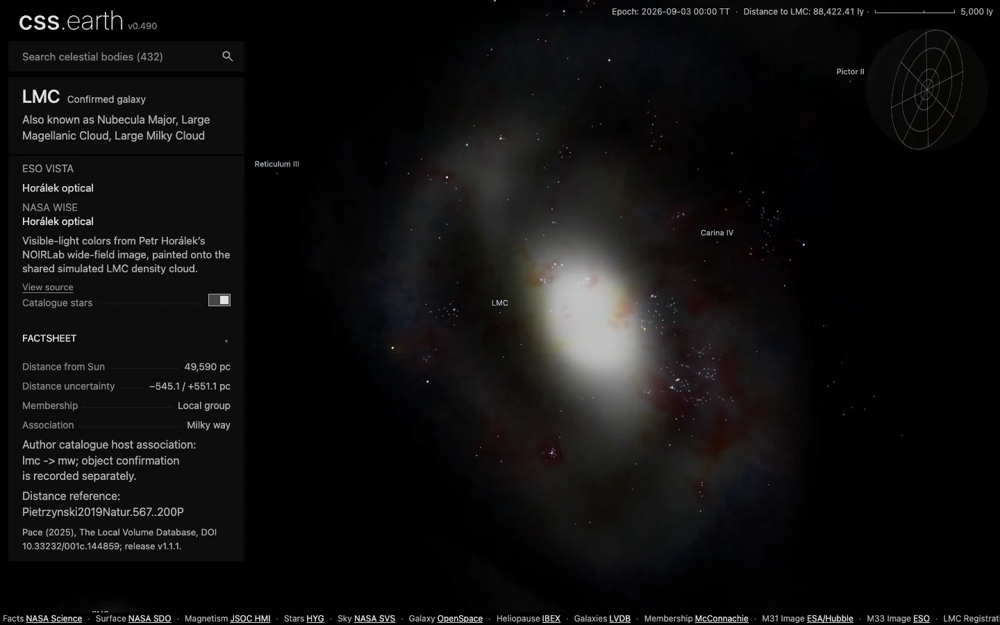
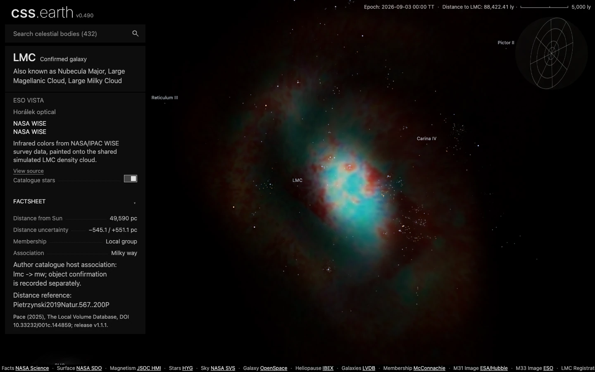

# Galaxies and the nearby universe

The shared world contains **776 sourced galaxy/candidate positions**, seven nearby galaxy-cluster centres, and detailed Milky Way, M31, M33, LMC and SMC renderers. The LMC has three selectable image treatments on one density cloud. Catalogue positions, observed colors and modeled depth have different evidence; the tables below identify each.

## LMC: three images, one cloud

Actual app captures at the **same camera**, with catalogue stars enabled and each lens's saved appearance. These are PolyCSS visualizations, not telescope photographs or recovered 3D gas maps. Click an image to inspect it at full size.

| ESO VISTA · near infrared | Horálek · optical | NASA WISE · infrared |
| --- | --- | --- |
| [](../images/galaxies/lmc-vista-infrared.webp) | [](../images/galaxies/lmc-horalek-widefield.webp) | [](../images/galaxies/lmc-wise-wide-infrared.webp) |
| [ESO original](https://www.eso.org/public/images/eso1914a/) · ESO/VMC Survey | [NOIRLab original](https://noirlab.edu/public/images/iotw2547a/) · NOIRLab/NSF/AURA/P. Horálek (Institute of Physics in Opava) | [WISE data](https://irsa.ipac.caltech.edu/onlinehelp/wise/wise/overview.html) · IPAC/NASA; color HiPS by CDS (CNRS/Unistra) |

| Color input actually used | Resolution and field | Registration and interpretation |
| --- | --- | --- |
| VISTA `eso1914a`, Y/J/Ks | 8,954 × 10,000 TIFF; about 7.7° × 8.6° | Fitted to SMASH stars: 5,340 held-out checks, P90 0.67 SMASH pixels; 83% matched hull. Infrared display colors. |
| Horálek `iotw2547a`, optical wide field | 6,582 × 4,388 JPEG | 592 matched stars; 198 held out, P90 1.12 SMASH pixels; 60.2% matched hull. Outer registration extrapolates beyond matched stars. |
| AllWISE W4/W2/W1 RGB through CDS HiPS2FITS | 6,000 × 6,000 JPEG; 24° tangent-plane field | Fixed publisher WCS checked against 34,811 AllWISE positions; 11,604 reserved checks, P90 0.632 native WISE pixels; 99.3% matched hull. Display composite with visible survey seams. |

The [source recipe](../../labs/nebula/models/image-candidates.json) retains the exact downloads, SHA-256 pins, coordinate transforms and credit strings. ESO and Horálek sources carry CC BY 4.0; the CDS AllWISE HiPS distribution records ODbL 1.0 alongside IPAC/NASA and CNRS/Unistra credit. These rendered derivatives apply star removal and authored display colors; they are not calibrated multiband photometry. The [alignment evidence](../../labs/nebula/models/lmc/candidates/source/alignment-report.json) checks image geometry; the separate user-authored image-to-simulation fit is not a measured correspondence to simulated stars.

### What supplies the shape and stars?

| Component | Scientific input | What we prepare |
| --- | --- | --- |
| Cloud support and depth | Garver, Nidever, Debattista & Deg (2026), [Dryad simulation](https://datadryad.org/dataset/doi%3A10.5061/dryad.1vhhmgr82); [associated paper](https://doi.org/10.1093/mnras/stag1287) | The 2.2 Gyr snapshot, 1,620,000 LMC stellar particles, deposited into a 266 × 259 × 116 density grid. All selected particles are retained. This is a stellar-mass prior; the snapshot contains no gas particles. |
| Point stars | [Bonanos et al. (2009)](https://arxiv.org/abs/0905.1328), [CDS J/AJ/138/1003](https://cdsarc.cds.unistra.fr/viz-bin/cat/J/AJ/138/1003) | The retained 943-star sample supplies measured sky positions and photometry. Reconstruction assigns deterministic depths using one density/sky reference. All three lenses use identical positions; apparent point size/opacity comes from the magnitude display model. |
| Surface color | The three registered observations above | Native star removal, then color sampling onto the fixed density. Each lens preserves the same 144 quads and every alpha byte. Uncovered density keeps neutral color. |

The [accepted bake recipe](../../labs/nebula/models/lmc/bake.json) pins image placement, saturation, detail, brightness and gamma. The [app settings](../../src/objects/lmc/README.md#evidence) retain cloud selection, axis brightness, cutoff and stellar exposure/size. Switching lenses changes the material while retaining the cloud, stars and camera.

## Extragalactic datasets

| Dataset and primary reference | Use in this branch | Scope and limits |
| --- | --- | --- |
| Pace (2025), [Local Volume Database paper](https://doi.org/10.33232/001c.144859), [release v1.1.1](https://github.com/apace7/local_volume_database/releases/tag/v1.1.1) | 776 eligible galaxies/candidates from 1,727 source rows; 951 exclusions recorded. Coordinates, distance references, aliases and structural measurements. | A pinned eligible census, not all galaxies in nature. Host-assigned, numerical-action, redshift and Hubble-law distances are excluded here. Candidate status and unspecified measurement methods remain explicit. |
| [McConnachie (2012)](https://doi.org/10.1088/0004-6256/144/1/4), [author October 2019 table](https://www.cadc-ccda.hia-iha.nrc-cnrc.gc.ca/en/community/nearby/) | Membership evidence, supplemented by LVDB satellite host chains: 142 retained objects have Local Group associations; 109 are confirmed galaxies. | Membership is not a radius cut. The January 2021 FITS is retained for audit but has no membership column. |
| [Graczyk et al. (2020)](https://arxiv.org/abs/2010.08754) | SMC distance override: 62.44 kpc, with 0.47 kpc statistical and 0.81 kpc systematic uncertainty. | Direct eclipsing-binary result; error components remain separate. |
| [Sadibekova et al. (2024), MCXC-II](https://arxiv.org/abs/2402.01538), [CDS J/A+A/688/A187](https://cdsarc.cds.unistra.fr/viz-bin/cat/J/A+A/688/A187) | Seven explicit selections from the 2,221-row release: Virgo, Fornax, Hydra, Centaurus, Norma, Perseus and Coma. Centres and R500 annotations. | Comoving distances from redshift using H0 = 70 km/s/Mpc and Ωm = 0.3; no peculiar-velocity correction. R500 is an overdensity aperture, not a physical edge. No cluster member distribution or luminous volume is supplied. |

[Galaxy selection, frames and source pins](../../src/objects/local-group/README.md) and [cluster selection and cosmology](../../src/objects/galaxy-clusters/README.md) give the full derivations. Both catalogues prepare Sun-origin ICRF-compatible Cartesian metres offline. The application does not parse papers/tables or integrate cosmology at runtime. Navigation framing radii are presentation choices, distinct from measured half-light radii or cluster apertures.

## Other detailed galaxies

| Renderer | Source | Current depth and coverage |
| --- | --- | --- |
| Milky Way exterior | [OpenSpace/AMNH/NAOJ volume](https://docs.openspaceproject.com/latest/content/milky-way/galaxy/milky-way-volume/index.html) | Existing 1,024 × 1,024 × 128 RGBA model, baked into directional slices. Simulation-based visualization. [Provenance](../../src/objects/milky-way/source/provenance.json). |
| Milky Way interior | [NASA SVS, Deep Star Maps 2020](https://svs.gsfc.nasa.gov/4851/) | Existing 8,192 × 4,096 Milky Way-only map derived from star catalogues. Angular radiance; the finite panorama shell adds authored visual depth. Credits: NASA/Goddard SVS, Ernie Wright (USRA), ESA/Gaia/DPAC. [Provenance](../../src/objects/milky-way/source/sky/provenance.json). |
| M31 | [ESA/Hubble & Digitized Sky Survey 2, heic1112f](https://esahubble.org/images/heic1112f/) | 4,783 × 5,000 crop/resample from the 21,299 × 13,775 original; 1 kpc parametric depth. Full visible galaxy plus foreground/background sources. Acknowledgment: Davide De Martin (ESA/Hubble). [Provenance](../../src/objects/m31/source/provenance.json). |
| M33 | [ESO VST/OmegaCAM, eso1424a](https://www.eso.org/public/images/eso1424a/) | 4,000 × 3,355 publication image, g/r/Hα; 1.2 kpc parametric envelope. Bright optical disk, excluding the larger H I outskirts. [Provenance](../../src/objects/m33/source/provenance.json). |
| SMC | [SMASH/NOIRLab, noirlab2030b](https://noirlab.edu/public/images/noirlab2030b/) | 3,000 × 2,501 AstroPix derivative, g/r/i/z; authored 25 kpc envelope informed by line-of-sight tracers. Main optical body, excluding the full Bridge, Wing and tidal debris. [Full credit and provenance](../../src/objects/smc/source/provenance.json). |

M31, M33 and the app's SMC still use image-derived parametric layers with retained compact features. The neutral SMC simulation field in the lab is a separate research input; it has not replaced the app renderer. These three objects have not adopted the LMC's star-removal/density-coloring pipeline.

## Reproduction and evidence

For the accepted LMC bank and an app capture, from the repository root with supported Node/pnpm and Python 3.9–3.12:

```sh
pnpm install --frozen-lockfile
pnpm setup:assets --object=sun
node --experimental-strip-types labs/nebula/run.mts bake-nebula
pnpm dev
# In another terminal, from the same repository root:
node tools/investigations/capture-galaxies.mts http://127.0.0.1:4210
```

The [bake guide](../../labs/nebula/docs/baking.md) explains acquisition and stage/cache behavior. First use needs the pinned native images, NOX model and Python packages; the command acquires them. It consumes the tracked density grid, so it does not rerun the N-body simulation. All runtime environment images and derived lab previews are generated and Git-ignored; inputs, settings and expected hashes stay versioned. The three small documentation screenshots are retained review evidence. `pnpm prepare:environment-images` restores M31/M33/SMC, the Milky Way, heliosphere and stellar atlas from pinned inputs; normal app startup also runs it.

The shared [diffuse resampler](../../src/preparation/image-layers/resize-rgba.ts) fixes the numerical order of premultiplication, integer reduction, Lanczos3 filtering and unpremultiplication. It uses 64 kernel phases, 12-bit coefficients and fixed 128-pixel coordinate spans. Compensated multiplication/addition preserves the accepted phase choices across CPUs; native contraction previously changed 39 resized bytes in M33. Source images, layer geometry and accepted output pins are unchanged. The [seeded regression](../../src/preparation/image-layers/image-layers.test.ts) pins an independent Sharp 0.35.3/libvips 8.18.3 macOS arm64 result; replacing compensated arithmetic with ordinary multiplication/addition makes it fail.

Image restoration compares geometric coordinates at a fixed relative tolerance of `64 × Number.EPSILON × max(1, |actual|, |expected|)` to allow cross-platform trigonometric rounding. This applies only to geometric fields; image hashes, byte counts, dimensions, identifiers and CSS transforms remain exact. Restoration always retains the checked-in descriptor and copies only images, so this comparison never changes the displayed geometry.

This independently written TypeScript implementation uses the numerical methods documented in libvips 8.18.3's [reduction and kernel tables](https://github.com/libvips/libvips/blob/v8.18.3/libvips/resample/reduceh.cpp), [Lanczos coefficients](https://github.com/libvips/libvips/blob/v8.18.3/libvips/resample/templates.h) and [alpha conversion](https://github.com/libvips/libvips/blob/v8.18.3/libvips/conversion/premultiply.c), plus Sharp 0.35.3's [byte casts](https://github.com/lovell/sharp/blob/v0.35.3/src/pipeline.cc) and [centered crop](https://github.com/lovell/sharp/blob/v0.35.3/src/common.cc). No third-party source text is incorporated. These method references retain their upstream LGPL-2.1-or-later (libvips) and Apache-2.0 (Sharp) licenses.

[captures.json](../../tests/galaxies/captures.json) preserves historical image paths at its recorded revision, together with the rendering commit, camera URLs, viewport, selected lenses, image hashes and successful checks. [capture-galaxies.mts](../../tools/investigations/capture-galaxies.mts) uses an isolated browser context and the real app, verifies all 943 stars and unchanged camera, and reports script/HTTP errors. No image processing jobs or user browser settings are changed. The screenshots are compressed WebPs with no cropping, resizing or color adjustment.

**Open visual limits:** simulation/observation registration still has an approximately 2.8 kpc model offset; oblique whitening, slice banding and the transition from the interior panorama remain research work. These captures document the current implementation, not a claim that those issues are solved. Continue with the lab's [method](../../labs/nebula/METHOD.md), [research](../../labs/nebula/RESEARCH.md), [next steps](../../labs/nebula/NEXTSTEPS.md) and [slice-stability evidence](../../labs/nebula/docs/slice-stability.md).
