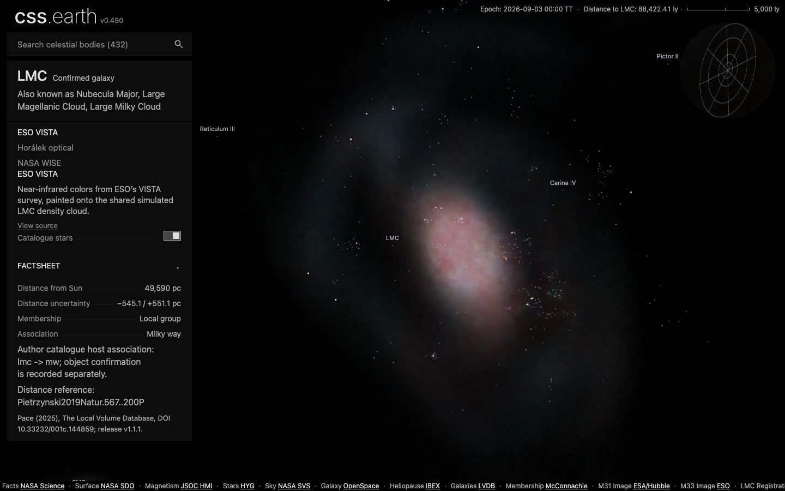
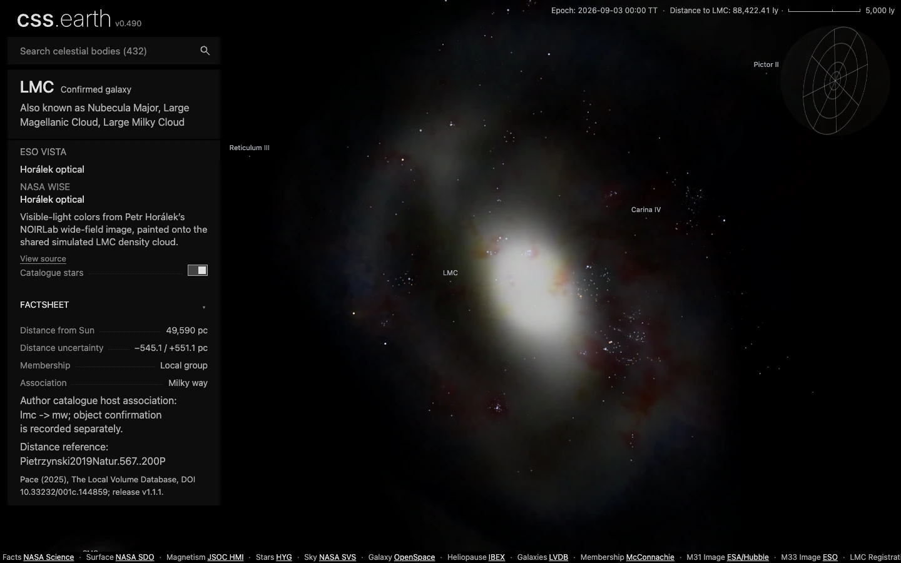
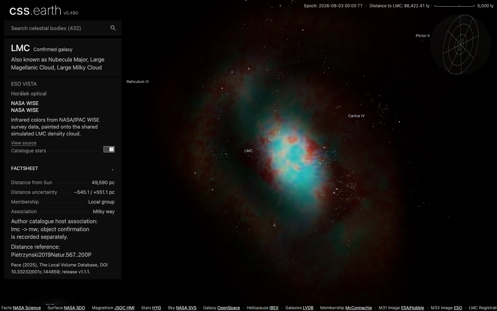
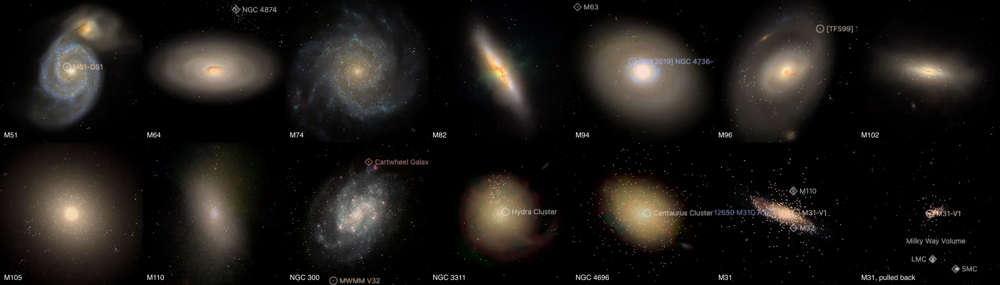

# Galaxies and the nearby universe

The shared world contains **776 sourced galaxy/candidate positions**, seven nearby galaxy-cluster centres, and detailed Milky Way, M31, M33, LMC and SMC renderers. Catalogue positions, observed colors and modeled depth have different evidence; the tables below identify each.

## LMC: three images, one cloud

The LMC has three selectable image treatments on one density cloud. These app captures use the same camera, with catalogue stars enabled. They are PolyCSS visualizations, not telescope photographs or recovered 3D gas maps.

| ESO VISTA · near infrared | Horálek · optical | NASA WISE · infrared |
| --- | --- | --- |
| [](../images/galaxies/lmc-vista-infrared.webp) | [](../images/galaxies/lmc-horalek-widefield.webp) | [](../images/galaxies/lmc-wise-wide-infrared.webp) |
| [ESO original](https://www.eso.org/public/images/eso1914a/) · ESO/VMC Survey | [NOIRLab original](https://noirlab.edu/public/images/iotw2547a/) · NOIRLab/NSF/AURA/P. Horálek (Institute of Physics in Opava) | [WISE data](https://irsa.ipac.caltech.edu/onlinehelp/wise/wise/overview.html) · IPAC/NASA; color HiPS by CDS (CNRS/Unistra) |

| Color input actually used | Resolution and field | Registration and interpretation |
| --- | --- | --- |
| VISTA `eso1914a`, Y/J/Ks | 8,954 × 10,000 TIFF; about 7.7° × 8.6° | Fitted to SMASH stars: 5,340 held-out checks, P90 0.67 SMASH pixels; 83% matched hull. Infrared display colors. |
| Horálek `iotw2547a`, optical wide field | 6,582 × 4,388 JPEG | 592 matched stars; 198 held out, P90 1.12 SMASH pixels; 60.2% matched hull. Outer registration extrapolates beyond matched stars. |
| AllWISE W4/W2/W1 RGB through CDS HiPS2FITS | 6,000 × 6,000 JPEG; 24° tangent-plane field | Fixed publisher WCS checked against 34,811 AllWISE positions; 11,604 reserved checks, P90 0.632 native WISE pixels; 99.3% matched hull. Display composite with visible survey seams. |

The [source recipe](../../labs/nebula/models/image-candidates.json) retains the exact downloads, coordinate transforms and credit strings. ESO and Horálek sources carry CC BY 4.0; the CDS AllWISE HiPS distribution records ODbL 1.0 alongside IPAC/NASA and CNRS/Unistra credit. The renders apply star removal and authored display colors; they are not calibrated multiband photometry. The [alignment evidence](../../labs/nebula/models/lmc/candidates/source/alignment-report.json) checks image geometry.

| Component | Scientific input | What we prepare |
| --- | --- | --- |
| Cloud support and depth | Garver, Nidever, Debattista & Deg (2026), [Dryad simulation](https://datadryad.org/dataset/doi%3A10.5061/dryad.1vhhmgr82); [associated paper](https://doi.org/10.1093/mnras/stag1287) | The 2.2 Gyr snapshot, 1,620,000 LMC stellar particles, deposited into a 266 × 259 × 116 density grid. This is a stellar-mass prior; the snapshot contains no gas particles. |
| Point stars | [Bonanos et al. (2009)](https://arxiv.org/abs/0905.1328), [CDS J/AJ/138/1003](https://cdsarc.cds.unistra.fr/viz-bin/cat/J/AJ/138/1003) | 943 stars with measured sky positions and photometry. Depths are assigned from the density. All three datasets use identical positions. |
| Surface color | The three registered observations above | Native star removal, then color sampling onto the fixed density. Uncovered density keeps neutral color. |

The [accepted bake recipe](../../labs/nebula/models/lmc/bake.json) pins image placement and color settings; the [app settings](../../src/objects/lmc-volume/README.md#evidence) retain cloud and star display. Switching datasets changes the material while retaining the cloud, stars and camera.

## Extragalactic datasets

| Dataset and primary reference | Use | Scope and limits |
| --- | --- | --- |
| Pace (2025), [Local Volume Database paper](https://doi.org/10.33232/001c.144859), [release v1.1.1](https://github.com/apace7/local_volume_database/releases/tag/v1.1.1) | 776 eligible galaxies/candidates from 1,727 source rows; 951 exclusions recorded. | A pinned eligible census, not all galaxies in nature. Host-assigned, numerical-action, redshift and Hubble-law distances are excluded. |
| [McConnachie (2012)](https://doi.org/10.1088/0004-6256/144/1/4), [author October 2019 table](https://www.cadc-ccda.hia-iha.nrc-cnrc.gc.ca/en/community/nearby/) | Membership evidence, with LVDB satellite host chains: 142 retained objects have Local Group associations; 109 are confirmed galaxies. | Membership is not a radius cut. |
| [Graczyk et al. (2020)](https://arxiv.org/abs/2010.08754) | SMC distance: 62.44 kpc, with 0.47 kpc statistical and 0.81 kpc systematic uncertainty. | Direct eclipsing-binary result. |
| [Sadibekova et al. (2024), MCXC-II](https://arxiv.org/abs/2402.01538), [CDS J/A+A/688/A187](https://cdsarc.cds.unistra.fr/viz-bin/cat/J/A+A/688/A187) | Seven clusters: Virgo, Fornax, Hydra, Centaurus, Norma, Perseus and Coma. Centres and R500 annotations. | Each centre at its Cosmicflows-4 group's measured distance, where its members are drawn; the redshift distance (H0 = 70 km/s/Mpc, Ωm = 0.3) only checks the angular scale. R500 is an overdensity aperture, not a physical edge. Virgo's and Fornax's packages add their member catalogues' galaxies when selected. |

[Galaxy selection, frames and source pins](../../src/objects/local-group-galaxies/README.md) and [cluster selection and cosmology](../../src/objects/galaxy-clusters/README.md) give the full derivations. Both catalogues prepare Sun-origin Cartesian metres offline; the application does not parse tables or integrate cosmology at runtime. Navigation framing radii are presentation choices.

## Other detailed galaxies

| Renderer | Source | Depth and coverage |
| --- | --- | --- |
| Milky Way exterior | [OpenSpace/AMNH/NAOJ volume](https://docs.openspaceproject.com/latest/content/milky-way/galaxy/milky-way-volume/index.html) | 1,024 × 1,024 × 128 RGBA model, baked into its bulge and inner disc only. Simulation-based visualization. [Provenance](../../src/objects/milky-way-volume/source/provenance.json). |
| Milky Way interior | [NASA SVS, Deep Star Maps 2020](https://svs.gsfc.nasa.gov/4851/) | 8,192 × 4,096 Milky Way-only map derived from star catalogues; the panorama shell adds authored visual depth. Credits: NASA/Goddard SVS, Ernie Wright (USRA), ESA/Gaia/DPAC. [Provenance](../../src/objects/milky-way-volume/source/sky/provenance.json). |
| M31 | [ESA/Hubble & Digitized Sky Survey 2, heic1112f](https://esahubble.org/images/heic1112f/) | 4,783 × 5,000 crop/resample; 1 kpc parametric depth. Acknowledgment: Davide De Martin (ESA/Hubble). [Provenance](../../src/objects/m31-layers/source/provenance.json). |
| M33 | [ESO VST/OmegaCAM, eso1424a](https://www.eso.org/public/images/eso1424a/) | 4,000 × 3,355, g/r/Hα; 1.2 kpc parametric envelope. Excludes the larger H I outskirts. [Provenance](../../src/objects/m33-layers/source/provenance.json). |
| SMC | [SMASH/NOIRLab, noirlab2030b](https://noirlab.edu/public/images/noirlab2030b/) | 3,000 × 2,501, g/r/i/z; authored 25 kpc envelope. Excludes the full Bridge, Wing and tidal debris. [Full credit and provenance](../../src/objects/smc-volume/source/provenance.json). |

The Milky Way overview enables the galaxy's prepared depth layers; other destinations keep its distant views. M31, M33 and the SMC use image-derived parametric layers, not the LMC's star-removal and density-coloring pipeline.

## Cluster dots

Galaxies draw their catalogued star clusters as dots, each at its published position on the sky. On a flat picture a dot lies on the picture's disc or plane and takes its tone from the photograph. Through a volume it sits at a depth drawn from the volume's spheroid. [M31's globular clusters](../../src/objects/m31-globular-clusters/README.md) are a bank of their own, spread in depth by the cluster system's published radial profile out to 150 kpc. No cluster's depth is measured. Each bank's README names its table and counts the clusters that lie beyond its photograph.



## Reproduction and evidence

For the accepted LMC bank and an app capture, from the repository root with supported Node/pnpm and Python 3.9–3.12:

```sh
pnpm install --frozen-lockfile
pnpm setup:assets --object=sun
node --experimental-strip-types labs/nebula/run.mts bake-nebula
pnpm dev
# In another terminal, from the same repository root:
node labs/investigations/capture-galaxies.mts http://127.0.0.1:4210
```

The [bake guide](../../labs/nebula/docs/baking.md) explains acquisition and caching. The command consumes the tracked density grid, so it does not rerun the N-body simulation. Runtime images and lab previews are generated and Git-ignored; inputs and settings stay versioned. `pnpm prepare:environment-images` restores M31/M33/SMC, the Milky Way, heliosphere and stellar atlas from pinned inputs; normal app startup also runs it.

The shared [diffuse resampler](../../packages/bake/src/image-layers/resize-rgba.ts) fixes the numerical order of premultiplication, integer reduction, Lanczos3 filtering and unpremultiplication, with 64 kernel phases, 12-bit coefficients and compensated arithmetic so results match across CPUs. The [seeded regression](../../packages/bake/src/image-layers/image-layers.test.ts) pins an independent Sharp 0.35.3/libvips 8.18.3 result. Image restoration compares geometric coordinates at a fixed relative tolerance of `64 × Number.EPSILON × max(1, |actual|, |expected|)`; all other fields remain exact.

This independently written TypeScript implementation uses the numerical methods documented in libvips 8.18.3's [reduction and kernel tables](https://github.com/libvips/libvips/blob/v8.18.3/libvips/resample/reduceh.cpp), [Lanczos coefficients](https://github.com/libvips/libvips/blob/v8.18.3/libvips/resample/templates.h) and [alpha conversion](https://github.com/libvips/libvips/blob/v8.18.3/libvips/conversion/premultiply.c), plus Sharp 0.35.3's [byte casts](https://github.com/lovell/sharp/blob/v0.35.3/src/pipeline.cc) and [centered crop](https://github.com/lovell/sharp/blob/v0.35.3/src/common.cc). No third-party source text is incorporated. These method references retain their upstream LGPL-2.1-or-later (libvips) and Apache-2.0 (Sharp) licenses.

[capture-galaxies.mts](../../labs/investigations/capture-galaxies.mts) uses an isolated browser context and the real app, verifies all 943 stars and the camera, and reports script and HTTP errors. [captures.json](../../site/test/fixtures/galaxies/captures.json) records the capture settings.

**Open visual limits:** simulation/observation registration still has an approximately 2.8 kpc model offset; oblique whitening, slice banding and the transition from the interior panorama remain research work. Continue with the lab's [method](../../labs/nebula/METHOD.md), [research](../../labs/nebula/RESEARCH.md), [next steps](../../labs/nebula/NEXTSTEPS.md) and [slice-stability evidence](../../labs/nebula/docs/slice-stability.md).
