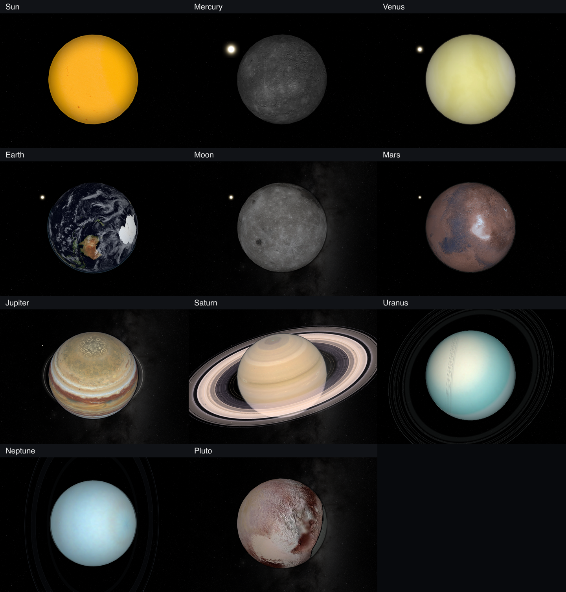

# Generic object runtime proof

All eleven registered objects bind the same `createObjectRuntime` implementation.
The shared owner assembles mounting, readiness, lifetime, controls, selection,
resource ownership/residency, native playback, camera binding, and cleanup.
Object packages supply prepared data and synchronous retained rendering.

This proves a broader contract than the earlier controller-only work. No new
object, route, or unregistered browser demonstration was added to establish it.
Architectural and behavioral acceptance is complete for the source identified
below. The visual comparison is complete with explicit pixel-failure
qualifications; it is not an all-frame pixel-parity pass.

## What is generic

| Responsibility | Actual implementation used by every mount |
| --- | --- |
| Definition and hook validation | `src/platform/object-runtime-contract.mjs` |
| Mount/readiness/fatal boundary | `src/platform/object-runtime.mjs` |
| Lifetime | `src/platform/scene-lifetime.mjs` |
| Native image leases | `src/platform/prepared-image-store.mjs` |
| Bounded residency | `src/platform/prepared-residency.mjs` |
| Selection and publication ordering | `src/platform/object-selection-runtime.mjs` |
| Lens/settings binding | `src/platform/object-control-binding.mjs` |
| Applying playback and speed | `src/platform/prepared-playback.mjs` |
| Camera/input/projection | Shared cubic-sky orbit and prepared-camera publisher |
| Body-dependent layer registration | `src/platform/body-layer-registration.mjs` |
| Browser observations and actions | `site/test/object-browser-profile.mjs` |

Every object client is an imports-only four-line binding with one factory call.
The returned mount API is unchanged. There is one registry and one object
adapter, and navigation mounts one scene at a time.

[The architecture document](shared-runtime-architecture-proposal.md) lists the
remaining package differences. For example, Saturn supplies rings and compound
interior demand; Earth supplies page-bank and dual-material demand; the Sun
supplies a self-lit presentation. Those packages cannot allocate image owners,
bind shell controls, start selection schedulers, or coordinate native playback.

## Executable ownership and behavior evidence

1. **Reachable source ownership.** The checker follows each real client through
   its imported helpers, validates the actual definition and control-content
   identity, and requires exactly one common factory binding. Helpers outside
   the object directory are checked too. The common runtime closure cannot
   import object packages or dispatch on hardcoded object IDs.
2. **Deliberate regressions.** Tests overlay eight controlled changes on existing
   object paths: a private mount, shell listener, image owner, selection scheduler,
   playback coordinator, control binder, helper-hidden owner outside the package,
   and shared object-ID dispatch. Each fails for its intended reason; the unchanged
   eleven-object closure passes. Additional alias, namespace, asynchronous-hook,
   malformed-plan and forged-registration negatives remain in the suite.
3. **Actual shared owners in Chrome.** The browser gate instruments the one real
   service-composition point and forwards every call to its actual implementation.
   All eleven objects at DPR 1/2 construct exactly one session, resource manager,
   playback owner, camera, selection owner and control binder. It exercises real
   pointer/wheel input, every supplied control, late native animation registration,
   disposal and calls after retirement. It verifies actual resource and animation
   retirement, rather than reading declaration-only counters.
4. **Useful failure coverage retained.** Actual package tests exercise startup
   cancellation, failed/late decodes, superseded selections, camera movement while
   loading, retries, partial publication, partial construction and cleanup errors.
   The 24 Mercury/Venus/Mars material-failure cases execute real presentations and
   the common mount, resources, selection and orbit.
5. **Read-only diagnostics.** Profiles use the same runtime endpoints, actual
   content and committed state. Browser reads do not change playback permission
   or register extra owners. Sky observations distinguish prepared material-light
   coordinates from sky-light coordinates. Validated field lists preserve the
   camera coordinates in existing audit records, and the same setter restores
   saved yaw and pitch. An explicitly requested pitch takes priority over an old
   saved pitch alias. Packages supply no camera reader or setter. An actual
   production bundle test proves development DOM snapshots and diagnostic
   observation code are removed.
6. **Normal acceptance chain.** `pnpm test:browser` begins with the all-object
   runtime gate, then the existing projection, shell, navigation, conformance,
   playback, compound-selection, real back/forward-cache and object smoke gates.
   The historical unregistered-object demo is absent from this execution chain.

The AST checker is a practical regression barrier, not a formal proof against
arbitrary obfuscated JavaScript. Native-boundary unit doubles are separate from
the actual registered-object Chrome evidence.

## Final validation

Acquisition, all 818 tests, the build, strict ownership checks and the complete
normal browser chain pass on the final frozen source. The full visual comparison
also completed. [The evidence record](generic-runtime-contract-evidence.json)
contains the measurements, ordered frame hashes and source/report hashes.

Tested source: `51ee3181174468870e72a52b020a657e89f3c64590c01392ebc8cff88cb6bbe4`
(1074 files).

Delivery source: `399f02bd1b111dd9c8b82095d556bbf6a0785db530e0c470175da4db2298212d`.
Final staging removed one redundant trailing newline from each of six modules.
Every other byte is unchanged; the six JavaScript syntax trees and all 30 built
HTML/CSS/JavaScript files are identical. Acquisition, all 818 tests, strict
ownership and the build were repeated successfully. The browser/visual runs
remain attributed to the original fingerprint above; they are not relabeled as
reruns on the formatting revision. The evidence contains both complete source
maps, the six byte changes, built-file hashes and fresh validation receipts.


| Check | Result |
| --- | --- |
| Source acquisition verification | All eleven object manifests pass |
| `pnpm test` | 818 pass, zero failures |
| `pnpm build` | All eleven object asset bundles pass |
| Strict runtime ownership | Eleven common factory bindings; 23 shared closure modules; zero private owners or violations |
| Prepared projective leaf census | 7,742 valid leaves; 162 Saturn interior leaves completed by their prepared descriptor |
| Full `pnpm test:browser` | Pass in installed Chrome 152.0.7977.76 |
| Actual runtime owner instrumentation | 22 cases, all six owners, DPR 1/2 |
| Camera behavior | 22 cases and 154 frames, DPR 1/2 |
| Registry-derived browser conformance | 143 cases |
| Playback / compound selection | 22 playback and six compound-selection cases |
| Actual back/forward-cache restoration | Eleven admissions, one scene and one camera after each return |

Commands used for the required chain:

```sh
pnpm acquire:planets -- --verify-only
pnpm test
pnpm build
node tools/check-object-runtime-ownership.mjs --all
pnpm test:browser http://127.0.0.1:4294
```

Start the dedicated server from the tested checkout after tests/preparation have
finished. Do not edit its source tree during captures:

```sh
node tools/serve-shared-runtime-audit.mjs /absolute/path/to/cssEarth-runtime 4294
```

The audit server's `no-store` policy and Vite websocket prevent native
back/forward-cache admission. The normal browser chain still checks real back
navigation there and records the reload path. A separate ordinary Astro server
with the same source fingerprint proves actual cache admission and restoration
for all eleven objects. These are separate receipts.

The first final browser attempt was invalidated when a Sun reproduction test
rewrote a watched prepared module, even though its bytes stayed identical. The
source guard retired that server as designed. The complete browser chain passed
after the tests finished and a new audit server froze the unchanged source.
The failed attempt and reason remain in the evidence; no timeout or assertion
was relaxed.

The full visual matrix also caught a profile migration error: Mars and Jupiter's
archived camera observations included yaw and a pitch alias that the first
common reader omitted. The common profile now preserves those fields as data
and restores the complete saved coordinates. A second capture caught an old
pitch alias overriding a newly requested pitch; the same shared setter now gives
the explicit pitch priority. Tests reject missing/duplicate fields and verify
both yaw restoration and that exact conflicting-alias case. Both failed captures
are retained; the references and frozen comparison modules are unchanged.

An additional readiness wait also timed out after the shell and actual object
endpoint both reported ready, with no router or browser errors. The common
profile now reads that flag first and starts the original waiter only while the
object is absent or loading. All twenty repeated Earth visibility/motion cases
passed with that path; tests also preserve rejection for missing/loading state.
The existing assertion and timeout are unchanged. The precise browser-wait
scheduling cause is not established, and the failed runs remain in the evidence.

A later Mercury wheel-takeover setup check observed no active wheel interval at
its checkpoint. The unchanged Mercury DPR 1/2 conformance cases passed on
recheck. That failed setup and its successful focused recheck are both retained;
the full browser chain subsequently passed independently. No interaction code, interval,
assertion or timeout was changed for that setup failure.

The frozen full visual matrix covers all eleven existing objects at DPR 1/2,
390- and 1440-pixel widths, all lenses, five speeds, relevant feature toggles,
camera bounds and restored input poses: 418 conditions, six ordered native GPU
readbacks per condition, 2,508 frames. Each candidate names the sealed matching
`dd91897` reference bundle and verifies source, prepared and loaded-byte identity.

For each ID obtained from `OBJECTS`, capture into a fresh output directory:

```sh
node tools/audit-shared-runtime.mjs candidate "$BASE_URL" "$CHECKOUT" \
  "$OUTPUT/$OBJECT_ID" --report-only --runtime-matrix --object "$OBJECT_ID" \
  --reference "$REFERENCE/$OBJECT_ID/baseline"
```

`--report-only` preserves all six scheduled frames even when equality or native
readback repeatability fails. A nonzero exit is retained and inspected through
the report's completion, error and comparison fields; it is not a pixel pass.



This overview crops and scales the default frames without changing their aspect
ratio. The full 154 frames remain in the evidence bundle;
[the overview receipt](images/prepared-camera-all-objects.sources.json) records
every input hash and crop.

The matched visual captures use the implementation applied to the baseline
`dd91897` checkout before the delivery commit, preserving the Git-derived About
version label. Delivery verifies the committed hashes against the recorded
delivery map and the six-byte formatting equivalence described above. A fresh matched comparison must preserve the same rendered build metadata
and use the reference bundle's recorded profiles; a different version label is
not masked or silently excluded.


## Recorded visual results

The final run completed all 418 conditions and 2,508 frames; 2216 frames are
exact. **Strict pixel equality fails overall.** All observed camera/lens poses
match their sealed references. Every captured retained structure and computed
property matches except Saturn's explicitly verified interior layout correction.

| Object | Conditions | Exact / all frames | Finding |
| --- | ---: | ---: | --- |
| Sun | 36 | 212 / 216 | All scene frames exact; four one-level page differences. |
| Mercury | 38 | 223 / 228 | All scene frames exact; five one-level mobile chart differences within reference variation. |
| Venus | 40 | 235 / 240 | All scene frames exact; five one-level mobile chart differences outside reference variation. |
| Earth | 44 | 60 / 264 | Reduced-scale texture differences; poses, 2,023 retained nodes and captured styles match. Precise cause unproven. |
| Moon | 34 | 198 / 204 | One paused-speed condition differs by one level in all six frames; poses and captured styles match. |
| Mars | 36 | 212 / 216 | All scene frames exact; four one-level mobile page differences within reference variation. |
| Jupiter | 38 | 221 / 228 | All scene frames exact; initial body readbacks settle, plus one-level mobile chart differences. |
| Saturn | 42 | 216 / 252 | Twelve intentional interior corrections; temporary incomplete GPU readbacks and small one-level differences retained. |
| Uranus | 38 | 225 / 228 | All scene frames exact; three one-level mobile chart differences within reference variation. |
| Neptune | 38 | 210 / 228 | Persistent one-level dark pixels and mobile chart differences; all desktop frames exact. |
| Pluto | 34 | 204 / 204 | All ordered frames exact. |

Earth's largest difference affects 40,860 pixels, with a maximum channel delta
of 72. Its maximum zoom, cutaway, topography, cross-section and maximum-camera
conditions are exact at both DPRs. Inspection of the reduced-scale differences
found aligned silhouettes, material addresses and features, with texture-detail
variation. Unchanged-reference repeats also varied, but they do not explain every
current difference. The precise Chrome sampling/readback cause is unproven.

Moon's six differences occur only in desktop DPR 1's paused speed-4 condition:
25,416 pixels, each by one channel level. The same application bytes produced
exact Moon frames in an earlier run; that does not establish the current cause.

Neptune repeats two/eight dark-pixel differences at mobile DPR 1 and seventeen
at mobile DPR 2, with additional chart pixels in three phases. They persist
outside reference variation; they are not qualified as proven random noise.

Saturn's corrected interior is solid where the reference has a broken grid.
Only the prepared leaf dimensions, derived origins and atlas size change in
computed styles: 162 leaves, seven values per leaf, across all 42 conditions.
Early DPR 2 readbacks also contain temporarily missing ring/body tiles. Later
frames settle; some reference frames show the same class of incomplete tiles.
These remain failed readbacks, including differences outside reference variation.
They are not a claim that every rendered frame is flawless.

The evidence lists every changed frame, its bounds, largest channel difference
and pixels outside the six reference frames' variation. It also records the
inspection findings for each object. All six phases and original full-resolution
images remain under `output/runtime-generalization/B22-v4/visual/`; the matching
references remain under `output/runtime-generalization/integration-baseline-v3/`.
The committed record contains their hashes and compact measurements.

## Visual and performance qualifications

Saturn's 162 interior projective leaves now use their prepared layout dimensions;
the difference from the previous broken fallback is an intentional correction.
The full matrix retains all other differences, including transient Chrome raster
completion, Earth's reduced-scale sampling differences and Neptune's few
persistent one-level background differences. No tolerance, mask or favorable
readback selection is used. Strict byte-identical pixel comparison is separate
from completed behavior/ownership tests and remains failed wherever pixels differ.

Earth's standalone performance checks pass at both DPRs. The separate production
workload fails its zero-long-task budget on both production builds: the reference
records 103 ms at DPR 1 and 85 ms at DPR 2; the candidate records 120/65/98 ms and
56/89 ms respectively. Its first strict run also failed (115/56/96 ms). All other
production assertions pass at both DPRs, including retained identity, lens and
interior changes, transfer size and compositor bounds. Both builds have 999
leaves and 2,022 stage elements; candidate transfer is 31,042,242 bytes against
the unchanged 45,000,000-byte budget. The candidate has more long tasks in this
measurement; no equivalent performance or improvement claim is made. The failed
strict run and the explicitly qualified report-only comparison are retained.

Mars and Jupiter's old element-count expectations fail on structures that are identical in reference
and candidate: 518 leaves/1,047 stage elements for Mars, 790/1,575 for Jupiter.
Jupiter's 40 ms P95 frame budget also fails: the same Shadows-enabled sweep
measures 50 ms on both versions at both DPRs. The earlier Mercury migration
comparison found the same 1,814 stage elements and 925 measured layers on both
versions, exceeding its old budgets. Limits remain unchanged; report-only
measurements are not budget passes. This contract proof makes no performance
improvement, physical-device, native-renderer-parity or immediate browser-memory
reclamation claim.

The standalone development-server measurements retain their original source
fingerprints. The final camera-profile and readiness corrections changed four
observation/test files; application and standalone benchmark bytes are unchanged.
The evidence records that comparison rather than presenting retained timings as
new measurements. The separate production comparison above uses fresh builds
of both recorded source trees.

See [the implementation record](shared-runtime-implementation.md) for migration
history, the camera repair, preserved incoming work and evidence limits.
