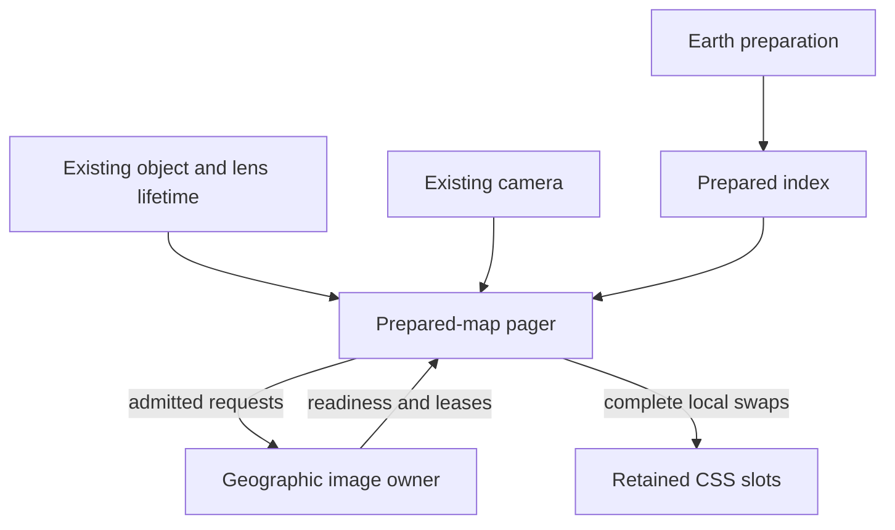

# Geographic streaming

The shared application shell owns the selected entity and its explicit lenses. The existing prepared-map pager owns geographic detail and drawable coverage. One geographic image owner should manage transport and bounded reuse, and the retained CSS renderer applies prepared image handles and transforms.

The current implementation is being completed in this order: local publication/loading, shared image reuse, a bounded coarse-to-fine representation, and continuous browser qualification. This is the implementation direction; the coarse representation and native memory outcome still require proof.

## Ownership

- Keep one shared shell, generic object adapter and mounted object scene. Entity kind does not create a new renderer or card. Every card owns its lenses: land cover belongs to Earth and the noise observation belongs to Buenos Aires. Camera position selects base imagery detail independently of card identity.
- Reuse the existing object and geographic lens lifetime for cancellation, dataset revisions, clearing old observations and teardown. Do not add a second dataset session or general layer manager.
- Earth preparation owns projection, geometry, source sampling, imagery, error bounds, provider addresses and any coverage relationships needed for replacement. Runtime may project prepared bounds for selection and decode/transport prepared records; it cannot generate scene geometry or images.
- The pager owns desired detail, current useful coverage, metadata demand and affordable complete replacement decisions. Keep selection and publication as small policy functions while sufficient. If their fallback histories diverge or coverage decisions spread into loaders, consolidate that state into one prepared-map controller.
- Strengthen the existing geographic image transport and share it with pages and overviews under the scene lifetime. Consumers hold leases. Do not wrap a second cache around it or rewrite fixed object-atlas residency.
- Retained CSS slots execute prepared writes. Publication and accounting use what actually becomes drawable, not a promise that an image will arrive.

## Selection, loading and publication

Keep coverage nodes, image resources and CSS pieces distinct. Multiple pieces can share one image. A complete drawable group may contain several pieces and images. Image readiness alone does not prove group coverage.

1. Select from the current view and prepared bounds/error records. Never use selected city or card kind as the level-of-detail signal.
2. Distinguish unknown metadata from a known empty branch. Unknown branches preserve useful previous coverage; they do not authorize retiring it. Continue bounded metadata discovery through expensive intermediate nodes because finer polar groups can require fewer visible pieces.
3. Load admitted images whose metadata is available. An unrelated directory request must not stop them. Preserve bounded retry, timeout, source validation and cancellation.
4. Publish complete local replacements independently. A parent connects its selected children into one replacement transaction; a selected parent likewise replaces related old descendants. Keep covering groups while their own metadata or images are incomplete. Release obsolete offscreen groups.
5. Reserve old plus incoming resources before work begins. Publish the new complete cut and retire replaced leases in one synchronous transaction. A late result cannot publish into a newer slot generation or dataset revision.
6. Under reversal, prioritize current coverage and visible detail. Useful ancestors and previously displayed descendants may remain while needed; avoid an unconditional ladder of all ancestor loads or unbounded prefetch.

## Resource limits

Preserve the mounted ceilings and their explicit meanings. Base paging has 512 retained slots, at most 256 displayed pieces, a conservative 128 MiB decoded reservation, and a separate 96-directory / 12 MiB metadata allowance. Observation paging has 32 slots and its existing byte allowance including overview costs. Additional backing must be included in the combined accounting; it cannot obtain invisible capacity by becoming another layer.

Keep separate accounting for conservative per-piece/raster cost, unique image resources, encoded blobs and in-flight payloads. Existing per-piece reservation is deliberately conservative. Sharing an image does not authorize a larger DOM/compositor load. Adding new byte categories under an unchanged number changes admission semantics and must be evaluated explicitly.

The shared resource owner should preserve image identities across revisits only within bounded idle residency and expiry rules. Eviction or scene destruction revokes retained blobs and releases decode owners. Existing loader reservations span complete fetch/decode work; transport telemetry that stops at HTTP headers is not an equivalent concurrency measure. Choose any shared scheduling limit from measured contention rather than introducing an arbitrary global cap.

Application ledgers do not bound Chrome's internal caches. Repeated lens-switch and teardown traces must establish whether reuse produces a native memory plateau. Blob identity reuse alone is not completion evidence.

## Coarse-to-fine representation

The current fine WMTS release remains unchanged. At regional views, a selected cut can require more CSS pieces than the display limit. Loading policy alone cannot make those same pieces fit.

Prototype a bounded coarse backing in accepted face coordinates using existing preparation functions and pinned RGB samples. Start with backing that remains beneath opaque fine detail. Measure its residency together with displayed and incoming detail, and inspect transparency, apron overlap and depth order. Only prepare regional retirement relationships where measured budget pressure requires reclaiming backing. Existing face identifiers and crops help preparation, but bounding rectangles alone do not prove pixel coverage.

Normal backing belongs to base imagery. The current observation-overview path suspends normal detail, so that lifecycle cannot be reused unchanged for backing intended to support the detail. Preserve explicit observation ownership and clearing.

The polar bridge needs a measured endpoint: existing preparation omits cap pieces below WMTS L10, and the first available cap cut may still exceed capacity. Adding only L0–L4 ancestors does not resolve this. Keep coarse coverage until an affordable fine cut exists, including cap/band transitions and both hemispheres; beyond source coverage, retain the accepted base. Include actual antimeridian crossings, not only a stationary view near the dateline.

Begin with one regular seam, one cap/band seam and an antimeridian transition. Compare retained backing with regional retirement only where needed. Verify source/result/difference frames at DPR 1/2, continuous replacement, metadata admission, image count, piece count, simultaneous reservations and release size before global expansion. Do not duplicate the 25 GB fine geometry release or acquire the whole raw imagery dataset.

## Traversal dependency

Cesium's source is a useful reference. Its quadtree can execute without a WebGL provider, but its private traversal assumes geographic child construction, terrain fills in some partial-readiness cases, and selection history committed before display callbacks. Prepared topology, CSS-pixel error and hard publication admission need additional semantics. An npm export does not make those private assumptions a supported prepared-page contract.

There is no mandatory Cesium dependency. Consider a pinned extraction only if a real prepared coarse/fine fixture demonstrates that it removes substantial selection/fallback policy, records what actually publishes and requires no second selector to repair its output. Otherwise maintain the existing prepared-map owner. Bundle size or WebGL elsewhere in the package is not the deciding factor.

Reference inspected: CesiumJS commit `488b114e16f5879f5d51456640aae67850a715c0`, particularly [QuadtreePrimitive](https://github.com/CesiumGS/cesium/blob/488b114e16f5879f5d51456640aae67850a715c0/packages/engine/Source/Scene/QuadtreePrimitive.js). If code or tests are copied/adapted, preserve applicable licenses/notices and mark modifications; keep data-provider attribution separate. Source research does not warrant branding the application Cesium-powered. [License](https://github.com/CesiumGS/cesium/blob/488b114e16f5879f5d51456640aae67850a715c0/LICENSE.md).

## Completion evidence

Complete the same PR with continuous cold/warm globe-to-region-to-city exploration, reversals, interrupted travel, delayed/failing imagery and metadata, offline recovery, lens/history changes and sustained revisits. Run real Chrome at DPR 1/2; label narrow viewport and CPU/network emulation honestly. Capture visible checkpoints and videos separately from performance measurements so screenshot overhead is not blamed on the application.

Run source verification, tests, build and OBJECTS-derived browser conformance appropriate to the final changes. Refresh delivery-cost scenarios from actual request/cache behavior. A stable metadata selection can still have blocked directories, and representative coverage does not establish worldwide valid pixels, physical-device behavior or provider availability. Merge and deployment remain the user's decisions.
